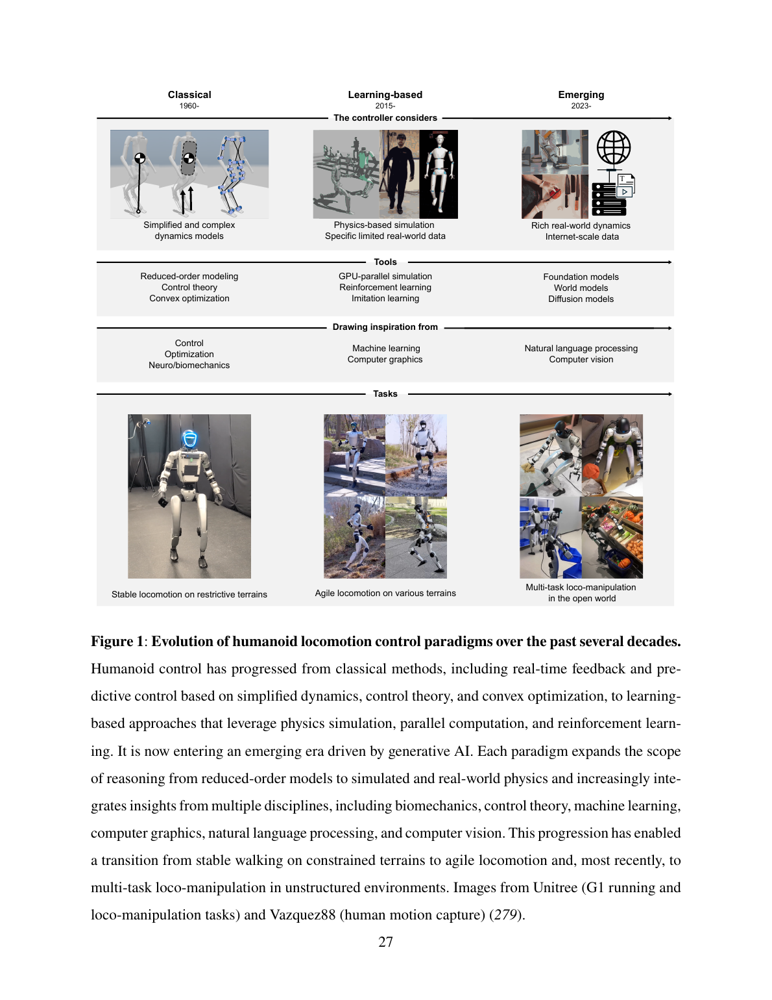
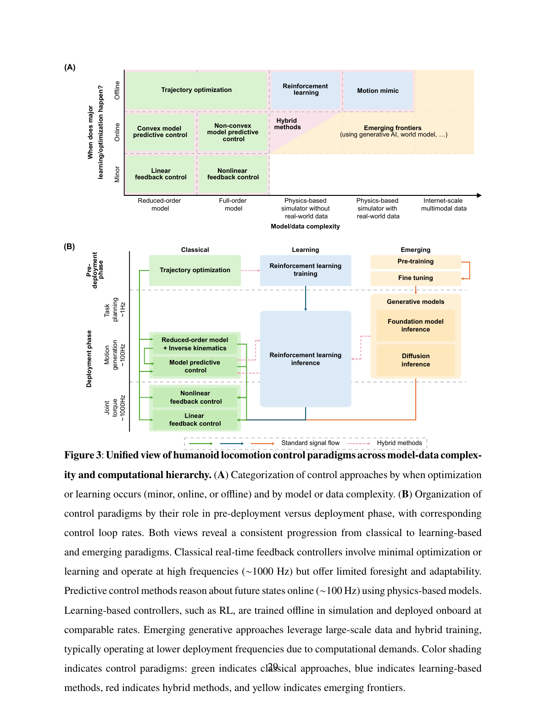

<!--
---
id: P0001
title_en: "Evolution of Humanoid Locomotion Control"
title_zh: "人形机器人运动控制的演进"
year: 2026
date: 2026-08-19
venue: "Science Robotics, 11(117), eaed3973"
primary_category: locomotion-prior
tags:
  - humanoid
  - locomotion
  - reinforcement-learning
  - physics-guidance
  - world-model
authors:
  - Yan Gu
  - Guanya Shi
  - Fan Shi
  - I-Chia Chang
  - Yen-Jen Wang
  - Qilong Cheng
  - Zachary Olkin
  - Ivan Lopez-Sanchez
  - Yunchu Feng
  - Jian Zhang
  - Aaron D. Ames
  - Hao Su
  - Koushil Sreenath
institutions:
  - Purdue University
  - Carnegie Mellon University
  - National University of Singapore
  - University of California, Berkeley
  - New York University
  - California Institute of Technology
  - Meta Platforms Inc.
paper_url: "https://doi.org/10.1126/scirobotics.aed3973"
project_url: "https://github.com/purdue-tracelab/Humanoid-Locomotion-Survey"
github_url: "https://github.com/purdue-tracelab/Humanoid-Locomotion-Survey"
video_url: null
open_source:
  code: "no"
  training_code: "no"
  inference_code: "no"
  model_weights: "no"
  dataset: "no"
  robot_deployment: "no"
open_source_checked: 2026-09-03
robots: []
inputs: []
outputs: []
read_status: deep-read
reproduce_status: not-started
local_materials:
  - "local_archive/P0001/Evolution_of_Humanoid_Locomotion_Control_20260819.pdf"
  - "local_archive/P0001/Evolution_of_Humanoid_Locomotion_Control_中英对照全文翻译.pdf"
created: 2026-09-03
updated: 2026-09-03
---
-->

# P0001｜人形机器人运动控制的演进

*Evolution of Humanoid Locomotion Control*

[论文](https://doi.org/10.1126/scirobotics.aed3973) · [配套资料](https://github.com/purdue-tracelab/Humanoid-Locomotion-Survey) · [中英对照全文翻译](attachments/中英对照全文翻译.pdf)

## 基本信息

<!-- AUTO-BASIC-INFO:START -->
> **作者**：Yan Gu、Guanya Shi、Fan Shi、I-Chia Chang、Yen-Jen Wang、Qilong Cheng、Zachary Olkin、Ivan Lopez-Sanchez、Yunchu Feng、Jian Zhang、Aaron D. Ames、Hao Su、Koushil Sreenath
>
> **机构**：Purdue University、Carnegie Mellon University、National University of Singapore、University of California, Berkeley、New York University、California Institute of Technology、Meta Platforms Inc.
>
> **论文时间**：2026-08-19
>
> **期刊 / 会议**：Science Robotics, 11(117), eaed3973
>
> **主分类**：Locomotion 与运动先验
>
> **重点标签**：**人形机器人** · **运动控制** · **强化学习** · **物理引导** · **世界模型**
>
> **阅读状态**：已精读　·　**复现状态**：未开始
<!-- AUTO-BASIC-INFO:END -->

### 资料与开源说明

- 类型：综述论文，而非新控制器或可复现代码项目。
- DOI：[10.1126/scirobotics.aed3973](https://doi.org/10.1126/scirobotics.aed3973)
- 开源边界：论文没有对应训练代码、模型权重或数据集；GitHub 链接是综述配套资料入口，不应标记为“控制代码已开源”。

## 本文贡献

- 建立“经典控制—学习控制—生成式控制”的统一历史坐标，而不是把强化学习视为与模型控制割裂的替代品。
- 用物理建模、受约束决策与不确定性适应三条主线解释各代方法共同解决的问题与不同取舍。
- 将未来方向归纳为物理引导生成、多模态感知、任务级智能和安全部署，并指出从展示性敏捷动作走向开放世界仍缺可靠性评价。

## 研究问题

综述试图回答：过去用于稳定行走的解析控制、近年用于敏捷全身运动的强化学习，以及正在兴起的生成模型如何构成一条连续技术路线，而不是彼此割裂的范式。

## 原论文重点图

**图 1：数十年人形运动控制范式演进（原论文 Figure 1）。** 横向从经典控制、学习式控制走向生成式智能；纵向同时比较控制器所利用的模型/数据、工具来源和任务能力。重点不是简单“新方法淘汰旧方法”，而是计算与数据规模扩大后，控制器能处理的动力学丰富度和任务开放性同步上升。

**图 2：控制范式的统一视角（原论文 Figure 3）。** 论文用模型—数据复杂度和在线—离线计算两个维度组织经典反馈、MPC、强化学习与混合方法。这张图解释了为什么现代系统仍常保留低层 PD/WBC：学习策略把大量优化离线编码进网络，但在线稳定执行仍需要快速反馈层。

## 研究方法详细解读

### 综述的分析框架与总体链路

这不是一篇提出单一网络的算法论文，而是把人形运动控制整理成一条从任务到电机的层级链。完整链路可写成：任务/速度/姿态命令与环境观测进入高层决策，高层产生落脚点、质心轨迹、未来全身动作或潜在技能，低层控制器将参考转换为关节位置、速度或力矩，机器人动力学与接触再产生下一时刻状态。论文以“模型知识如何进入控制、约束如何进入决策、不确定性如何被处理”三条轴线比较各代方法，因此同一工作可能同时具有优化、学习和生成成分，不能只按网络名称归类。

### 模型驱动控制：从动力学约束到执行量

经典路线先由状态估计得到基座姿态、质心、足端接触和关节状态，再由步态规划器给出接触序列或落脚点。质心动力学、零力矩点、倒立摆或全身刚体动力学被写进 MPC/轨迹优化，求解未来质心、接触力和动量；WBC/QP 在更高频率下把这些量分配为关节加速度、接触力或力矩，并同时满足摩擦锥、关节限位和动力学等式。其优势是接口明确、约束可解释，代价是模型误差、复杂接触和长时离散决策会迅速扩大求解难度。

### 强化学习与模仿：数据、奖励和策略更新

学习路线把仿真器作为状态转移函数：策略接收本体历史、任务命令、地形或参考动作，输出关节目标/力矩；仿真并行采样后，用任务奖励、姿态与速度跟踪、接触和能耗正则共同更新策略。动作模仿把 MoCap 或优化轨迹作为稠密监督，运动先验/判别器约束自然性，课程学习与困难样本重采样逐步扩大技能和地形范围；域随机化、外力扰动与观测噪声则用来覆盖部署时的模型不确定性。这里“训练成功”只表示在给定奖励和仿真分布内优化完成，并不自动给出稳定性证明或真实机器人安全保证。

### 生成式与基础模型：高层参考如何形成

较新的系统把文本、图像、音乐、动作历史、场景几何等编码成条件，用扩散模型、掩码模型或自回归模型生成未来人体/机器人动作。离散 tokenizer 或连续潜空间负责压缩动作，条件注意力负责语义对齐，采样器产生多种候选；随后仍要经过可执行性筛选、人体到机器人的重定向以及低层跟踪。综述所称的生成式阶段并未取代控制器，而是把过去手工给定的参考轨迹变为可学习的预测模块，物理可行性仍由训练数据、仿真反馈或下游控制闭环补足。

### 推理与部署时的信息流

在线运行时应区分三个频率：高层规划/生成低频更新未来片段，策略或 WBC 中频产生关节目标，电机环高频执行并返回传感器状态。任何比较都要逐项记录状态估计是否特权、参考窗口长度、环境感知来源、动作是残差位置还是力矩、是否使用历史/循环状态、是否依赖外部工作站。把“生成一段姿态”“仿真中可跟踪”和“实机闭环稳定”视作三个不同证据层级，是这篇综述最重要的复现方法论。

### 三类路线的组合关系与阅读边界

实际强系统通常是混合体：生成模型负责意图与长时结构，学习策略吸收复杂接触和模型误差，MPC/WBC/PD 保留硬约束与高频稳定性；训练时又会用优化轨迹、仿真奖励和真实数据共同提供监督。因此论文的时间线应理解为能力重心迁移，而不是后一范式淘汰前一范式。综述没有统一数据集、损失函数或单一实验协议，不能把不同机器人、频率、观测和安全条件下的结果直接横向排名。

## 实验结果与结论

- 人形运动控制的目标已从“保持稳定”扩展到敏捷、鲁棒、可表达并能与环境交互。
- 纯模型或纯数据路线都不足以覆盖开放世界，未来系统需要把优化、学习和预测推理结合起来。
- 安全、可访问性和接近人类水平能力仍是开放问题，展示视频不能替代严格评估。

## 局限与复现提醒

优点是建立跨经典控制、强化学习和生成模型的统一坐标系；局限是综述跨度很大，不能替代对具体控制器的接口、数据、奖励和实机协议审计。

### 对个人研究的价值

适合作为整个知识库的路线图：GENMO/OMG 等位于生成式“上层大脑”，SONIC/跟踪器位于反应式执行层，物理反馈与约束机制负责连接生成和真实执行。

## 阅读与复现状态

- 阅读：已深读原文与中英对照材料，并完成路线梳理。
- 延伸整理：持续补齐文中代表性系统档案。
- 复现：综述本身无单一代码系统，不适用 Demo/训练复现。

## 参考资料

- [Science Robotics / DOI](https://doi.org/10.1126/scirobotics.aed3973)
- [PubMed 书目信息](https://pubmed.ncbi.nlm.nih.gov/42616832/)
- [配套 GitHub](https://github.com/purdue-tracelab/Humanoid-Locomotion-Survey)

## 更新记录

- 2026-09-03：依据原论文方法与训练章节，扩展总体流程、数据表征、模块信息流、训练目标、推理/部署及实现边界。
- 2026-09-03：补充正文基本信息卡，展示完整作者、机构、论文时间、期刊/会议、分类、标签与状态。
- 2026-09-03：创建精读档案，登记原文与中英对照材料；开源状态按综述属性记录。
- 2026-09-03：隐藏元数据，纳入翻译附件与原论文 Figure 1/3，重写贡献和方法解读结构。
