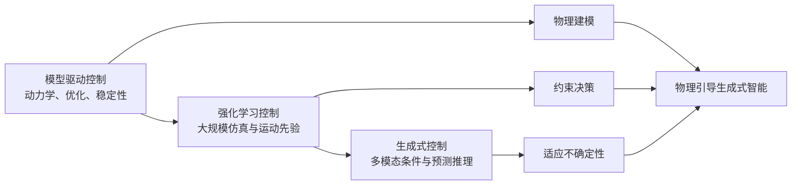

# P0001 — 人形机器人运动控制的演进

## 1. 基本信息

- 类型：综述论文，而非新控制器或可复现代码项目。
- 发表：Science Robotics 11(117)，文章号 eaed3973，2026-08-19。
- DOI：[10.1126/scirobotics.aed3973](https://doi.org/10.1126/scirobotics.aed3973)
- 作者单位覆盖 Purdue、CMU、NUS、UC Berkeley、NYU、Caltech 与 Meta。

### 开源状态

论文没有对应训练代码、模型权重或数据集；GitHub 链接是综述配套资料入口，不应标记为“控制代码已开源”。

## 2. 一句话总结

论文把人形运动控制梳理为“经典模型控制 → 大规模仿真强化学习 → 生成式控制”的演进，并认为未来会汇聚到融合物理建模、约束决策和不确定性适应的“物理引导生成式智能”。

## 3. 研究问题

综述试图回答：过去用于稳定行走的解析控制、近年用于敏捷全身运动的强化学习，以及正在兴起的生成模型如何构成一条连续技术路线，而不是彼此割裂的范式。

## 4. 整体框架

## 5. 框架说明与方法主线

- 模型驱动阶段强调可解释动力学、轨迹优化和稳定性保证，但对复杂接触、模型误差和大技能库扩展困难。
- 强化学习阶段借助并行仿真、动作模仿和域随机化获得敏捷性与鲁棒性，但依赖奖励、数据和安全验证。
- 生成式阶段开始把文本、视觉、动作历史和环境上下文统一为条件，生成未来动作或控制目标。
- 三条核心原则不是简单按年代替换：物理模型仍约束学习系统，约束决策仍限制生成结果，不确定性适应决定真实世界鲁棒性。

## 6. 输入、输出与表征

本论文是综述，没有单一模型输入输出。比较不同方法时，应分别记录状态估计、参考动作、任务命令、环境感知、输出力矩/关节目标和控制频率，不能把它们压成同一接口。

## 7. 网络、训练与部署

不适用单一实现。论文讨论的技术谱系涵盖解析 WBC/MPC、模仿与强化学习策略、运动先验、生成模型和预测式控制。

## 8. 主要结论

- 人形运动控制的目标已从“保持稳定”扩展到敏捷、鲁棒、可表达并能与环境交互。
- 纯模型或纯数据路线都不足以覆盖开放世界，未来系统需要把优化、学习和预测推理结合起来。
- 安全、可访问性和接近人类水平能力仍是开放问题，展示视频不能替代严格评估。

## 9. 优点与局限

优点是建立跨经典控制、强化学习和生成模型的统一坐标系；局限是综述跨度很大，不能替代对具体控制器的接口、数据、奖励和实机协议审计。

## 10. 对个人研究的价值

适合作为整个知识库的路线图：GENMO/OMG 等位于生成式“上层大脑”，SONIC/跟踪器位于反应式执行层，物理反馈与约束机制负责连接生成和真实执行。

## 11. 阅读与复现状态

- [x] 阅读原文与中英对照材料
- [x] 完成路线梳理
- [ ] 逐项补齐文中代表性系统档案
- [ ] 复现（综述本身不适用）

## 12. 本地材料

- `local_archive/P0001/Evolution_of_Humanoid_Locomotion_Control_20260819.pdf`：发表版原文。
- `local_archive/P0001/Evolution_of_Humanoid_Locomotion_Control_中英对照全文翻译.pdf`：中英对照全文翻译。

## 13. 来源

- [Science Robotics / DOI](https://doi.org/10.1126/scirobotics.aed3973)
- [PubMed 书目信息](https://pubmed.ncbi.nlm.nih.gov/42616832/)
- [配套 GitHub](https://github.com/purdue-tracelab/Humanoid-Locomotion-Survey)

## 14. 更新日志

- 2026-09-03：创建精读档案，登记原文与中英对照材料；开源状态按综述属性记录。
