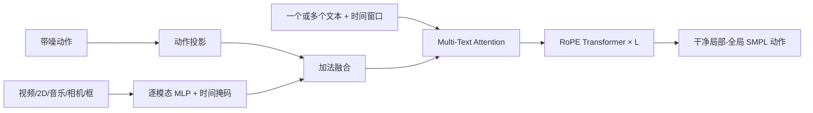

# P0002 — GENMO：一个用于人体运动的通才模型

## 1. 基本信息

- 论文：[arXiv:2505.01425](https://arxiv.org/abs/2505.01425)，ICCV 2025 Highlight。
- 项目页：[NVIDIA Research](https://research.nvidia.com/labs/dair/genmo)
- 代码：[NVlabs/GENMO](https://github.com/NVlabs/GENMO)。项目后来将 GENMO 更名为 GEM，但论文题名和永久档案 ID 保持不变。
- 开源核验：官方仓库提供训练/推理代码与 GEM-SMPL 权重；训练所需完整数据集未随仓库发布。

## 2. 一句话总结

GENMO 把动作估计改写成强观测条件下的动作生成，用一个扩散 Transformer 同时处理视频/2D 姿态估计与文本、音乐、关键帧驱动的多样动作生成。

## 3. 研究问题

传统方法把估计与生成拆成不同模型，无法共享人体时序和运动学先验。论文希望同一网络既能在视频条件下精确恢复动作，又能在文本或音乐条件下保持多样性，并支持变长、分时段和多模态组合控制。

## 4. 整体框架

## 5. 框架详细说明

- 逐帧对齐条件先经独立 MLP 投影和有效区间掩码，再在公共隐空间加法融合。
- 文本没有天然帧对齐关系，因此通过带时间窗口的跨注意力注入；多段文本可控制不同时间区间。
- RoPE 与滑动窗口注意力负责变长时序建模，减少绝对位置长度绑定。
- 输出联合局部姿态、gravity-view 全局轨迹、相机运动和手脚接触，兼顾估计与生成。

## 6. 训练流程

同一网络按样本切换两类目标：文本/音乐等高方差条件使用标准扩散生成损失；视频/2D 关键点等低方差强条件同时使用生成模式和最大噪声下直接回归的估计模式。解码后的关节、顶点、接触和 2D 重投影损失提供几何约束。对于仅有 2D 标注的野外视频，模型先估计伪 3D，再用重投影监督反哺生成训练。

## 7. 推理与部署

推理从噪声出发，在一次扩散过程中接受任意可用条件组合。论文输出是人体 SMPL 运动，不是机器人关节控制；接入人形机器人仍需重定向和跟踪控制链路。

## 8. 实验与结论

论文在人体运动估计、文本生成、音乐舞蹈、关键帧插值和混合条件任务上评估。AIST++ 中统一模型的动作多样性、PFC 与 BAS 优于专用 music-only 版本，但 FID 存在分布贴合权衡。双模式训练优于仅扩散或仅回归，说明生成先验与精确估计可相互促进。

## 9. 优点

- 单一主干统一任务、条件和训练模式。
- 支持不同时间段的多文本与多模态混合控制。
- 可利用仅有 2D 标注的野外视频扩展动作先验。

## 10. 局限

- “任意长度”依赖滑动窗口和训练外泛化，长序列仍可能累积漂移。
- 不同动作表示转换带来分布偏移。
- 人体运动质量不等于机器人动力学可执行性。

## 11. 对个人研究的价值

GENMO 适合作为视频/文本/音乐到人体运动的统一上游。机器人链路需要明确区分：GENMO 生成 SMPL → 重定向得到机器人参考 → GMT/SONIC 跟踪执行。

## 12. 阅读与复现状态

- [x] 阅读原文
- [x] 精读方法与全文翻译
- [x] 核验官方代码与权重入口
- [ ] 在本知识库中运行官方 Demo/训练
- [ ] 机器人重定向与控制闭环验证

## 13. 本地材料

- `local_archive/P0002/GENMO：A GENeralist Model for Human MOtion.pdf`：ICCV 原文。
- `local_archive/P0002/GENMO_方法详解与全文翻译.pdf`：方法拆解与全文中文翻译。

## 14. 来源

- [论文](https://arxiv.org/abs/2505.01425)
- [项目页](https://research.nvidia.com/labs/dair/genmo)
- [官方代码](https://github.com/NVlabs/GENMO)

## 15. 更新日志

- 2026-09-03：建立 GENMO 精读档案，记录 GEM 更名与当前开源状态，登记本地原文和译解材料。
