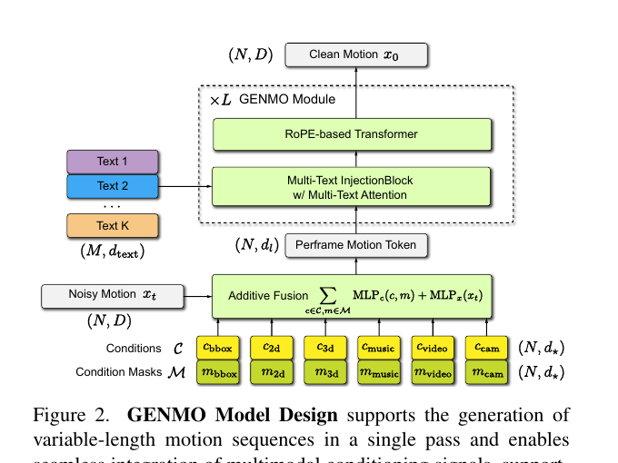
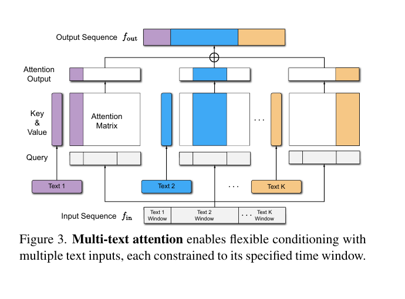

<!--
---
id: P0002
title_en: "GENMO: A GENeralist Model for Human MOtion"
title_zh: "GENMO：一个用于人体运动的通才模型"
year: 2025
date: 2025-05-02
venue: "ICCV 2025 (Highlight)"
primary_category: motion-generation
tags:
  - motion-generation
  - human-motion
  - multimodal
  - diffusion
  - transformer
  - text
  - music
  - video
  - smpl
authors:
  - Jiefeng Li
  - Jinkun Cao
  - Haotian Zhang
  - Davis Rempe
  - Jan Kautz
  - Umar Iqbal
  - Ye Yuan
institutions:
  - NVIDIA
paper_url: "https://arxiv.org/abs/2505.01425"
project_url: "https://research.nvidia.com/labs/dair/genmo"
github_url: "https://github.com/NVlabs/GENMO"
video_url: null
open_source:
  code: full
  training_code: full
  inference_code: full
  model_weights: full
  dataset: "no"
  robot_deployment: "no"
open_source_checked: 2026-09-03
robots: []
inputs:
  - video
  - 2D keypoints
  - text
  - music
  - 3D keyframes
outputs:
  - SMPL human motion
read_status: deep-read
reproduce_status: not-started
local_materials:
  - "local_archive/P0002/GENMO：A GENeralist Model for Human MOtion.pdf"
  - "local_archive/P0002/GENMO_方法详解与全文翻译.pdf"
created: 2026-09-03
updated: 2026-09-03
---
-->

# P0002｜GENMO：一个用于人体运动的通才模型

*GENMO: A GENeralist Model for Human MOtion*

[论文](https://arxiv.org/abs/2505.01425) · [项目页](https://research.nvidia.com/labs/dair/genmo) · [官方代码](https://github.com/NVlabs/GENMO) · [方法详解与全文翻译](attachments/方法详解与全文翻译.pdf)

## 基本信息

<!-- AUTO-BASIC-INFO:START -->
> **作者**：Jiefeng Li、Jinkun Cao、Haotian Zhang、Davis Rempe、Jan Kautz、Umar Iqbal、Ye Yuan
>
> **机构**：NVIDIA
>
> **论文时间**：2025-05-02
>
> **期刊 / 会议**：ICCV 2025 (Highlight)
>
> **主分类**：动作生成
>
> **重点标签**：**动作生成** · **人体动作** · **多模态** · **扩散模型** · **Transformer** · **文本** · **音乐** · **视频** · **SMPL**
>
> **阅读状态**：已精读　·　**复现状态**：未开始
<!-- AUTO-BASIC-INFO:END -->

### 资料与开源说明

- 名称说明：官方项目后来将 GENMO 更名为 GEM，但论文题名和永久档案 ID 保持不变。
- 开源核验：官方仓库提供训练/推理代码与 GEM-SMPL 权重；训练所需完整数据集未随仓库发布。

## 本文贡献

- 提出统一的扩散 Transformer，把视频/2D 姿态下的确定性动作估计与文本、音乐、关键帧下的多样动作生成放入同一训练目标。
- 设计逐帧加法条件融合与带时间区间的 Multi-Text Attention，使不同模态、多个文本片段和可变长度序列能共用主干。
- 通过“生成模式 + 最大噪声估计模式”以及关节、顶点、接触、2D 重投影等几何监督，让生成先验反哺估计，并用野外 2D 视频扩大训练分布。

## 研究问题

传统方法把估计与生成拆成不同模型，无法共享人体时序和运动学先验。论文希望同一网络既能在视频条件下精确恢复动作，又能在文本或音乐条件下保持多样性，并支持变长、分时段和多模态组合控制。

## 原论文重点图

**图 1：GENMO 统一模型设计（原论文方法图）。** 带噪动作与逐帧条件先投影到同一隐空间，视频特征、2D 关键点、相机、音乐等通过加法融合；文本通过跨注意力注入。相同 Transformer 主干依据条件强弱既可执行扩散去噪，也可在最大噪声处直接回归。

**图 2：Multi-Text Attention（原论文方法图）。** 每条文本附带有效时间区间，注意力掩码只允许对应动作帧读取该文本，从而表达“前半段走路、后半段跳舞”等分段控制，而不必把文本硬对齐为逐帧特征。

## 研究方法详细解读

### 总体流程：一个主干同时做估计与生成

GENMO 的数据流是：先把目标动作表示加噪，把视频、2D 骨架、音乐、相机、关键帧等逐帧条件投影到同一隐空间并与动作 token 相加；文本条件则通过跨注意力进入 16 层 Transformer 主干；网络预测干净动作，最后由人体运动学解码出 SMPL 关节、网格、全局轨迹和接触。训练时依据条件的确定性选择“从任意噪声去噪”的生成模式或“从纯噪声直接恢复唯一答案”的估计模式，但两者共享全部主干参数，所以视频估计学到的几何约束和文本/音乐生成学到的运动先验能够互相迁移。

### 动作、相机与接触表征

每帧目标不是单一关节角，而是把 gravity-view 下的根朝向 6D、根局部速度、24 个 SMPL 关节的 6D 旋转、10 维体型、根平移、相机 6D 旋转与三维平移以及 6 个接触标记组合起来。gravity-view 将重力方向固定而保留水平朝向，便于同时表达相机运动和人体全局运动；6D 旋转避免四元数符号跳变。接触维度让网络显式学习足/手与地面的时序关系，几何解码后还能在关节和网格空间施加监督，而不是只在参数向量上比较误差。

### 条件编码与图中信息流

帧对齐条件分别经过自己的 MLP，并带有“该条件在哪些帧有效”的掩码；投影结果与带噪动作做加法，因此缺失某个模态时只需关闭对应分支。文本没有天然逐帧对应，模型为每条提示附上起止区间，在 Multi-Text Attention 中只允许区间内的动作帧读取该文本，由此实现分段语义控制。主干使用 RoPE 编码相对时间，并以滑动窗口注意力处理长序列；这解释了框架图中条件加法支路、文本跨注意力支路和时序主干三类箭头各自承担的功能。

### 训练阶段与损失构成

生成模式遵循 DDPM：随机采样扩散时刻，将干净动作加噪后回归原始动作，适用于文本、音乐等一对多条件。估计模式把输入直接置于最大噪声时刻，让网络从视频或 2D 骨架回归确定的动作；强条件样本也参加生成模式，使估计不退化成逐帧回归。基础动作损失之外，网络经 SMPL 前向运动学计算关节、顶点和接触误差，并把三维结果投影到图像平面形成 2D 重投影损失。对只有 2D 标注的野外视频，先由估计分支产生伪三维动作，再重新加噪交给生成分支，通过可计算的重投影误差利用无三维真值数据。

### 多数据集联合训练与条件缺失

训练混合 AMASS、BEDLAM、Human3.6M、3DPW、AIST++、HumanML3D、Motion-X 等来源；每个数据集只提供其拥有的模态和监督，未提供的字段由掩码排除，而不是伪造完整标注。这样的采样把视频估计、文本生动作、音乐舞蹈、关键帧补全放入同一 batch 分布。需要注意，联合训练的关键不只是“多数据集”，而是每个样本都携带条件可见性与损失可见性，确保网络只在有证据的维度上受监督。

### 推理、组合控制与机器人边界

推理时从高斯噪声或给定的部分动作出发，按可用模态组合条件并迭代去噪；多段文本的时间掩码控制局部语义，帧级关键点/视频/音乐提供更强的时序约束。滑窗可把模型外推到较长序列，但窗口间误差仍可能累计。“统一模型”输出的是 SMPL 人体运动及相机/接触量，不直接输出机器人关节命令；用于人形机器人时还必须经过骨架和尺度映射、重定向、动力学可行性检查与闭环跟踪，知识库未把人体指标当作实机验证。

## 实验结果与结论

论文在人体运动估计、文本生成、音乐舞蹈、关键帧插值和混合条件任务上评估。AIST++ 中统一模型的动作多样性、PFC 与 BAS 优于专用 music-only 版本，但 FID 存在分布贴合权衡。双模式训练优于仅扩散或仅回归，说明生成先验与精确估计可相互促进。

## 局限与复现提醒

- “任意长度”依赖滑动窗口和训练外泛化，长序列仍可能累积漂移。
- 不同动作表示转换带来分布偏移。
- 人体运动质量不等于机器人动力学可执行性。

### 对个人研究的价值

GENMO 适合作为视频/文本/音乐到人体运动的统一上游。机器人链路需要明确区分：GENMO 生成 SMPL → 重定向得到机器人参考 → GMT/SONIC 跟踪执行。

## 阅读与复现状态

- 阅读：已深读原文、方法详解与全文翻译。
- 资源：已核验官方代码与权重入口。
- 运行：本知识库尚未执行官方 Demo 或训练。
- 机器人：尚未完成重定向与闭环控制验证。

## 参考资料

- [论文](https://arxiv.org/abs/2505.01425)
- [项目页](https://research.nvidia.com/labs/dair/genmo)
- [官方代码](https://github.com/NVlabs/GENMO)

## 更新记录

- 2026-09-03：依据原论文方法与训练章节，扩展总体流程、数据表征、模块信息流、训练目标、推理/部署及实现边界。
- 2026-09-03：补充正文基本信息卡，展示完整作者、机构、论文时间、期刊/会议、分类、标签与状态。
- 2026-09-03：建立 GENMO 精读档案，记录 GEM 更名与当前开源状态，登记本地原文和译解材料。
- 2026-09-03：纳入译解附件和原论文方法图，补充完整动作表征、网络结构及双模式训练解读。
