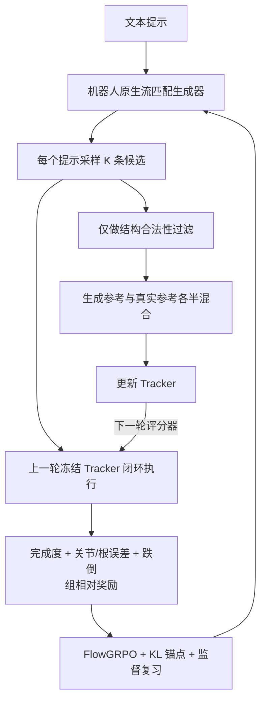

# P0003 — GenTrack：机器人原生生成与零样本跟踪的物理对齐

## 1. 基本信息

- 论文：[arXiv:2608.01410](https://arxiv.org/abs/2608.01410)，本地译解依据 v2（2026-08-05）。
- 平台：Unitree G1；实验使用 ProtoMotions 与 SONIC 两类跟踪器骨干。
- 开源状态：截至 2026-09-03，论文未给出官方项目页、代码、权重或公开生成测试集入口。

## 2. 一句话总结

GenTrack 让机器人原生文本动作生成器与全身跟踪器在线交替后训练：上一轮跟踪器用闭环执行反馈对齐生成器，新生成参考再扩大下一轮跟踪器的零样本覆盖。

## 3. 研究问题

人体/重定向数据可以扩展参考动作数量，但“处于机器人坐标空间”并不保证在闭环动力学下可执行。固定生成数据或固定奖励跟踪器的单向方案会很快过时，且筛选容易把分布压向简单动作。

## 4. 整体框架

## 5. 表征与奖励

每帧使用 38 维 G1 表示：3 维根通道、6D 骨盆旋转和 29 个驱动关节角；片段规范到首帧地面原点与 +x 朝向，平面根运动用增量表示。执行代价综合完成比例、最大关节误差、根轨迹/位移误差和跌倒，形成比二值成功更稠密的物理反馈。

## 6. 训练流程

每轮对同一提示采样多个候选，由上一轮冻结跟踪器执行并组内归一化奖励；生成器用 FlowGRPO 更新，同时以初始生成器 KL 和原始文本动作监督复习抑制语义/多样性坍塌。结构有效的新参考进入累计池，与公开重定向参考按相同 transition 预算混合，使用跟踪器原生目标继续训练。

## 7. 推理与部署

在线联合训练结束后，生成器直接输出 G1 机器人空间参考，跟踪器负责闭环执行。论文实验限于仿真 G1，没有真实机器人共同在线训练证据。

## 8. 主要结果

SONIC 分支在 LAFAN1/AMASS-test/Wild-G1 的成功率由 85.0/79.0/47.2 提升到 90.0/79.7/48.0，MPJPE 由 126.2 mm 降到 124.1 mm。生成器关键身体位置误差由 0.410 m 降到 0.325 m，同时保持或改善 TMR/FID。Filtered SFT 虽有更高名义执行成功率，却损害语义和分布指标，说明“容易跟踪”不等于整体更好。

## 9. 优点与局限

- 优点：把生成覆盖与控制能力做成共同演化闭环；滞后评分器减少自评非平稳性；锚点与复习显式防塌缩。
- 局限：只评估仿真 Unitree G1；内部 357k 初始化数据、Wild-G1 与 1024 提示套件不公开；奖励仍依赖特定跟踪器能力边界。

## 10. 对个人研究的价值

它直接对应“GENMO/机器人原生生成器 → SONIC”链路的联合后训练设想，并提示不能用一次性离线生成或成功门过滤替代在线互训。

## 11. 阅读与复现状态

- [x] 阅读原文与 v2 译解
- [x] 核对 38D 表征、奖励和主要结果
- [ ] 官方代码（尚未发布）
- [ ] 仿真复现
- [ ] 实机验证（论文未报告）

## 12. 本地材料

- `local_archive/P0003/GenTrack: Physical Alignment for Robot-Native Motion Generation and.pdf`：论文 v2。
- `local_archive/P0003/GenTrack_方法详解与全文中文翻译.docx`：方法详解与全文翻译。

## 13. 来源

- [arXiv](https://arxiv.org/abs/2608.01410)

## 14. 更新日志

- 2026-09-03：创建精读档案；明确无官方开源入口与仅仿真验证边界。
