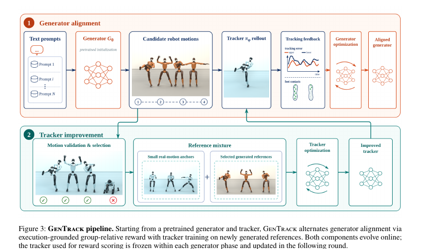

<!--
---
id: P0003
title_en: "GenTrack: Physical Alignment for Robot-Native Motion Generation and Zero-Shot Humanoid Tracking"
title_zh: "GenTrack：面向机器人原生动作生成与零样本人形机器人跟踪的物理对齐"
year: 2026
date: 2026-08-02
venue: "arXiv preprint arXiv:2608.01410"
primary_category: motion-generation
tags:
  - motion-generation
  - motion-tracking
  - physics-feedback
  - reinforcement-learning
  - flow-matching
  - g1
  - sim2sim
authors:
  - Zeyu Ling
  - Xinyao Yu
  - Renye Yan
  - Jikang Cheng
  - Zhanke Wang
  - Qing Shuai
  - Changqing Zou
institutions:
  - Zhejiang University
  - Peking University
  - Tencent
  - Zhejiang Lab
paper_url: "https://arxiv.org/abs/2608.01410"
project_url: null
github_url: null
video_url: null
open_source:
  code: "no"
  training_code: "no"
  inference_code: "no"
  model_weights: "no"
  dataset: "no"
  robot_deployment: "no"
open_source_checked: 2026-09-03
robots:
  - Unitree G1
inputs:
  - text
  - robot motion references
outputs:
  - robot-native motion
  - motion tracking policy
read_status: deep-read
reproduce_status: not-started
local_materials:
  - "local_archive/P0003/GenTrack: Physical Alignment for Robot-Native Motion Generation and.pdf"
  - "local_archive/P0003/GenTrack_方法详解与全文中文翻译.docx"
created: 2026-09-03
updated: 2026-09-04
---
-->

# P0003｜GenTrack：机器人原生生成与零样本跟踪的物理对齐

*GenTrack: Physical Alignment for Robot-Native Motion Generation and Zero-Shot Humanoid Tracking*

[论文](https://arxiv.org/abs/2608.01410) · [方法详解与全文中文翻译](attachments/方法详解与全文中文翻译.docx)

## 基本信息

<!-- AUTO-BASIC-INFO:START -->
> **作者**：Zeyu Ling、Xinyao Yu、Renye Yan、Jikang Cheng、Zhanke Wang、Qing Shuai、Changqing Zou
>
> **机构**：Zhejiang University、Peking University、Tencent、Zhejiang Lab
>
> **论文时间**：2026-08-02
>
> **期刊 / 会议**：arXiv preprint arXiv:2608.01410
>
> **主分类**：动作生成
>
> **重点标签**：**动作生成** · **动作跟踪** · **物理反馈** · **强化学习** · **流匹配** · **Unitree G1** · **Sim2Sim**
>
> **阅读状态**：已精读　·　**复现状态**：未开始
<!-- AUTO-BASIC-INFO:END -->

### 资料与开源说明

- 阅读版本：译解附件依据 arXiv v2（2026-08-05）。
- 平台：Unitree G1；实验使用 ProtoMotions 与 SONIC 两类跟踪器骨干。
- 开源状态：截至 2026-09-03，论文未给出官方项目页、代码、权重或公开生成测试集入口。

## 本文贡献

- 提出生成器—跟踪器共同演化的交替训练框架，用上一轮冻结跟踪器给生成动作提供真实闭环物理反馈。
- 设计 FlowGRPO 组相对优化，将动作完成度、跟踪误差与跌倒组合成稠密奖励，同时用 KL 锚点和监督复习抑制语义与多样性坍塌。
- 让通过结构检查的新机器人原生动作反向扩充跟踪训练分布，在不依赖真实机器人在线采样的条件下提高零样本跟踪覆盖。

## 研究问题

人体/重定向数据可以扩展参考动作数量，但“处于机器人坐标空间”并不保证在闭环动力学下可执行。固定生成数据或固定奖励跟踪器的单向方案会很快过时，且筛选容易把分布压向简单动作。

## 原论文重点图

**图 1：GenTrack 的生成—执行共同演化（原论文框架图）。** 左侧以文本采样多条机器人原生参考；中间由冻结的上一代跟踪器在仿真闭环中执行并回传组相对物理奖励；生成器更新后产生的新参考与真实参考混合，继续训练下一代跟踪器。箭头构成跨轮次闭环，而不是在同一步同时更新两个网络。

## 研究方法详细解读

GenTrack 的核心不是“生成更多动作再训练 tracker”这么简单，而是让生成器和跟踪器轮流改变对方的训练分布：跟踪器用真实闭环执行结果告诉生成器哪些动作更可执行，更新后的生成器再制造当前 tracker 没见过的新参考，迫使 tracker 扩展能力。两者不是一次端到端反传，而是在轮次边界交替冻结和更新。

### 1. 总体定位：GenTrack 要解决什么问题

机器人原生关节轨迹只解决了骨架格式问题，并不等于动力学可执行；另一方面，只在固定重定向动作库上训练的 tracker 会受数据覆盖限制。若用当前 tracker 的成功阈值直接筛选生成动作，训练集又会越来越偏向容易、缓慢的动作。GenTrack 因此需要同时解决三个矛盾：把物理执行反馈送回不可微生成器、避免生成器向保守动作塌缩，以及让 tracker 学习困难生成分布而不是只回放已会技能。

### 2. 完整训练循环：每轮六步

1. 用离线重定向数据分别初始化机器人动作生成器和跟踪器。
2. 对同一文本采样一组 G1 动作，只删除数值或结构非法样本。
3. 冻结上一轮 tracker，在仿真中执行候选并计算完成度、关节、根轨迹和跌倒组成的稠密分数。
4. 组内归一化奖励，用 FlowGRPO 更新生成器，同时用初始模型 KL 和监督复习保持语义与多样性。
5. 将结构有效的生成动作与公开参考按相同 transition 预算混合，继续用 PPO 更新 tracker。
6. 冻结新 tracker 作为下一轮物理评价器，重复上述过程。

### 3. 总体信息流：生成器与跟踪器交替互教

GenTrack 不在一次反向传播中端到端训练“文本到力矩”，而是维护机器人原生生成器 `Gθ` 与闭环跟踪策略 `πϕ` 两个模型。第一轮先用离线 GMR 重定向的文本—G1 动作对初始化生成器，并用已有参考动作初始化跟踪器；之后每轮执行“同提示批量生成候选 → 冻结上一轮跟踪器在物理仿真中执行并打分 → 用组相对策略优化更新生成器 → 收集结构有效的新动作 → 以公开动作和生成动作混合继续训练跟踪器”。新跟踪器成为下一轮更强的物理评价器，由此形成双向提升闭环。

### 机器人原生动作表征与离线初始化

生成空间直接采用 38 维 Unitree G1 表征：3 维根通道、骨盆 6D 旋转和 29 个驱动关节角。每个片段将首帧平移到地面原点并规范为朝向 `+x`，平面根运动用相邻帧位移而非绝对世界坐标表示，从而降低场景位置对学习的干扰。GMR 只用于建立最初的 357,472 条配对参考，不在交替循环里不断充当教师；这一设计让后续生成分布可以由机器人可执行性而非人体重定向误差主导。

### 物理评分如何从 rollout 产生

每个文本提示一次采样 `K` 条候选，先做有限值、形状和场景依赖的结构检查；通过者才交给“上一轮已冻结”的跟踪器执行。评分不是单一是否跌倒，而是综合完成比例、最大关节误差、平均根轨迹误差、位移误差与跌倒情况，未通过结构检查的样本直接获得负反馈。当前正在训练的跟踪器不参与给自己生成的数据打分，避免评价器和被评价者在同一步共同漂移；TMR 相似度和多样性只用于留出集评估，不被偷换成奖励。

### 生成器的 FlowGRPO 更新

候选奖励先在同一提示组内标准化，以相对优势告诉 flow-matching 生成器“哪些样本比同组更可执行”。每轮对采样轨迹做四次 clipped replay 更新，同时加入相对初始冻结生成器的 KL 约束（系数 0.02），每两次迭代再穿插原始文本—动作的监督 flow-matching 锚点（权重 1）。组相对更新提供物理偏好，KL 和监督复习分别防止分布突然偏移及文本语义/多样性坍塌；因此方法不是把仿真分数简单回归到动作，而是在原生成先验附近做受限策略优化。

### 跟踪器更新与数据池管理

生成候选只要结构合法就进入累计生成池，并不要求先达到某个跟踪成功阈值，这使跟踪器能够接触当前弱点而非只学习容易样本。训练 batch 以相同 transition 预算混合公开重定向动作和新生成动作，再按 ProtoMotions/SONIC 对应实现的原生 PPO 跟踪目标更新策略。公开参考维持基础技能，生成分布暴露当前生成器特有的速度、根轨迹和姿态误差；轮次结束后导出新策略，并冻结为下一轮评分器。

### 推理、部署和证据边界

最终推理时，文本只经过生成器得到 G1 机器人空间参考，闭环策略读取本体状态和参考窗口输出关节控制；GMR 不再位于在线链路。这缩短了“人体生成—在线重定向—机器人控制”的接口，但生成参考仍需跟踪策略承担动力学修正。论文分别以 ProtoMotions 和 SONIC 跟踪器实例验证闭环，知识库记录的是仿真共同训练证据；没有据此宣称真实 G1 上已经完成安全部署。

## 实验结果与结论

SONIC 分支在 LAFAN1/AMASS-test/Wild-G1 的成功率由 85.0/79.0/47.2 提升到 90.0/79.7/48.0，MPJPE 由 126.2 mm 降到 124.1 mm。生成器关键身体位置误差由 0.410 m 降到 0.325 m，同时保持或改善 TMR/FID。Filtered SFT 虽有更高名义执行成功率，却损害语义和分布指标，说明“容易跟踪”不等于整体更好。

## 局限与复现提醒

- 优点：把生成覆盖与控制能力做成共同演化闭环；滞后评分器减少自评非平稳性；锚点与复习显式防塌缩。
- 局限：只评估仿真 Unitree G1；内部 357k 初始化数据、Wild-G1 与 1024 提示套件不公开；奖励仍依赖特定跟踪器能力边界。

### 对个人研究的价值

它直接对应“GENMO/机器人原生生成器 → SONIC”链路的联合后训练设想，并提示不能用一次性离线生成或成功门过滤替代在线互训。

## 阅读与复现状态

- 阅读：已深读原文与 v2 译解，核对 38D 表征、奖励和主要结果。
- 代码：论文未发布官方实现。
- 仿真：尚未复现。
- 实机：论文未报告，本知识库也未验证。

## 参考资料

- [arXiv](https://arxiv.org/abs/2608.01410)

## 更新记录

- 2026-09-04：参照 ADAPT 文档第一部分重构方法开篇，明确双向在线训练的三个核心矛盾，并用六步循环讲清生成、物理评分、FlowGRPO、数据池和 tracker 更新顺序。
- 2026-09-03：依据原论文方法与训练章节，扩展总体流程、数据表征、模块信息流、训练目标、推理/部署及实现边界。
- 2026-09-03：补充正文基本信息卡，展示完整作者、机构、论文时间、期刊/会议、分类、标签与状态。
- 2026-09-03：创建精读档案；明确无官方开源入口与仅仿真验证边界。
- 2026-09-03：纳入译解附件与原论文框架图，扩展共同演化、FlowGRPO 和表征解读。
