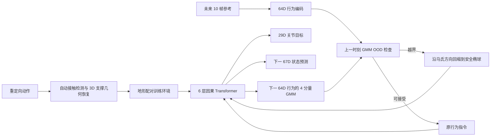

# P0004 — GigaBrain-WBC-0.5：行为世界模型全身控制

## 1. 基本信息

- 论文：[arXiv:2608.18234](https://arxiv.org/abs/2608.18234)
- 项目页：[GigaBrain-WBC-0.5](https://shepherd1226.github.io/gigabrain-wbc-0.5/)
- 开源状态：项目页标注代码 “coming soon”；当前无官方 GitHub、权重或数据下载入口。

## 2. 一句话总结

方法把全身跟踪器改造成因果行为世界模型，使同一网络同时预测控制动作、下一本体状态和下一潜在行为分布，并用该分布在线回缩不合理指令。

## 3. 研究问题

大规模跟踪器通常在空场景和平地训练，无法利用椅子、台阶、负载等环境接触；当参考命令在当前环境下不可行时，纯反应式策略也缺少“当前还能做什么”的显式估计。

## 4. 整体框架

## 5. 输入、网络与输出

控制频率 50 Hz。输入为 67D 本体状态、29D 上一步动作和 64D 行为命令，共 160D；核心为 6 层、4 头、局部窗口 32 帧的因果 Transformer。三个输出头分别给出 29D PD 关节目标、下一 67D 状态和下一行为的 4 分量对角 GMM。

## 6. 数据与训练

自动标注管线从重定向动作中的低速接触点恢复点云，经全身穿透过滤、DBSCAN 和几何原语拟合得到可仿真的 3D 支撑。训练动作来自 Bones-Seed、MotionMillion、MotionDecode 共 2188 小时，其中恢复约 72.57 小时地形交互。PPO 主目标配合参考重建/循环一致性、下一状态预测和行为 GMM 似然损失。

## 7. 推理与部署

原始参考编码后先由上一时刻 GMM 做 OOD 判断；越界时不急停，而是沿原意图方向投影到安全半径 `R_safe=3` 的椭球边界，再由策略执行。这个过滤器检测训练分布偏离，不是形式化物理安全证明。

## 8. 主要结果

论文报告 Standard 成功率 96.3%，Terrain 81.3%，不合理参考下 83.1%，摔倒恢复 99.3%；地形结果约为最强基线 4.3 倍。硬件演示覆盖坐支撑、上平台、携带负载、支撑缺失、外部扰动和跨 Maker L01 微调，但项目页明确说明核心量化表为 MuJoCo sim-to-sim。

## 9. 优点与局限

- 优点：把环境依赖的行为可行性建模、数据生成和部署过滤统一到同一控制器。
- 局限：OOD 距离不是风险或稳定性证明；安全半径需随 checkpoint/机器人重新标定；自动几何只恢复真实接触过的支撑面；代码尚未开放。

## 10. 对个人研究的价值

它为 SONIC/GMT 类控制器补充“环境如何改变可执行行为”的建模层，适合研究从平地跟踪走向支撑交互与 best-effort 指令修正；不应把它当作高层视觉世界模型。

## 11. 阅读与复现状态

- [x] 阅读原文与方法译解
- [x] 核对控制频率、输入输出和主要量化结果
- [ ] 官方代码/权重（尚未发布）
- [ ] 仿真复现
- [ ] 独立实机安全验证

## 12. 本地材料

- `local_archive/P0004/GigaBrain-WBC-0.5: A Behavior World Model.pdf`：原论文。
- `local_archive/P0004/GigaBrain-WBC-0.5_方法讲解与全文中文翻译.pdf`：方法讲解与全文翻译。

## 13. 来源

- [论文](https://arxiv.org/abs/2608.18234)
- [官方项目页](https://shepherd1226.github.io/gigabrain-wbc-0.5/)

## 14. 更新日志

- 2026-09-03：创建精读档案；将项目页“代码即将发布”和 sim-to-sim/硬件演示边界分别记录。
