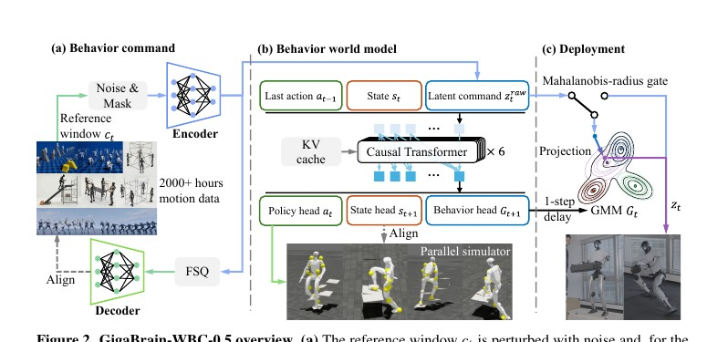
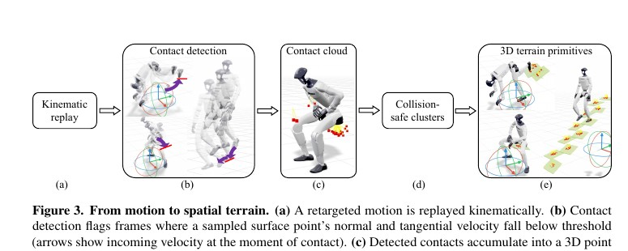

<!--
---
id: P0004
title_en: "GigaBrain-WBC-0.5: A Behavior World Model for Robust Whole-Body Control with Environment Interaction"
title_zh: "GigaBrain-WBC-0.5：用于环境交互鲁棒全身控制的行为世界模型"
year: 2026
date: 2026-08-18
venue: "Technical report, arXiv:2608.18234"
primary_category: world-model-vla-agent
tags:
  - world-model
  - whole-body-control
  - motion-tracking
  - transformer
  - physics-feedback
  - g1
  - sim2real
authors:
  - Ziyang Cheng
  - Tianshu Tang
  - Jinxin Lan
  - Xinze Chen
  - Yuhan Gong
  - Zhichao Liu
  - Changzhong Wu
  - Yahao Mao
  - Zongyan Deng
  - Mingxuan Ma
  - Huasen Xi
  - Yilong Liu
  - Yutong Wu
  - Xiaofeng Wang
  - Yang Wang
  - Yun Ye
  - Guan Huang
  - Xiaojie Jin
  - Zheng Zhu
  - Jiwen Lu
institutions:
  - Tsinghua University
  - GigaAI
  - University of Shanghai for Science and Technology
  - Beijing Jiaotong University
  - Institute of Automation, Chinese Academy of Sciences
  - University of Chinese Academy of Sciences
paper_url: "https://arxiv.org/abs/2608.18234"
project_url: "https://shepherd1226.github.io/gigabrain-wbc-0.5/"
github_url: null
video_url: null
open_source:
  code: "no"
  training_code: "no"
  inference_code: "no"
  model_weights: "no"
  dataset: "no"
  robot_deployment: "no"
open_source_checked: 2026-09-03
robots:
  - Unitree G1
  - Maker L01
inputs:
  - proprioception
  - previous action
  - latent behavior command
outputs:
  - joint position target
  - next proprioceptive state
  - next behavior distribution
read_status: deep-read
reproduce_status: not-started
local_materials:
  - "local_archive/P0004/GigaBrain-WBC-0.5: A Behavior World Model.pdf"
  - "local_archive/P0004/GigaBrain-WBC-0.5_方法讲解与全文中文翻译.pdf"
created: 2026-09-03
updated: 2026-09-03
---
-->

# P0004｜GigaBrain-WBC-0.5：行为世界模型全身控制

*GigaBrain-WBC-0.5: A Behavior World Model for Robust Whole-Body Control with Environment Interaction*

[论文](https://arxiv.org/abs/2608.18234) · [项目页](https://shepherd1226.github.io/gigabrain-wbc-0.5/) · [方法讲解与全文中文翻译](attachments/方法讲解与全文中文翻译.pdf)

## 基本信息

<!-- AUTO-BASIC-INFO:START -->
> **作者**：Ziyang Cheng、Tianshu Tang、Jinxin Lan、Xinze Chen、Yuhan Gong、Zhichao Liu、Changzhong Wu、Yahao Mao、Zongyan Deng、Mingxuan Ma、Huasen Xi、Yilong Liu、Yutong Wu、Xiaofeng Wang、Yang Wang、Yun Ye、Guan Huang、Xiaojie Jin、Zheng Zhu、Jiwen Lu
>
> **机构**：Tsinghua University、GigaAI、University of Shanghai for Science and Technology、Beijing Jiaotong University、Institute of Automation, Chinese Academy of Sciences、University of Chinese Academy of Sciences
>
> **论文时间**：2026-08-18
>
> **期刊 / 会议**：Technical report, arXiv:2608.18234
>
> **主分类**：世界模型 / VLA / Agent
>
> **重点标签**：**世界模型** · **全身控制** · **动作跟踪** · **Transformer** · **物理反馈** · **Unitree G1** · **Sim2Real**
>
> **阅读状态**：已精读　·　**复现状态**：未开始
<!-- AUTO-BASIC-INFO:END -->

### 资料与开源说明

- 开源状态：项目页标注代码 “coming soon”；当前无官方 GitHub、权重或数据下载入口。

## 本文贡献

- 把全身控制策略扩展为因果行为世界模型，同步预测关节动作、下一本体状态和下一行为分布。
- 从已有动作的接触轨迹自动恢复可仿真支撑几何，构造包含椅子、台阶、负载等环境交互的训练数据，而不只训练空场平地跟踪。
- 在部署时用上一时刻预测的 GMM 检测行为命令是否分布外，并把越界指令沿原意图方向回缩到安全椭球，提供 best-effort 执行。

## 研究问题

大规模跟踪器通常在空场景和平地训练，无法利用椅子、台阶、负载等环境接触；当参考命令在当前环境下不可行时，纯反应式策略也缺少“当前还能做什么”的显式估计。

## 原论文重点图

**图 1：行为世界模型控制框架（原论文方法图）。** 当前本体状态、历史动作和未来参考编码进入因果 Transformer；动作头负责 PD 目标，状态头学习一步动力学，行为头输出下一行为的混合高斯分布。部署端以该分布筛查外部指令，形成“预测可行行为—修正命令—闭环执行”的链路。

**图 2：接触驱动的三维支撑恢复（原论文方法图）。** 管线从重定向动作中寻找低速接触点，聚类并拟合平面/几何原语，再剔除全身穿透的场景。这使动作和环境不是随机拼接，而是由动作真实发生过的接触关系配对。

## 研究方法详细解读

### 总体流程：行为编码、因果控制与在线修正

完整链路是：离线动作先被整理为未来参考窗口并编码成连续行为潜变量；50 Hz 控制时，策略读取当前 67 维本体状态、29 维上一动作和 64 维行为条件，经局部因果 Transformer 输出 29 维 PD 关节目标；辅助头同时预测下一状态和下一行为分布。部署时，上一时刻预测出的行为 GMM 会先判断下一条参考是否超出训练分布，越界参考被投影到概率椭球边界后再送入策略。换言之，框架图中的 encoder、controller、world/behavior prediction head 和 OOD projector 组成一条有时间先后约束的闭环，而不是四个独立模块。

### 参考窗口与 160 维策略输入

策略状态由 67 维本体量、上一时刻 29 维动作以及行为编码器的 64 维连续输出组成，总计 160 维。行为命令来自未来 10 帧参考，每帧包含 29 维关节角、相对根 6D 旋转、帧间根平移、相对当前根平移和参考坐标中的重力方向，共 44 维、合计 440 维；MLP 将其压缩为两个 32 维 token。FSQ 和解码器只承担参考重建与循环一致性辅助约束，控制策略实际接收的是量化前的连续潜变量，不能把这项工作误解为“离散 token 直接控制机器人”。

### 因果 Transformer 与三个输出头

当前帧 160 维输入先映射到 256 维，再进入 6 层、4 头 Transformer；RoPE 表示相对时序，局部注意力只回看 32 帧，部署时使用 KV cache 避免重复计算。动作头输出 PD 目标，状态头预测下一帧 67 维本体量，行为头输出下一 64 维潜变量的 4 分量对角高斯混合（权重、均值与方差共 516 个参数）。这些辅助预测迫使隐状态同时保留机器人动力学趋势和动作先验，并为下一步的 OOD 检测提供条件分布。

### 地形交互数据的自动恢复

对动作库进行运动学回放，从低速肢体接触点形成候选点云；先用全身穿透与法向方向排除不可能接触，再进行 1 mm 体素化、DBSCAN 聚类和法向/偏移估计，最后以定向盒、主成分轴等几何原语拟合支撑面。得到的原语在 Isaac Lab 中按动作生成对应地形，从而把原本只有关节轨迹的数据转成“动作—支撑几何”训练样本。三套动作源合计约 2,188 小时，但自动恢复出约 72.57 小时地形交互，二者不能混写成相同规模。

### PPO 与辅助目标的联合训练

训练同时运行平地和地形环境（论文设置为 4,096 与 512 个环境），按参考跟踪奖励用 PPO 优化控制策略，并加入跌倒姿态课程、外力和动力学随机化覆盖恢复状态。总目标由 PPO、参考重建（0.01）、编码—解码循环一致性（1）、下一状态预测（0.01）以及行为 GMM 负对数似然（权重 0.005）构成。约三分之一训练样本可得到根平移纠偏，其余样本以及部署时该纠偏量置零，避免策略依赖线上不可获得的特权校正。

### OOD 投影、推理与部署边界

在时刻 `t`，系统只使用 `t-1` 时预测的 GMM 评估当前行为，先选最大后验分量，再计算马氏距离；若超过安全半径，就沿均值到原行为的方向径向投影到椭球边界。严格使用上一时刻分布避免读取未来信息，投影是无状态且论文报告耗时低于 1 ms。它限制的是潜空间统计异常，不验证接触、碰撞或硬件力矩上限；所以“在线修正”应理解为分布内保守化，而非形式化安全控制器。

## 实验结果与结论

论文报告 Standard 成功率 96.3%，Terrain 81.3%，不合理参考下 83.1%，摔倒恢复 99.3%；地形结果约为最强基线 4.3 倍。硬件演示覆盖坐支撑、上平台、携带负载、支撑缺失、外部扰动和跨 Maker L01 微调，但项目页明确说明核心量化表为 MuJoCo sim-to-sim。

## 局限与复现提醒

- 优点：把环境依赖的行为可行性建模、数据生成和部署过滤统一到同一控制器。
- 局限：OOD 距离不是风险或稳定性证明；安全半径需随 checkpoint/机器人重新标定；自动几何只恢复真实接触过的支撑面；代码尚未开放。

### 对个人研究的价值

它为 SONIC/GMT 类控制器补充“环境如何改变可执行行为”的建模层，适合研究从平地跟踪走向支撑交互与 best-effort 指令修正；不应把它当作高层视觉世界模型。

## 阅读与复现状态

- 阅读：已深读原文与方法译解，核对 50 Hz、输入输出和主要量化结果。
- 代码/权重：官方仍标记为即将发布。
- 仿真：尚未复现论文指标。
- 实机：项目视频不等同于本知识库的独立安全验证。

## 参考资料

- [论文](https://arxiv.org/abs/2608.18234)
- [官方项目页](https://shepherd1226.github.io/gigabrain-wbc-0.5/)

## 更新记录

- 2026-09-03：依据原论文方法与训练章节，扩展总体流程、数据表征、模块信息流、训练目标、推理/部署及实现边界。
- 2026-09-03：补充正文基本信息卡，展示完整作者、机构、论文时间、期刊/会议、分类、标签与状态。
- 2026-09-03：创建精读档案；将项目页“代码即将发布”和 sim-to-sim/硬件演示边界分别记录。
- 2026-09-03：纳入译解附件、行为世界模型图和地形恢复图，细化三输出头与 OOD 回缩机制。
