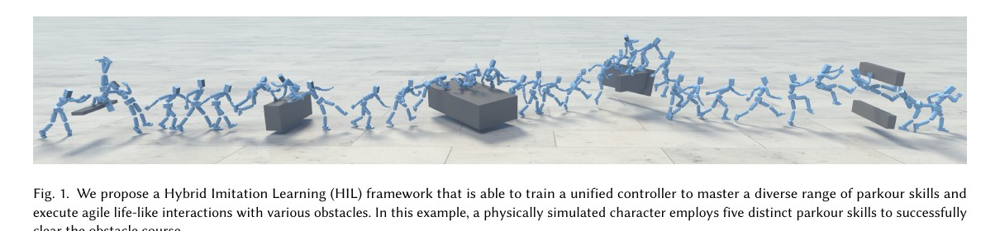
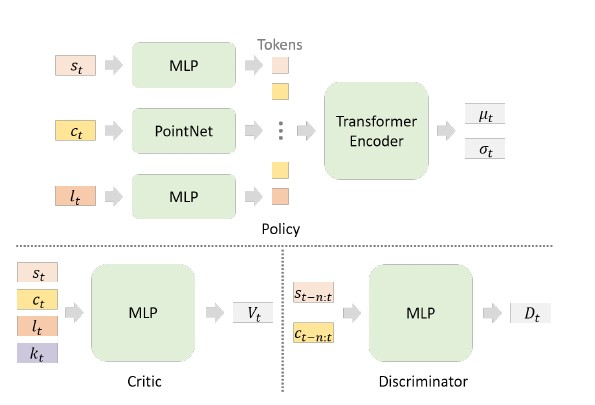

<!--
---
id: P0005
title_en: "HIL: Hybrid Imitation Learning for Dynamic Athletic Control"
title_zh: "HIL：面向动态运动控制的混合模仿学习"
year: 2025
date: 2025-05-19
venue: "ACM Transactions on Graphics (TOG), 2026"
primary_category: locomotion-prior
tags:
  - imitation-learning
  - adversarial-learning
  - reinforcement-learning
  - motion-tracking
  - motion-prior
  - locomotion
authors:
  - Jiashun Wang
  - Yifeng Jiang
  - Haotian Zhang
  - Chen Tessler
  - Davis Rempe
  - Jessica Hodgins
  - Xue Bin Peng
institutions:
  - Carnegie Mellon University
  - NVIDIA
  - Simon Fraser University
paper_url: "https://arxiv.org/abs/2505.12619"
project_url: "https://xbpeng.github.io/projects/HIL/index.html"
github_url: null
video_url: null
open_source:
  code: "no"
  training_code: "no"
  inference_code: "no"
  model_weights: "no"
  dataset: "no"
  robot_deployment: "no"
open_source_checked: 2026-09-03
robots: []
inputs:
  - character state
  - scene geometry
  - goal condition
outputs:
  - simulated character control
read_status: deep-read
reproduce_status: not-started
local_materials:
  - "local_archive/P0005/Hybrid_Imitation_Learning_TOG.pdf"
  - "local_archive/P0005/HIL_2026-leftToRight.pdf"
  - "local_archive/P0005/HIL_全文翻译与方法框架详解.pdf"
created: 2026-09-03
updated: 2026-09-04
---
-->

# P0005｜HIL：面向动态运动控制的混合模仿学习

*HIL: Hybrid Imitation Learning for Dynamic Athletic Control*

[论文](https://arxiv.org/abs/2505.12619) · [项目页](https://xbpeng.github.io/projects/HIL/index.html) · [全文翻译与方法框架详解](attachments/全文翻译与方法框架详解.pdf) · [中英左右对照全文](attachments/中英左右对照全文.pdf)

## 基本信息

<!-- AUTO-BASIC-INFO:START -->
> **作者**：Jiashun Wang、Yifeng Jiang、Haotian Zhang、Chen Tessler、Davis Rempe、Jessica Hodgins、Xue Bin Peng
>
> **机构**：Carnegie Mellon University、NVIDIA、Simon Fraser University
>
> **论文时间**：2025-05-19
>
> **期刊 / 会议**：ACM Transactions on Graphics (TOG), 2026
>
> **主分类**：Locomotion 与运动先验
>
> **重点标签**：**模仿学习** · **对抗学习** · **强化学习** · **动作跟踪** · **运动先验** · **运动控制**
>
> **阅读状态**：已精读　·　**复现状态**：未开始
<!-- AUTO-BASIC-INFO:END -->

### 资料与开源说明

- 版本说明：预印本题名与最终 TOG 版本题名不同，本页以官方项目页列出的最终版本为准；论文时间登记为 arXiv 首次公开日期。
- 开源状态：官方项目页提供论文与视频，但截至核验日没有 HIL 专用代码、权重或数据下载入口。

## 本文贡献

- 在同一策略、观测与动作空间中并行训练精确动作跟踪和目标驱动对抗模仿，避免两套专家的切换开销。
- 引入场景条件判别器，使动作“像参考”之外还必须符合障碍几何与可供性，缓解 AMP 在复杂场景中的错误技能复用。
- 使用 Perturbed State Initialization 扩大参考轨迹邻域，让策略学习偏离后的恢复和技能衔接，在保真度、技能覆盖与任务完成之间取得平衡。

## 研究问题

逐帧跟踪可以忠实复现动作，却难以偏离参考去适应新场景；只做对抗式分布匹配更自由，却容易模式坍塌并反复使用少数简单技能。论文目标是让一个控制器同时保留两者优势。

## 原论文重点图

**图 1：动态运动控制任务总览（原论文 Figure 1）。** 参考库提供跑、跳、翻越等技能，但场景目标常要求策略改变时序、组合技能或在受扰后恢复；这正是单纯逐帧跟踪与纯 AMP 各自不足的交叉区域。

**图 2：混合模仿学习结构（原论文方法图）。** Tracking 与 Goal-Directed 环境共享策略；前者给出参考跟踪奖励以固定动作质量，后者把任务奖励与场景条件判别器输出的风格奖励组合。两路 rollouts 合并进行 PPO 更新，因此混合发生在数据与目标层而非部署时的专家切换。

## 研究方法详细解读

HIL 的关键不是把“模仿奖励”和“任务奖励”简单相加，而是让同一个策略在两类并行环境中学习互补能力：跟踪环境告诉它动作应该长什么样，目标环境允许它为了跨越、到达或交互而改变动作时序。场景条件判别器只负责约束目标探索不要变成不自然的取巧行为。

### 1. 总体定位：HIL 要解决什么问题

纯动作跟踪能得到自然技能，但参考轨迹固定，环境或目标改变后缺乏调整空间；纯目标强化学习可以自由探索，却容易学出僵硬、投机或缺少风格的动作。若先模仿再完全切到任务训练，又会遗忘动作先验。HIL 要解决的是如何在一个持续训练过程中同时保留“像数据中的人一样动”和“根据场景完成新目标”，并让两类监督共享同一控制接口。

### 2. 整体训练流程：两类环境、一次联合更新

1. 从动作库采样参考，在跟踪环境中用姿态、速度、根状态和控制正则产生稠密模仿回报。
2. 在目标环境中输入场景和任务目标，用到达、跨越或交互奖励推动策略探索不同动作时序。
3. 用参考片段和目标 rollout 训练场景条件判别器，把其输出作为动作自然性奖励。
4. 汇总两类环境的优势，用一次 PPO 更新同一 actor/critic；扰动初始化、课程和早停逐步扩大可恢复状态。
5. 部署只保留统一策略和 PD 控制，不再运行参考跟踪分支或判别器。

### 3. 总体信息流：同一策略从模仿过渡到目标驱动

HIL 在物理仿真中并行维护两类环境，但只训练一个条件策略。跟踪环境给出动作目标，要求角色复现数据中的技能；目标驱动环境给出任务和场景条件，允许策略改变动作时序以完成目标。两边 rollout 汇入同一 PPO 更新，跟踪分支提供明确技能监督，目标分支用任务奖励与对抗式运动先验探索新的组合。部署时不再选择“跟踪专家”或“目标专家”，统一策略仅依据当前状态、目标与场景产生 PD 动作。

### 统一状态、条件与动作接口

角色状态在根坐标系中表示，包括根高度、各关节相对位置/旋转及线速度、角速度，使策略对全局平移和朝向更稳定。条件接口按任务装入场景点云、目标位置或动作目标，而不是依赖只能在完整参考轨迹中获得的相位和长未来姿态；策略输出高斯动作分布，其样本经 PD 控制器转成仿真关节驱动。价值网络可读取任务标识等训练期信息，动作策略保持部署可用的观测边界。

### 跟踪分支的监督组成

跟踪 rollout 从动作库选择参考，通过位置、旋转、线/角速度、根高度等逐项误差构造跟踪奖励，并用能耗或动作正则抑制为追误差而产生的剧烈控制。与传统逐帧模仿不同，HIL 把参考改写为目标条件而非显式相位输入，使同一个接口可以继续承载场景任务。Perturbed State Initialization 在参考状态附近注入扰动，让策略学会从偏离轨迹的状态恢复，也为后续不严格沿参考执行的目标分支建立可达状态邻域。

### 目标分支与场景条件判别器

目标驱动环境用完成任务的奖励推动角色接近目标、跨越或利用场景，同时用对抗判别器限制动作风格。判别器输入连续 `n` 步角色状态以及场景条件，区分动作库片段与策略片段；加入场景是为了避免把“在平地上自然”的动作错误判为“在障碍物旁也自然”。判别器按二分类目标和梯度惩罚更新，策略则把其输出转换成风格奖励，与任务奖励共同进入 PPO 回报。

### 交替优化、课程与终止

一次训练迭代先由两类环境并行采样：跟踪样本覆盖已有技能，目标样本覆盖任务探索；随后计算优势并更新共享 actor/critic，再以参考和策略状态序列更新判别器。扰动初始化、早期终止和逐步扩展的状态分布共同控制课程难度：过早失败的 rollout 不再浪费仿真步，而接近参考但受扰动的状态仍被保留用于恢复学习。这样训练的重点是维持“任务可达性—动作自然性—控制稳定性”三者平衡，而不是单独最大化判别器分数。

### 推理方式与适用边界

推理时策略读取当前物理状态和任务/场景目标，以固定控制步长输出动作；无需播放一条固定参考，也无需在线运行判别器。因而角色可在障碍变化时调整步幅和技能连接，但自然性来自训练分布而非硬约束。论文验证的是仿真人形角色技能迁移与交互，不能据此推断无状态估计误差、无执行器延迟的结果会直接迁移到真实机器人。

## 实验结果与结论

论文在程序化跑酷障碍与 heading control 中评估。跑酷任务中，HIL 的技能准确率 0.66、跟踪误差 0.31，优于对比方法；任务完成率 0.74 虽非最高，却在自然度、技能覆盖和完成率之间更均衡。Warm-start AMP 的完成率可达 0.85，但明显偏用少数翻越动作。

## 局限与复现提醒

- 优点：训练结构简单清晰；统一目标条件让两种模仿模式可共享知识；场景条件判别器减轻无视障碍的风格匹配。
- 局限：主要是物理角色动画/仿真实验，不能直接视为真实人形机器人控制结果；技能和场景仍受参考动作与程序化任务范围限制；未开放复现代码。

### 对个人研究的价值

HIL 适合用于理解“跟踪保真”和“任务适应”的权衡，也可为舞蹈/跑酷控制中同时保留动作风格与允许动态修正提供奖励设计参考。

## 阅读与复现状态

- 阅读：已深读最终论文、中英对照、方法奖励与消融。
- 代码：尚无 HIL 专用官方代码。
- 仿真：尚未复现。
- 机器人：论文以物理角色动画为主，尚无本知识库的人形机器人迁移验证。

## 参考资料

- [官方项目页](https://xbpeng.github.io/projects/HIL/index.html)
- [预印本](https://arxiv.org/abs/2505.12619)

## 更新记录

- 2026-09-04：按 ADAPT 式方法导读补充跟踪与目标学习的核心矛盾，并用“两类环境、一次 PPO 更新”的五步流程讲清判别器、课程及部署关系。
- 2026-09-03：依据原论文方法与训练章节，扩展总体流程、数据表征、模块信息流、训练目标、推理/部署及实现边界。
- 2026-09-03：补充正文基本信息卡，展示完整作者、机构、论文时间、期刊/会议、分类、标签与状态。
- 2026-09-03：创建精读档案；区分预印本与最终 TOG 题名，登记三份本地材料。
- 2026-09-03：纳入两份译解附件和原论文总览/网络图，扩展混合训练与场景条件判别器解读。
