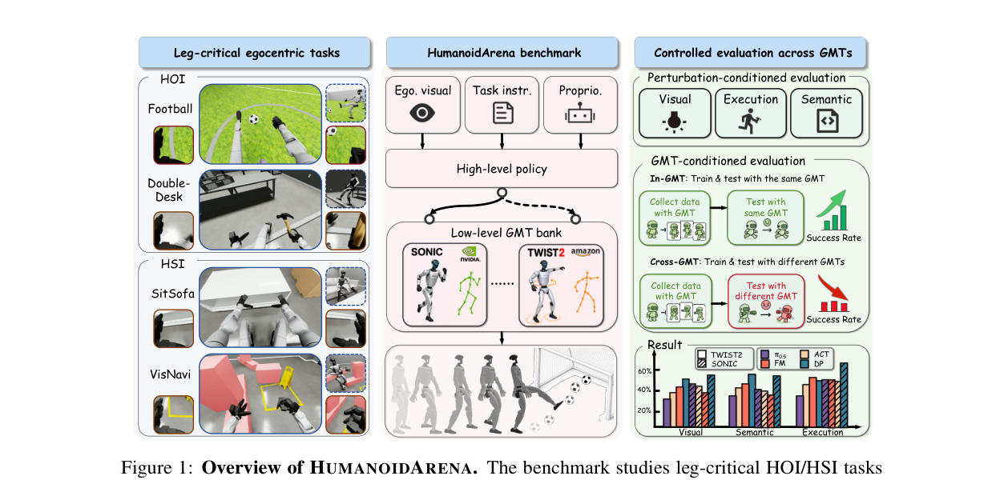
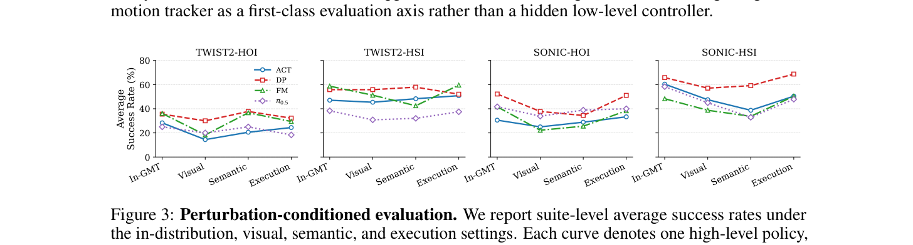

<!--
---
id: P0006
title_en: "HumanoidArena: Benchmarking Egocentric Hierarchical Whole-body Learning"
title_zh: "HumanoidArena：第一视角层级式全身学习基准"
year: 2026
date: 2026-06-16
venue: "arXiv preprint arXiv:2606.17833"
primary_category: datasets
tags:
  - dataset
  - benchmark
  - human-object-interaction
  - loco-manipulation
  - whole-body-control
  - g1
  - isaac-lab
authors:
  - Taowen Wang
  - Zikang Xie
  - Bin Yang
  - Yunheng Wang
  - Zizhao Yuan
  - Yuetong Fang
  - Yixiao Feng
  - Yichi Wang
  - Xingyu Chen
  - Haodong Chen
  - Qiwei Wu
  - Weisheng Xu
  - Lihan Chen
  - Lusong Li
  - Zecui Zeng
  - Renjing Xu
institutions:
  - The Hong Kong University of Science and Technology (Guangzhou)
  - Beijing University of Technology
  - Harbin Institute of Technology, Shenzhen
  - Shenzhen MSU-BIT University
  - JD Explore Academy
paper_url: "https://arxiv.org/abs/2606.17833"
project_url: "https://humanoidarena.github.io/"
github_url: "https://github.com/William-wAng618/HumanoidArena"
video_url: null
open_source:
  code: full
  training_code: full
  inference_code: full
  model_weights: full
  dataset: full
  robot_deployment: "no"
open_source_checked: 2026-09-03
robots:
  - Unitree G1
inputs:
  - egocentric RGB
  - proprioception
  - task instruction
outputs:
  - 40D intermediate whole-body action
read_status: deep-read
reproduce_status: not-started
local_materials:
  - "local_archive/P0006/HUMANOIDARENA：Benchmarking Egocentric.pdf"
  - "local_archive/P0006/HUMANOIDARENA_全文翻译与方法框架图详解.docx"
created: 2026-09-03
updated: 2026-09-03
---
-->

# P0006｜HumanoidArena：第一视角层级式全身学习基准

*HumanoidArena: Benchmarking Egocentric Hierarchical Whole-body Learning*

[论文](https://arxiv.org/abs/2606.17833) · [项目页](https://humanoidarena.github.io/) · [官方代码](https://github.com/William-wAng618/HumanoidArena) · [全文翻译与方法框架图详解](attachments/全文翻译与方法框架图详解.docx)

## 1. 基本信息

- 论文：[arXiv:2606.17833](https://arxiv.org/abs/2606.17833)
- 项目页：[HumanoidArena](https://humanoidarena.github.io/)
- 代码：[William-wAng618/HumanoidArena](https://github.com/William-wAng618/HumanoidArena)
- 资源：官方页提供代码、训练/评估管线、LeRobot 数据、策略 checkpoint、仿真资产和原始演示；定位为 simulation-first，不宣称实机部署。

## 本文贡献

- 建立第一视角、长时程、全身操作基准，将视觉感知—高层动作预测—低层全身跟踪放入统一评测协议。
- 定义 40D 中间动作和 GMT 适配接口，让 ACT、Diffusion Policy、Flow Policy、π0.5 等高层策略公平连接 TWIST2/SONIC。
- 同时评估视觉、语义、执行扰动及 In-GMT/Cross-GMT 两类适配，揭示任务成功和跌倒并非由高层模型单独决定。

## 3. 研究问题

现有端到端系统难区分高层策略与低层跟踪器各自贡献，也缺少下肢协调对任务成功不可替代的 HOI/HSI 基准。论文关心中间动作是否可执行、对分布变化是否鲁棒、换 GMT 后是否仍可迁移。

## 原论文重点图

**图 1：层级学习与评测总览（原论文 Figure 1）。** 第一视角 RGB、任务指令和本体状态输入高层策略；高层输出统一全身中间动作，再经 GMT 适配为低层跟踪命令。最终评的是机器人闭环任务成功与跌倒，而不是离线动作误差。

**图 2：视觉、语义与执行扰动评测（原论文结果图）。** 三类扰动分别定位感知泛化、语义理解和控制容错问题，使失败能追溯到高层策略或 GMT 接口。

## 研究方法详细解读

### 接口、数据与任务

状态为根姿态 6D + 29D 关节位置 + 29D 关节速度，共 64D；动作包含根 XY 增量、根高度、根 6D 姿态、29D 关节目标和双手开合，共 40D。7 个任务为 Football、DoubleDesk、P&PBox、OpenDoor、SitSofa、Boxing、VisNavi。每个任务、每个 GMT 有 100 条成功演示，共 1400 条，50 Hz；记录 640×480 第一视角图像、状态、动作与 GMT 后端。

### 高低层训练与两类适配协议

高层基线统一训练 100k 梯度步；评估使用 3 个随机种子、每种子 20 个 rollout。扰动轴分别改变光照/外观、语义相似资产和物体初始化范围。GMT 轴比较同后端训练测试与跨后端替换，报告成功率、平均摔倒率、绝对下降和相对保持率。

## 实验结果与结论

TWIST2 下 Flow Matching 的 HOI/HSI 最佳平均成功率为 36.11%/58.75%；SONIC 下 Diffusion Policy 为 52.22%/65.83%。跨 GMT 后平均性能大幅下降，T→S 与 S→T 的平均绝对下降约 39.9% 与 36.0%，且摔倒/任务保持呈不对称，说明当前 40D 接口仍携带后端特定分布。

## 局限与复现提醒

- 优点：把 GMT 作为显式实验变量；任务要求真实全身协调；数据、checkpoint 与评估协议资源完整。
- 局限：仿真优先、任务数和演示数有限；训练只含成功示范；跨 GMT 脆弱说明“canonical action”尚未真正后端无关。

### 对个人研究的价值

这是验证 GMT 接口是否可替换的直接基准。对于 SONIC/GMT 部署链路，应复用其 64D 状态、40D 动作、adapter 边界和跨后端评估，而不能只比较单一控制器下的任务成功率。

## 阅读与复现状态

- 阅读：已深读原文和完整中文译解，并核对动作接口与评测协议。
- 资源：已核验代码、数据、模型与资产入口。
- 运行：尚未下载验证完整数据契约，也未运行 Isaac Lab benchmark。
- 迁移：尚未独立复测 Cross-GMT。

## 参考资料

- [论文](https://arxiv.org/abs/2606.17833)
- [官方项目页](https://humanoidarena.github.io/)
- [官方代码](https://github.com/William-wAng618/HumanoidArena)

## 更新记录

- 2026-09-03：创建基准精读档案；核验公开代码、数据、权重和资产，明确 simulation-first 边界。
- 2026-09-03：纳入译解附件和原论文总览/扰动图，细化 40D 接口与跨 GMT 评测方法。
