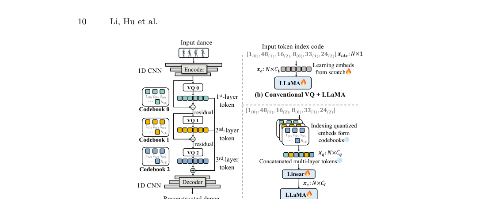
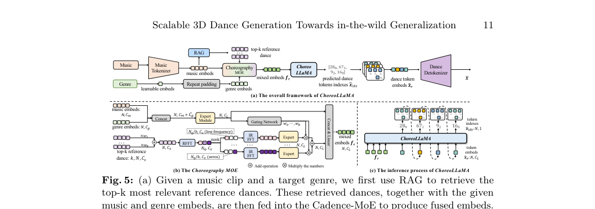

<!--
---
id: P0007
title_en: "InfiniteDance: Scalable 3D Dance Generation Towards in-the-wild Generalization"
title_zh: "InfiniteDance：面向野外泛化的可扩展三维舞蹈生成"
year: 2026
date: 2026-03-10
venue: "ECCV 2026"
primary_category: motion-generation
tags:
  - motion-generation
  - music
  - human-motion
  - diffusion
  - transformer
  - motion-capture
  - large-scale-data
authors:
  - Ronghui Li
  - Zhongyuan Hu
  - Li Siyao
  - Youliang Zhang
  - Haozhe Xie
  - Mingyuan Zhang
  - Jie Guo
  - Xiu Li
  - Ziwei Liu
institutions:
  - Tsinghua University
  - Peng Cheng Laboratory
  - S-Lab, Nanyang Technological University
paper_url: "https://arxiv.org/abs/2603.13375"
project_url: "https://infinitedance.github.io/"
github_url: "https://github.com/MotrixLab/InfiniteDance"
video_url: null
open_source:
  code: full
  training_code: full
  inference_code: full
  model_weights: full
  dataset: full
  robot_deployment: "no"
open_source_checked: 2026-09-03
robots: []
inputs:
  - music
  - retrieved dance references
outputs:
  - 3D human dance motion
read_status: deep-read
reproduce_status: not-started
local_materials:
  - "local_archive/P0007/InfiniteDance： Scalable 3D Dance Generation.pdf"
  - "local_archive/P0007/InfiniteDance_full_translation_explanation.docx"
created: 2026-09-03
updated: 2026-09-04
---
-->

# P0007｜InfiniteDance：面向野外泛化的可扩展三维舞蹈生成

*InfiniteDance: Scalable 3D Dance Generation Towards in-the-wild Generalization*

[论文](https://arxiv.org/abs/2603.13375) · [项目页](https://infinitedance.github.io/) · [官方代码](https://github.com/MotrixLab/InfiniteDance) · [全文翻译与方法详解](attachments/全文翻译与方法详解.docx)

## 基本信息

<!-- AUTO-BASIC-INFO:START -->
> **作者**：Ronghui Li、Zhongyuan Hu、Li Siyao、Youliang Zhang、Haozhe Xie、Mingyuan Zhang、Jie Guo、Xiu Li、Ziwei Liu
>
> **机构**：Tsinghua University、Peng Cheng Laboratory、S-Lab, Nanyang Technological University
>
> **论文时间**：2026-03-10
>
> **期刊 / 会议**：ECCV 2026
>
> **主分类**：动作生成
>
> **重点标签**：**动作生成** · **音乐** · **人体动作** · **扩散模型** · **Transformer** · **动作捕捉** · **大规模数据**
>
> **阅读状态**：已精读　·　**复现状态**：未开始
<!-- AUTO-BASIC-INFO:END -->

### 资料与开源说明

- 开源资源：官方仓库提供训练/推理代码、数据与权重下载。

## 本文贡献

- 构建 100.69 小时野外三维舞蹈数据管线，把单目恢复、物理模仿、足部修复和人工筛选串联起来。
- 用 RVQ-VAE 将长动作压缩成层级离散 token，再以 ChoreoLLaMA 自回归生成，扩大序列长度与动作词汇容量。
- 提出基于音乐检索的 RAG 与 Cadence-MoE，使生成同时利用外部编舞记忆和快慢节奏专家，提高长时节奏一致性与未见音乐泛化。

## 研究问题

现有音乐舞蹈数据规模小、舞种窄；单目重建存在脚滑、漂浮和穿透；传统生成器面对野外音乐时易产生无结构动作。论文认为数据规模、动作物理质量和音乐条件建模必须共同解决。

## 原论文重点图

**图 1：FRDM 足部修复与数据构建（原论文方法图）。** 单目恢复的 SMPL-X 先经物理模仿获得较稳定轨迹，FRDM 再依据足接触和根运动修复脚滑；它在接触约束下联动调整足部与全身，不是简单时域平滑。

**图 2：ChoreoLLaMA 长时舞蹈生成（原论文方法图）。** 音乐由 MuQ 编码，舞蹈由 RVQ-VAE 转为多层 token，自回归主干预测后续 token，以离散压缩降低长序列建模成本。

**图 3：检索增强与 Cadence-MoE（原论文方法图）。** RAG 从动作库取回与当前音乐相近的舞蹈片段，节奏专家按音乐结构路由；前者提供外部动作记忆，后者提供条件专门化。

## 研究方法详细解读

InfiniteDance 的重点不只是换了一个更大的音乐舞蹈生成器，而是先修复“野外视频动作根本不够干净”这个上游瓶颈。它把系统分成数据恢复与长舞蹈生成两条线：前者从互联网视频得到物理和时序更可靠的 SMPL-X 动作，后者再用检索、频带专家和自回归模型学习音乐驱动的长程编舞。

### 1. 总体定位：为什么直接扩大舞蹈模型不够

现有动作库多来自棚拍 MoCap，规模小、舞种有限；互联网视频丰富，却包含镜头运动、遮挡、接触错误、手脸缺失和逐帧抖动。若直接训练生成器，模型会把脚滑、穿地和估计噪声当成舞蹈规律。另一方面，长音乐中的节拍、段落与风格变化跨越多个时间尺度，单一局部注意力很难同时处理。论文因此把数据质量、长程节奏和动作离散表示视为同一问题链。

### 2. 整体流程：先建库，再分阶段生成

1. 从野外舞蹈视频检测单人片段，恢复身体、手部、面部和全局运动。
2. 用物理模仿删除明显不可执行片段，再以 FRDM 修正模仿结果中的下肢抖动与接触伪影。
3. 训练多层 RVQ-VAE，把连续 SMPL-X 舞蹈压成从粗到细的离散 token。
4. 用音乐—舞蹈对比检索为新音乐寻找结构相近参考，再由 Cadence-MoE 在不同频带提取节奏先验。
5. ChoreoLLaMA 结合音乐、舞种和检索先验自回归生成长 token 序列，detokenizer 还原连续人体舞蹈。

### 3. 总体信息流：先修数据，再学音乐到长舞蹈

InfiniteDance 的端到端链路分成两个相互独立的训练问题。数据侧先从野外视频检测单人片段，恢复身体、手和面部，再用物理模仿去掉悬空/穿地，最后由 FRDM 修复物理模仿引入的下肢抖动；生成侧把清洗后的舞蹈编码成多层离散 token，把音乐编码、检索到的相似舞蹈和舞种信息送入 Cadence-MoE，最后由 ChoreoLLaMA 自回归预测 token 并解码为连续动作。框架图上方是数据生产线，下方才是生成模型，二者的优化目标和冻结关系不能混为一次端到端训练。

### 野外视频恢复与三段清洗

原视频先由 YOLOv8 找到完整单人舞蹈片段，GVHMR 恢复身体 SMPL 运动，SMPLest-X 补充手部和面部。纯视觉恢复常出现漂浮、穿地与脚滑，因此用 PHC 一类物理模仿器执行参考，以接触动力学把全身拉回可执行状态；但控制器高频纠偏又会给根、膝和脚带来抖动。最终 FRDM 只重建根、膝、足等易受物理纠偏影响的通道，保留上半身原估计，从而在“物理稳定”和“舞蹈细节”之间做局部而非全身替换。

### FRDM 的表示、训练和几何约束

FRDM 使用 259 维、接近 HumanML3D 的逐帧表示，包含根偏航/平面速度/高度、22 关节的位置、速度、旋转及接触。训练数据来自高质量 MoCap，先把干净动作加噪，再让扩散模型恢复目标下肢；损失除基础去噪/重建外，还约束根运动、接触脚速度、速度积分得到的位置一致性，以及经前向运动学得到的旋转—关节位置一致性。推理早期用整体几何引导确定姿态，后期加大足接触引导消除细小脚滑，最终与冻结的上身、手脸通道合并为训练样本。

### 舞蹈 tokenizer 与音乐—动作检索

MuQ 产生逐帧音乐语义/节奏特征；三层 RVQ-VAE 将动作逐级量化，每一级码本拟合上一级残差，因此粗层描述主体动作，后续层补细节。论文把量化后的连续码本 embedding 送给主干，而不只传整数索引，保留多级残差信息。另一个 CLIP 式音乐—舞蹈检索器用 InfoNCE 对齐两种模态：给定新音乐检索 top-k 相似训练舞蹈，按相似度加权形成参考，作为显式编舞先验而非复制最终输出。

### Cadence-MoE 与 ChoreoLLaMA 的训练

检索参考先经实数快速傅里叶变换分成不同频带，各专家由线性层、注意力和 Mamba 处理不同节奏跨度，softmax 门控再融合并逆变换回时域；音乐、舞种与融合参考共同条件化 LLaMA3.2-1B。ChoreoLLaMA 按时间自回归预测 RVQ 各层离散索引，以真实前缀做教师强制训练，预测索引再查码本、经 detokenizer 恢复身体运动。tokenizer、检索对齐和自回归生成是先后训练的组件，检索结果为条件，不参与最终动作的硬约束。

### 长时推理与机器人边界

推理时新音乐依次经过 MuQ、检索器、频带专家和自回归主干，模型滚动产生多层动作 token，再由 RVQ 解码得到长时间 SMPL-X 舞蹈。检索与频域分解改善长程节奏结构，但生成越长仍可能产生状态漂移或段落重复。系统输出人体动作而非机器人力矩；接入人形机器人需要重新定义骨架和接触、完成重定向及仿真筛选，再由低层策略跟踪，FRDM 的人体物理修复不能替代机器人动力学验证。

## 实验结果与结论

论文报告在跨数据集与 OOD 音乐上优于现有方法，长于 30 秒的生成没有明显指标崩塌；检索距离分析显示输出不是简单复制参考。具体数值应按原论文相同数据集和评估器比较，不能跨协议直接横比。

## 局限与复现提醒

- 优点：完整覆盖“数据采集—物理修复—可扩展生成”；同时关注手脸与野外音乐；资源开放度高。
- 局限：单目恢复与自动筛选仍会传播误差；RAG 依赖检索库覆盖；人体舞蹈指标不证明机器人可执行性；权重与数据体积大。

### 对个人研究的价值

适合作为音乐到人体舞蹈的上游数据/模型来源，并为 GENMO/OMG 的音乐分支提供对比。接机器人时必须额外记录 SMPL-X→robot 表征、FPS 重采样、接触重算和跟踪验证。

## 阅读与复现状态

- 阅读：已深读原文和完整译解，核对核心模块与数据口径。
- 资源：已核验代码、权重和数据入口。
- 运行：尚未下载全量资源或执行生成 Demo。
- 机器人：尚未进行重定向和物理执行验证。

## 参考资料

- [论文](https://arxiv.org/abs/2603.13375)
- [项目页](https://infinitedance.github.io/)
- [官方代码](https://github.com/MotrixLab/InfiniteDance)

## 更新记录

- 2026-09-04：参照 ADAPT 的问题—流程—阶段讲法重构方法导读，明确数据修复是生成模型的前置核心，并用五步链路串起 FRDM、RVQ、检索、Cadence-MoE 与 ChoreoLLaMA。
- 2026-09-03：依据原论文方法与训练章节，扩展总体流程、数据表征、模块信息流、训练目标、推理/部署及实现边界。
- 2026-09-03：补充正文基本信息卡，展示完整作者、机构、论文时间、期刊/会议、分类、标签与状态。
- 2026-09-03：创建精读档案；登记公开代码、数据和权重，明确人体生成与机器人执行的边界。
- 2026-09-03：纳入译解附件及 FRDM、ChoreoLLaMA、Cadence-MoE 原图，扩展长时生成解读。
