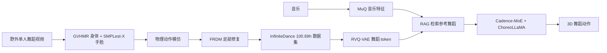

# P0007 — InfiniteDance：面向野外泛化的可扩展三维舞蹈生成

## 1. 基本信息

- 论文：[arXiv:2603.13375](https://arxiv.org/abs/2603.13375)，ECCV 2026。
- 项目页：[InfiniteDance](https://infinitedance.github.io/)
- 代码与资源：[MotrixLab/InfiniteDance](https://github.com/MotrixLab/InfiniteDance)，提供训练/推理代码、数据与权重下载。

## 2. 一句话总结

论文同时扩展舞蹈数据和生成模型：从野外视频构建 100.69 小时高质量 3D 舞蹈集，再用带 RAG 与快慢节奏 MoE 的 ChoreoLLaMA 提升未见音乐泛化。

## 3. 研究问题

现有音乐舞蹈数据规模小、舞种窄；单目重建存在脚滑、漂浮和穿透；传统生成器面对野外音乐时易产生无结构动作。论文认为数据规模、动作物理质量和音乐条件建模必须共同解决。

## 4. 整体框架

## 5. 数据与动作修复

管线先从单人视频估计 SMPL-X 身体、手和脸，再用物理模仿减少整体非物理伪影。FRDM 在更线性的关节位置/速度/旋转空间中学习足部恢复，并用接触与几何约束抑制脚滑，同时尽量保留原舞蹈表现力。最终数据覆盖 6 大类、30 个细粒度舞种，含音乐、手部与面部信息。

## 6. 网络与训练

MuQ 提取音乐表示，RVQ-VAE 把舞蹈量化为多层 token。跨模态 RAG 检索与输入音乐相近的参考舞蹈作为提示；Cadence-MoE 让专家适配快慢节奏；LLaMA3.2-1B 主干自回归生成舞蹈 token。训练与评估同时使用 InfiniteDance 和公开舞蹈数据。

## 7. 推理与部署

输入野外音乐后，系统检索参考、路由节奏专家并生成 3D 人体舞蹈。它不是机器人控制器；若用于人形机器人，仍需重定向、物理筛选和低层跟踪。

## 8. 主要结果

论文报告在跨数据集与 OOD 音乐上优于现有方法，长于 30 秒的生成没有明显指标崩塌；检索距离分析显示输出不是简单复制参考。具体数值应按原论文相同数据集和评估器比较，不能跨协议直接横比。

## 9. 优点与局限

- 优点：完整覆盖“数据采集—物理修复—可扩展生成”；同时关注手脸与野外音乐；资源开放度高。
- 局限：单目恢复与自动筛选仍会传播误差；RAG 依赖检索库覆盖；人体舞蹈指标不证明机器人可执行性；权重与数据体积大。

## 10. 对个人研究的价值

适合作为音乐到人体舞蹈的上游数据/模型来源，并为 GENMO/OMG 的音乐分支提供对比。接机器人时必须额外记录 SMPL-X→robot 表征、FPS 重采样、接触重算和跟踪验证。

## 11. 阅读与复现状态

- [x] 阅读原文与完整译解
- [x] 核验代码、权重和数据入口
- [ ] 下载全量资源
- [ ] 运行生成 Demo
- [ ] 机器人重定向与物理执行验证

## 12. 本地材料

- `local_archive/P0007/InfiniteDance： Scalable 3D Dance Generation.pdf`：原论文。
- `local_archive/P0007/InfiniteDance_full_translation_explanation.docx`：全文翻译、框架拆解与机器人应用启示。

## 13. 来源

- [论文](https://arxiv.org/abs/2603.13375)
- [项目页](https://infinitedance.github.io/)
- [官方代码](https://github.com/MotrixLab/InfiniteDance)

## 14. 更新日志

- 2026-09-03：创建精读档案；登记公开代码、数据和权重，明确人体生成与机器人执行的边界。
