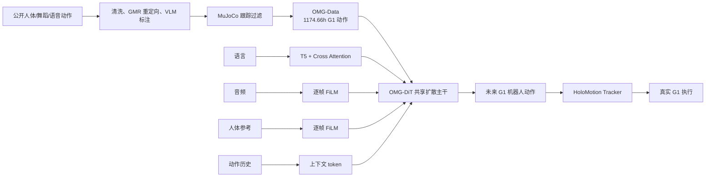

# P0008 — OMG：面向通用人形机器人控制的全模态动作生成

## 1. 基本信息

- 论文：[arXiv:2606.10340](https://arxiv.org/abs/2606.10340)
- 项目页：[OMG](https://tsinghua-mars-lab.github.io/OMG/)
- 代码：[Tsinghua-MARS-Lab/OMG](https://github.com/Tsinghua-MARS-Lab/OMG)，当前含数据、训练、生成、跟踪、benchmark 与 G1 实时部署文档，采用 MIT License。

## 2. 一句话总结

OMG 在 1174.66 小时、统一到 G1 空间的全模态数据上训练共享扩散 Transformer，把语言、音频、人体参考及其组合实时生成机器人未来动作，再由 HoloMotion 跟踪执行。

## 3. 研究问题

通用跟踪器能执行参考动作，却不能自行把高层多模态意图变成参考；人体动作数据又高度异构，缺少统一机器人空间和物理筛选。论文要构建可扩展的动作生成“大脑”，放在反应式跟踪“小脑”之上。

## 4. 整体框架

## 5. 数据与表征

OMG-Data 将异构来源清洗、分段、重定向、语言标注和仿真过滤后统一为 30 Hz、1174.66 小时 G1 动作；文本、人体参考、音频覆盖时长相互重叠，不能相加。每帧 125D 动作由规范化根位置/旋转、关节角和机器人连杆位置组成。

## 6. 网络与训练

OMG-DiT 直接在动作空间做 `x`-prediction，不额外依赖 VAE/tokenizer。语言与历史作为全局上下文经交叉注意力注入，35D 音频和 66D 人体关键点经逐帧 FiLM 注入；模态随机丢弃支持 classifier-free guidance。新模态通过零初始化适配器接入，减少对已有动作先验的破坏。

## 7. 推理与部署

生成器根据最近历史与当前条件预测未来窗口，支持文本、音频、人体参考和训练中未见的文本+音频组合。官方部署把 GPU 工作站上的实时生成服务器、G1 Orin 上的 HoloMotion 跟踪模型与实机桥接分开运行。

## 8. 主要结果

OMG-XL 在文本任务上报告 FID 6.03（论文缩放口径）和 R@1 65.43%；音频任务两种规模跌倒率为 0；人体参考条件下 MPJPE 18.84 mm。50M/300M/500M 模型显示随容量扩大误差下降；在新文本分布和 Pico 关键点条件上，预训练模型比同数据量从头训练更具样本效率。

## 9. 优点与局限

- 优点：数据、模型、条件接口和部署链路完整；直接生成机器人原生轨迹；支持零样本模态组合和轻量新接口。
- 局限：训练数据以平地为主；生成与跟踪仍模块化，未用真实执行反馈联合适配；更大生成器并非所有跟踪/限位指标都同步改善。

## 10. 对个人研究的价值

OMG 是“多模态动作生成大脑 + GMT 小脑”的直接工程参考，可与 GENMO（人体动作）和 SONIC（跟踪控制）形成清晰分层；实际使用必须锁定 125D 表征、30 Hz 数据、跟踪器接口和部署协议。

## 11. 阅读与复现状态

- [x] 阅读原文、左右对照和方法详解
- [x] 核验官方代码、数据、权重与部署文档
- [ ] 在本知识库中运行官方 Demo
- [ ] 训练复现
- [ ] 独立实机安全验证

## 12. 本地材料

- `local_archive/P0008/OMG：Omni-Modal Motion Generation for.pdf`：原论文。
- `local_archive/P0008/OMG-leftToRight.pdf`：左右中英对照版。
- `local_archive/P0008/OMG_论文全文翻译与方法框架详解.docx`：全文翻译、补充材料和框架详解。

## 13. 来源

- [论文](https://arxiv.org/abs/2606.10340)
- [项目页](https://tsinghua-mars-lab.github.io/OMG/)
- [官方代码](https://github.com/Tsinghua-MARS-Lab/OMG)

## 14. 更新日志

- 2026-09-03：创建精读档案；登记三份本地材料并核验当前完整开源与部署入口。
