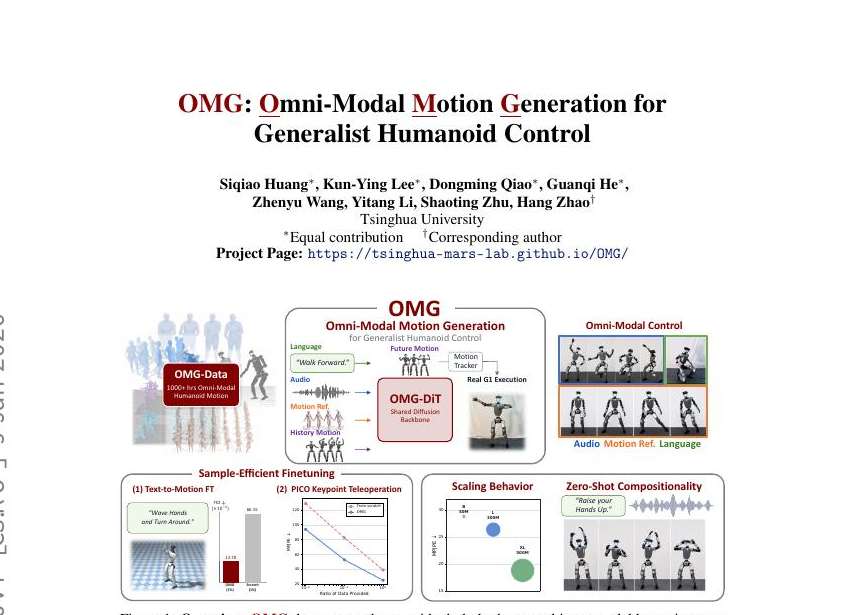
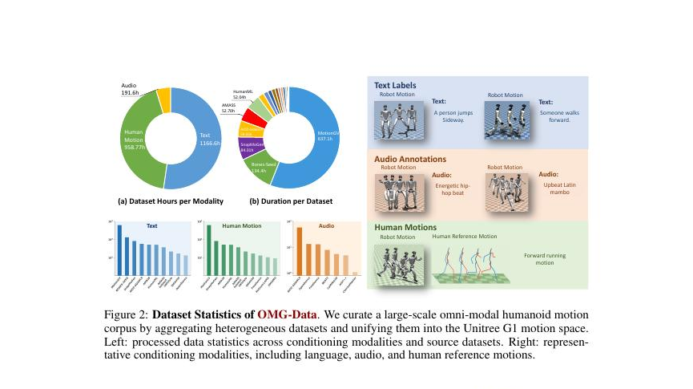
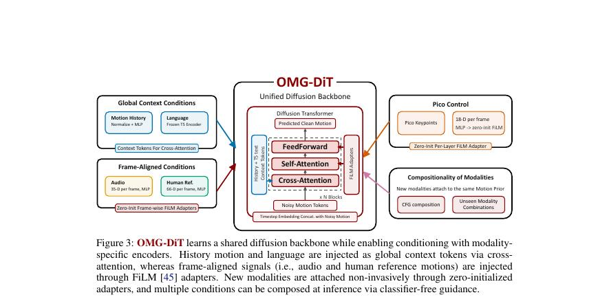

<!--
---
id: P0008
title_en: "OMG: Omni-Modal Motion Generation for Generalist Humanoid Control"
title_zh: "OMG：面向通用人形机器人控制的全模态动作生成"
year: 2026
date: 2026-06-09
venue: "arXiv preprint arXiv:2606.10340"
primary_category: motion-generation
tags:
  - motion-generation
  - multimodal
  - diffusion
  - transformer
  - text
  - audio
  - music
  - g1
  - real-time
authors:
  - Siqiao Huang
  - Kun-Ying Lee
  - Dongming Qiao
  - Guanqi He
  - Zhenyu Wang
  - Yitang Li
  - Shaoting Zhu
  - Hang Zhao
institutions:
  - Tsinghua University
paper_url: "https://arxiv.org/abs/2606.10340"
project_url: "https://tsinghua-mars-lab.github.io/OMG/"
github_url: "https://github.com/Tsinghua-MARS-Lab/OMG"
video_url: null
open_source:
  code: full
  training_code: partial
  inference_code: partial
  model_weights: partial
  dataset: full
  robot_deployment: partial
open_source_checked: 2026-09-03
robots:
  - Unitree G1
inputs:
  - language
  - audio
  - human reference motion
  - motion history
outputs:
  - robot-native future motion
read_status: deep-read
reproduce_status: not-started
local_materials:
  - "local_archive/P0008/OMG：Omni-Modal Motion Generation for.pdf"
  - "local_archive/P0008/OMG-leftToRight.pdf"
  - "local_archive/P0008/OMG_论文全文翻译与方法框架详解.docx"
created: 2026-09-03
updated: 2026-09-04
---
-->

# P0008｜OMG：面向通用人形机器人控制的全模态动作生成

*OMG: Omni-Modal Motion Generation for Generalist Humanoid Control*

[论文](https://arxiv.org/abs/2606.10340) · [项目页](https://tsinghua-mars-lab.github.io/OMG/) · [官方代码](https://github.com/Tsinghua-MARS-Lab/OMG) · [全文翻译与方法框架详解](attachments/全文翻译与方法框架详解.docx) · [中英左右对照全文](attachments/中英左右对照全文.pdf)

## 基本信息

<!-- AUTO-BASIC-INFO:START -->
> **作者**：Siqiao Huang、Kun-Ying Lee、Dongming Qiao、Guanqi He、Zhenyu Wang、Yitang Li、Shaoting Zhu、Hang Zhao
>
> **机构**：Tsinghua University
>
> **论文时间**：2026-06-09
>
> **期刊 / 会议**：arXiv preprint arXiv:2606.10340
>
> **主分类**：动作生成
>
> **重点标签**：**动作生成** · **多模态** · **扩散模型** · **Transformer** · **文本** · **音频** · **音乐** · **Unitree G1** · **实时**
>
> **阅读状态**：已精读　·　**复现状态**：未开始
<!-- AUTO-BASIC-INFO:END -->

### 资料与开源说明

- 开源资源：官方仓库当前含数据、训练、生成、跟踪、benchmark 与 G1 实时部署文档，采用 MIT License。

## 本文贡献

- 构建 1174.66 小时 OMG-Data，把文本、音频、人体参考等异构来源清洗、GMR 重定向、VLM 标注并用 MuJoCo 跟踪结果过滤到统一 G1 空间。
- 提出直接在 125D 机器人动作空间做 `x`-prediction 的共享 OMG-DiT；语言/历史用交叉注意力，音频/人体参考用逐帧 FiLM。
- 将生成器作为高层“动作大脑”接入 HoloMotion 跟踪器，支持单模态、未联合训练过的模态组合和实时 G1 部署；新条件以零初始化适配器接入以保留先验。

## 研究问题

通用跟踪器能执行参考动作，却不能自行把高层多模态意图变成参考；人体动作数据又高度异构，缺少统一机器人空间和物理筛选。论文要构建可扩展的动作生成“大脑”，放在反应式跟踪“小脑”之上。

## 原论文重点图

**图 1：全模态生成—控制系统（原论文 Figure 1）。** 不同条件统一驱动机器人原生动作生成器，未来参考再由 HoloMotion 闭环跟踪。生成和控制仍是两个模型，部署必须保证表示、帧率、关节顺序与历史窗口一致。

**图 2：OMG-Data 构建（原论文数据图）。** 原始人体、舞蹈和语音动作经清洗、分段、GMR、语言标注与物理过滤统一为 G1 轨迹；1174.66 小时是模态覆盖有重叠的总库口径。

**图 3：OMG-DiT 条件注入（原论文方法图）。** 语言与动作历史作为全局 token 经交叉注意力进入主干；音频与人体关键点逐帧对齐，因此使用 FiLM 调制。随机丢模态支持 classifier-free guidance。

## 研究方法详细解读

OMG 的核心不是让一个网络从任意模态直接输出电机控制，而是先把文本、音乐、人体参考和 VR 关键点都变成同一种 G1 机器人空间未来动作，再由独立 HoloMotion tracker 在物理闭环中执行。高层解决“未来应该怎么动”，低层解决“当前状态下怎样稳定做到”，两者的训练数据、频率和证据不能混在一起。

### 1. 总体定位：OMG 要解决什么问题

过去的文本、音乐、动作模仿和遥操作通常各有一套人体表示与模型，落到机器人时还要经过不同重定向器，容易产生骨架和动力学错位。OMG 试图用一个机器人原生生成器覆盖多模态条件，同时保留强 tracker 处理接触和扰动。真正难点包括：统一异构数据到同一 G1 表示、让不同条件在一个扩散主干中互不干扰，以及保证生成参考在特定控制器下足够可执行。

### 2. 整体训练与部署流程：六步

1. 清洗人体、舞蹈和多模态数据，并统一文本、音频与参考动作时间轴。
2. 经 GMR/相关预处理映射到 29 自由度 G1，再由仿真 tracker 过滤失败片段，形成 OMG-Data。
3. 用 10 帧历史和未来 60 帧机器人动作训练 OMG-DiT 的基础去噪能力。
4. 文本走全局语义条件，音频与人体参考走逐帧 FiLM；模态 dropout 为组合 CFG 建立条件/无条件分支。
5. 用零初始化适配器接入 PICO 关键点等新增条件，尽量不破坏已有能力。
6. 部署时 OMG-DiT 低频生成未来 G1 参考，HoloMotion 在 Orin 上高频闭环跟踪。

### 3. 总体信息流：机器人原生生成与低层跟踪分层

OMG 将策略写成高层生成器 `πϕ` 与低层跟踪器 `πψ` 的组合。数据先被统一重定向为 G1 机器人空间并由仿真跟踪筛选；高层 OMG-DiT 读取最近 10 帧历史及文本、音乐、人体参考或 VR 关键点，生成未来 60 帧机器人动作；低层 HoloMotion 在物理闭环中把参考变成关节控制。生成器负责“想做什么和未来怎么动”，跟踪器负责“当前动力学状态下如何执行”，训练与部署都不把两者误合为一个网络。

### OMG-Data 的构造与可执行性过滤

异构人体/舞蹈数据先做格式清洗、切片和语言/音频对齐，再通过重定向统一到 29 自由度 G1；随后让跟踪器在仿真中逐条执行，以根高度过低、倾角过大及持续异常判定跌倒并删除失败片段。最终动作统一为 30 Hz、总计 1,174.66 小时，文本、人体参考、音频只是这批动作上的重叠标注，不能把各模态时长再次相加。过滤结果只证明在该跟踪器和仿真配置下达到筛选标准，并不是对所有控制器或真实硬件的普适可执行性证明。

### 125 维动作表示与历史条件

每帧 125 维机器人状态包含规范化后的根位置/旋转、29 个关节角以及机器人身体连杆位置；根平面位置和朝向在局部坐标中处理，以便片段拼接并减弱世界原点依赖。训练样本以 10 帧历史为因果上下文、预测未来 60 帧，时间分辨率为 30 Hz。网络直接在这一动作空间做 `x0` 预测，没有 VAE 或离散 tokenizer，因此所有去噪误差会直接作用于可解释的机器人姿态量。

### OMG-DiT 与多模态注入位置

带噪未来动作和扩散时刻进入 DiT 主干，历史序列通过跨注意力提供连续性。冻结 T5 编码文本并作为全局语义条件；35 维逐帧音频和 66 维人体参考分别在每层通过 FiLM 调制，使节拍/姿态拥有帧级控制。新增 PICO 关键点时使用零初始化的 FiLM/AdaLN 适配器：训练开始不改变原模型输出，再逐步学习新条件，降低灾难性遗忘。不同模态在训练中随机丢弃，得到条件和无条件分支，为组合式 classifier-free guidance 做准备。

### 训练目标与分阶段适配

基础目标是在随机扩散时刻由带噪动作回归干净动作，AdamW、学习率 `6e-5`、总 batch 1,024，论文报告 8 张 A800 训练 100k 步、少于 10 小时。先用 OMG-Data 建立文本、音频和人体参考的共享先验，再冻结/低扰动地接入新关键点适配器；模态 dropout 使单模态和缺失模态都出现在训练分布内。损失是生成参考的动作重建，并不通过真实机器人电机端到端反传，物理性主要来自前置数据筛选和后置跟踪器。

### 推理、条件组合与部署频率

推理从噪声开始做 50 步 DDIM，分别计算各条件相对无条件预测的方向，再按文本 3、音频 1.5、人体参考 2 及全局 2.5 等尺度组合，因此即使文本+音频配对未显式出现也能组合。高层在 RTX 4090 工作站运行并通过 ONNX/TensorRT、FP16 与缓存降低延迟，低层跟踪器在 G1 的 Orin 上闭环执行；通信只传未来参考和状态。网络分机、频率与缓冲共同决定实时性，论文的生成质量指标不能替代低层稳定性或硬件安全测试。

## 实验结果与结论

OMG-XL 在文本任务上报告 FID 6.03（论文缩放口径）和 R@1 65.43%；音频任务两种规模跌倒率为 0；人体参考条件下 MPJPE 18.84 mm。50M/300M/500M 模型显示随容量扩大误差下降；在新文本分布和 Pico 关键点条件上，预训练模型比同数据量从头训练更具样本效率。

## 局限与复现提醒

- 训练数据以平地为主；生成与跟踪仍模块化，未用真实执行反馈联合适配；更大生成器并非所有跟踪/限位指标都同步改善。
- 官方仓库有主要训练、生成和部署代码，但完整 GMR 预处理与 HoloMotion tracker 权重并未全部开放；这会阻断从原始人体数据到同口径实机部署的完整复现。

### 对个人研究的价值

OMG 是“多模态动作生成大脑 + GMT 小脑”的直接工程参考，可与 GENMO（人体动作）和 SONIC（跟踪控制）形成清晰分层；实际使用必须锁定 125D 表征、30 Hz 数据、跟踪器接口和部署协议。

## 阅读与复现状态

- 阅读：已深读原文、左右对照和方法详解。
- 资源：已核验官方仓库公开边界；GMR 预处理和跟踪器资源并非全部齐备。
- 运行：本知识库尚未执行官方 Demo 或训练。
- 实机：未做独立安全验证。

## 参考资料

- [论文](https://arxiv.org/abs/2606.10340)
- [项目页](https://tsinghua-mars-lab.github.io/OMG/)
- [官方代码](https://github.com/Tsinghua-MARS-Lab/OMG)

## 更新记录

- 2026-09-04：按 ADAPT 式讲解补充 OMG 的高低层准确分工、三类核心难点及六步训练/部署流程，先建立机器人原生生成逻辑再进入表示与网络细节。
- 2026-09-03：依据原论文方法与训练章节，扩展总体流程、数据表征、模块信息流、训练目标、推理/部署及实现边界。
- 2026-09-03：补充正文基本信息卡，展示完整作者、机构、论文时间、期刊/会议、分类、标签与状态。
- 2026-09-03：创建精读档案；登记三份本地材料并核验当前完整开源与部署入口。
- 2026-09-03：纳入两份译解附件与三张原论文重点图；修正 GMR/跟踪权重开源边界，扩展数据筛选、条件注入和部署解读。
