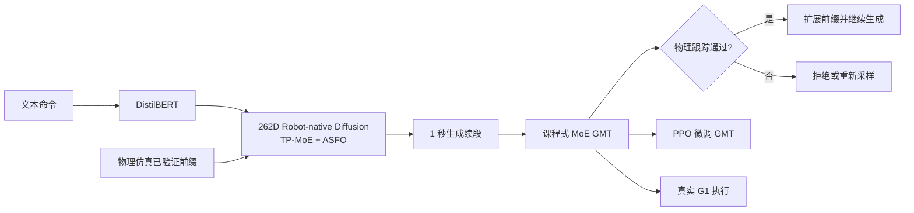

# P0009 — PhyGile：物理前缀引导的敏捷通用人形机器人动作生成与跟踪

## 1. 基本信息

- 论文：[arXiv:2603.19305](https://arxiv.org/abs/2603.19305)
- 项目页：[PhyGile](https://baojch.github.io/phygile-page/)
- 代码：[Baojch/phygile_tracking](https://github.com/Baojch/phygile_tracking)。截至 2026-09-03，公开仓库聚焦 Tracking，不能据此认定生成器、完整训练链路、权重和实机部署全部开源。

## 2. 一句话总结

PhyGile 先用课程式 MoE 强化通用动作跟踪器，再让文本扩散模型直接生成 262D 机器人原生动作，并用已经过仿真验证的物理可执行前缀把生成与执行闭环连接。

## 3. 研究问题

人体域文本动作即使几何上可重定向，也可能违反机器人力矩、接触和动态平衡约束；同时，大规模动作数据的长尾分布会使 GMT 偏向常见简单动作。论文试图同时解决“生成—执行错位”和“高难动作训练不足”。

## 4. 整体框架

## 5. GMT：两阶段课程式 MoE

Stage I 用带语义的 HumanML3D 将动作按控制难度分级，以 hard-biased routing、逐级加入专家和 freeze-and-drop 让专家覆盖稀有高动态动作。Stage II 在 AMASS、LaFAN1 等约 45 小时数据上进行全局 soft top-k MoE 后训练，通过负载均衡提升通用性。

## 6. 机器人原生生成器

文本条件扩散模型直接预测每帧 262D 的机器人骨架状态，避免推理阶段再次从 SMPL 重定向。TP-MoE 在 token 级混合专家参数，ASFO 根据动作语义频率对长尾技能过采样，使高难动作获得更多训练机会。

## 7. Physics-Prefix 闭环适配

每次从 GMT 已验证可执行的短片段出发生成约 1 秒续段，再交给物理仿真和 GMT 检查。通过的片段扩展 prefix，失败片段被拒绝或重采样；此阶段扩散生成器保持冻结，主要以新生成分布继续 PPO 微调 GMT。因而这里的 prefix 是局部可执行性证据，不等同于全局动力学约束或形式化安全保证。

## 8. 主要结果

论文在离线与实机实验中展示侧手翻、翻滚、breakdance 等高动态动作。主表中完整系统的跟踪成功率达到 0.9401，并改善角度与速度误差；消融说明 curriculum MoE、TP-MoE、ASFO 和 physics-prefix 各自贡献于敏捷跟踪、语义生成或物理可执行性。

## 9. 优点与局限

- 优点：机器人原生生成减少运行时重定向误差；生成与控制形成闭环；专门处理长尾高难技能。
- 局限：物理前缀与阈值筛选是局部、经验式约束；生成器在适配阶段冻结；当前公开仓库范围不足以支持端到端复现结论。

## 10. 对个人研究的价值

这篇工作适合对照 OMG/RLPF：OMG 强调多模态大数据生成，RLPF 用物理反馈优化人体动作模型，PhyGile 则把机器人原生扩散与 GMT 的可执行前缀直接耦合。复现时必须锁定 262D 定义、采样频率、prefix 长度、跟踪失败阈值及关节顺序。

## 11. 阅读与复现状态

- [x] 阅读原文和方法详解/全文翻译
- [x] 核验项目页与当前公开仓库范围
- [ ] 运行公开 Tracking 代码
- [ ] 验证完整生成—跟踪闭环
- [ ] 独立实机安全验证

## 12. 本地材料

- `local_archive/P0009/PhyGile: Physics-Prefix Guided Motion Generation.pdf`：原论文。
- `local_archive/P0009/PhyGile_方法详解与全文中文翻译.docx`：方法拆解与全文中文翻译。

## 13. 来源

- [论文](https://arxiv.org/abs/2603.19305)
- [项目页](https://baojch.github.io/phygile-page/)
- [当前公开 Tracking 仓库](https://github.com/Baojch/phygile_tracking)

## 14. 更新日志

- 2026-09-03：创建精读档案；登记两份本地材料，并将当前开源状态保守标记为 partial/unknown。
