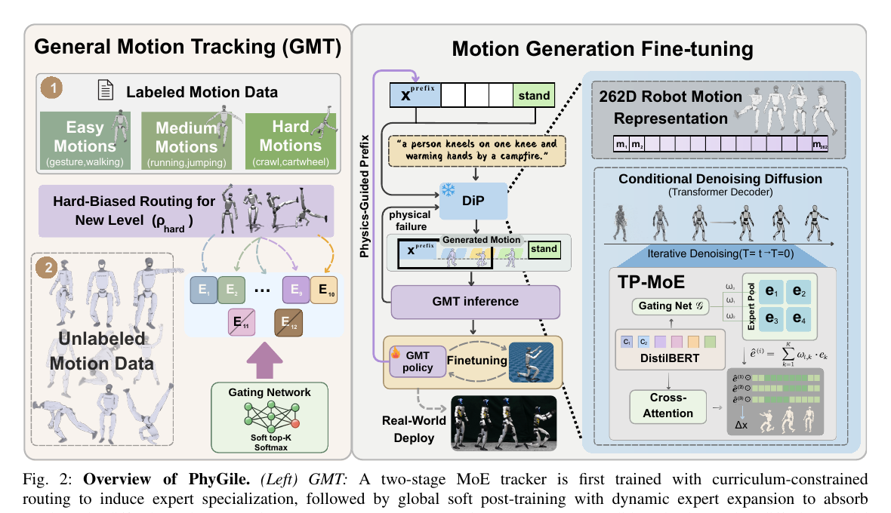

<!--
---
id: P0009
title_en: "PhyGile: Physics-Prefix Guided Motion Generation for Agile General Humanoid Motion Tracking"
title_zh: "PhyGile：物理前缀引导的敏捷通用人形机器人动作生成与跟踪"
year: 2026
date: 2026-03-13
venue: "IROS 2026"
primary_category: motion-generation
tags:
  - motion-generation
  - physics-guidance
  - diffusion
  - motion-tracking
  - curriculum-learning
  - whole-body-control
  - g1
  - sim2real
authors:
  - Jiacheng Bao
  - Haoran Yang
  - Yucheng Xin
  - Junhong Liu
  - Yuecheng Xu
  - Han Liang
  - Pengfei Han
  - Xiaoguang Ma
  - Dong Wang
  - Bin Zhao
institutions:
  - Shanghai AI Laboratory
  - University of Science and Technology of China
  - Tsinghua University
  - Fudan University
  - ByteDance
  - Northeastern University
paper_url: "https://arxiv.org/abs/2603.19305"
project_url: "https://baojch.github.io/phygile-page/"
github_url: "https://github.com/Baojch/phygile_tracking"
video_url: null
open_source:
  code: partial
  training_code: partial
  inference_code: partial
  model_weights: unknown
  dataset: "no"
  robot_deployment: unknown
open_source_checked: 2026-09-03
robots:
  - Unitree G1
inputs:
  - natural-language command
  - physics-feasible motion prefix
outputs:
  - 262D robot-native motion
  - joint-position targets through GMT
read_status: deep-read
reproduce_status: not-started
local_materials:
  - "local_archive/P0009/PhyGile: Physics-Prefix Guided Motion Generation.pdf"
  - "local_archive/P0009/PhyGile_方法详解与全文中文翻译.docx"
created: 2026-09-03
updated: 2026-09-03
---
-->

# P0009｜PhyGile：物理前缀引导的敏捷通用人形机器人动作生成与跟踪

*PhyGile: Physics-Prefix Guided Motion Generation for Agile General Humanoid Motion Tracking*

[论文](https://arxiv.org/abs/2603.19305) · [项目页](https://baojch.github.io/phygile-page/) · [当前公开 Tracking 代码](https://github.com/Baojch/phygile_tracking) · [方法详解与全文中文翻译](attachments/方法详解与全文中文翻译.docx)

## 基本信息

<!-- AUTO-BASIC-INFO:START -->
> **作者**：Jiacheng Bao、Haoran Yang、Yucheng Xin、Junhong Liu、Yuecheng Xu、Han Liang、Pengfei Han、Xiaoguang Ma、Dong Wang、Bin Zhao
>
> **机构**：Shanghai AI Laboratory、University of Science and Technology of China、Tsinghua University、Fudan University、ByteDance、Northeastern University
>
> **论文时间**：2026-03-13
>
> **期刊 / 会议**：IROS 2026
>
> **主分类**：动作生成
>
> **重点标签**：**动作生成** · **物理引导** · **扩散模型** · **动作跟踪** · **课程学习** · **全身控制** · **Unitree G1** · **Sim2Real**
>
> **阅读状态**：已精读　·　**复现状态**：未开始
<!-- AUTO-BASIC-INFO:END -->

### 资料与开源说明

- 开源边界：截至 2026-09-03，公开仓库聚焦 Tracking，不能据此认定生成器、完整训练链路、权重和实机部署全部开源。

## 本文贡献

- 以两阶段课程式 MoE 训练通用动作跟踪器，先按难度让专家覆盖长尾高动态技能，再用全局 soft top-k 路由恢复通用性。
- 让文本扩散模型直接预测 262D 机器人原生状态，通过 TP-MoE 与 ASFO 分别处理 token 级专家化和语义长尾采样。
- 提出 Physics-Prefix 生成—验证循环：只从 GMT 已执行成功的前缀续写约 1 秒，失败则拒绝/重采样，并用新分布继续微调跟踪器。

## 研究问题

人体域文本动作即使几何上可重定向，也可能违反机器人力矩、接触和动态平衡约束；同时，大规模动作数据的长尾分布会使 GMT 偏向常见简单动作。论文试图同时解决“生成—执行错位”和“高难动作训练不足”。

## 原论文重点图

**图 1：PhyGile 总体框架（原论文方法图）。** 上游文本编码驱动机器人原生扩散生成器；中间的 physics-prefix 把已执行成功片段作为下一段条件；下游 GMT 一边充当物理验证器，一边用新生成分布继续 PPO 更新。该闭环改善的是相对于特定 tracker 的可执行性，并非生成器内部已经满足完整动力学约束。

## 研究方法详细解读

### 总体流程：先训练可扩展跟踪器，再训练机器人生成器

PhyGile 的框架包含两条训练线。GMT 线先把重定向动作按控制难度做课程式专家训练，再用全数据联合软路由；生成线把同一机器人动作表示与文本对齐，训练带 Token-Parameterized MoE 的扩散模型。最后冻结生成器，从 GMT 已执行成功的短前缀采样下一秒动作，在物理仿真里回放并把这些“生成分布”用于继续微调 GMT。因而图中的 difficulty curriculum、TP-MoE generator 与 Physics-Prefix 是先后衔接的三个阶段，不是一个联合损失里的并列模块。

### 262 维机器人描述与数据分级

机器人原生描述共 262 维，包括根角/线速度与高度、12 个身体局部位置（36 维）、29 个身体的 6D 旋转（174 维）、13 个身体局部速度（39 维），以及足 4、手 2 个接触标记。HumanML3D、AMASS、LaFAN1 和约 3 小时私有数据先经 GMR 转到同一骨架，合计约 45 小时。LLM 按语义和动作复杂度标成 12 级：1–10 参与课程训练，11 表示场景条件不匹配，12 表示机器人物理上不可行，后两级用于识别边界而非强迫策略模仿。

### GMT 第一阶段：逐级新增专家

Stage I 从低难度开始，能力稳定后逐级解锁到 10；新增专家复制上一专家参数，避免随机初始化破坏控制。路由器以约 0.8 概率把当前最难等级硬分给新专家，同时用难度标签的交叉熵约束门控；旧专家可冻结，持续失败或污染分布的样本由基于 EMA 跟踪误差/成功率的 freeze-and-drop 机制暂停或剔除。这样每个专家先占据可解释的难度区间，再逐步扩展，而不是让 top-k 门控从随机状态自行竞争。

### GMT 第二阶段：全局软路由与动态容量

Stage II 把 1–10 级和不同数据源混合，开放全部专家，以 soft top-k 权重联合输出；负载均衡项防止门控把所有样本压到少数专家，难度交叉熵降为辅助项。系统监测路由熵、专家能力差距和困难样本积压，条件持续满足时可增加新专家并设置不同学习率，让容量随数据复杂度增长。PPO 仍依据姿态/速度/根运动跟踪和控制正则更新策略，MoE 只改变策略容量分配，不改变物理仿真的回报闭环。

### 生成器、TP-MoE 与长尾采样

文本经 DistilBERT 形成 token，扩散 Transformer 解码 262 维机器人动作并做 `x0` 预测。每个前馈层后加入 TP-MoE：路由由文本 token 产生，不是整段共享一个专家；交叉注意力权重还提供时间掩码，使动作帧关注对应词语。ASFO 先由 LLM 给动作打语义标签，再按逆频率上限过采样稀有动作并对左右相关稀有技能镜像增强，配合负载均衡让高动态长尾不被常见走路吞没。

### Physics-Prefix 的闭环适配

构造样本时先选 GMT 已成功执行的前缀及终端条件，生成器只续写约 1 秒；候选交给冻结/当前 GMT 仿真执行，依据 MPJPE 和失败状态筛选，失败则重采样，通过者扩展可执行前缀。论文最终阶段保持扩散生成器冻结，主要用这些包含生成误差的 rollout 继续 PPO 微调 Stage-II GMT，缩小“重定向真值”和“模型输出”之间的分布差。该机制提供逐段经验可执行性，不是全局轨迹优化，也不保证任意长拼接都稳定。

### 推理与部署边界

运行时文本生成器直接输出机器人空间动作，省去在线 SMPL 到 G1 的重定向；GMT 读取参考和本体状态闭环控制。生成器与跟踪器虽然通过 Physics-Prefix 数据关联，但没有在部署时互相反向传播。论文的可执行性来自特定仿真、资产和策略检查，迁移到不同质量参数、控制频率或真实机器人仍需重新验证接触、限位、延迟与安全停机。

## 实验结果与结论

论文在离线与实机实验中展示侧手翻、翻滚、breakdance 等高动态动作。主表中完整系统的跟踪成功率达到 0.9401，并改善角度与速度误差；消融说明 curriculum MoE、TP-MoE、ASFO 和 physics-prefix 各自贡献于敏捷跟踪、语义生成或物理可执行性。

## 局限与复现提醒

- 优点：机器人原生生成减少运行时重定向误差；生成与控制形成闭环；专门处理长尾高难技能。
- 局限：物理前缀与阈值筛选是局部、经验式约束；生成器在适配阶段冻结；当前公开仓库范围不足以支持端到端复现结论。

### 对个人研究的价值

这篇工作适合对照 OMG/RLPF：OMG 强调多模态大数据生成，RLPF 用物理反馈优化人体动作模型，PhyGile 则把机器人原生扩散与 GMT 的可执行前缀直接耦合。复现时必须锁定 262D 定义、采样频率、prefix 长度、跟踪失败阈值及关节顺序。

## 阅读与复现状态

- 阅读：已深读原文和方法详解/全文翻译。
- 资源：已核验项目页与当前公开仓库范围，公开内容以 Tracking 为主。
- 运行：尚未运行公开代码或验证完整生成—跟踪闭环。
- 实机：未做独立安全验证。

## 参考资料

- [论文](https://arxiv.org/abs/2603.19305)
- [项目页](https://baojch.github.io/phygile-page/)
- [当前公开 Tracking 仓库](https://github.com/Baojch/phygile_tracking)

## 更新记录

- 2026-09-03：依据原论文方法与训练章节，扩展总体流程、数据表征、模块信息流、训练目标、推理/部署及实现边界。
- 2026-09-03：补充正文基本信息卡，展示完整作者、机构、论文时间、期刊/会议、分类、标签与状态。
- 2026-09-03：创建精读档案；登记两份本地材料，并将当前开源状态保守标记为 partial/unknown。
- 2026-09-03：纳入译解附件与原论文框架图，细化课程式 MoE、262D 表征和 Physics-Prefix 循环。
