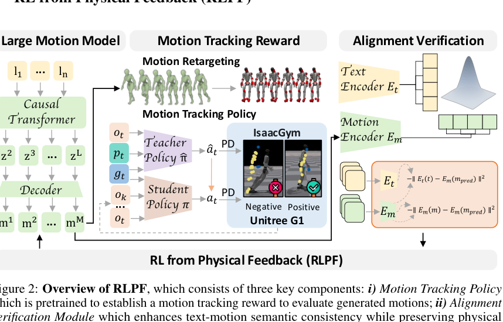

<!--
---
id: P0010
title_en: "RL from Physical Feedback: Aligning Large Motion Models with Humanoid Control"
title_zh: "基于物理反馈的强化学习：让大动作模型与人形机器人控制对齐"
year: 2025
date: 2025-06-15
venue: "ECCV 2026"
primary_category: motion-generation
tags:
  - motion-generation
  - reinforcement-learning
  - physics-feedback
  - transformer
  - text
  - retargeting
  - motion-tracking
  - g1
  - sim2real
authors:
  - Junpeng Yue
  - Zepeng Wang
  - Yuxuan Wang
  - Weishuai Zeng
  - Jiangxing Wang
  - Xinrun Xu
  - Yu Zhang
  - Sipeng Zheng
  - Ziluo Ding
  - Zongqing Lu
institutions:
  - Peking University
  - BeingBeyond
  - Wuhan University
paper_url: "https://arxiv.org/abs/2506.12769"
project_url: "https://beingbeyond.github.io/RLPF/"
github_url: "https://github.com/BeingBeyond/RLPF"
video_url: null
open_source:
  code: "no"
  training_code: "no"
  inference_code: "no"
  model_weights: "no"
  dataset: "no"
  robot_deployment: "no"
open_source_checked: 2026-09-03
robots:
  - Unitree G1
inputs:
  - text instruction
outputs:
  - discrete human-motion tokens
  - retargeted robot reference motion
read_status: deep-read
reproduce_status: not-started
local_materials:
  - "local_archive/P0010/RL from Physical Feedback: Aligning Large Motion.pdf"
  - "local_archive/P0010/RLPF_方法框架详解与全文中文翻译.docx"
created: 2026-09-03
updated: 2026-09-03
---
-->

# P0010｜基于物理反馈的强化学习：让大动作模型与人形机器人控制对齐

*RL from Physical Feedback: Aligning Large Motion Models with Humanoid Control*

[论文](https://arxiv.org/abs/2506.12769) · [项目页](https://beingbeyond.github.io/RLPF/) · [代码占位仓库](https://github.com/BeingBeyond/RLPF) · [方法框架详解与全文中文翻译](attachments/方法框架详解与全文中文翻译.docx)

## 基本信息

<!-- AUTO-BASIC-INFO:START -->
> **作者**：Junpeng Yue、Zepeng Wang、Yuxuan Wang、Weishuai Zeng、Jiangxing Wang、Xinrun Xu、Yu Zhang、Sipeng Zheng、Ziluo Ding、Zongqing Lu
>
> **机构**：Peking University、BeingBeyond、Wuhan University
>
> **论文时间**：2025-06-15
>
> **期刊 / 会议**：ECCV 2026
>
> **主分类**：动作生成
>
> **重点标签**：**动作生成** · **强化学习** · **物理反馈** · **Transformer** · **文本** · **重定向** · **动作跟踪** · **Unitree G1** · **Sim2Real**
>
> **阅读状态**：已精读　·　**复现状态**：未开始
<!-- AUTO-BASIC-INFO:END -->

### 资料与开源说明

- 开源状态：截至 2026-09-03，官方仓库仍仅说明代码将发布，故这里不把占位仓库记为已开源。

## 本文贡献

- 将 SMPL→G1 重定向和冻结跟踪器的仿真执行结果转成物理反馈，直接后训练文本动作大模型，而不只优化人体域视觉指标。
- 使用 GRPO 对同一文本的 20 个候选做组相对优化，无需额外价值网络；二值跟踪结果给出控制器真实能力边界。
- 加入文本—动作、参考—生成两类语义对齐奖励和 KL 约束，抑制“站立最安全”等奖励投机，在可执行性与语义/多样性之间平衡。

## 研究问题

传统文本到动作模型主要优化人体域的视觉质量和语义一致性，生成结果经重定向后仍可能脚滑、穿地或动态失稳。只优化“容易跟踪”又会产生站立等奖励投机，因此需要同时约束物理可执行性和语义忠实度。

## 原论文重点图

**图 1：RLPF 物理反馈后训练（原论文方法图）。** 文本动作模型先生成离散 token 并解码为人体动作，经过优化式重定向后由冻结 tracker 在 Isaac Gym 执行；跟踪成败与两种语义对齐分数共同进入 GRPO。反馈穿过不可微的重定向和物理仿真，因此通过策略梯度更新生成模型。

## 研究方法详细解读

### 总体流程：把冻结控制器变成生成模型的物理评审员

RLPF 先用文本—人体动作数据监督训练大动作模型，再独立训练一个可部署的 G1 跟踪器。强化后训练时，每条文本由生成器采样一组人体动作，经过形态/姿态重定向变成 G1 参考，由冻结跟踪器在 Isaac Gym 中完整执行；完成与否形成物理奖励，文本语义和与参考动作的一致性形成对齐奖励，组内归一化后通过 GRPO 更新生成模型。梯度不穿过重定向或仿真器，物理反馈以标量策略优化信号回到 LLM。

### 动作 tokenizer 与监督微调起点

连续人体动作先由 VQ 动作 tokenizer 压缩为离散码，LLaMA2-7B 因果解码器读取文本后逐 token 预测动作序列，码本解码器再还原连续人体动作。监督阶段在 Motion-X 的 81,082 条文本—动作样本上最小化下一 token 负对数似然，建立语言语义、动作语法和时序长度先验。RLPF 并不依赖 LLaMA2 这一唯一架构，但强化学习的起点必须已有可用生成分布，否则稀疏的仿真成败无法教会基础动作。

### 从 SMPL 动作到物理 rollout

每个候选先调整人体与机器人形态比例，再通过姿态/逆运动学和关键点优化映射到 29 自由度 G1，确保根轨迹和末端位置在机器人骨架上有明确参考。Teacher 跟踪器在 PPO 训练时可读取特权物理状态，学习大范围恢复和动态跟踪；随后以 DAgger 类循环让 Student 在自己访问到的状态上查询 Teacher，只保留历史本体等部署可用输入。RLPF 阶段冻结 Student，把是否完成序列、是否跌倒和误差阈值综合成二值跟踪成功信号。

### 为什么还需要双重语义奖励

只最大化物理成功会鼓励生成器输出站立、慢走等容易跟踪但不符合提示的动作。论文用预训练文本/动作对比编码器计算文本—生成动作距离，约束语言含义；同时计算生成动作与数据中参考动作的对齐距离，限制模型借助对比模型漏洞偏离真实动作分布。两类距离与物理成功共同构成奖励，使“可执行”和“说到做到”同时进入排序，但它们依然是冻结模型的代理指标，不等同于人工语义判断。

### GRPO 的采样和优化细节

每条提示采样 20 个候选，把综合奖励在组内减均值、除标准差形成相对优势，无需额外价值网络。训练采用 clipped probability ratio，限制新旧策略在单次更新中过度变化，并以参考模型 KL 项保持在监督模型附近；附录权重为 tracking 10、alignment 2、KL 1，最大提示/生成长度 100、梯度范数 0.1。这里优化的是离散动作 token 的概率，仿真评价不可微并不构成障碍。

### 推理、部署与训练证据

训练完成后只需输入文本，模型生成并解码人体动作，再按相同重定向契约得到 G1 参考；Student tracker 以 50 Hz 输出控制，底层电机环约 200 Hz，论文部署使用 Orin NX/LCM。RLPF 改善的是生成模型偏向可跟踪参考的概率，低层控制器仍承担扰动恢复。不同机器人、重定向器、质量参数或跟踪阈值会改变奖励含义，因此复现时必须把生成 checkpoint、映射配置和 tracker 视为同一评估契约。

## 实验结果与结论

论文在 CMU/AMASS、Isaac Gym 与 MuJoCo 上报告更高跟踪成功率和较低动作误差，并给出真实 G1 动作展示。消融显示仅有物理奖励会损害语义和动作丰富性，加入对齐验证后才在可执行性与文本一致性之间取得平衡。

## 局限与复现提醒

- 优点：把实际控制器能力直接反馈给生成模型；GRPO 不依赖人工偏好标注；显式处理 reward hacking。
- 局限：物理奖励主要是固定 tracker 下的二值成败；人体生成、优化式重定向和控制仍是多阶段链路；当前没有可运行代码与权重可供复核。

### 对个人研究的价值

RLPF 可作为“物理反馈后训练”路线，与 GENMO/OMG 的数据驱动生成和 PhyGile 的 physics-prefix 路线横向比较。迁移到自有机器人时，奖励必须基于实际 tracker、关节映射、仿真参数与失败判据重新校准。

## 阅读与复现状态

- 阅读：已深读原文和方法详解/全文翻译。
- 资源：已核验项目页；GitHub 仍是待发布占位入口。
- 运行：尚未在统一 tracker 上复现实验。
- 实机：未做独立安全验证。

## 参考资料

- [论文](https://arxiv.org/abs/2506.12769)
- [项目页](https://beingbeyond.github.io/RLPF/)
- [代码占位仓库](https://github.com/BeingBeyond/RLPF)

## 更新记录

- 2026-09-03：依据原论文方法与训练章节，扩展总体流程、数据表征、模块信息流、训练目标、推理/部署及实现边界。
- 2026-09-03：补充正文基本信息卡，展示完整作者、机构、论文时间、期刊/会议、分类、标签与状态。
- 2026-09-03：创建精读档案；登记两份本地材料，并区分“已有仓库 URL”与“已有可运行代码”。
- 2026-09-03：纳入译解附件和原论文框架图，扩展 GRPO 奖励、重定向—跟踪反馈及防投机机制。
