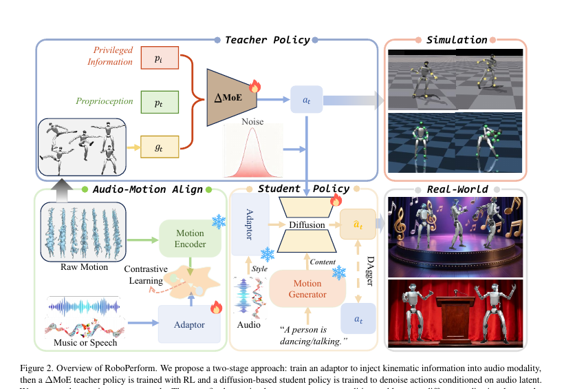

<!--
---
id: P0011
title_en: "Do You Have Freestyle? Expressive Humanoid Locomotion via Audio Control"
title_zh: "你会即兴表演吗？通过音频控制实现富有表现力的人形机器人运动"
year: 2026
date: 2025-12-29
venue: "CVPR 2026 Highlight"
primary_category: motion-generation
tags:
  - motion-generation
  - whole-body-control
  - audio
  - music
  - diffusion
  - distillation
  - motion-prior
  - g1
  - real-time
  - sim2real
authors:
  - Zhe Li
  - Cheng Chi
  - Yangyang Wei
  - Boan Zhu
  - Tao Huang
  - Zhenguo Sun
  - Yibo Peng
  - Pengwei Wang
  - Zhongyuan Wang
  - Fangzhou Liu
  - Chang Xu
  - Shanghang Zhang
institutions:
  - Beijing Academy of Artificial Intelligence
  - University of Sydney
  - Harbin Institute of Technology
  - Hong Kong University of Science and Technology
  - Shanghai Jiao Tong University
  - Peking University
paper_url: "https://arxiv.org/abs/2512.23650"
project_url: "https://gentlefress.github.io/RoboPerform-proj/"
github_url: "https://github.com/gentlefress/RoboPerform"
video_url: null
open_source:
  code: full
  training_code: full
  inference_code: full
  model_weights: full
  dataset: full
  robot_deployment: full
open_source_checked: 2026-09-03
robots:
  - Unitree G1
inputs:
  - music audio
  - speech audio
  - high-level motion content
  - proprioceptive history
outputs:
  - 23D target joint positions
read_status: deep-read
reproduce_status: not-started
local_materials:
  - "local_archive/P0011/Do You Have Freestyle? Expressive Humanoid Locomotion via Audio Control.pdf"
  - "local_archive/P0011/RoboPerform_方法详解与全文中文翻译.docx"
created: 2026-09-03
updated: 2026-09-03
---
-->

# P0011｜RoboPerform：通过音频控制实现富有表现力的人形机器人运动

*Do You Have Freestyle? Expressive Humanoid Locomotion via Audio Control*

[论文](https://arxiv.org/abs/2512.23650) · [项目页](https://gentlefress.github.io/RoboPerform-proj/) · [官方代码](https://github.com/gentlefress/RoboPerform) · [方法详解与全文中文翻译](attachments/方法详解与全文中文翻译.docx)

## 1. 基本信息

- 论文：[arXiv:2512.23650](https://arxiv.org/abs/2512.23650)
- 项目页：[RoboPerform](https://gentlefress.github.io/RoboPerform-proj/)
- 代码：[gentlefress/RoboPerform](https://github.com/gentlefress/RoboPerform)，当前含训练、推理、数据/检查点入口、TensorRT 导出、MuJoCo sim2sim 与实机部署说明。

## 本文贡献

- 将“动作内容”和“音频风格”解耦：64D 内容潜变量指定要做什么，256D 音频潜变量表达音乐节拍或语音韵律，二者直接调制控制策略。
- 先用 ResMoE/ΔMoE 教师学习多分布可执行动作，再以 DAgger 风格蒸馏把物理控制知识传给音频条件扩散学生。
- 以四层 MLP 扩散策略、`x0` 预测和两步 DDIM 实现约 5.3 ms 推理，直接输出 23D G1 关节目标，并公开 TensorRT、MuJoCo sim2sim 与实机部署链路。

## 3. 研究问题

常见音频驱动方案先生成完整人体动作，再重定向并跟踪，容易累积重建误差、增加延迟，并削弱音频与执行器之间的时序耦合。论文希望不显式重建人体动作，就能让机器人随音乐舞蹈或随语音生成伴随手势。

## 原论文重点图

**图 1：RoboPerform 总体方法（原论文框架图）。** 上支路先训练带混合专家的教师获得可执行控制分布；音频适配器用对比目标把音乐/语音节奏映射为风格特征；扩散学生联合内容、风格、本体状态和历史动作，经过两步 DDIM 直接给出关节目标。论文的“无需重定向”限定在学生在线推理，教师数据准备仍使用参考动作。

## 研究方法详细解读

### ResMoE/ΔMoE 教师

教师以残差混合专家处理不同动作分布：共享主干提供通用控制，四个 MLP 专家学习动作域残差，门控根据动作/状态组合专家；actor 隐层约为 `[768, 512, 128]`，value 网络约为 `[512, 256, 128]`，在 Isaac Gym 用 PPO 训练。教师仍由重定向参考动作监督，因此论文所说“retargeting-free”只指学生在线推理链路。

### 扩散学生与音频条件

学生把 64D 内容 latent、256D 逐帧音频风格 latent、本体状态和历史动作联合输入扩散策略，预测 23D 关节位置目标。音频适配器是 6 层、4 头 Transformer，以 InfoNCE 对齐节拍/韵律和动作特征；Motion VAE 使用 9 层、4 头结构。约三层 1792 宽的主体 MLP 配合 AdaLN 注入时间和条件，采用 `x0` 预测与两步 DDIM，论文报告约 5.3 ms 策略延迟。

### 蒸馏、推理与部署

先训练覆盖多动作模式的教师，再把教师行为蒸馏到音频条件扩散学生。官方工程提供训练、离线推理、TensorRT 导出、MuJoCo sim2sim 和 G1 实机链路；这些公开入口说明流程可获得，但本知识库尚未实际运行，因此复现状态仍为 not-started。

## 实验结果与结论

实验覆盖 music-to-dance 与 speech-to-gesture，报告物理可行性、音频节拍/韵律对齐、动作多样性和推理效率方面相对两阶段方案的改善，并展示真实机器人舞者与主持人场景。结论应限定在论文任务分布与 G1 平台，不能直接外推为任意音频、任意机器人或硬件安全保证。

## 局限与复现提醒

- 优点：音频直接进入控制策略；舞蹈与伴随手势统一；低延迟；公开部署链路较完整。
- 局限：内容 latent 仍依赖上游运动先验；训练阶段需要教师和参考动作；长时稳定性、极端音频和人机共域安全仍需独立验证。

### 对个人研究的价值

它提供了 GENMO/OMG 之外更“端到端控制”的音乐接口，可用于比较“先生成轨迹再跟踪”和“音频直接调制策略”两类架构。接入自有系统时应核对 23D 关节顺序、控制频率、动作历史窗口、音频特征对齐以及 TensorRT 输入输出契约。

## 阅读与复现状态

- 阅读：已深读原文和方法详解/全文翻译，核对网络层数、潜变量与输出维度。
- 资源：已核验官方代码、数据/权重和部署入口。
- 运行：尚未执行离线音频推理或 MuJoCo sim2sim。
- 实机：未做独立安全验证。

## 参考资料

- [论文](https://arxiv.org/abs/2512.23650)
- [项目页](https://gentlefress.github.io/RoboPerform-proj/)
- [官方代码](https://github.com/gentlefress/RoboPerform)

## 更新记录

- 2026-09-03：创建精读档案；登记两份本地材料，核验正式 arXiv 编号及完整公开工程入口。
- 2026-09-03：纳入译解附件与原论文框架图，补充教师、音频适配器、Motion VAE 和扩散学生网络细节。
