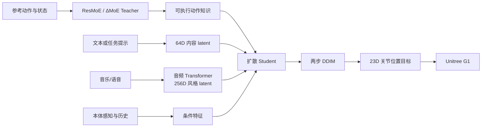

# P0011 — RoboPerform：通过音频控制实现富有表现力的人形机器人运动

## 1. 基本信息

- 论文：[arXiv:2512.23650](https://arxiv.org/abs/2512.23650)
- 项目页：[RoboPerform](https://gentlefress.github.io/RoboPerform-proj/)
- 代码：[gentlefress/RoboPerform](https://github.com/gentlefress/RoboPerform)，当前含训练、推理、数据/检查点入口、TensorRT 导出、MuJoCo sim2sim 与实机部署说明。

## 2. 一句话总结

RoboPerform 将“动作 = 内容 + 风格”落实为教师—学生控制框架：高层内容指定要做什么，音乐节拍或语音韵律作为风格信号直接调制扩散策略，实时输出 G1 关节目标。

## 3. 研究问题

常见音频驱动方案先生成完整人体动作，再重定向并跟踪，容易累积重建误差、增加延迟，并削弱音频与执行器之间的时序耦合。论文希望不显式重建人体动作，就能让机器人随音乐舞蹈或随语音生成伴随手势。

## 4. 整体框架

## 5. 教师策略

教师以残差混合专家处理不同动作分布：共享主干提供通用控制，专家分支学习动作域残差，门控根据动作/状态选择组合。教师仍由经过重定向的参考动作训练，因此论文所说“retargeting-free”特指学生推理链路，不表示整个训练数据准备从未使用重定向。

## 6. 扩散学生与音频条件

学生把 64D 内容 latent、256D 逐帧音频风格 latent、本体状态和历史动作联合输入扩散策略，预测 23D 关节位置目标。音频编码器通过对比学习对齐节拍、韵律与运动特征；四层 MLP 扩散策略使用两步 DDIM 推理，论文报告约 5.3 ms 的策略延迟。

## 7. 训练与部署

先训练覆盖多动作模式的教师，再把教师行为蒸馏到音频条件扩散学生。官方工程提供训练、离线推理、TensorRT 导出、MuJoCo sim2sim 和 G1 实机链路；这些公开入口说明流程可获得，但本知识库尚未实际运行，因此复现状态仍为 not-started。

## 8. 主要结果

实验覆盖 music-to-dance 与 speech-to-gesture，报告物理可行性、音频节拍/韵律对齐、动作多样性和推理效率方面相对两阶段方案的改善，并展示真实机器人舞者与主持人场景。结论应限定在论文任务分布与 G1 平台，不能直接外推为任意音频、任意机器人或硬件安全保证。

## 9. 优点与局限

- 优点：音频直接进入控制策略；舞蹈与伴随手势统一；低延迟；公开部署链路较完整。
- 局限：内容 latent 仍依赖上游运动先验；训练阶段需要教师和参考动作；长时稳定性、极端音频和人机共域安全仍需独立验证。

## 10. 对个人研究的价值

它提供了 GENMO/OMG 之外更“端到端控制”的音乐接口，可用于比较“先生成轨迹再跟踪”和“音频直接调制策略”两类架构。接入自有系统时应核对 23D 关节顺序、控制频率、动作历史窗口、音频特征对齐以及 TensorRT 输入输出契约。

## 11. 阅读与复现状态

- [x] 阅读原文和方法详解/全文翻译
- [x] 核验官方代码、数据/权重与部署入口
- [ ] 运行离线音频推理
- [ ] 完成 MuJoCo sim2sim
- [ ] 独立实机安全验证

## 12. 本地材料

- `local_archive/P0011/Do You Have Freestyle? Expressive Humanoid Locomotion via Audio Control.pdf`：RoboPerform 原论文；`2602.00401v1.pdf` 实为 ZEST，未误归入本条目。
- `local_archive/P0011/RoboPerform_方法详解与全文中文翻译.docx`：方法详解与全文中文翻译。

## 13. 来源

- [论文](https://arxiv.org/abs/2512.23650)
- [项目页](https://gentlefress.github.io/RoboPerform-proj/)
- [官方代码](https://github.com/gentlefress/RoboPerform)

## 14. 更新日志

- 2026-09-03：创建精读档案；登记两份本地材料，核验正式 arXiv 编号及完整公开工程入口。
