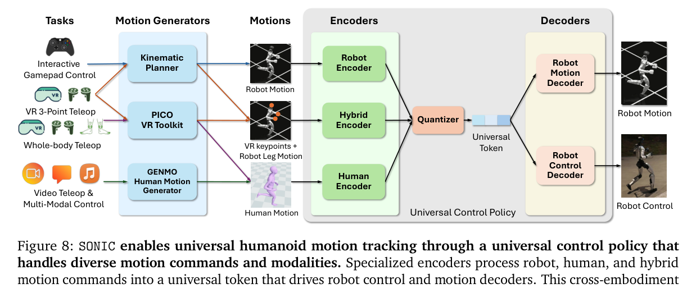
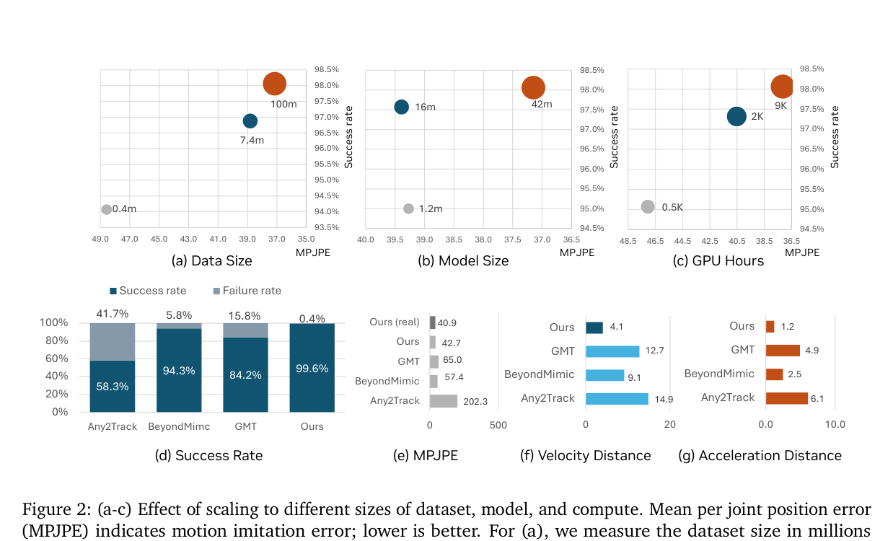

<!--
---
id: P0012
title_en: "SONIC: Supersizing Motion Tracking for Natural Humanoid Whole-Body Control"
title_zh: "SONIC：扩展运动跟踪以实现自然的人形机器人全身控制"
year: 2025
date: 2025-11-11
venue: "arXiv preprint arXiv:2511.07820"
primary_category: tracking-wbc
tags:
  - motion-tracking
  - whole-body-control
  - motion-prior
  - large-scale-data
  - g1
  - sim2real
  - real-time
  - zero-shot
  - multimodal
authors:
  - Zhengyi Luo
  - Ye Yuan
  - Tingwu Wang
  - Chenran Li
  - Sirui Chen
  - Fernando Castañeda
  - Zi-Ang Cao
  - Jiefeng Li
  - David Minor
  - Qingwei Ben
  - Xingye Da
  - Runyu Ding
  - Cyrus Hogg
  - Lina Song
  - Edy Lim
  - Eugene Jeong
  - Tairan He
  - Haoru Xue
  - Wenli Xiao
  - Zi Wang
  - Simon Yuen
  - Jan Kautz
  - Yan Chang
  - Umar Iqbal
  - Linxi Jim Fan
  - Yuke Zhu
institutions:
  - NVIDIA
paper_url: "https://arxiv.org/abs/2511.07820"
project_url: "https://nvlabs.github.io/SONIC/"
github_url: "https://github.com/NVlabs/GR00T-WholeBodyControl"
video_url: null
open_source:
  code: full
  training_code: full
  inference_code: full
  model_weights: full
  dataset: partial
  robot_deployment: full
open_source_checked: 2026-09-03
robots:
  - Unitree G1
inputs:
  - robot-native motion command
  - human keypoints
  - hybrid command
  - VR teleoperation
  - video
  - text and music through GENMO
  - VLA action
outputs:
  - target joint positions
read_status: deep-read
reproduce_status: not-started
local_materials:
  - "local_archive/P0012/sonic_paper.pdf"
  - "local_archive/P0012/SONIC_全文翻译与方法框架图详解.docx"
created: 2026-09-03
updated: 2026-09-04
---
-->

# P0012｜SONIC：扩展运动跟踪以实现自然的人形机器人全身控制

*SONIC: Supersizing Motion Tracking for Natural Humanoid Whole-Body Control*

[论文](https://arxiv.org/abs/2511.07820) · [项目页](https://nvlabs.github.io/SONIC/) · [官方代码](https://github.com/NVlabs/GR00T-WholeBodyControl) · [全文翻译与方法框架图详解](attachments/全文翻译与方法框架图详解.docx)

## 基本信息

<!-- AUTO-BASIC-INFO:START -->
> **作者**：Zhengyi Luo、Ye Yuan、Tingwu Wang、Chenran Li、Sirui Chen、Fernando Castañeda、Zi-Ang Cao、Jiefeng Li、David Minor、Qingwei Ben、Xingye Da、Runyu Ding、Cyrus Hogg、Lina Song、Edy Lim、Eugene Jeong、Tairan He、Haoru Xue、Wenli Xiao、Zi Wang、Simon Yuen、Jan Kautz、Yan Chang、Umar Iqbal、Linxi Jim Fan、Yuke Zhu
>
> **机构**：NVIDIA
>
> **论文时间**：2025-11-11
>
> **期刊 / 会议**：arXiv preprint arXiv:2511.07820
>
> **主分类**：动作跟踪与全身控制
>
> **重点标签**：**动作跟踪** · **全身控制** · **运动先验** · **大规模数据** · **Unitree G1** · **Sim2Real** · **实时** · **零样本** · **多模态**
>
> **阅读状态**：已精读　·　**复现状态**：未开始
<!-- AUTO-BASIC-INFO:END -->

### 资料与开源说明

- 开源边界：官方仓库当前提供训练、评估、模型和 G1 部署相关资源；论文约 700 小时的自有动作数据并未等同于完整公开数据集。

## 本文贡献

- 将 motion tracking 定义为可扩展基础任务，在超过 1 亿帧、约 700 小时动作上把控制策略从 1.2M 扩展到 42M 参数，并系统研究数据、模型和算力缩放。
- 设计 Robot、Human、Hybrid 三种命令编码器，将机器人参考、人体关键点和上下身混合指令映射到统一 motion token，共享同一策略主干。
- 以实时运动学规划器、VR、单目视频、GENMO 和 VLA 等多个入口验证统一控制接口，使同一 G1 策略承担低层 System 1 执行。

## 研究问题

传统人形控制器规模小、数据少，而且常为每个技能重新设计奖励。SONIC 试图证明：密集参考监督的运动跟踪可以随模型、数据和算力扩展，形成可迁移到遥操作、交互导航、多模态动作及 VLA 的通用 System 1 控制基础。

## 原论文重点图

**图 1：SONIC 统一全身控制策略（原论文架构图）。** 三种命令编码器先消除机器人姿态、人体关键点和混合上/下身命令的表示差异；共享主干再与本体感知共同输出 PD 关节目标。统一发生在 motion token 层，而不是把所有输入强行拼成同一原始向量。

**图 2：数据、模型与算力缩放结果（原论文结果图）。** 控制器从 1.2M 增至 42M，数据扩展到约 700 小时；曲线显示性能总体随规模改善，但数据多样性比简单重复数据更重要，因此“更多帧”不能替代动作覆盖。

## 研究方法详细解读

SONIC 的核心不是让底层策略直接理解文本、音乐、视频和 VLA，而是把所有上游意图先变成机器人参考、人体关键点或混合命令，再由不同 encoder 压到同一种 motion token，最后交给一个大规模共享控制器执行。它真正做大的对象是 motion tracking：数据、模型和算力一起扩展，而不是每种模态各训练一个控制策略。

### 1. 总体定位：SONIC 要解决什么问题

传统人形控制器常为每种技能和接口重做奖励、观测与网络，数据难以汇总，模型也停留在小 MLP。即使已有通用 tracker，机器人参考、人体关键点和三点 VR 的几何定义不同，直接拼接会让策略学到互不兼容的表示。SONIC 要回答的是：能否用统一 token 接口把上亿帧动作训练进一个可扩展策略，并让这个低层 System 1 被多种上层系统复用。

### 2. 整体训练流程：从动作库到统一控制器

1. 收集约 700 小时动作，经 GMR/PyRoki 映射到 29 自由度 G1，并用仿真跟踪过滤为约 611 小时可用数据。
2. 为同一动作构造 robot、human 和 hybrid 三类命令，分别由专用 encoder 压成两个 32 维 token。
3. 用 FSQ、命令重建、跨 encoder 对齐和循环一致性，让不同命令在共享潜空间表达同一动作意图。
4. 共享 decoder 结合本体历史输出 PD 关节目标，以 PPO 跟踪奖励训练，并通过困难片段重采样扩大覆盖。
5. 部署时视频、VR、运动学规划器、GENMO 或 VLA 只负责提供受支持命令；SONIC 本体仍以 50 Hz 完成统一闭环执行。

### 3. 总体信息流：多种参考先编码成统一控制 token

SONIC 的核心不是让一个策略直接理解文本、视频和 VR，而是把不同来源的运动命令分别编码到同一潜空间，再由共享控制解码器结合本体历史输出关节目标。训练链路为“人体动作收集 → GMR/PyRoki 重定向与仿真过滤 → 三类命令构造 → 专用 encoder/FSQ 对齐 → PPO 跟踪与辅助重建联合训练”；部署链路则由运动学规划器、视频/VR/GENMO/GROOT 等上游提供任一受支持命令，统一策略以 50 Hz 闭环执行。

### 百小时数据到机器人动作库

原始来源约 700 小时，覆盖日常、舞蹈和高动态技能；经过 GMR/PyRoki 映射到 29 自由度 G1，并用仿真执行误差与失败条件筛选后，保留约 611 小时、超过一亿个 50 Hz 帧。最终训练索引约 317,189 段，另设内容留出 7,016 段和重复性留出 9,395 段，避免把近重复动作当作泛化。数据规模、技能多样性和模型参数量在缩放实验中分别控制，论文报告的约 9k GPU hours 是总体训练成本，不应理解为单次小模型预算。

### 三种命令表示与 FSQ 对齐

机器人参考 encoder 读取未来关节角/速度，人类参考 encoder 读取三维人体关节，hybrid encoder 则把当前头手观测与未来下半身机器人参考组合。各 encoder 先用 MLP 提取特征，再压成两个 32 维 token，并以每维 32 级 FSQ 量化；共享控制解码器读取量化 token 与本体观测产生关节目标。机器人动作 decoder 从 token 重建原命令，循环一致性让不同 encoder 在共享空间表示相同动作意图，而量化瓶颈减少某一命令接口独占潜空间。

### 策略观测与控制输出

actor 使用最近 10 步的关节位置/速度、根角速度、投影重力和上一动作，避免依赖部署不可得的全局位置；critic 在训练期可读取更完整的特权状态。共享 decoder 输出 PD 目标关节位置，仿真以更高频率积分动力学。三类命令只影响潜 token 的来源，不改变后半段 actor 接口，因此同一控制器可以在全身参考、头手遥操作和混合下半身规划之间切换。

### PPO、辅助损失与困难动作采样

主目标由 PPO 回报构成，奖励细分根姿态/速度、相对 link 位姿与速度、关节跟踪、接触和控制正则。辅助部分包括命令重建、不同 encoder token 的成对对齐以及编码—解码循环一致性；FSQ 用 straight-through estimator 让量化前 encoder 获得梯度。每段动作维护失败统计，adaptive bin sampling 提高难跟踪片段出现概率；随着数据和网络从约 1.2M 扩到 42M 参数，128 GPU 训练用于保持大规模并行采样吞吐。

### 实时运动学规划与上游接口

内置 planner 以 0.8–2.4 秒端点为约束，使用相对骨盆的关节/全局旋转 token；encoder 时间下采样 4 倍，掩码生成器按余弦计划迭代确定 token，再用弹簧模型控制目标根位置和朝向，并周期性重规划。GEM 生成的人体动作通过滑窗重叠/补洞送到 human encoder，三点 VR 进入 hybrid encoder，文本或音乐本身并不直接进入 SONIC actor，而是由上游先转成运动参考。

### 推理部署频率与验证边界

G1 上策略用 TensorRT 运行，论文链路约为策略 50 Hz、命令更新 500 Hz、输入接收 100 Hz、规划器 10 Hz；策略约 1–2 ms、规划器约 12 ms。VLA 苹果搬运使用约 300 条遥操作示范，是共享运动接口接入操作策略的概念验证。复现时必须同步检查 encoder 类型、参考频率、G1 资产/关节顺序与 PD 参数，不能把“任一模态可接入”误读成任意数据无需适配即可实机运行。

## 实验结果与结论

SONIC 在未见 AMASS 子集上相对 Any2Track、BeyondMimic 和 GMT 提升成功率与跟踪精度；真实 G1 上展示 50 条多样动作均成功完成。三点 VR 的移动取放任务报告右腕平均延迟 121.9 ms，VLA 概念验证在 20 次实验中成功率 95%。这些结果来自论文协议，不替代本仓库自己的运行时与硬件验证。

## 局限与复现提醒

- 优点：系统性验证数据/模型/算力扩展；统一多身体、多接口表示；从训练到 onboard 部署链路完整。
- 局限：核心 700 小时自有数据并未完整公开；安全、能耗、长期部署和输入噪声仍待研究；生成器、规划器和 tracker 仍非端到端联合训练。

### 对个人研究的价值

SONIC 是 GENMO/OMG 等生成模型的关键执行端参考。接入或训练时应把实验 YAML、实际加载资产、机器人/人体/hybrid 三类观测、token 维度、50 Hz 控制、关节顺序和部署 `observation_config` 作为同一契约核对。

## 阅读与复现状态

- 阅读：已深读原文和全文翻译/框架详解。
- 资源：已核验官方项目、代码、权重和部署入口；论文的完整 700 小时自有数据未全部公开。
- 运行：本知识库尚未运行预训练模型或真实多 GPU 训练 smoke。
- 部署：尚未完成独立 sim2sim 与硬件安全验证。

## 参考资料

- [论文](https://arxiv.org/abs/2511.07820)
- [项目页](https://nvlabs.github.io/SONIC/)
- [官方代码](https://github.com/NVlabs/GR00T-WholeBodyControl)

## 更新记录

- 2026-09-04：按 ADAPT 文档第一部分的讲解顺序重构方法导读，明确 SONIC 扩展的是 motion tracking 而非直接理解全部模态，并用五步流程讲清数据、三类 encoder、FSQ、PPO 与上游接口。
- 2026-09-03：依据原论文方法与训练章节，扩展总体流程、数据表征、模块信息流、训练目标、推理/部署及实现边界。
- 2026-09-03：补充正文基本信息卡，展示完整作者、机构、论文时间、期刊/会议、分类、标签与状态。
- 2026-09-03：创建精读档案；登记两份本地材料，并将代码/模型/部署与未完整公开的自有数据分别记录。
- 2026-09-03：纳入译解附件及统一策略/缩放原图，重写贡献并扩展三类 encoder、规模实验和部署接口解读。
