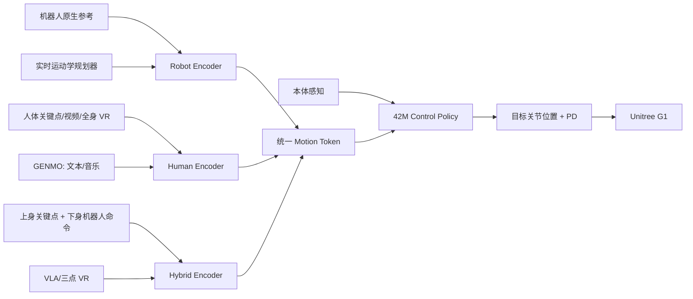

# P0012 — SONIC：扩展运动跟踪以实现自然的人形机器人全身控制

## 1. 基本信息

- 论文：[arXiv:2511.07820](https://arxiv.org/abs/2511.07820)
- 项目页：[NVIDIA SONIC](https://nvlabs.github.io/SONIC/)
- 代码：[NVlabs/GR00T-WholeBodyControl](https://github.com/NVlabs/GR00T-WholeBodyControl)，当前提供训练、评估、模型和 G1 部署相关资源；论文约 700 小时的自有动作数据并未等同于完整公开数据集。

## 2. 一句话总结

SONIC 把 motion tracking 作为可扩展基础任务，在超过 1 亿帧、约 700 小时动作数据上将策略扩大到 42M 参数，并以统一 token 空间让机器人动作、人体关键点、VR、视频、GENMO 和 VLA 共用一个 G1 控制策略。

## 3. 研究问题

传统人形控制器规模小、数据少，而且常为每个技能重新设计奖励。SONIC 试图证明：密集参考监督的运动跟踪可以随模型、数据和算力扩展，形成可迁移到遥操作、交互导航、多模态动作及 VLA 的通用 System 1 控制基础。

## 4. 整体框架

## 5. 数据与扩展

训练数据超过 100M 帧、约 700 小时，覆盖多类日常和高动态人体动作，先经 GMR 映射到机器人域。模型从 1.2M 扩展到 42M 参数，论文摘要报告约 9k GPU hours；实验分别改变数据量、模型容量和并行算力，观察到性能随规模增长而改善，其中数据多样性贡献尤为明显。

## 6. 统一跟踪策略

机器人参考、人类关键点和上下身混合命令分别经专用 encoder 映射到统一 token，策略再结合关节状态、角速度、重力方向和历史动作，输出 PD 目标关节位置。训练使用 PPO 及根姿态、相对 link 位姿/速度等密集跟踪奖励，不需要为每个下游接口另训一套控制器。

## 7. 下游接口

实时运动学规划器支持速度、方向、风格、姿态高度和爬行等交互命令；全身/三点 VR、单目视频、GENMO 的文本/音乐动作及 GR00T VLA 通过相应 encoder 接入共享 token。VLA 的苹果搬运实验是 300 条遥操作数据上的概念验证，不应解释为广泛操作泛化。

## 8. 主要结果

SONIC 在未见 AMASS 子集上相对 Any2Track、BeyondMimic 和 GMT 提升成功率与跟踪精度；真实 G1 上展示 50 条多样动作均成功完成。三点 VR 的移动取放任务报告右腕平均延迟 121.9 ms，VLA 概念验证在 20 次实验中成功率 95%。这些结果来自论文协议，不替代本仓库自己的运行时与硬件验证。

## 9. 优点与局限

- 优点：系统性验证数据/模型/算力扩展；统一多身体、多接口表示；从训练到 onboard 部署链路完整。
- 局限：核心 700 小时自有数据并未完整公开；安全、能耗、长期部署和输入噪声仍待研究；生成器、规划器和 tracker 仍非端到端联合训练。

## 10. 对个人研究的价值

SONIC 是 GENMO/OMG 等生成模型的关键执行端参考。接入或训练时应把实验 YAML、实际加载资产、机器人/人体/hybrid 三类观测、token 维度、50 Hz 控制、关节顺序和部署 `observation_config` 作为同一契约核对。

## 11. 阅读与复现状态

- [x] 阅读原文和全文翻译/框架详解
- [x] 核验官方项目、代码、权重与部署入口
- [ ] 运行官方预训练模型
- [ ] 完成真实多 GPU 训练 smoke 与仿真评估
- [ ] 完成独立 sim2sim 与硬件安全验证

## 12. 本地材料

- `local_archive/P0012/sonic_paper.pdf`：原论文。
- `local_archive/P0012/SONIC_全文翻译与方法框架图详解.docx`：全文翻译与方法框架图详解。

## 13. 来源

- [论文](https://arxiv.org/abs/2511.07820)
- [项目页](https://nvlabs.github.io/SONIC/)
- [官方代码](https://github.com/NVlabs/GR00T-WholeBodyControl)

## 14. 更新日志

- 2026-09-03：创建精读档案；登记两份本地材料，并将代码/模型/部署与未完整公开的自有数据分别记录。
