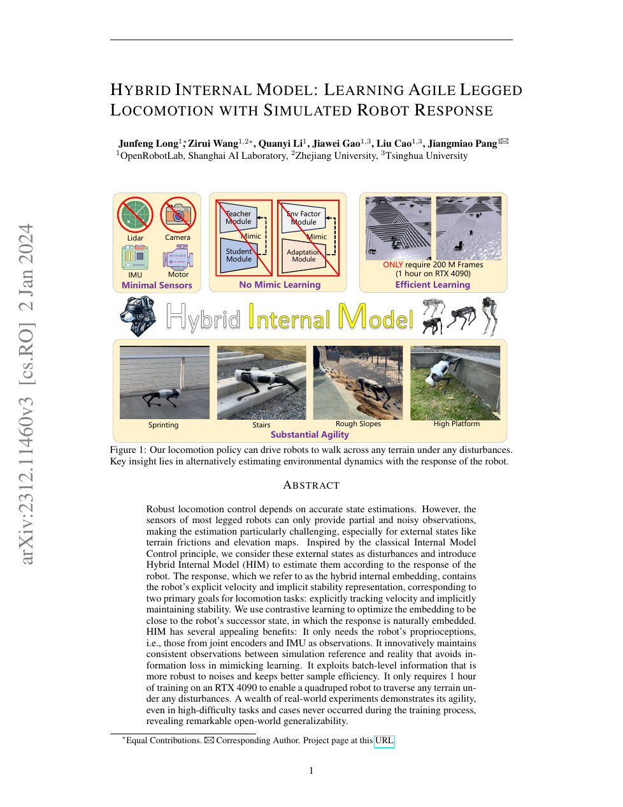

<!--
---
id: P0013
title_en: "Hybrid Internal Model: Learning Agile Legged Locomotion with Simulated Robot Response"
title_zh: "混合内部模型：利用模拟机器人响应学习敏捷足式运动"
year: 2023
date: 2023-12-18
venue: "ICLR 2024"
primary_category: locomotion-prior
tags: [locomotion, reinforcement-learning, contrastive-learning, motion-prior, sim2real, biped]
authors: [Junfeng Long, Zirui Wang, Quanyi Li, Jiawei Gao, Liu Cao, Jiangmiao Pang]
institutions: [OpenRobotLab, Shanghai AI Laboratory, Zhejiang University, Tsinghua University]
paper_url: "https://arxiv.org/abs/2312.11460"
project_url: null
github_url: "https://github.com/OpenRobotLab/HIMLoco"
video_url: null
open_source: {code: full, training_code: full, inference_code: full, model_weights: unknown, dataset: "no", robot_deployment: partial}
open_source_checked: 2026-09-03
robots: [Unitree A1, Unitree Go1]
inputs: [proprioception, velocity command]
outputs: [joint position target, hybrid internal embedding]
read_status: read
reproduce_status: not-started
local_materials: []
created: 2026-09-03
updated: 2026-09-03
---
-->

# P0013｜混合内部模型：利用模拟机器人响应学习敏捷足式运动

*Hybrid Internal Model: Learning Agile Legged Locomotion with Simulated Robot Response*

[论文](https://arxiv.org/abs/2312.11460) · [官方代码](https://github.com/OpenRobotLab/HIMLoco)

## 基本信息

<!-- AUTO-BASIC-INFO:START -->
> **作者**：Junfeng Long、Zirui Wang、Quanyi Li、Jiawei Gao、Liu Cao、Jiangmiao Pang
>
> **机构**：OpenRobotLab、Shanghai AI Laboratory、Zhejiang University、Tsinghua University
>
> **论文时间**：2023-12-18
>
> **期刊 / 会议**：ICLR 2024
>
> **主分类**：Locomotion 与运动先验
>
> **重点标签**：**运动控制** · **强化学习** · **对比学习** · **运动先验** · **Sim2Real** · **双足机器人**
>
> **阅读状态**：已阅读　·　**复现状态**：未开始
<!-- AUTO-BASIC-INFO:END -->

## 本文贡献

- 把难以直接感知的地形、摩擦和外部扰动视为未知环境动力学，用机器人短期响应反推对控制真正有用的隐变量。
- 构造“显式速度 + 隐式稳定性”的混合内部嵌入，只依赖关节编码器和 IMU，避免部署时模仿仅在仿真可得的特权地形状态。
- 以原型聚类和交换分配式对比学习改善噪声鲁棒性与样本效率，并与 PPO 交替优化，完成零样本 sim-to-real 越障。

## 研究问题

盲式运动控制既要跟踪速度，又要适应不可见地形和外力。Teacher–Student 若让学生回归特权状态，可能压缩掉对控制有用但难命名的信息；纯历史编码又缺少明确的训练目标。HIM 的假设是：环境因素会通过后继本体状态显现，因此“响应”比手工环境标签更适合作为内部模型目标。

## 原论文重点图

**图 1：HIM 动机与实机能力总览（原论文 Figure 1 所在页）。** 上半部分对比特权 teacher/mimic 路线与只依赖最小传感器的 HIM；下半部分展示冲刺、楼梯、粗糙斜坡和高台等测试。图中“1 小时/RTX 4090”是论文训练配置，不应外推到不同机器人和并行环境数。

## 研究方法详细解读

### 混合内部嵌入

编码器读取一段本体历史，输出显式速度估计与 16 维隐式稳定性表示。显式部分用真值速度监督，确保命令跟踪的可解释分量；隐式部分不回归具体摩擦或高度图，而以机器人后继状态为自监督目标，保留多种扰动共同造成的动态结果。

### 原型对比学习

源/目标编码器把当前历史和后继状态映射到共享空间，样本与可学习原型做匹配。Sinkhorn–Knopp 产生平衡的软分配，再用 SwAV 式交换预测让当前响应能够预测后继状态的原型。批级分配比逐样本回归更不易被传感器噪声支配。

### 与 PPO 的交替训练

策略把速度命令、本体状态和 HIM 嵌入共同映射为关节目标。训练交替进行 HIM 表征更新和 PPO 控制更新，使嵌入围绕“能否改善控制”收敛；若只离线预训练表征，策略分布变化会使后继状态目标失配。

## 实验结果与结论

论文在四足平台上展示楼梯、斜坡、高台、负载和未见扰动，并报告约 2 亿仿真帧即可训练。核心结论是显式速度与隐式稳定性互补、对比原型优于直接特权状态模仿；这些证据建立在论文的平台与奖励上，尚不能直接证明对人形机器人同样成立。

## 局限与复现提醒

- HIM 是足式 locomotion 的环境适应模块，不生成语义动作，也不等同于显式世界模型。
- 复现必须核对历史长度、16D 嵌入、原型数、Sinkhorn 温度、PPO/表征更新比例和实际传感器观测。
- 本知识库尚未运行官方训练或实机部署。

## 阅读与复现状态

- 阅读：已阅读论文与飞书方法整理。
- 代码：已核验官方训练仓库，未运行。
- 实机：论文有四足实机证据，本知识库无独立验证。

## 参考资料

- [arXiv](https://arxiv.org/abs/2312.11460)
- [官方代码](https://github.com/OpenRobotLab/HIMLoco)

## 更新记录

- 2026-09-03：补充正文基本信息卡，展示完整作者、机构、论文时间、期刊/会议、分类、标签与状态。
- 2026-09-03：新建条目，纳入飞书清单，补充原论文 Figure 1、混合嵌入与对比学习解读。
