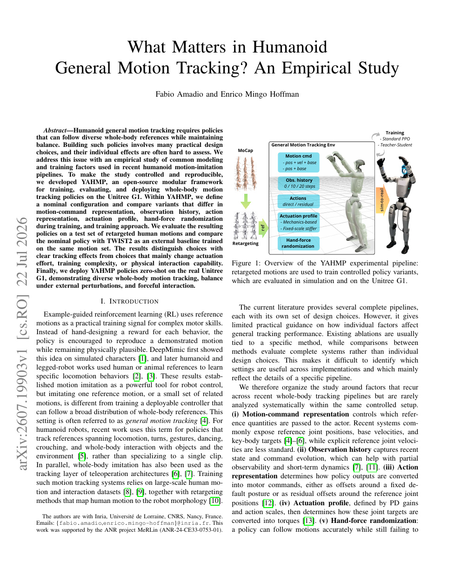

<!--
---
id: P0014
title_en: "What Matters in Humanoid General Motion Tracking? An Empirical Study"
title_zh: "人形机器人通用动作跟踪中什么最重要？一项实证研究"
year: 2026
date: 2026-07-22
venue: "arXiv preprint arXiv:2607.19903"
primary_category: tracking-wbc
tags: [motion-tracking, benchmark, reinforcement-learning, whole-body-control, g1, sim2real]
authors: [Fabio Amadio, Enrico Mingo Hoffman]
institutions: [Inria, Université de Lorraine, CNRS]
paper_url: "https://arxiv.org/abs/2607.19903"
project_url: null
github_url: "https://github.com/hucebot/yahmp"
video_url: "https://youtu.be/BH6FpQzwm8M"
open_source: {code: full, training_code: full, inference_code: full, model_weights: full, dataset: partial, robot_deployment: full}
open_source_checked: 2026-09-03
robots: [Unitree G1]
inputs: [motion reference, observation history, proprioception]
outputs: [residual joint position target]
read_status: read
reproduce_status: not-started
local_materials: []
created: 2026-09-03
updated: 2026-09-03
---
-->

# P0014｜人形机器人通用动作跟踪中什么最重要？一项实证研究

*What Matters in Humanoid General Motion Tracking? An Empirical Study*

[论文](https://arxiv.org/abs/2607.19903) · [YAHMP 官方代码](https://github.com/hucebot/yahmp) · [实验视频](https://youtu.be/BH6FpQzwm8M)

## 本文贡献

- 在同一 YAHMP 框架与动作集上逐项控制变量，比较参考命令、观测历史、动作表示、PD 配置、手部外力随机化和 Teacher–Student，而非比较彼此完全不同的整套系统。
- 给出可操作结论：参考关节速度和约 0.2 秒历史显著重要，残差动作有中等收益，更硬的 PD 不稳定地改善跟踪且增加峰值力矩。
- 开源 50 Hz Unitree G1 的训练、评估、部署与 ONNX 流程，并以零样本实机跟踪、外扰和负载实验补足仿真消融。

## 研究问题

通用跟踪论文往往同时改变网络、奖励、观测和执行器参数，难以知道提升来自哪里。本文固定名义配置，只替换一个因素；因此它的价值不是提出更复杂的 tracker，而是建立能复核设计取舍的受控基线。

## 原论文重点图

**图 1：YAHMP 受控实验管线（原论文 Figure 1 所在页）。** MoCap 参考进入统一跟踪环境，右侧六组开关分别控制命令、历史、动作、执行器、手力与训练范式，最终走同一 sim-to-real 链路。每个结论只对这一共同协议内的变量差异负责。

## 研究方法详细解读

### 名义观测与动作

策略接收本体状态、参考关节位置/速度、基座运动与 10 步历史；以参考关节角为中心输出残差，PD 再转成力矩。把速度从命令中移除会使各类误差上升，说明位置目标不足以表达瞬时动态趋势。

### 六类控制变量

历史比较 0/10/20 步：无历史严重退化，20 步未稳定优于 10 步。Direct Action 改为相对默认站姿输出，迫使网络重新生成参考姿态；Residual Action 直接学习动力学修正。Mechanics-based PD 按目标自然频率和阻尼比从等效机械参数计算，Stiffer 配置则代表常见经验高增益。

### 交互与训练范式

手部随机外力不一定改善自由空间跟踪，却显著影响承载/推压能力；因此交互训练目标不能只看 MPJPE。Teacher–Student 使用特权 teacher 再蒸馏部署 student，但在本文协议中相对调好的单阶段 PPO 收益有限，复杂度不应被默认合理化。

## 实验结果与结论

在 1024 条测试动作上，移除参考速度使基座、关键身体和关节误差普遍恶化；TWIST2 在关键点位置上有优势，但 YAHMP 名义配置在方向和关节空间更均衡。真实 G1 的 mechanics-based 配置比 stiff PD 更平滑、峰值力矩更低。结论是跟踪精度、执行器负担与交互能力必须分别评价。

## 局限与复现提醒

- 结论来自单一机器人、数据处理与奖励实现，不能把“10 步最佳”当作跨平台常数。
- 必须固定重定向动作集、50 Hz、action scale、PD 增益与测试动作，才是控制变量实验。
- 本知识库仅完成静态阅读，尚未运行 YAHMP 或 ONNX 实机链路。

## 阅读与复现状态

- 阅读：已阅读原文、飞书深度整理与主要消融。
- 资源：代码、模型与部署入口已核验。
- 运行：未训练、未仿真、未实机验证。

## 参考资料

- [arXiv](https://arxiv.org/abs/2607.19903)
- [官方代码](https://github.com/hucebot/yahmp)

## 更新记录

- 2026-09-03：新建条目，系统整理六类消融、50 Hz 部署与原论文实验框架。
