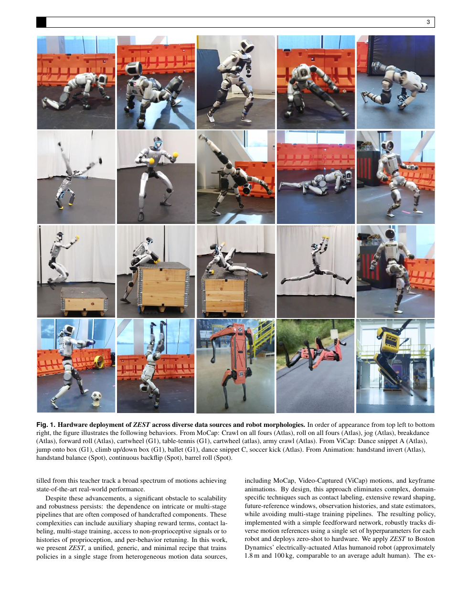

<!--
---
id: P0015
title_en: "ZEST: Zero-shot Embodied Skill Transfer for Athletic Robot Control"
title_zh: "ZEST：面向运动型机器人控制的零样本具身技能迁移"
year: 2026
date: 2026-01-30
venue: "arXiv preprint arXiv:2602.00401"
primary_category: tracking-wbc
tags: [motion-tracking, reinforcement-learning, whole-body-control, zero-shot, sim2real, humanoid]
authors: [Jean Pierre Sleiman, He Li, Alphonsus Adu-Bredu, Robin Deits, Arun Kumar, Kevin Bergamin, Mohak Bhardwaj, Scott Biddlestone, Nicola Burger, Matthew A. Estrada, Francesco Iacobelli, Twan Koolen, Alexander Lambert, Erica Lin, M. Eva Mungai, Zach Nobles, Shane Rozen-Levy, Yuyao Shi, Jiashun Wang, Jakob Welner, Fangzhou Yu, Mike Zhang, Alfred Rizzi, Jessica Hodgins, Sylvain Bertrand, Yeuhi Abe, Scott Kuindersma, Farbod Farshidian]
institutions: [RAI Institute, Boston Dynamics]
paper_url: "https://arxiv.org/abs/2602.00401"
project_url: null
github_url: null
video_url: null
open_source: {code: unknown, training_code: unknown, inference_code: unknown, model_weights: unknown, dataset: unknown, robot_deployment: unknown}
open_source_checked: 2026-09-03
robots: [Boston Dynamics Atlas, Unitree G1, Boston Dynamics Spot]
inputs: [next reference frame, proprioception]
outputs: [residual joint position target]
read_status: read
reproduce_status: not-started
local_materials: []
created: 2026-09-03
updated: 2026-09-04
---
-->

# P0015｜ZEST：面向运动型机器人控制的零样本具身技能迁移

*ZEST: Zero-shot Embodied Skill Transfer for Athletic Robot Control*

[论文](https://arxiv.org/abs/2602.00401)

## 基本信息

<!-- AUTO-BASIC-INFO:START -->
> **作者**：Jean Pierre Sleiman、He Li、Alphonsus Adu-Bredu、Robin Deits、Arun Kumar、Kevin Bergamin、Mohak Bhardwaj、Scott Biddlestone、Nicola Burger、Matthew A. Estrada、Francesco Iacobelli、Twan Koolen、Alexander Lambert、Erica Lin、M. Eva Mungai、Zach Nobles、Shane Rozen-Levy、Yuyao Shi、Jiashun Wang、Jakob Welner、Fangzhou Yu、Mike Zhang、Alfred Rizzi、Jessica Hodgins、Sylvain Bertrand、Yeuhi Abe、Scott Kuindersma、Farbod Farshidian
>
> **机构**：RAI Institute、Boston Dynamics
>
> **论文时间**：2026-01-30
>
> **期刊 / 会议**：arXiv preprint arXiv:2602.00401
>
> **主分类**：动作跟踪与全身控制
>
> **重点标签**：**动作跟踪** · **强化学习** · **全身控制** · **零样本** · **Sim2Real** · **人形机器人**
>
> **阅读状态**：已阅读　·　**复现状态**：未开始
<!-- AUTO-BASIC-INFO:END -->

## 本文贡献

- 用同一精简 RL 跟踪框架吸收高质量 MoCap、噪声单目视频与非物理动画，并在 Atlas、G1、Spot 三类形态上零样本上机。
- 只使用下一帧参考与残差动作，不依赖接触标签、未来窗口、长历史、显式状态估计器或 Teacher–Student，减少技能迁移链的专用工程。
- 结合难片段自适应 RSI、模型辅助外力课程、闭链执行器 armature 估计与精化执行器模型，解决长时高动态/多接触动作的训练稳定性。

## 研究问题

运动型技能往往因数据来源不同、闭链执行器动态和局部难片段而需要逐技能调奖励。ZEST 追问：如果把初始化采样、辅助课程和执行器建模做好，是否可以用更少的观测与奖励工程获得跨数据源、跨机器人的通用跟踪器。

## 原论文重点图

**图 1：ZEST 技能迁移框架（原论文 Figure 1 所在页）。** 论文把三类来源动作统一转成参考，训练阶段通过自适应起始状态和辅助外力攻克失败片段；部署时不使用这些辅助量，仅靠本体观测和下一帧参考输出残差动作。

## 研究方法详细解读

ZEST 的核心主张是：零样本动作迁移不一定依赖复杂特权观测、循环网络或每个机器人专门设计的控制结构。它把接口压到最小——当前本体、下一参考帧和上一动作——再用困难时间分箱、参考状态初始化和可退火辅助力解决训练早期“根本学不会高难片段”的问题。

### 1. 总体定位：什么叫零样本具身技能迁移

同一段人类运动映射到 Atlas、G1、Spot 等不同形态后，关节、执行器、接触和闭链约束完全不同。复杂 tracker 常依赖长历史、特权速度或特定骨架模块，移植成本高。ZEST 关注的不是生成新动作，而是给定已经重定向的参考，能否只替换机器人资产和执行器模型，就用统一的单阶段训练配方学会包括运动型技能在内的跟踪。

### 2. 整体训练流程：统一配方适配不同机器人

1. 将 MoCap、视频捕捉或动画离线重定向到目标机器人，保持各机器人自己的关节和约束。
2. 每步把当前本体、下一帧参考和上一动作输入前馈 actor，输出参考关节角上的残差目标。
3. 用跟踪奖励、控制正则和域随机化进行单阶段 PPO，不引入部署不可得的特权 actor 输入。
4. 按动作时间分箱统计失败，优先从困难片段初始化；训练早期用可撤销基座辅助力帮助策略经历完整技能。
5. 逐步退火辅助力，最终在无该外力条件下训练和评估；换机器人时同步替换资产、执行器、PD、闭链和接触契约。

### 3. 总体信息流：最少接口完成多形态跟踪

ZEST 将 MoCap、视觉捕捉或手工动画先重定向到目标机器人，再用同一类单阶段 PPO tracker 学习执行。每个控制步只提供当前本体、下一参考帧和上一动作，前馈策略输出参考关节角上的残差目标；仿真 PD/执行器推进状态，跟踪奖励和控制正则更新策略。困难动作通过失败分箱重采样，早期再施加可退火的基座辅助力，训练后两者都不成为线上依赖。Atlas、G1、Spot 只替换资产和执行器参数，不改变这一主流程。

### 极简观测、动作与参考接口

参考只包含下一帧姿态/根运动，不输入长未来窗、相位、接触标签或显式状态估计器；本体观测加上一时刻动作提供最小的短期动态信息。策略输出相对参考关节位置的残差，经缩放与参考相加后交给 PD。名义轨迹直接承担动作语义，网络专注重力、惯性和接触造成的误差修正；代价是接触时序、未来冲量和恢复趋势都必须从当前参考与物理 rollout 中隐式学习。

### 时间分箱与自适应初始状态采样

每条动作按固定持续时间划分为多个 bin，为每个 bin 维护 EMA 失败率。episode 重置时，一部分保持均匀覆盖，另一部分按失败权重采样，使跳跃起跳、落地或地面起身等局部难点不断获得训练预算；成功后对应权重自然下降。该机制比按整条动作打难度更精细，也避免策略只反复见到片段开头，但需要保证 bin 索引、参考相位和重置状态严格同步。

### 可撤销的模型辅助力

早期策略往往无法到达腾空、翻滚或高台动作的关键状态，ZEST 根据参考与当前基座差异施加虚拟模型式 wrench，为根部提供方向明确的平移/转动辅助。每个动作分箱拥有自己的辅助难度，跟踪改善后幅值逐步退火到零；最终策略必须在无辅助力时保持成功。它是探索 curriculum 而非部署控制器，若训练结束仍有非零辅助，就不能声称完成同等零样本迁移。

### 奖励、随机化与训练方式

PPO 回报由关节/身体姿态、根位置与朝向、速度等参考误差和力矩、动作变化等正则组成，不需要人工接触标注。训练同时加入质量、摩擦、电机、观测噪声和外力等适度随机化，但论文避免用极端随机化掩盖资产建模问题。每种技能/机器人在物理仿真中训练独立策略，论文报告约 7k 迭代、单张 L4 约 10 小时；仿真多技能展示不等于同一个实机策略已无缝覆盖全部技能。

### 执行器、闭链与 sim-to-real 契约

闭链或复杂传动的关节不能直接使用开链刚体惯量。论文从近似解析模型得到各关节等效 armature，并结合硬件力矩/速度特性选择 PD 增益与动作尺度；Spot 还使用更细的功率和执行器模型。策略、惯量、增益、延迟与限幅共同构成 sim-to-real 契约，错误的资产参数会让仿真中稳定的残差在实机放大，无法靠 checkpoint 本身补偿。

### 推理与适用边界

ViCap 工作流是录制人体 → 三维恢复与平滑 → 重定向 → 训练 tracker → 实机播放；在线控制只需下一参考帧、本体和前馈 actor。论文有多机器人硬件展示，但“relaxed root adherence”意味着策略允许牺牲严格根轨迹以消除视觉数据抖动/脚滑。复现既要报告动作误差，也要报告接触、力矩与恢复；格式/FK 正确不能代替真实动力学测试。

## 实验结果与结论

Atlas 展示 army crawl、breakdance 等动态多接触技能，Atlas/G1 从视频迁移舞蹈和爬箱，Spot 从动画迁移连续后空翻。证据说明简化接口并不必然牺牲技能范围，但论文展示不能替代对完整成功率分布、硬件冲击和安全边界的复核。

## 局限与复现提醒

- 复现必须获得准确机器人模型、执行器参数、armature、辅助力退火和动作分箱统计。
- “零样本”指仿真训练后不在目标硬件上继续学习，不代表无需重定向、系统辨识或安全调试。
- 当前未核验到完整官方训练代码，条目不宣称可端到端复现。

## 阅读与复现状态

- 阅读：已阅读原文和飞书方法整理。
- 代码：公开边界待核验。
- 运行：未仿真或实机验证。

## 参考资料

- [arXiv](https://arxiv.org/abs/2602.00401)

## 更新记录

- 2026-09-04：按 ADAPT 式方法导读补充零样本迁移的准确任务定义，并以五步统一配方说明重定向、极简 actor、困难分箱、辅助力退火和跨机器人契约。
- 2026-09-03：依据原论文方法与训练章节，扩展总体流程、数据表征、模块信息流、训练目标、推理/部署及实现边界。
- 2026-09-03：补充正文基本信息卡，展示完整作者、机构、论文时间、期刊/会议、分类、标签与状态。
- 2026-09-03：新建条目，整理自适应 RSI、辅助外力课程和闭链执行器建模。
