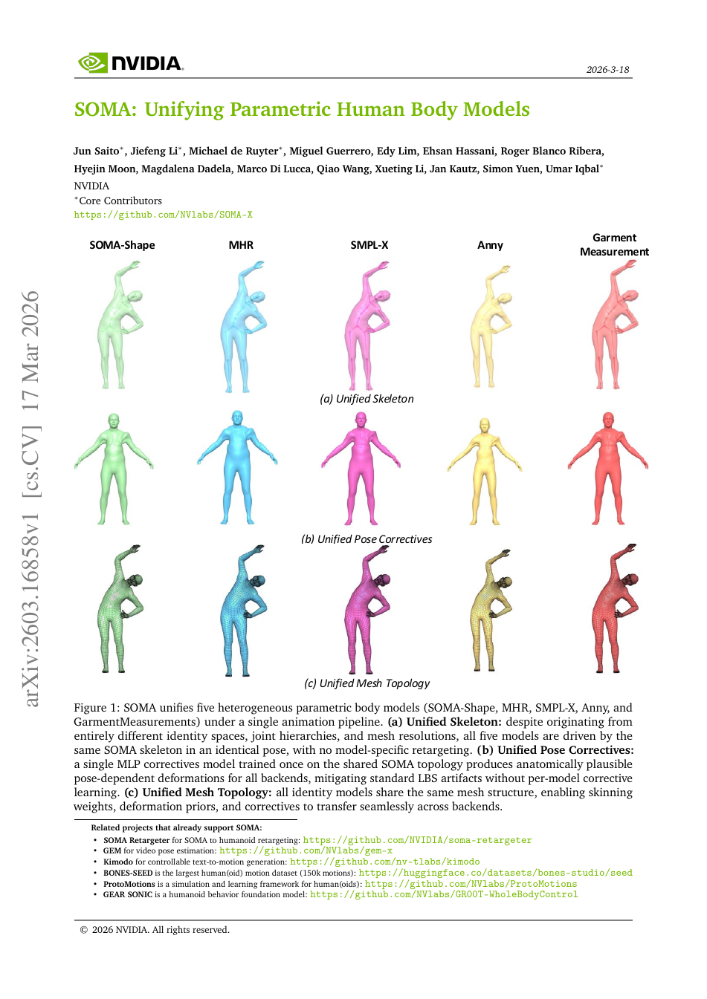

<!--
---
id: P0016
title_en: "SOMA: Unifying Parametric Human Body Models"
title_zh: "SOMA：统一参数化人体模型（含 GEM-X 视频估计器）"
year: 2026
date: 2026-03-17
venue: "NVIDIA Technical Report, arXiv:2603.16858"
primary_category: retargeting
tags: [retargeting, pose-estimation, smpl, smplx, inverse-kinematics, optimization]
authors: [Jun Saito, Jiefeng Li, Michael de Ruyter, Miguel Guerrero, Edy Lim, Ehsan Hassani, Roger Blanco Ribera, Hyejin Moon, Magdalena Dadela, Marco Di Lucca, Qiao Wang, Xueting Li, Jan Kautz, Simon Yuen, Umar Iqbal]
institutions: [NVIDIA]
paper_url: "https://arxiv.org/abs/2603.16858"
project_url: "https://research.nvidia.com/labs/dair/soma-x/"
github_url: "https://github.com/NVlabs/SOMA-X"
video_url: null
open_source: {code: full, training_code: full, inference_code: full, model_weights: full, dataset: partial, robot_deployment: partial}
open_source_checked: 2026-09-03
robots: [humanoid]
inputs: [parametric human body, posed vertices, video]
outputs: [unified mesh, unified skeleton, unified motion]
read_status: read
reproduce_status: not-started
local_materials: []
created: 2026-09-03
updated: 2026-09-04
---
-->

# P0016｜SOMA：统一参数化人体模型（含 GEM-X 视频估计器）

*SOMA: Unifying Parametric Human Body Models*

[论文](https://arxiv.org/abs/2603.16858) · [项目页](https://research.nvidia.com/labs/dair/soma-x/) · [官方代码](https://github.com/NVlabs/SOMA-X) · [GEM-X](https://github.com/NVlabs/gem-x)

> 飞书中的“GEM-X”是 SOMA 生态的视频人体估计器，不是独立论文；本条目归档其对应的 SOMA 技术报告，并保留 GEM-X 官方入口。

## 基本信息

<!-- AUTO-BASIC-INFO:START -->
> **作者**：Jun Saito、Jiefeng Li、Michael de Ruyter、Miguel Guerrero、Edy Lim、Ehsan Hassani、Roger Blanco Ribera、Hyejin Moon、Magdalena Dadela、Marco Di Lucca、Qiao Wang、Xueting Li、Jan Kautz、Simon Yuen、Umar Iqbal
>
> **机构**：NVIDIA
>
> **论文时间**：2026-03-17
>
> **期刊 / 会议**：NVIDIA Technical Report, arXiv:2603.16858
>
> **主分类**：重定向
>
> **重点标签**：**重定向** · **姿态估计** · **SMPL** · **SMPL-X** · **逆运动学** · **优化**
>
> **阅读状态**：已阅读　·　**复现状态**：未开始
<!-- AUTO-BASIC-INFO:END -->

## 本文贡献

- 用网格拓扑、骨架和姿态三层抽象统一 SOMA-Shape、MHR、SMPL-X、Anny 等互不兼容的人体模型。
- 将每对模型都写转换器的 `O(M²)` 维护成本降为每个模型连接一次统一后端的 `O(M)`，并保持 GPU 加速和端到端可微。
- 支持从任意形状或姿态顶点闭式恢复统一关节变换/旋转，使 GEM-X 估计、Kimodo 生成和 humanoid retargeter 共用同一人体表示。

## 研究问题

不同参数人体模型在拓扑、骨架、单位和形状空间上不兼容，导致动作数据、估计器和生成器无法直接组合。SOMA 的重点不是再做一个新 SMPL，而是定义稳定中间层，隔离上游身份/姿态来源与下游动画、重定向消费者。

## 原论文重点图

**图 1：统一骨架、姿态修正与网格拓扑（原论文 Figure 1 所在页）。** 五类身份模型先映射到共享 SOMA 网格，再由同一骨架和修正器驱动。图中相同姿态在不同体形上保持关节语义一致，这正是跨数据集/模型复用的接口基础。

## 研究方法详细解读

SOMA 的核心不是把 SMPL、SMPL-X、MHR 的参数名字做一层转换，而是建立一个与源模型拓扑无关的统一人体空间。它先把不同 identity 的表面映射到 canonical topology，恢复统一 77 关节骨架，再用共享 LBS 和姿态修正表示动作；反向的 pose abstraction 则把任意源模型姿态投到这套统一骨架。

### 1. 总体定位：为什么已有参数化人体模型不能直接互换

不同 body model 的顶点数、骨架、手脸自由度、shape 参数和 pose blend shape 都不同，相同参数值没有共同几何含义。若动作生成、视频估计和机器人重定向各绑定一种模型，数据无法合并，模型输出也难迁移。SOMA 要把“人物是谁”和“人物怎么动”分开：先从几何恢复统一 identity，再在统一骨架上表达 pose，使下游生成器和估计器不必为每种人体模型重训全部主干。

### 2. 整体方法流程：身份规范化与姿态抽象两条方向

1. Identity provider 从任意源模型产生中性/身份网格，并通过预计算四面体重心坐标映射到 canonical surface。
2. 用 RBF 关节回归和 Kabsch 对齐从统一网格恢复 77 关节身份骨架。
3. 训练共享 LBS 与 pose corrective，根据统一骨架姿态生成高保真表面。
4. 对源模型现有姿态执行 pose abstraction，闭式求解局部骨骼旋转并映射到统一 77 关节参数。
5. 下游 GEM-X 等估计器输出 SOMA 空间动作，Kimodo 等生成器也在同一空间工作；机器人仍需独立重定向和动力学控制。

### 3. 总体信息流：先统一人体身份，再统一姿态

SOMA 不是单个动作生成网络，而是一层跨人体模型的可微接口。任意 SMPL/SMPL-X/MHR 等后端先由 identity provider 输出网格，把顶点通过预计算的四面体重心坐标映射到 canonical topology；统一网格经 RBF 关节回归和 Kabsch 得到 77 关节身份骨架，再由统一 LBS 与 pose corrective 产生姿态网格。反向时，posed mesh 先转回 canonical topology，姿态抽象逐层反演 skinning 得到统一旋转；下游估计、生成或机器人重定向都只对这一公共状态编程。

### Identity provider 与 SOMA Shape

每个已有人体模型实现一个 provider，把自己的 shape/pose 参数转成米制网格和关节；对没有合适参数化的身份，SOMA Shape 在统一网格上用 128 维 PCA 表示体形。PCA 数据来自 SizeUSA、Triplegangers 等 9,326 个身体，并经统一预处理。此层只解决“这个人静止时长什么样”，与动作姿态分离；新增后端只需实现自身到公共网格的连接器，不必为每一对源/目标模型训练转换器。

### 拓扑对应为什么用体积重心坐标

不同模型顶点数和表面采样不一致，逐顶点最近邻在体形变化或关节弯曲时不稳定。SOMA 为目标点记录其在 canonical 四面体中的固定重心权重，输入后端网格变形时按同一权重插值位置，从而建立三维体积内的稠密对应。这个映射随后承载 skinning weights、形变先验和 corrective；它依赖预处理时拓扑、尺度与坐标严格一致，错误对应会系统性污染后续骨架和旋转。

### 77 关节骨架的闭式恢复

关节位置由稀疏 RBF 权重对统一网格做矩阵乘得到；局部坐标轴则取关节邻域的参考点，用 Kabsch 最小二乘对齐恢复旋转，再用子关节方向修正退化轴。实现用 Warp 向量化，可为不同身体形状即时生成身份自适应骨架。这里没有通过神经网络猜关节，闭式几何提供确定性，但输入网格噪声和左右/父子定义仍会直接传到结果。

### LBS 与姿态 corrective 的训练

正向动画先按统一 77 关节做线性蒙皮，再由共享 MLP 根据 6D 关节旋转预测 pose corrective；解剖 mask 限制某关节只影响相关区域。该 MLP由约 80k 个 MHR posed meshes 蒸馏/训练，目标是补偿纯 LBS 的肌肉和软组织误差。训练好的 corrective 在各 identity provider 间共享，因而网络学习的是公共拓扑上的姿态残差，不是任一后端的私有参数空间。

### Pose abstraction 的逆向算法

给定 posed mesh，系统先做拓扑映射和骨架初始化，然后按父到子层级对局部顶点执行逆 LBS Procrustes，逐关节恢复旋转。为避免 SVD 在接近 180° 时跳变，旋转正交化采用 Newton–Schulz 迭代；身体、手指和全局朝向分层求解。解析流程可达约 1,200 FPS；需要更精确时可从解析解 warm-start，对 6D 旋转做约 100 步 Adam 优化，速度约 16–18 FPS，二者精度/吞吐不同。

### 推理阶段的 GEM-X、Kimodo 与机器人栈边界

GEM-X 从单目视频回归 SOMA 人体状态，Kimodo 在 SOMA 空间生成或编辑运动，SOMA Retargeter 再把公共骨架映射到机器人；这是估计—生成—适配三段式系统。GEM-X 的 520M 回归模型不是 GENMO 扩散生成器，SOMA 也不负责机器人接触动力学。复现必须分别验证 topology connector、骨架顺序、旋转约定、单位和目标机器人映射，公共表示正确仍不代表低层控制可执行。

## 实验结果与结论

论文展示跨多种人体模型的统一驱动、形状/姿态互换和 GPU 加速。核心结论是统一后端能减少转换器数量并复用数据与网络；它解决表示兼容，不自动解决机器人动力学可执行性。

## 局限与复现提醒

- 模型统一依赖精确后端连接器，拓扑/单位/关节语义错误会静默传播。
- SOMA 到机器人仍需约束优化或控制器，不能把人体层可微等同于实机可执行。
- 本知识库尚未运行 GEM-X、SOMA-X 或 retargeter。

## 阅读与复现状态

- 阅读：已阅读技术报告与飞书 GEM-X 整理。
- 资源：SOMA-X、GEM-X 和 retargeter 入口已核验。
- 运行：未执行模型转换或视频估计。

## 参考资料

- [SOMA 技术报告](https://arxiv.org/abs/2603.16858)
- [SOMA-X](https://github.com/NVlabs/SOMA-X)
- [GEM-X](https://github.com/NVlabs/gem-x)

## 更新记录

- 2026-09-04：按 ADAPT 式讲解补充跨人体模型不兼容的根因，并用五步双向流程讲清 canonical topology、身份骨架、LBS、pose abstraction 与下游边界。
- 2026-09-03：依据原论文方法与训练章节，扩展总体流程、数据表征、模块信息流、训练目标、推理/部署及实现边界。
- 2026-09-03：补充正文基本信息卡，展示完整作者、机构、论文时间、期刊/会议、分类、标签与状态。
- 2026-09-03：将飞书 GEM-X 条目归并到对应 SOMA 技术报告，补充三层表示与生态接口解读。
