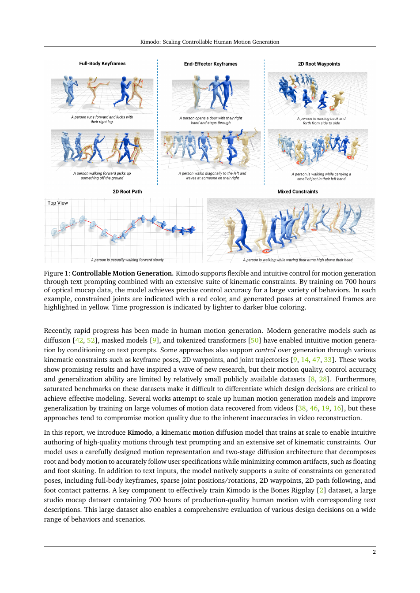

<!--
---
id: P0017
title_en: "Kimodo: Scaling Controllable Human Motion Generation"
title_zh: "Kimodo：可控人体动作生成的规模化"
year: 2026
date: 2026-03-16
venue: "NVIDIA Technical Report, arXiv:2603.15546"
primary_category: motion-generation
tags: [motion-generation, diffusion, transformer, text, keypoints, large-scale-data, human-motion]
authors: [Davis Rempe, Mathis Petrovich, Ye Yuan, Haotian Zhang, Xue Bin Peng, Yifeng Jiang, Tingwu Wang, Umar Iqbal, David Minor, Michael de Ruyter, Jiefeng Li, Chen Tessler, Edy Lim, Eugene Jeong, Sam Wu, Ehsan Hassani, Michael Huang, Jin-Bey Yu, Chaeyeon Chung, Lina Song, Olivier Dionne, Jan Kautz, Simon Yuen, Sanja Fidler]
institutions: [NVIDIA]
paper_url: "https://arxiv.org/abs/2603.15546"
project_url: "https://research.nvidia.com/labs/sil/projects/kimodo"
github_url: "https://github.com/nv-tlabs/kimodo"
video_url: null
open_source: {code: full, training_code: full, inference_code: full, model_weights: full, dataset: partial, robot_deployment: "no"}
open_source_checked: 2026-09-03
robots: []
inputs: [text, full-body keyframes, sparse joint constraints, 2D waypoints, 2D paths]
outputs: [SOMA human motion]
read_status: deep-read
reproduce_status: not-started
local_materials: []
created: 2026-09-03
updated: 2026-09-03
---
-->

# P0017｜Kimodo：可控人体动作生成的规模化

*Kimodo: Scaling Controllable Human Motion Generation*

[论文](https://arxiv.org/abs/2603.15546) · [项目页](https://research.nvidia.com/labs/sil/projects/kimodo) · [官方代码](https://github.com/nv-tlabs/kimodo) · [中英左右对照技术报告](attachments/中英左右对照技术报告.pdf)

## 本文贡献

- 在 700 小时高质量光学 MoCap 上训练可扩展扩散模型，系统分析数据规模与模型规模对动作质量、泛化和约束精度的影响。
- 设计根部—身体两阶段去噪器：先稳定全局轨迹，再在其条件下生成局部身体细节，降低根漂移与脚部伪影。
- 统一文本、全身关键帧、稀疏关节位置/旋转、2D waypoint 和稠密 2D path 等约束，实现同一模型的强可控生成。

## 研究问题

公开 MoCap 规模限制了动作生成的长尾覆盖，而把所有控制条件直接塞进一个去噪器容易让全局轨迹与局部姿态互相干扰。Kimodo 通过大规模高质量数据和结构化分解检验“规模是否能转化为可控性”，而不仅是提高无条件视觉质量。

## 原论文重点图

**图 1：Kimodo 控制条件与两阶段生成（原论文 Figure 1 所在页）。** 文本提供语义，关键帧/关节/二维路径提供不同粒度几何约束；root denoiser 先确定全局移动，body denoiser 再补全身体动作。分解让路径约束不必与高维局部关节在同一预测头直接竞争。

## 研究方法详细解读

### SOMA 动作表示与约束采样

动作在统一 SOMA 人体层中表示，训练时从真实姿态随机采样不同密度、不同关节和不同二维/三维形式的约束。这样模型不是为某一种编辑接口单独微调，而是在训练阶段学习约束缺失模式。

### 两阶段扩散去噪

第一阶段专注根平移、朝向与路径相关特征，第二阶段以根预测和外部条件为上下文恢复身体姿态。训练可分别监督两部分；推理时上游根误差会传给身体，因此约束冲突处理和 root/body 归一化是复现重点。

### 规模实验

论文逐步增加 700 小时数据子集与网络规模，比较生成质量和约束遵循。规模收益来自动作覆盖与高质量捕捉，而不是把互联网噪声样本简单堆叠；私有数据口径也意味着公开复现很难完全重现缩放曲线。

## 实验结果与结论

在大规模 MoCap 与 HumanML3D 等协议上，Kimodo 在文本质量和多类运动学约束上取得强结果，并能生成训练分布外组合。论文支持“数据/模型扩大提升可控性”的结论，但不证明生成结果具备机器人接触与力矩可行性。

## 局限与复现提醒

- 700 小时光学 MoCap 未等价完整公开数据，公开代码无法单独复现数据缩放结论。
- 二维路径需要明确相机/地面坐标定义；SOMA 到 SMPL/机器人需额外转换。
- 本知识库已深读对照文档，但未运行官方模型。

## 阅读与复现状态

- 阅读：已深读技术报告与中英左右对照材料。
- 资源：代码和模型入口已核验，训练数据仅部分可得。
- 运行：未执行生成或约束评测。

## 参考资料

- [arXiv](https://arxiv.org/abs/2603.15546)
- [项目页](https://research.nvidia.com/labs/sil/projects/kimodo)
- [官方代码](https://github.com/nv-tlabs/kimodo)

## 更新记录

- 2026-09-03：新建精读条目，纳入中英对照附件和原论文重点图，解析 root/body 两阶段与控制条件。
