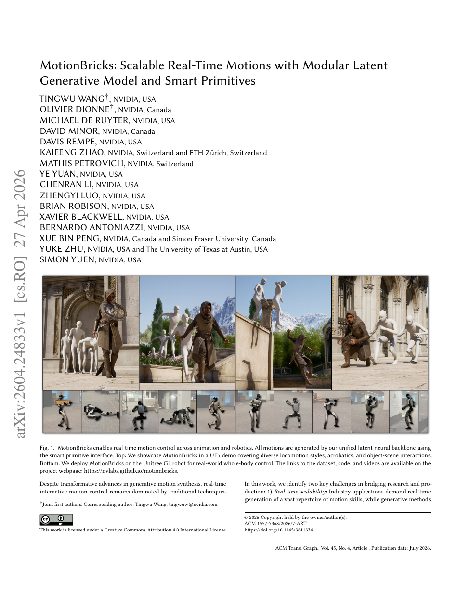

<!--
---
id: P0018
title_en: "MotionBricks: Scalable Real-Time Motions with Modular Latent Generative Model and Smart Primitives"
title_zh: "MotionBricks：基于模块化潜变量生成模型与智能原语的可扩展实时动作"
year: 2026
date: 2026-04-27
venue: "ACM Transactions on Graphics 45(4), SIGGRAPH 2026"
primary_category: motion-generation
tags: [motion-generation, real-time, latent-motion, multimodal, human-object-interaction, g1]
authors: [Tingwu Wang, Olivier Dionne, Michael De Ruyter, David Minor, Davis Rempe, Kaifeng Zhao, Mathis Petrovich, Ye Yuan, Chenran Li, Zhengyi Luo, Brian Robison, Xavier Blackwell, Bernardo Antoniazzi, Xue Bin Peng, Yuke Zhu, Simon Yuen]
institutions: [NVIDIA, ETH Zürich, Simon Fraser University, The University of Texas at Austin]
paper_url: "https://arxiv.org/abs/2604.24833"
project_url: "https://nvlabs.github.io/motionbricks/"
github_url: null
video_url: null
open_source: {code: unknown, training_code: unknown, inference_code: unknown, model_weights: unknown, dataset: partial, robot_deployment: partial}
open_source_checked: 2026-09-03
robots: [Unitree G1]
inputs: [velocity command, style, keyframes, object constraints]
outputs: [real-time latent motion, humanoid reference motion]
read_status: read
reproduce_status: not-started
local_materials: []
created: 2026-09-03
updated: 2026-09-04
---
-->

# P0018｜MotionBricks：基于模块化潜变量生成模型与智能原语的可扩展实时动作

*MotionBricks: Scalable Real-Time Motions with Modular Latent Generative Model and Smart Primitives*

[论文](https://arxiv.org/abs/2604.24833) · [项目页](https://nvlabs.github.io/motionbricks/)

## 基本信息

<!-- AUTO-BASIC-INFO:START -->
> **作者**：Tingwu Wang、Olivier Dionne、Michael De Ruyter、David Minor、Davis Rempe、Kaifeng Zhao、Mathis Petrovich、Ye Yuan、Chenran Li、Zhengyi Luo、Brian Robison、Xavier Blackwell、Bernardo Antoniazzi、Xue Bin Peng、Yuke Zhu、Simon Yuen
>
> **机构**：NVIDIA、ETH Zürich、Simon Fraser University、The University of Texas at Austin
>
> **论文时间**：2026-04-27
>
> **期刊 / 会议**：ACM Transactions on Graphics 45(4), SIGGRAPH 2026
>
> **主分类**：动作生成
>
> **重点标签**：**动作生成** · **实时** · **动作潜变量** · **多模态** · **人-物交互** · **Unitree G1**
>
> **阅读状态**：已阅读　·　**复现状态**：未开始
<!-- AUTO-BASIC-INFO:END -->

## 本文贡献

- 面向生产级实时交互，在单一模块化潜变量主干中建模超过 35 万动作片段，报告约 2 ms 延迟与 15,000 FPS 批吞吐。
- 提出 Smart Primitives，把速度、风格、关键帧和物体交互统一为可组合动作接口，让应用像搭积木一样组织导航与交互。
- 在 UE5 应用和 Unitree G1 上展示同一生成框架从动画到机器人控制的迁移，强调生成层与低层执行层的组合边界。

## 研究问题

离线扩散模型通常质量高但交互延迟大，传统 motion matching/状态机实时却难扩展到海量技能和多模态控制。MotionBricks 试图把大数据生成先验压入低延迟 latent transition，并用显式原语接口解决产品逻辑如何稳定调用生成模型。

## 原论文重点图

**图 1：动画与 G1 的统一实时动作接口（原论文 Figure 1 所在页）。** 上半部分展示 UE5 中导航、风格、杂技和物体交互，下半部分展示 G1 执行；共同点是 Smart Primitive 只描述约束，模块化潜变量主干生成连续动作，机器人端仍需跟踪控制器。

## 研究方法详细解读

MotionBricks 的核心不是输入一句文本后离线生成整段动作，而是把运行时任务拆成可组合的 Smart Primitives。应用只需在未来若干时间点声明根轨迹、关键帧或身体部位约束；Root Module 决定这一小段“去哪里、持续多久”，Pose Module 再补全身体，生成结果持续写入播放缓冲，从而在实时交互中滚动续写。

### 1. 总体定位：它要解决怎样的实时动作问题

导航、转身、坐下、抓取或用户临时控制往往同时包含不同时间尺度和身体部位约束。为每种任务训练生成器无法扩展，纯文本又不能精确指定落脚、路径和接触时刻；大扩散模型反复采样还难满足实时延迟。MotionBricks 要建立一种“约束就是积木”的运行时接口，让同一主干快速组合动作，而不要求训练集拥有每一种任务组合标签。

### 2. 整体训练与运行流程：从 tokenizer 到缓冲续写

1. 用多头 tokenizer 将根、身体部位和时间信息压成模块化 latent，同时训练统一 decoder 高保真重建连续动作。
2. 训练 Root Module：读取短历史和未来根/任务约束，预测 primitive 持续时间与根轨迹。
3. 训练 Pose Module：以根结果、身体关键帧和被 mask 的动作 token 为条件，补全完整姿态。
4. 运行时由任务层把导航或交互意图翻译成 Smart Primitives，先调用根模块，再调用姿态模块。
5. 解码动作写入播放缓冲；缓冲低于阈值时用最近历史重新规划，约束改变只影响后续块。
6. 输出仍是人体/角色动作；接入机器人必须另做骨架映射、接触检查和闭环跟踪。

### 3. 总体信息流：约束编排器驱动两级动作生成

MotionBricks 运行时先由应用层把导航、物体交互或用户输入翻译为 Smart Primitives，即未来时间点上的根轨迹、身体关键帧和部位约束。Root Module 根据 4 帧历史与目标先预测本段持续时间和根轨迹；Pose Module 再结合根、约束和被掩码的多头动作 token 补全身体；统一 decoder 恢复连续动作并放入播放缓冲。缓冲低于阈值时重新规划，因而角色能在执行途中接受新目标，而不是一次生成整条固定动画。

### 多头动作 tokenizer 与表示

连续状态同时包含全局/局部根、关节位置、全局 6D 旋转、速度和接触，训练时做随机全局旋转增强而不强制 heading canonicalization。encoder 只编码姿态并沿时间下采样 4 倍，再按 root/body 或身体部位分到 `K` 个特征 head，每个 head 独立量化（VQ 运行均值更新，也提供 FSQ 变体）。多头码使上身、下身和根可被分别 mask/替换，避免一个单码本把所有控制都绑在同一离散索引上。

### Decoder 如何重建和遵循关键帧

decoder 接收多头 token、根轨迹及稀疏关键帧，在多个时间尺度使用 root/keyframe skip connection，把精确约束直接送到重建层。训练随机给 0–10 个关键帧，监督连续姿态、速度、接触和量化重建；decoder 允许对上游根作小幅细化，使离散 token 与硬给定轨迹不一致时仍能形成平滑身体。该机制解决的是数据分布内协调，不提供冲突约束必然可满足的数学保证。

### Root Module 与 Pose Module 的生成顺序

Root Module 使用 Transformer 和 16 个 frame slot，先在 12–64 帧（以 4 帧为单位）上预测动作持续时间，再生成相应根轨迹。Pose Module 读取根、历史、文本/任务及稀疏身体约束，对多头动作 token 做掩码预测；训练按余弦课程改变 mask 比例，推理通常少量甚至一次前向即可填充。根先确定“去哪、多久”，姿态再确定“身体怎么配合”，这是实时性和可控性的主要来源。

### Smart Primitives 如何组合任务

原语不是保存好的动画 clip，而是生成约束的程序：locomotion 原语给速度、方向和目标点，交互原语给手/物体关系或特定关键帧，风格原语附加语义。状态机依据场景事件选择和排列原语，并把时间化约束送给同一生成器，无需为每个新任务重训。若两个原语对同一关节/时刻要求冲突，系统仍需应用层优先级或放宽约束，模型只会给出训练分布中最可能的折中。

### 训练与运行时缓冲

先独立训练 tokenizer/decoder，再训练根时长与轨迹预测，最后训练姿态 token 的掩码补全；每一阶段以前一阶段固定或稳定的表示为目标。运行时保存最近 4 帧作为连续性上下文，生成段进入动作 buffer，控制器消费到阈值便触发下一段；新事件可改写尚未执行的未来约束。论文报告约 2 ms 是生成核心的局部延迟，不包括感知、任务逻辑、解码、网络通信和机器人低层控制。

### 机器人链路与证据边界

G1 展示把生成参考交给已有全身跟踪器，生成模型本身不计算力矩、接触稳定或碰撞安全。若输入为人体表示，还需保持 tokenizer 输出与重定向/机器人参考的坐标契约。工程复现应分别测生成吞吐、缓冲欠载、参考跟踪、sim2sim 和实机安全，不能用实时动画帧率替代完整控制周期。

## 实验结果与结论

论文在不同规模开源/私有动作集上比较质量与吞吐，并展示生产级长时交互。核心结论是潜变量模块化和原语接口可兼顾规模、质量与实时性；G1 演示说明可连接机器人，但不是完整硬件安全或任意技能泛化证明。

## 局限与复现提醒

- 35 万片段含私有数据，公开资源边界会影响规模复现。
- 吞吐与单实例端到端延迟口径不同，不能直接把 15,000 FPS 当控制频率。
- 机器人链路需要核对 MotionBricks 输出表示、跟踪器、50 Hz 重采样和关节映射。

## 阅读与复现状态

- 阅读：已阅读原论文与飞书方法整理。
- 资源：项目页已核验，代码/权重发布状态保守记为待核验。
- 运行：未执行 UE5 或 G1 演示。

## 参考资料

- [arXiv](https://arxiv.org/abs/2604.24833)
- [项目页](https://nvlabs.github.io/motionbricks/)
- [ACM DOI](https://doi.org/10.1145/3811334)

## 更新记录

- 2026-09-04：按 ADAPT 式讲解补充 Smart Primitives 的任务动机，并用六步流程讲清 tokenizer、Root/Pose 模块、约束编排和运行时缓冲续写。
- 2026-09-03：依据原论文方法与训练章节，扩展总体流程、数据表征、模块信息流、训练目标、推理/部署及实现边界。
- 2026-09-03：补充正文基本信息卡，展示完整作者、机构、论文时间、期刊/会议、分类、标签与状态。
- 2026-09-03：新建条目，整理模块化 latent、Smart Primitives、实时性口径与 G1 接口。
