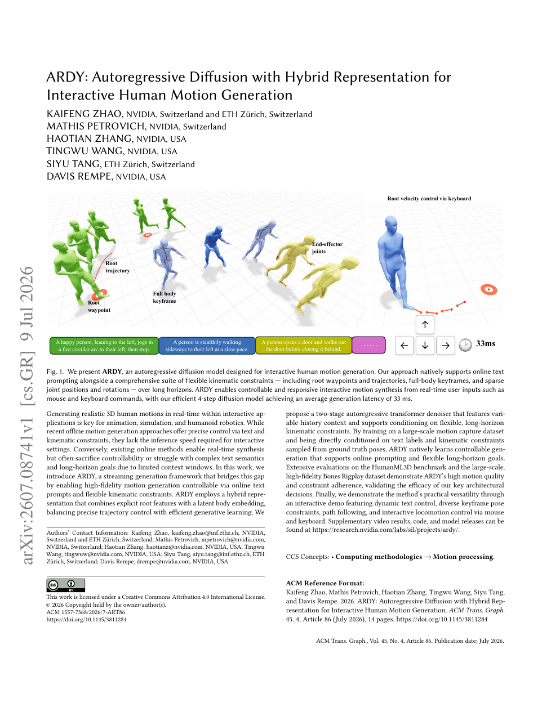

<!--
---
id: P0019
title_en: "ARDY: Autoregressive Diffusion with Hybrid Representation for Interactive Human Motion Generation"
title_zh: "ARDY：用于交互式人体动作生成的混合表示自回归扩散模型"
year: 2026
date: 2026-07-09
venue: "arXiv preprint arXiv:2607.08741"
primary_category: motion-generation
tags: [motion-generation, diffusion, autoregressive, real-time, text, keypoints, human-motion]
authors: [Kaifeng Zhao, Mathis Petrovich, Haotian Zhang, Tingwu Wang, Siyu Tang, Davis Rempe]
institutions: [NVIDIA, ETH Zürich]
paper_url: "https://arxiv.org/abs/2607.08741"
project_url: "https://research.nvidia.com/labs/sil/projects/ardy/"
github_url: null
video_url: null
open_source: {code: unknown, training_code: unknown, inference_code: unknown, model_weights: unknown, dataset: "no", robot_deployment: "no"}
open_source_checked: 2026-09-03
robots: []
inputs: [online text, keyframes, paths, motion history]
outputs: [streaming human motion]
read_status: read
reproduce_status: not-started
local_materials: []
created: 2026-09-03
updated: 2026-09-03
---
-->

# P0019｜ARDY：用于交互式人体动作生成的混合表示自回归扩散模型

*ARDY: Autoregressive Diffusion with Hybrid Representation for Interactive Human Motion Generation*

[论文](https://arxiv.org/abs/2607.08741) · [项目页](https://research.nvidia.com/labs/sil/projects/ardy/)

## 基本信息

<!-- AUTO-BASIC-INFO:START -->
> **作者**：Kaifeng Zhao、Mathis Petrovich、Haotian Zhang、Tingwu Wang、Siyu Tang、Davis Rempe
>
> **机构**：NVIDIA、ETH Zürich
>
> **论文时间**：2026-07-09
>
> **期刊 / 会议**：arXiv preprint arXiv:2607.08741
>
> **主分类**：动作生成
>
> **重点标签**：**动作生成** · **扩散模型** · **自回归** · **实时** · **文本** · **关键点** · **人体动作**
>
> **阅读状态**：已阅读　·　**复现状态**：未开始
<!-- AUTO-BASIC-INFO:END -->

## 本文贡献

- 提出流式自回归扩散框架，在在线文本提示、关键帧、路径与交互式 locomotion 指令下持续生成动作。
- 用“显式根特征 + 身体潜变量”混合表示兼顾全局轨迹精确控制与局部姿态压缩，降低纯高维动作扩散的实时成本。
- 设计两阶段自回归 Transformer 去噪器和可变历史上下文，以 4 步扩散实现约 33 ms 一段的交互生成。

## 研究问题

离线动作生成可使用完整未来条件，但无法响应运行中变化的提示；既有在线模型速度快却常只有短历史或弱文本控制。ARDY 要在因果流式约束下同时保留文本语义、长时目标和几何可控性。

## 原论文重点图

**图 1：ARDY 交互控制能力与总体结构（原论文 Figure 1 所在页）。** 系统把已生成历史与当前在线条件组成自回归上下文，显式根通道承担路径/朝向，latent body 通道承担姿态细节；每次只生成下一块，再把结果接回历史。

## 研究方法详细解读

### 总体流程：显式根轨迹与隐式身体分级生成

ARDY 将最近可变长度历史、文本、路径和稀疏目标组织成条件，在每个滚动窗口先由 Root Diffusion 生成未来全局根，再把干净根停止梯度地交给 Body Diffusion 生成身体 latent；decoder 将根与身体还原为连续动作，执行前一部分后继续滚动。根承担用户能直接操控的世界轨迹，身体 latent 承担高维姿态先验，两阶段只在当前窗口串联，下一窗口通过历史实现自回归连续。

### 混合动作表示与 tokenizer

根保留世界坐标 `xyz`、heading 的正余弦等显式量，身体按 4 帧 patch 进入 8 层因果 Transformer encoder，压成 512 维 latent 并用默认每维 64 级 FSQ 量化。decoder 先把全局根转换为局部增量再与身体重建，减少长时积分和脚滑；训练包括动作重建、量化以及约 0.01 权重的 skate 损失。tokenizer 单张 A100、batch 128 训练约 4M 步，为后续扩散提供稳定混合空间。

### 可变历史与未来目标的条件组织

每个生成块长度为 `C`，从既有动作随机取 `H` 帧历史，并允许目标落在当前块或更远的 `F` 帧未来。文本和扩散时刻形成语义 token；根路径/关键帧作为显式数值与 mask 写入 root 分支，身体关键帧则拼接给 body 分支，未来目标另用 goal token 表示。训练随机改变 `H`、约束部位和时间，模拟运行时刚启动、稳定滚动与提示切换等不同上下文。

### 两阶段扩散和损失回传

Root 与 Body 各使用 8 层、8 头、宽 1,024 Transformer，总计约 156M。Root 先从噪声回归干净全局通道；其输出 detach 后供 Body 使用，防止身体损失通过根分支改变轨迹语义。损失同时覆盖混合 token、解码身体、被 mask 的目标及 FK 后关节一致性。训练使用最大 10 秒序列、随机 yaw、10% 条件丢弃，4 张 A100、batch 512 约 1M 步；默认推理只需 10 个扩散时间步。

### 约束覆盖与运行时去噪

推理时已知历史和硬目标在每个扩散步重新覆盖相应通道，Root 先满足路径，Body 再在该根运动上补姿态。系统执行生成块的一部分并把真实已输出帧加入历史，下一块可换文本或键鼠方向；窗口重叠/历史注意力吸收边界速度。论文实时配置可进一步使用 4 个去噪步，约 33 ms 得到一块，但低步数是质量—响应速度折中，并不意味着完整角色系统只有 33 ms 延迟。

### 训练推理边界与机器人适配

ARDY 面向交互角色动画，输出人体连续动作；扩散损失和 skate 正则不包含机器人质量、力矩或接触稳定。转到人形机器人还需统一骨架、重定向、动作筛选与低层跟踪，并分别计算生成、通信和控制预算。长时连续性来自滚动条件，不是一次对无限序列求解，提示频繁冲突仍可能在窗口边界积累误差。

## 实验结果与结论

论文在 HumanML3D 与大规模 Bones Rigplay 上比较质量、约束遵循和实时性，并展示动态文本切换、关键帧、路径与键鼠控制。ARDY 的优势是在线可控生成，不以物理执行为训练目标。

## 局限与复现提醒

- 自回归长序列仍可能累积 root/接触漂移，提示突变时需要过渡策略。
- 复现需固定动作编码器、显式/隐式维度、块长、历史采样和 4 步 sampler。
- 本知识库尚未运行交互 Demo 或机器人链路。

## 阅读与复现状态

- 阅读：已阅读论文与飞书方法解读。
- 资源：项目页已核验，代码/权重状态待正式发布确认。
- 运行：未复现。

## 参考资料

- [arXiv](https://arxiv.org/abs/2607.08741)
- [项目页](https://research.nvidia.com/labs/sil/projects/ardy/)

## 更新记录

- 2026-09-03：依据原论文方法与训练章节，扩展总体流程、数据表征、模块信息流、训练目标、推理/部署及实现边界。
- 2026-09-03：补充正文基本信息卡，展示完整作者、机构、论文时间、期刊/会议、分类、标签与状态。
- 2026-09-03：新建条目，整理混合表示、两阶段流式扩散和实时性边界。
