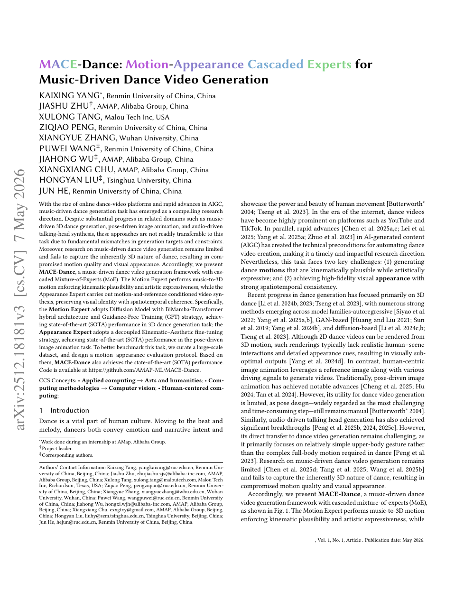

<!--
---
id: P0020
title_en: "MACE-Dance: Motion-Appearance Cascaded Experts for Music-Driven Dance Video Generation"
title_zh: "MACE-Dance：面向音乐驱动舞蹈视频生成的动作—外观级联专家"
year: 2025
date: 2025-12-20
venue: "arXiv preprint arXiv:2512.18181"
primary_category: motion-generation
tags: [dance-generation, music, video, diffusion, mixture-of-experts, physical-plausibility]
authors: [Kaixing Yang, Jiashu Zhu, Xulong Tang, Ziqiao Peng, Xiangyue Zhang, Puwei Wang, Jiahong Wu, Xiangxiang Chu, Hongyan Liu, Jun He]
institutions: [Renmin University of China, AMAP Alibaba Group, Malou Tech, Wuhan University, Tsinghua University]
paper_url: "https://arxiv.org/abs/2512.18181"
project_url: "https://macedance.github.io/"
github_url: null
video_url: null
open_source: {code: unknown, training_code: unknown, inference_code: unknown, model_weights: unknown, dataset: partial, robot_deployment: "no"}
open_source_checked: 2026-09-03
robots: []
inputs: [music, reference image]
outputs: [3D dance motion, dance video]
read_status: read
reproduce_status: not-started
local_materials: []
created: 2026-09-03
updated: 2026-09-03
---
-->

# P0020｜MACE-Dance：面向音乐驱动舞蹈视频生成的动作—外观级联专家

*MACE-Dance: Motion-Appearance Cascaded Experts for Music-Driven Dance Video Generation*

[论文](https://arxiv.org/abs/2512.18181) · [项目页](https://macedance.github.io/)

## 基本信息

<!-- AUTO-BASIC-INFO:START -->
> **作者**：Kaixing Yang、Jiashu Zhu、Xulong Tang、Ziqiao Peng、Xiangyue Zhang、Puwei Wang、Jiahong Wu、Xiangxiang Chu、Hongyan Liu、Jun He
>
> **机构**：Renmin University of China、AMAP Alibaba Group、Malou Tech、Wuhan University、Tsinghua University
>
> **论文时间**：2025-12-20
>
> **期刊 / 会议**：arXiv preprint arXiv:2512.18181
>
> **主分类**：动作生成
>
> **重点标签**：**舞蹈生成** · **音乐** · **视频** · **扩散模型** · **混合专家** · **物理合理性**
>
> **阅读状态**：已阅读　·　**复现状态**：未开始
<!-- AUTO-BASIC-INFO:END -->

## 本文贡献

- 将音乐到舞蹈视频拆成 Motion Expert 与 Appearance Expert：先生成三维身体运动，再按参考人物外观合成时序一致视频。
- Motion Expert 采用 BiMamba–Transformer 扩散骨干与 Guidance-Free Training，同时建模长时音乐结构、运动学合理性和表现力。
- Appearance Expert 使用运动学—美学解耦微调，并构建面向动作质量与视觉外观的联合数据/评测协议。

## 研究问题

音乐舞蹈动作生成、姿态驱动人物动画和最终舞蹈视频的目标不同：动作要踩点且符合人体运动学，视频还要保持身份、纹理和跨帧一致。直接端到端生成容易让外观损失掩盖动作错误，因此论文采用级联专家分工。

## 原论文重点图

**图 1：动作—外观级联流程（原论文 Figure 1 所在页）。** 音乐先进入 Motion Expert 得到 3D 舞蹈，随后与参考图共同驱动 Appearance Expert。中间 3D 表示既是可解释接口，也是两阶段误差传播点。

## 研究方法详细解读

### Motion Expert

BiMamba 分支以线性复杂度吸收较长音频/动作上下文，Transformer 分支补充全局交互；扩散头预测连续 3D 动作。Guidance-Free Training 把条件强度学习进模型，减少传统 CFG 的双前向推理开销。

### Appearance Expert

第二阶段把生成姿态转成参考人物视频。运动学微调关注姿态遵循与肢体结构，美学微调关注身份、纹理和画面质量；分开优化避免只追求锐利画面而忽略动作。

### 级联误差

Appearance Expert 只能渲染上游提供的姿态，Motion Expert 的脚滑、穿插和错误朝向会被视频放大。评估因此必须同时报告 3D motion 指标和视频时空/身份指标，不能用单一视觉分数替代。

## 实验结果与结论

论文报告两个专家在各自任务上达到强基线，并在联合 motion–appearance 协议下改善音乐舞蹈视频。结论说明级联可降低跨目标冲突，但并不代表 3D 动作适合机器人执行。

## 局限与复现提醒

- 两阶段推理带来累计误差和更高总延迟；视频身份保持也受参考图质量影响。
- 机器人研究主要可复用 Motion Expert，Appearance Expert 属于视频生成链。
- 当前代码/模型发布边界待核验，本知识库未运行。

## 阅读与复现状态

- 阅读：已阅读原论文摘要、方法页与飞书整理。
- 资源：项目页已核验，代码与模型待核验。
- 运行：未复现。

## 参考资料

- [arXiv](https://arxiv.org/abs/2512.18181)
- [项目页](https://macedance.github.io/)

## 更新记录

- 2026-09-03：补充正文基本信息卡，展示完整作者、机构、论文时间、期刊/会议、分类、标签与状态。
- 2026-09-03：新建条目，整理动作—外观级联、两类专家及联合评价边界。
