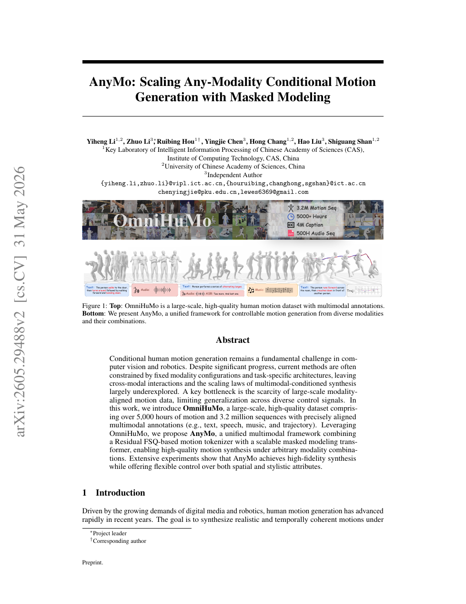

<!--
---
id: P0021
title_en: "AnyMo: Scaling Any-Modality Conditional Motion Generation with Masked Modeling"
title_zh: "AnyMo：通过掩码建模扩展任意模态条件动作生成"
year: 2026
date: 2026-05-28
venue: "arXiv preprint arXiv:2605.29488"
primary_category: motion-generation
tags: [motion-generation, multimodal, masked-modeling, transformer, large-scale-data, text, music, speech]
authors: [Yiheng Li, Zhuo Li, Ruibing Hou, Yingjie Chen, Hong Chang, Hao Liu, Shiguang Shan]
institutions: [Institute of Computing Technology CAS, University of Chinese Academy of Sciences]
paper_url: "https://arxiv.org/abs/2605.29488"
project_url: null
github_url: null
video_url: null
open_source: {code: unknown, training_code: unknown, inference_code: unknown, model_weights: unknown, dataset: unknown, robot_deployment: "no"}
open_source_checked: 2026-09-03
robots: []
inputs: [text, speech, music, trajectory, arbitrary modality combinations]
outputs: [human motion]
read_status: read
reproduce_status: not-started
local_materials: []
created: 2026-09-03
updated: 2026-09-03
---
-->

# P0021｜AnyMo：通过掩码建模扩展任意模态条件动作生成

*AnyMo: Scaling Any-Modality Conditional Motion Generation with Masked Modeling*

[论文](https://arxiv.org/abs/2605.29488)

## 基本信息

<!-- AUTO-BASIC-INFO:START -->
> **作者**：Yiheng Li、Zhuo Li、Ruibing Hou、Yingjie Chen、Hong Chang、Hao Liu、Shiguang Shan
>
> **机构**：Institute of Computing Technology CAS、University of Chinese Academy of Sciences
>
> **论文时间**：2026-05-28
>
> **期刊 / 会议**：arXiv preprint arXiv:2605.29488
>
> **主分类**：动作生成
>
> **重点标签**：**动作生成** · **多模态** · **掩码建模** · **Transformer** · **大规模数据** · **文本** · **音乐** · **语音**
>
> **阅读状态**：已阅读　·　**复现状态**：未开始
<!-- AUTO-BASIC-INFO:END -->

## 本文贡献

- 构建 OmniHuMo：超过 5000 小时、320 万动作序列和精确对齐的文本、语音、音乐、轨迹标注，用于研究多模态规模化。
- 使用 Residual FSQ 动作 tokenizer 与可扩展 Masked Modeling Transformer，把不同条件组合统一成补全动作 token 的任务。
- 通过随机条件/动作掩码让同一模型支持单模态、任意组合与空间—风格联合控制，并分析数据/模型扩展趋势。

## 研究问题

多模态动作模型常固定输入组合，换模态就要改网络；更根本的瓶颈是缺少大规模严格时间对齐数据。AnyMo 先建设 OmniHuMo，再把“有什么条件”转为掩码模式，避免按任务分别定义生成头。

## 原论文重点图

**图 1：OmniHuMo 数据规模与 AnyMo 统一掩码建模（原论文 Figure 1 所在页）。** 数据从海量视频提取人体、音频、说话人、文本和轨迹；模型把可见条件 token 与被遮动作 token 共同送入 Transformer，迭代恢复未知部分。

## 研究方法详细解读

### 总体流程：大规模自动标注、残差量化与并行补全

AnyMo 先用 OmniHuMo 流水线把海量网络视频变成对齐的人体动作、文本、音频和轨迹数据；然后单独训练 Residual-FSQ tokenizer，将连续动作压成多层离散码；最后用双向 masked Transformer 对文本、音频、轨迹和动作 token 做统一条件建模。训练时随机决定哪些模态可见、哪些动作位置被遮蔽，模型恢复缺失动作 token；推理时从全 mask 或部分已知动作开始迭代填充，再由 tokenizer 解码为连续人体运动。

### OmniHuMo 的视频处理链

原始池超过 2 亿视频，先做镜头切分和质量筛选，再用 YOLOv11 检测人物、MOTRv2 维持轨迹、RTMW 提取二维关键点、GVHMR 恢复世界坐标人体动作，并结合 DroidSLAM 与 UniDepth 补相机/深度线索。音频侧由 Demucs 分离声源，用三维说话人定位、SyncNet 和语音活动对齐“谁在说、何时在说”，Whisper/BAS 提供语音与词级时间；最后 Qwen3-VL 根据画面和动作生成描述。成品超过 5,000 小时、约 320 万片段，其中约 500 小时带音频条件。

### R-FSQ tokenizer 如何逐层编码动作

encoder 沿时间下采样连续姿态，每个 Residual-FSQ 层把当前残差限制到有界区间并逐维舍入为 `V+1` 个标量级别，再从残差中减去该层重建；多层输出相加形成最终 latent。与大向量码本最近邻不同，标量组合天然具有较高码利用率，早层表示粗动作，后层补剩余细节。decoder 用所有层 embedding 恢复动作，先通过重建/速度/运动学等目标训练到稳定，再冻结为生成模型的词表。

### 多模态条件如何进入共享空间

文本由 T5-XL 编码，音频由 WavTokenizer 提取，轨迹通过时序卷积投影；各自变成与动作 token 同宽的序列。R-FSQ 的多个残差 stream 在同一时间位置采用一致 mask，使模型不能从未遮蔽的细层直接抄出粗层；各层 embedding 相加后进入双向 LLaMA/Transformer，输出端为每个残差层配置独立 `V+1` 分类头。因而网络并行预测所有时间与量化层，而不是从左到右生成一条长串。

### 三阶段训练日程

Stage I 使用所有文本—动作数据训练 tokenizer 后的生成主干，音频和轨迹模块尚不更新，建立通用动作/语言先验；Stage II 冻结文本分支与 Transformer，只训练音频、轨迹编码器，使新条件对齐到已形成的动作空间；Stage III 解冻联合微调，每个 epoch 保留约 10% text-only 数据并纳入全部 audio 数据，防止新模态覆盖文本能力。训练中约 0.1 概率进行跨模态增强，并随机丢弃模态/遮蔽区间，形成任意组合输入。

### Mask-predict 推理和条件冲突

推理先固定用户给出的文本、音频、轨迹或局部动作，把未知动作位置设为 mask；Transformer 预测所有码的类别分布，按置信度先提交可靠 token，再依照调度重新遮蔽低置信位置，多轮后补齐全部序列。已知动作/轨迹可在每轮重新钳制，因此支持补全与编辑。不同条件矛盾时模型以训练分布做概率折中，没有显式硬约束求解；迭代次数、mask 比例与采样温度共同控制速度、多样性和约束遵循。

### 数据和机器人使用边界

自动链的任何误检都可能沿“人物跟踪—三维恢复—音频对齐—caption”传播，大规模不能替代抽样质量审核。AnyMo 输出人体动作，未直接训练机器人动力学控制；接入机器人还需确定骨架、FPS、根坐标与接触，再执行重定向、仿真筛选和跟踪。公开指标证明多模态生成能力，不证明每条动作在特定机器人上可执行。

## 实验结果与结论

论文报告任意模态组合下的动作质量、空间控制与风格一致性，并显示规模扩大带来稳定收益。该结论依赖 OmniHuMo 的自动标注与评测器，尚不能说明生成动作具备物理机器人可执行性。

## 局限与复现提醒

- 大规模互联网数据包含估计偏差、版权与分布不均问题；需区分原始视频、派生动作和可公开部分。
- tokenizer 的 FPS、骨架与归一化是模型接口，不能与其他动作库直接混用。
- 当前未核验完整数据/代码开放，本知识库未运行。

## 阅读与复现状态

- 阅读：已阅读原论文与飞书数据/方法整理。
- 资源：开源边界待核验。
- 运行：未进行数据构建或模型推理。

## 参考资料

- [arXiv](https://arxiv.org/abs/2605.29488)

## 更新记录

- 2026-09-03：依据原论文方法与训练章节，扩展总体流程、数据表征、模块信息流、训练目标、推理/部署及实现边界。
- 2026-09-03：补充正文基本信息卡，展示完整作者、机构、论文时间、期刊/会议、分类、标签与状态。
- 2026-09-03：新建条目，整理 OmniHuMo 自动管线、Residual FSQ 与任意模态掩码建模。
