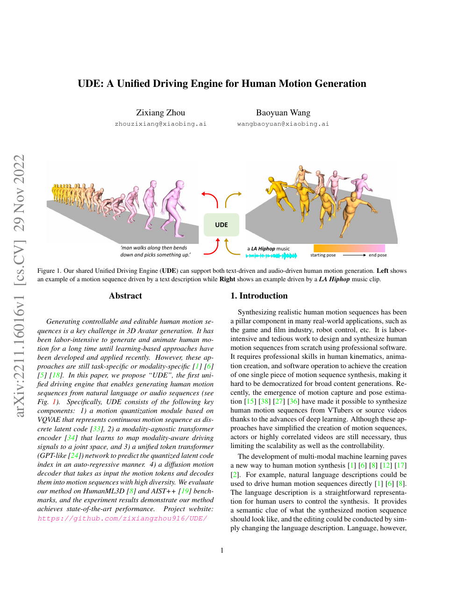

<!--
---
id: P0022
title_en: "UDE: A Unified Driving Engine for Human Motion Generation"
title_zh: "UDE：人体动作生成的统一驱动引擎"
year: 2022
date: 2022-11-29
venue: "CVPR 2023"
primary_category: motion-generation
tags: [motion-generation, multimodal, autoregressive, diffusion, transformer, text, music]
authors: [Zixiang Zhou, Baoyuan Wang]
institutions: [Xiaobing.AI]
paper_url: "https://arxiv.org/abs/2211.16016"
project_url: "https://github.com/zixiangzhou916/UDE"
github_url: "https://github.com/zixiangzhou916/UDE"
video_url: null
open_source: {code: full, training_code: full, inference_code: full, model_weights: partial, dataset: "no", robot_deployment: "no"}
open_source_checked: 2026-09-03
robots: []
inputs: [text, music]
outputs: [human motion]
read_status: read
reproduce_status: not-started
local_materials: []
created: 2026-09-03
updated: 2026-09-03
---
-->

# P0022｜UDE：人体动作生成的统一驱动引擎

*UDE: A Unified Driving Engine for Human Motion Generation*

[论文](https://arxiv.org/abs/2211.16016) · [官方代码](https://github.com/zixiangzhou916/UDE)

## 本文贡献

- 较早将文本到动作与音乐到舞蹈统一到一个驱动引擎，而不是为两种条件分别训练完整模型。
- 用 VQ-VAE 离散化连续动作，模态无关编码器把文本/音乐映射到共享条件空间，GPT 式 Transformer 自回归预测动作 token。
- 在 token 之后增加扩散动作解码器，以连续细化缓解单纯离散重建的动作僵硬与多样性不足。

## 研究问题

文本是片段级语义，音乐是逐帧节奏，二者统计结构不同。UDE 通过共享 token 生成目标统一输出空间，同时保留各自条件编码器；关键问题是共享能否迁移先验而不让强势模态压制另一模态。

## 原论文重点图

**图 1：UDE 双模态任务示例与统一引擎（原论文 Figure 1 所在页）。** 左侧文本控制动作语义，右侧音乐控制舞蹈节奏；二者经过各自编码后进入同一个动作 token 预测器和扩散解码器。

## 研究方法详细解读

### 动作量化

VQ-VAE 把连续姿态窗口映射到离散码本索引，建立可由语言模型预测的动作“词表”。码本大小、下采样率和 commitment loss 决定重建误差与序列长度，必须先单独验证 tokenizer。

### 条件对齐与自回归

文本/音乐编码器输出被投影到共享空间，统一 GPT 根据条件逐 token 预测动作。自回归便于变长生成，但训练—推理曝光偏差会造成长序列漂移；音乐节拍的高时间分辨率还需保留对齐信息。

### 扩散解码

离散 token 提供粗语义与动作结构，扩散 decoder 在连续空间恢复细节与多样性。它不是从纯噪声独立生成，而是受 token 强条件约束；因此 tokenizer 错误会形成上限。

## 实验结果与结论

论文在 HumanML3D 与 AIST++ 上分别评估文本动作和音乐舞蹈，并显示统一模型具有竞争力。UDE 奠定了“模态编码—共享动作 token—连续解码”的路线，但任务仍以人体运动学为主。

## 局限与复现提醒

- 文本与音乐数据并非同一配对数据，统一空间依赖跨数据集动作表示的一致化。
- 自回归 token 和扩散 decoder 形成两阶段误差链，需分开报告重建与生成误差。
- 未包含机器人动力学或控制闭环。

## 阅读与复现状态

- 阅读：已阅读论文与飞书方法整理。
- 代码：官方仓库已核验，未运行。
- 机器人：不适用直接部署。

## 参考资料

- [arXiv](https://arxiv.org/abs/2211.16016)
- [官方代码](https://github.com/zixiangzhou916/UDE)

## 更新记录

- 2026-09-03：新建条目，解析动作量化、统一 token 预测与扩散细化链路。
