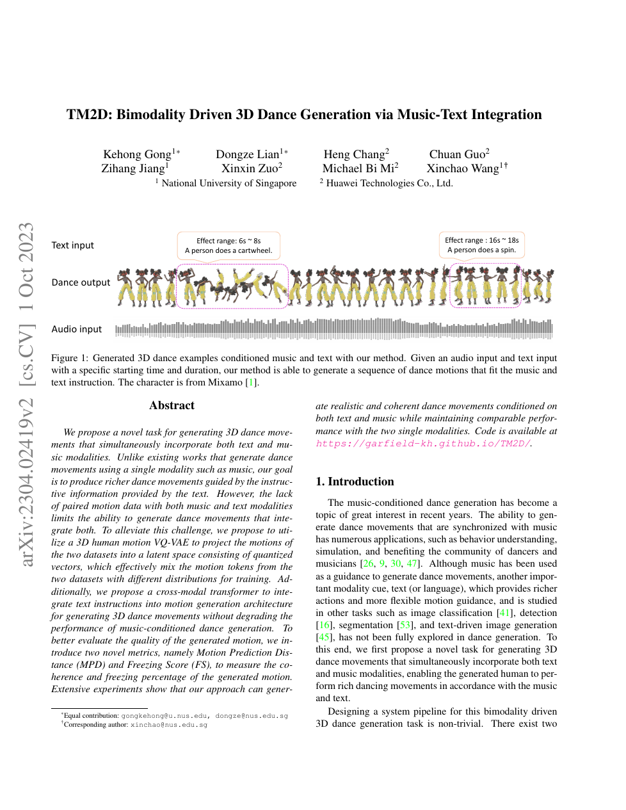

<!--
---
id: P0023
title_en: "TM2D: Bimodality Driven 3D Dance Generation via Music-Text Integration"
title_zh: "TM2D：通过音乐—文本融合进行双模态三维舞蹈生成"
year: 2023
date: 2023-04-05
venue: "ICCV 2023"
primary_category: motion-generation
tags: [dance-generation, music, text, multimodal, autoregressive, motion-prior]
authors: [Kehong Gong, Dongze Lian, Heng Chang, Chuan Guo, Zihang Jiang, Xinxin Zuo, Michael Bi Mi, Xinchao Wang]
institutions: [National University of Singapore, Huawei Technologies]
paper_url: "https://arxiv.org/abs/2304.02419"
project_url: "https://garfield-kh.github.io/TM2D/"
github_url: null
video_url: null
open_source: {code: partial, training_code: unknown, inference_code: partial, model_weights: unknown, dataset: "no", robot_deployment: "no"}
open_source_checked: 2026-09-03
robots: []
inputs: [music, timed text]
outputs: [3D dance motion]
read_status: read
reproduce_status: not-started
local_materials: []
created: 2026-09-03
updated: 2026-09-03
---
-->

# P0023｜TM2D：通过音乐—文本融合进行双模态三维舞蹈生成

*TM2D: Bimodality Driven 3D Dance Generation via Music-Text Integration*

[论文](https://arxiv.org/abs/2304.02419) · [项目页](https://garfield-kh.github.io/TM2D/)

## 基本信息

<!-- AUTO-BASIC-INFO:START -->
> **作者**：Kehong Gong、Dongze Lian、Heng Chang、Chuan Guo、Zihang Jiang、Xinxin Zuo、Michael Bi Mi、Xinchao Wang
>
> **机构**：National University of Singapore、Huawei Technologies
>
> **论文时间**：2023-04-05
>
> **期刊 / 会议**：ICCV 2023
>
> **主分类**：动作生成
>
> **重点标签**：**舞蹈生成** · **音乐** · **文本** · **多模态** · **自回归** · **运动先验**
>
> **阅读状态**：已阅读　·　**复现状态**：未开始
<!-- AUTO-BASIC-INFO:END -->

## 本文贡献

- 提出音乐 + 带起止时间文本的双模态舞蹈任务，让文本在指定区间注入“侧手翻/旋转”等语义，同时维持整段音乐节奏。
- 用共享 motion VQ-VAE 将来源分布不同的文本动作与音乐舞蹈数据投到同一离散空间，绕过缺少三模态成对数据的问题。
- 设计跨模态 Transformer 融合文本与音乐，并提出 MPD、Freezing Score 评价动作连续性和冻结比例。

## 研究问题

音乐决定节拍和整体风格，却难精确表达动作事件；文本能描述事件，但没有细粒度节奏。由于几乎不存在“音乐—文本—舞蹈”三元配对，TM2D 需要借共享动作 tokenizer 组合两个数据集的监督。

## 原论文重点图

**图 1：带时间区间的文本—音乐控制（原论文 Figure 1 所在页）。** 连续音乐覆盖全序列，文本只在指定 6–8 秒、16–18 秒区间生效；生成舞蹈既要保持节奏，又要在局部完成语义动作。

## 研究方法详细解读

### 共享动作码本

HumanML3D 与 AIST++ 的动作先统一骨架/表征，再由同一 VQ-VAE 编码。共享码本提供跨数据集桥梁，但若舞蹈和日常动作占用完全不同码区，所谓统一会退化为隐式分区。

### 音乐主干与文本注入

音乐特征按时间驱动 token 序列，文本编码附带有效区间，通过跨注意力只影响相应时段。训练可分别使用音乐—舞蹈和文本—动作样本；缺失模态的处理方式决定模型是否真正学习融合。

### 评价

MPD 度量预测动作与运动分布的距离，Freezing Score 统计长时间几乎不动的片段，补充 FID/节拍一致性无法识别的退化。评价器仍可能偏向训练骨架和速度阈值。

## 实验结果与结论

论文显示双模态模型能按时间插入文本动作，同时保持与单音乐方法相近的舞蹈质量。结论证明共享离散空间可缓解三元配对缺失，但复杂文本与快速节拍冲突仍有限。

## 局限与复现提醒

- 跨数据集统一的 FPS、骨架和 root 表示是关键前处理。
- 文本区间需用户显式给定，尚非自动从语言推断时间结构。
- 生成人体舞蹈不含物理可执行性约束。

## 阅读与复现状态

- 阅读：已阅读论文与飞书方法整理。
- 资源：项目页已核验，未运行代码。
- 机器人：未适配。

## 参考资料

- [arXiv](https://arxiv.org/abs/2304.02419)
- [项目页](https://garfield-kh.github.io/TM2D/)

## 更新记录

- 2026-09-03：补充正文基本信息卡，展示完整作者、机构、论文时间、期刊/会议、分类、标签与状态。
- 2026-09-03：新建条目，整理共享码本、时段文本控制和评价指标。
