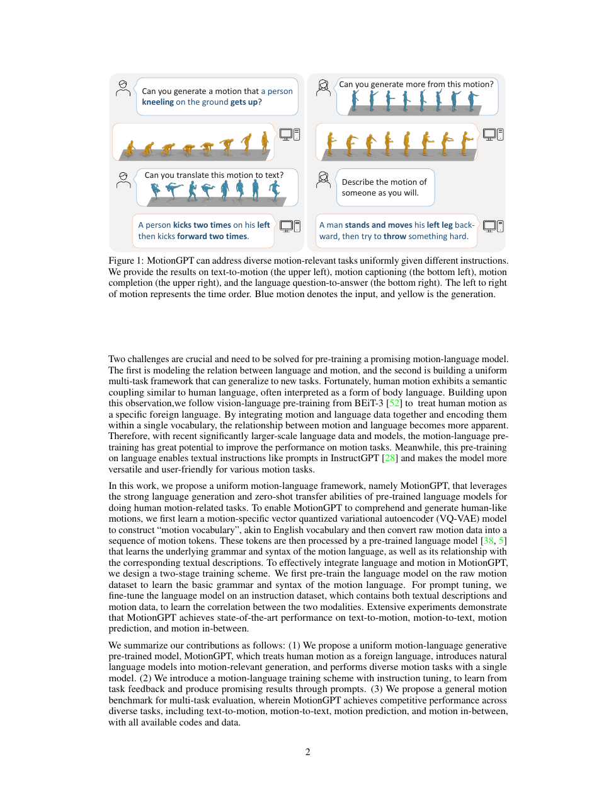

<!--
---
id: P0024
title_en: "MotionGPT: Human Motion as a Foreign Language"
title_zh: "MotionGPT：将人体动作视为一种外语"
year: 2023
date: 2023-06-26
venue: "NeurIPS 2023"
primary_category: motion-generation
tags: [motion-generation, transformer, autoregressive, text, motion-editing, human-motion]
authors: [Biao Jiang, Xin Chen, Wen Liu, Jingyi Yu, Gang Yu, Tao Chen]
institutions: [Fudan University, Tencent PCG, ShanghaiTech University]
paper_url: "https://arxiv.org/abs/2306.14795"
project_url: "https://motion-gpt.github.io/"
github_url: "https://github.com/OpenMotionLab/MotionGPT"
video_url: null
open_source: {code: full, training_code: full, inference_code: full, model_weights: full, dataset: "no", robot_deployment: "no"}
open_source_checked: 2026-09-03
robots: []
inputs: [text, motion tokens, task prompt]
outputs: [motion, text]
read_status: read
reproduce_status: not-started
local_materials: []
created: 2026-09-03
updated: 2026-09-03
---
-->

# P0024｜MotionGPT：将人体动作视为一种外语

*MotionGPT: Human Motion as a Foreign Language*

[论文](https://arxiv.org/abs/2306.14795) · [项目页](https://motion-gpt.github.io/) · [官方代码](https://github.com/OpenMotionLab/MotionGPT)

## 本文贡献

- 将连续三维动作经 VQ-VAE 转成离散“动作词”，与文本 token 一起交给 T5 式语言模型建模。
- 用混合 motion–language 预训练与提示式问答微调，统一文本生动作、动作描述、预测和插值等任务。
- 把自然语言设为任务和输出接口，使动作理解与生成能在同一序列到序列框架中互相促进。

## 研究问题

传统动作网络按任务设计头部，难复用语言模型的多任务能力。MotionGPT 的关键假设是离散动作 token 可被当作“外语”；挑战是 tokenizer 是否保留细节，以及语言模型的离散正确性如何转化为连续运动质量。

## 原论文重点图

**图 1：MotionGPT 的动作词汇与多任务框架（原论文 Figure 1 所在页）。** 动作 tokenizer 负责连续—离散转换，T5 接收由任务提示、文本和动作 token 组成的序列，再输出目标模态；同一骨干通过提示区分生成、描述、预测和插值。

## 研究方法详细解读

### 动作 tokenizer

VQ-VAE 将连续关节序列下采样到码本索引，decoder 重建动作。tokenizer 先独立训练，码本利用率和重建误差决定后续模型上限；离散化有利于接入 LLM，但会损失高频姿态与接触细节。

### Motion–Language 预训练

模型采用 T5 的编码器—解码器，将文本和扩展动作词表统一为 token 序列。预训练混合无条件动作、文本动作对和反向描述，使模型学习动作语法与跨模态对应。

### 提示式任务微调

各任务被写成自然语言指令和输入/输出占位符；预测、插值通过暴露部分动作 token 并要求补全实现。统一格式便于扩任务，但性能仍依赖每类指令和数据配比，不是纯零样本泛化。

## 实验结果与结论

论文在文本动作、动作描述、预测和插值等任务达到当时有竞争力结果，说明离散动作可被语言模型统一处理。连续动作质量仍受 VQ 重建限制，且没有机器人动力学闭环。

## 局限与复现提醒

- 必须先验证 tokenizer 的 FPS、关节顺序、归一化与码本利用率，再评价 LLM。
- 文本指标与动作 FID 使用不同评估器，不能混为“通用智能”。
- 机器人使用需重定向、物理筛选和跟踪控制。

## 阅读与复现状态

- 阅读：已阅读论文与飞书方法整理。
- 资源：官方代码/权重已核验，未运行。
- 机器人：未验证。

## 参考资料

- [arXiv](https://arxiv.org/abs/2306.14795)
- [官方代码](https://github.com/OpenMotionLab/MotionGPT)

## 更新记录

- 2026-09-03：新建条目，解析动作词表、T5 统一建模和提示式多任务训练。
