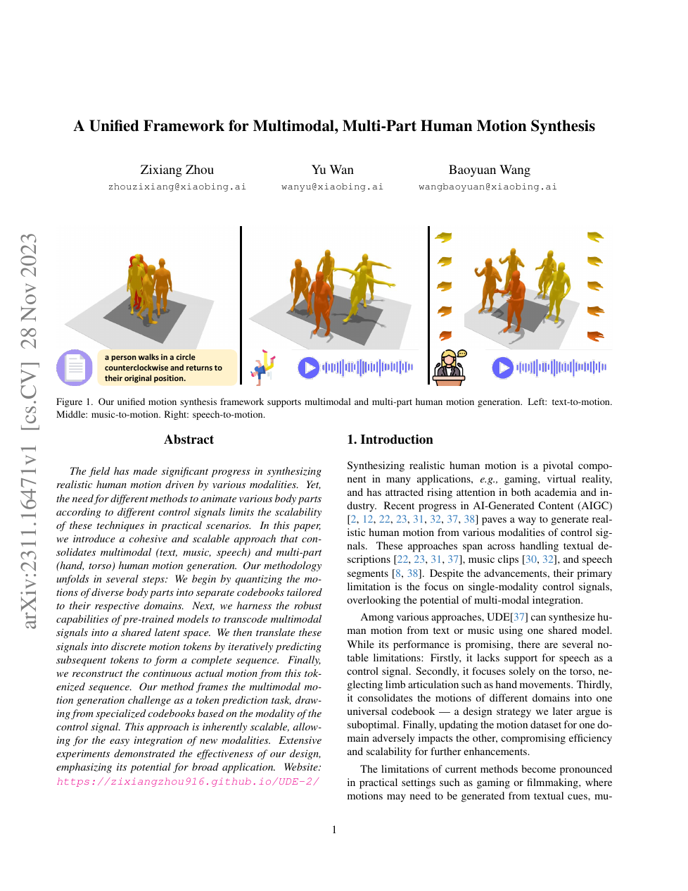

<!--
---
id: P0025
title_en: "A Unified Framework for Multimodal, Multi-Part Human Motion Synthesis"
title_zh: "UDE-2：多模态、多身体部位人体动作合成统一框架"
year: 2023
date: 2023-11-28
venue: "arXiv preprint arXiv:2311.16471"
primary_category: motion-generation
tags: [motion-generation, multimodal, autoregressive, transformer, text, music, speech]
authors: [Zixiang Zhou, Yu Wan, Baoyuan Wang]
institutions: [Xiaobing.AI]
paper_url: "https://arxiv.org/abs/2311.16471"
project_url: "https://zixiangzhou916.github.io/UDE-2/"
github_url: "https://github.com/zixiangzhou916/UDE-2"
video_url: null
open_source: {code: partial, training_code: "no", inference_code: partial, model_weights: full, dataset: "no", robot_deployment: "no"}
open_source_checked: 2026-09-03
robots: []
inputs: [text, music, speech, auxiliary conditions]
outputs: [torso motion, hand motion, full-body motion]
read_status: read
reproduce_status: not-started
local_materials: []
created: 2026-09-03
updated: 2026-09-03
---
-->

# P0025｜UDE-2：多模态、多身体部位人体动作合成统一框架

*A Unified Framework for Multimodal, Multi-Part Human Motion Synthesis*

[论文](https://arxiv.org/abs/2311.16471) · [项目页](https://zixiangzhou916.github.io/UDE-2/) · [官方代码](https://github.com/zixiangzhou916/UDE-2)

## 基本信息

<!-- AUTO-BASIC-INFO:START -->
> **作者**：Zixiang Zhou、Yu Wan、Baoyuan Wang
>
> **机构**：Xiaobing.AI
>
> **论文时间**：2023-11-28
>
> **期刊 / 会议**：arXiv preprint arXiv:2311.16471
>
> **主分类**：动作生成
>
> **重点标签**：**动作生成** · **多模态** · **自回归** · **Transformer** · **文本** · **音乐** · **语音**
>
> **阅读状态**：已阅读　·　**复现状态**：未开始
<!-- AUTO-BASIC-INFO:END -->

## 本文贡献

- 将 UDE 从文本/音乐驱动身体扩展到文本、音乐、语音三模态和躯干、手部等多身体部位。
- 为不同身体部位分别学习离散码本，并设计分层 torso VQ-VAE，将局部姿态解码、全局轨迹估计和全局细化拆成两阶段。
- 以 CLIP、MTR、HuBERT 编码条件，统一预测部位专用动作 token，并用语义增强和语义感知采样平衡一致性与多样性。

## 研究问题

全身动作各部位频率和条件不同：语音强约束上身/手势，音乐约束整体节奏，文本提供片段语义。单一码本容易让大幅躯干动作淹没手部细节，完全分开又难保持协调。UDE-2 通过部位码本和共享条件到 token 框架折中。

## 原论文重点图

**图 1：UDE-2 支持文本、音乐和语音驱动不同身体部位（原论文 Figure 1 所在页）。** 条件先进入预训练模态编码器，再由统一序列模型选择对应部位码本，最后分层重建连续全身动作。

## 研究方法详细解读

### 部位专用量化

手部与躯干分别量化，避免共享码本按能量偏向大关节。躯干编码相对轨迹，第一阶段解局部姿态并估计粗全局运动，第二阶段细化全局位置；权重重初始化用来提高不活跃 token 的利用率。

### 条件到动作 token

CLIP、MTR、HuBERT 分别提供文本、音乐、语音语义，encoder–decoder Transformer 自回归预测目标部位 token。辅助条件作为可学习 embedding 注入，使同一模态能控制不同部位/任务。

### 语义增强与采样

语义增强模块拉近条件和动作表示；语义感知采样在高一致性 token 与多样候选之间调节。该过程仍受预训练条件编码器域偏移影响，尤其是语音语言和音乐风格。

## 实验结果与结论

论文在文本动作、音乐舞蹈与语音手势数据上验证统一生成。公开仓库提供 demo 与预训练权重，但 TODO 明确训练/评估代码未发布，因此只能称部分开源。

## 局限与复现提醒

- 分部位码本需要显式同步，否则手势与躯干可能相位不一致。
- 公开实现缺完整训练与评测脚本，无法仅凭 demo 复现论文表格。
- 不含机器人动力学或接触控制。

## 阅读与复现状态

- 阅读：已阅读论文、项目页和飞书方法整理。
- 资源：demo/权重可得，训练评估代码未发布。
- 运行：未执行 demo。

## 参考资料

- [arXiv](https://arxiv.org/abs/2311.16471)
- [项目页](https://zixiangzhou916.github.io/UDE-2/)
- [官方代码](https://github.com/zixiangzhou916/UDE-2)

## 更新记录

- 2026-09-03：补充正文基本信息卡，展示完整作者、机构、论文时间、期刊/会议、分类、标签与状态。
- 2026-09-03：新建条目，整理分部位量化、三模态编码与公开资源边界。
