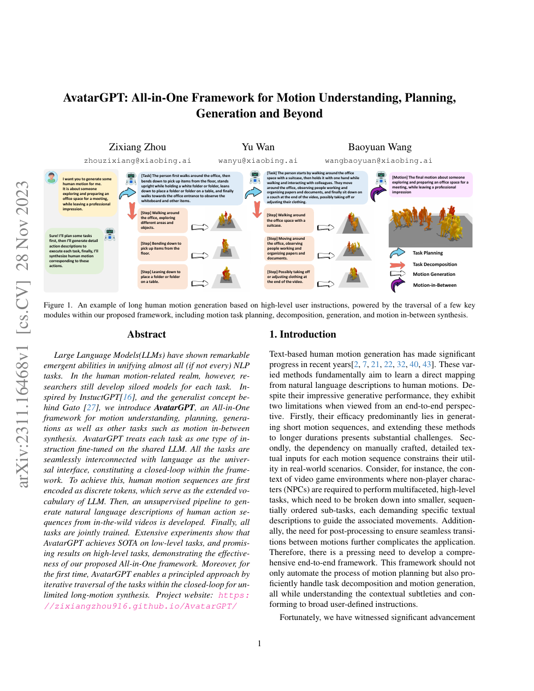

<!--
---
id: P0026
title_en: "AvatarGPT: All-in-One Framework for Motion Understanding, Planning, Generation and Beyond"
title_zh: "AvatarGPT：动作理解、规划、生成及更多任务的一体化框架"
year: 2023
date: 2023-11-28
venue: "CVPR 2024"
primary_category: world-model-vla-agent
tags: [motion-generation, autoregressive, transformer, text, motion-editing, human-motion]
authors: [Zixiang Zhou, Yu Wan, Baoyuan Wang]
institutions: [Xiaobing.AI]
paper_url: "https://arxiv.org/abs/2311.16468"
project_url: null
github_url: null
video_url: null
open_source: {code: unknown, training_code: unknown, inference_code: unknown, model_weights: unknown, dataset: unknown, robot_deployment: "no"}
open_source_checked: 2026-09-03
robots: []
inputs: [instructions, text, motion tokens]
outputs: [motion, captions, task plans]
read_status: read
reproduce_status: not-started
local_materials: []
created: 2026-09-03
updated: 2026-09-03
---
-->

# P0026｜AvatarGPT：动作理解、规划、生成及更多任务的一体化框架

*AvatarGPT: All-in-One Framework for Motion Understanding, Planning, Generation and Beyond*

[论文](https://arxiv.org/abs/2311.16468)

## 基本信息

<!-- AUTO-BASIC-INFO:START -->
> **作者**：Zixiang Zhou、Yu Wan、Baoyuan Wang
>
> **机构**：Xiaobing.AI
>
> **论文时间**：2023-11-28
>
> **期刊 / 会议**：CVPR 2024
>
> **主分类**：世界模型 / VLA / Agent
>
> **重点标签**：**动作生成** · **自回归** · **Transformer** · **文本** · **动作编辑** · **人体动作**
>
> **阅读状态**：已阅读　·　**复现状态**：未开始
<!-- AUTO-BASIC-INFO:END -->

## 本文贡献

- 将动作理解、文本生动作、动作补全与高层任务规划统一成共享 LLM 上的指令任务。
- 把人体动作量化为扩展词表 token，用自然语言作为高低层任务之间的公共接口，形成“规划—生成—描述”的闭环。
- 从野外视频自动生成动作—语言数据，缓解高层规划描述与低层动作对缺乏的问题，并通过迭代任务遍历生成长动作。

## 研究问题

动作系统通常把规划、生成、描述拆开，接口是不可读 latent；这使多轮修正和长任务组合困难。AvatarGPT 将动作 token 接入 LLM，但必须同时处理高层文本逻辑和低层连续动作精度之间的尺度差异。

## 原论文重点图

**图 1：AvatarGPT 从任务描述到步骤、动作和反馈的闭环（原论文 Figure 1 所在页）。** LLM 先把长任务拆成步骤，再为步骤产生动作 token；动作也可反向描述为文本，使多轮对话在语言上下文中保持状态。

## 研究方法详细解读

### 总体流程：用语言连接规划、理解与动作生成

AvatarGPT 由动作 tokenizer、多模态 T5 式 LLM 和自动视频标注管线组成。连续人体动作先量化为离散 embedding，经轻量 adapter 映射到 LLM hidden space；文本走原 tokenizer。模型把文本生动作、动作描述、预测、插值、任务分解和场景估计都改写为“条件序列 → 目标序列”，根据目标模态选择文本 head 或动作 head 自回归生成。高层任务输出的步骤文本可再次作为低层动作条件，动作结果也能反向描述，由此形成规划—生成—理解循环。

### VQ 动作 tokenizer 与词表 adapter

动作 encoder 将 `T×c` 连续序列压成 `Tq×d` latent，最近邻量化为码本 embedding，decoder 重建原动作；训练使用重建、embedding 和 commitment 三项损失。与直接复用文本 token 或从零训练巨大扩展 embedding 不同，AvatarGPT 保留动作码本本身的语义，再学习 `d→D` adapter 把码本向量投到 LLM hidden 维度。这样既不污染原文字词含义，也能用有限动作数据快速对齐，但 VQ 重建误差仍是最终接触与细节的硬上限。

### 文本 head 与动作 head 为什么分开

LLM hidden state 同时可能预测文字或动作。原 head 只映射到文本词表 `Vt`，新增 motion head 映射到动作词表 `Vm`；任务模板决定使用哪个 head。若共用一个拼接大 head，生成动作时可能采到无法由动作 decoder 解码的文字 token，反之亦然；分 head 把有效采样域写进结构。输入侧仍共享 Transformer，因此文本语义、动作序列和高层推理可在 hidden space 交互。

### 指令建模与训练目标

条件 `C` 和目标 `X` 都可为文本或动作：encoder 对条件做全注意力，causal decoder 依据 `C` 与已生成前缀预测下一个 token。文本目标和动作目标分别计算交叉熵，更新共享 LLM、adapter 及对应输出 head；动作 tokenizer 先独立训练再作为稳定接口。不同任务通过 instruction、input、response 模板统一，数据配比决定模型是否兼顾低层动作精度和高层文本逻辑，而不是由架构自动保证均衡。

### 自动视频标注的多粒度链

野外视频先切成固定长度片段，Visual-LLM 生成包含人物、动作和环境的详细描述；ChatGPT 再把每段整理成短的逐步动作描述，汇总为 task description，并把多个任务描述进一步概括为整段 scene description。于是同一视频产生 scene—task—step 三个粒度的监督，用于场景估计、任务总结/分解和长动作生成。自动标注扩大覆盖，但视觉误识别和语言概括误差会逐层传播，不能当作人工动作真值。

### 推理闭环与长动作形成

给定场景或任务，LLM 先输出步骤列表；每个步骤再作为 motion head 条件生成动作 token，VQ decoder 还原连续片段。也可从动作出发生成描述，再依据后续指令编辑或插值。长动作来自多轮任务遍历和片段拼接，而非一次注意力覆盖无限帧；上下文能维持语义顺序，但根位置、朝向、速度和足接触的段间连续仍受 tokenizer 与拼接策略限制。

### 适用边界

框架中的 planning 是语言层任务分解，scene estimation 是文本描述生成，并没有闭环环境感知、碰撞检查或物理执行反馈。输出为人体动作，接入机器人仍要重定向、可执行性筛选和低层跟踪。复现应分开评价动作 tokenizer、低层任务、高层文本逻辑与全流程长序列，不能用某一层的好结果替代其他层。

## 实验结果与结论

AvatarGPT 在多项低层动作任务取得强结果，并首次系统展示动作规划与多轮组合。高层规划主要为生成式演示，不等同于具备环境感知和物理反馈的机器人 Agent。

## 局限与复现提醒

- 动作 token 的离散误差和段间拼接漂移会随长时生成累积。
- 自动视频标注可能含语义/时序噪声；规划正确也不保证动作可执行。
- 公开代码/权重状态需进一步核验，本知识库未运行。

## 阅读与复现状态

- 阅读：已阅读论文与飞书整理。
- 资源：开源状态待核验。
- 运行：未复现。

## 参考资料

- [arXiv](https://arxiv.org/abs/2311.16468)

## 更新记录

- 2026-09-03：依据原论文方法与训练章节，扩展总体流程、数据表征、模块信息流、训练目标、推理/部署及实现边界。
- 2026-09-03：补充正文基本信息卡，展示完整作者、机构、论文时间、期刊/会议、分类、标签与状态。
- 2026-09-03：新建条目，解析动作扩展词表、指令多任务和长动作闭环。
