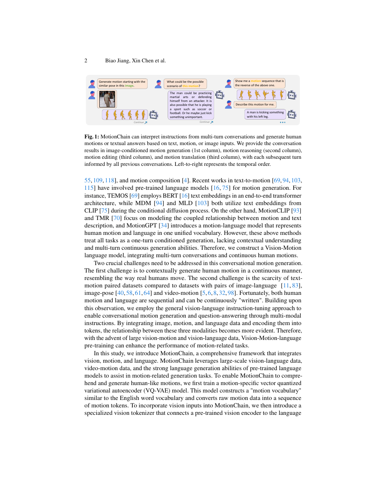

<!--
---
id: P0027
title_en: "MotionChain: Conversational Motion Controllers via Multimodal Prompts"
title_zh: "MotionChain：通过多模态提示实现对话式动作控制"
year: 2024
date: 2024-04-02
venue: "ECCV 2024"
primary_category: motion-generation
tags: [motion-generation, multimodal, transformer, text, image, motion-editing, autoregressive]
authors: [Biao Jiang, Xin Chen, Chi Zhang, Fukun Yin, Zhuoyuan Li, Gang Yu, Jiayuan Fan]
institutions: [Fudan University, Tencent]
paper_url: "https://arxiv.org/abs/2404.01700"
project_url: null
github_url: "https://github.com/OpenMotionLab/MotionChain"
video_url: null
open_source: {code: full, training_code: full, inference_code: full, model_weights: partial, dataset: partial, robot_deployment: "no"}
open_source_checked: 2026-09-03
robots: []
inputs: [text, image, motion, multi-turn history]
outputs: [continuous human motion]
read_status: read
reproduce_status: not-started
local_materials: []
created: 2026-09-03
updated: 2026-09-03
---
-->

# P0027｜MotionChain：通过多模态提示实现对话式动作控制

*MotionChain: Conversational Motion Controllers via Multimodal Prompts*

[论文](https://arxiv.org/abs/2404.01700) · [官方代码](https://github.com/OpenMotionLab/MotionChain)

## 本文贡献

- 将文本、图像和动作转为多模态 token，引入 Vision-Motion-aware Language Model 处理多轮动作生成与编辑。
- 利用语言、视觉—语言和视觉—动作数据联合训练，使用户可逐轮追加、修改或引用既有动作上下文。
- 以对话历史维持长任务语义，并将多个局部动作指令串成连续长动作控制链。

## 研究问题

单轮 text-to-motion 很难表达“保持上一步风格，再抬左手、最后坐下”这类增量编辑。MotionChain 将历史、图像和动作统一进对话上下文；难点是不同 tokenizer 的时间/语义尺度与段间连续性。

## 原论文重点图

**图 1：多模态 token 与对话式动作控制（原论文 Figure 1 所在页）。** 文本/图像/动作分别编码后进入共享语言模型，输出动作 token；下一轮继续读取已有上下文，使动作可以被引用、扩展和修改。

## 研究方法详细解读

### 多模态 token 化

动作经 VQ tokenizer 离散化，图像经视觉编码器/离散投影，文本使用语言词表。统一序列能复用 next-token 训练，但不同 token 的采样率和长度差异会造成上下文预算不均。

### Vision-Motion-aware LLM

模型通过大规模语言和视觉语言数据保留通用对话，再用视觉动作/文本动作对学习跨模态对应。训练需明确哪些参数冻结、哪些 adapter 更新，否则容易灾难性遗忘已有语言能力。

### 多轮连续生成

每轮输出既是最终动作，也是下一轮上下文；连接时需要对根位置、朝向与速度对齐。语言上的“连续”不保证运动学无缝，必要时仍需过渡/插值或物理修正。

## 实验结果与结论

论文在对话式动作生成和多模态控制上报告强结果，并展示更自然的逐步交互。主要指标仍在人体动作域，未验证真实环境规划或机器人闭环。

## 局限与复现提醒

- 多轮历史迅速消耗上下文，动作 token 压缩率和截断策略决定可用长度。
- 图像理解错误会通过语言模型传入动作；段间连续性需单独评测。
- 机器人应用需增加重定向、接触与低层控制。

## 阅读与复现状态

- 阅读：已阅读论文与飞书整理。
- 资源：官方代码入口已核验，未运行。
- 机器人：未验证。

## 参考资料

- [arXiv](https://arxiv.org/abs/2404.01700)
- [官方代码](https://github.com/OpenMotionLab/MotionChain)

## 更新记录

- 2026-09-03：新建条目，整理多模态 token、对话上下文与连续动作拼接问题。
