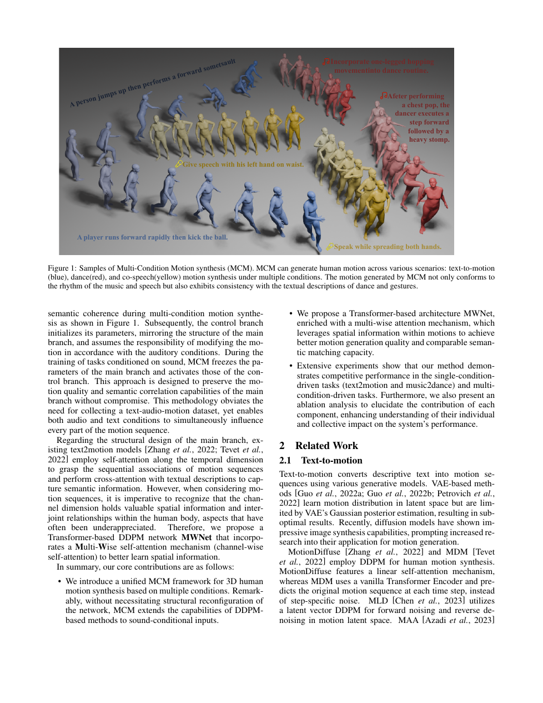

<!--
---
id: P0028
title_en: "MCM: Multi-condition Motion Synthesis Framework"
title_zh: "MCM：多条件动作合成框架"
year: 2024
date: 2024-04-19
venue: "IJCAI 2024"
primary_category: motion-generation
tags: [motion-generation, multimodal, diffusion, transformer, text, audio, mixture-of-experts]
authors: [Zeyu Ling, Bo Han, Yongkang Wongkan, Han Lin, Mohan Kankanhalli, Weidong Geng]
institutions: [Zhejiang University, National University of Singapore]
paper_url: "https://arxiv.org/abs/2404.12886"
project_url: null
github_url: null
video_url: null
open_source: {code: unknown, training_code: unknown, inference_code: unknown, model_weights: unknown, dataset: "no", robot_deployment: "no"}
open_source_checked: 2026-09-03
robots: []
inputs: [text, music, speech]
outputs: [human motion]
read_status: read
reproduce_status: not-started
local_materials: []
created: 2026-09-03
updated: 2026-09-03
---
-->

# P0028｜MCM：多条件动作合成框架

*MCM: Multi-condition Motion Synthesis Framework*

[论文](https://arxiv.org/abs/2404.12886)

## 本文贡献

- 提出主分支 + 控制分支的双分支扩散框架，将已训练文本动作模型扩展到音乐、语音与多条件输入。
- 控制分支复制主分支结构和权重，并通过零初始化连接注入新条件，尽量保留主模型已有文本生成能力。
- 设计 MWNet 与 multi-wise attention，同时在时间、关节/通道等维度建模动作相关性，可作为 DDPM 类主干。

## 研究问题

不同模态条件粒度差异明显：文本全局、音频逐帧；直接联合训练可能破坏已有单模态能力。MCM 借鉴 ControlNet 思路，将新模态适配隔离到控制分支，再逐层影响冻结/稳定主分支。

## 原论文重点图

**图 1：MCM 主分支—控制分支方法（原论文 Figure 1 所在页）。** 主分支保留原文本扩散能力，控制分支读取音频或其他条件；多层零卷积/零映射把控制残差注入主干，使初始模型行为不被突然破坏。

## 研究方法详细解读

### MWNet 主干

MWNet 将动作视为关节、通道和时间组成的结构张量，通过多维自注意力分别捕捉时序和身体相关性，再在扩散 timestep 条件下预测噪声/动作。该结构比扁平 token 更显式利用骨架拓扑。

### 控制分支适配

控制分支从主分支复制参数，接收音乐或语音特征；零初始化连接开始时输出近零，训练后逐层学习条件残差。它降低灾难性遗忘，但参数/计算近似增加一套主干。

### 单条件与混合条件

相同框架可在文本动作、音乐舞蹈和语音手势间复用，也可同时输入多个条件。条件冲突时模型仍是软折中，没有显式优先级或可满足性求解。

## 实验结果与结论

论文在文本动作上达到强结果，在音乐舞蹈和语音手势上具有竞争力，并展示多条件控制。贡献主要在可插拔条件适配，而非新的机器人控制算法。

## 局限与复现提醒

- 双分支提高显存和推理成本；“保留能力”需用旧任务回归测试验证。
- 音频 FPS、特征窗口与动作帧对齐是核心接口。
- 生成结果未经过机器人动力学验证。

## 阅读与复现状态

- 阅读：已阅读论文与飞书方法整理。
- 资源：代码/权重开源状态待核验。
- 运行：未复现。

## 参考资料

- [arXiv](https://arxiv.org/abs/2404.12886)

## 更新记录

- 2026-09-03：新建条目，解析双分支条件适配、零初始化和 MWNet。
