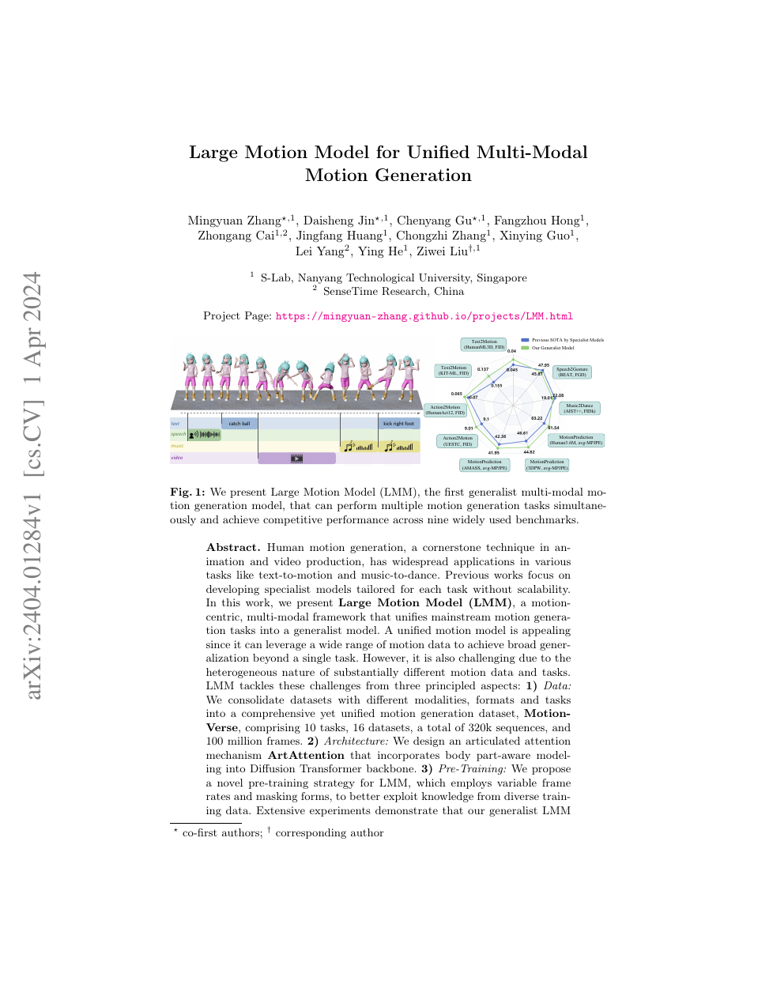

<!--
---
id: P0029
title_en: "Large Motion Model for Unified Multi-Modal Motion Generation"
title_zh: "LMM：用于统一多模态动作生成的大动作模型"
year: 2024
date: 2024-04-01
venue: "ECCV 2024"
primary_category: motion-generation
tags: [motion-generation, multimodal, diffusion, transformer, large-scale-data, human-motion]
authors: [Mingyuan Zhang, Daisheng Jin, Chenyang Gu, Fangzhou Hong, Zhongang Cai, Jingfang Huang, Chongzhi Zhang, Xinying Guo, Lei Yang, Ying He, Ziwei Liu]
institutions: [S-Lab Nanyang Technological University, SenseTime Research]
paper_url: "https://arxiv.org/abs/2404.01284"
project_url: "https://mingyuan-zhang.github.io/projects/LMM.html"
github_url: null
video_url: null
open_source: {code: unknown, training_code: unknown, inference_code: unknown, model_weights: unknown, dataset: partial, robot_deployment: "no"}
open_source_checked: 2026-09-03
robots: []
inputs: [text, music, speech, motion constraints]
outputs: [human motion]
read_status: read
reproduce_status: not-started
local_materials: []
created: 2026-09-03
updated: 2026-09-03
---
-->

# P0029｜LMM：用于统一多模态动作生成的大动作模型

*Large Motion Model for Unified Multi-Modal Motion Generation*

[论文](https://arxiv.org/abs/2404.01284) · [项目页](https://mingyuan-zhang.github.io/projects/LMM.html)

## 基本信息

<!-- AUTO-BASIC-INFO:START -->
> **作者**：Mingyuan Zhang、Daisheng Jin、Chenyang Gu、Fangzhou Hong、Zhongang Cai、Jingfang Huang、Chongzhi Zhang、Xinying Guo、Lei Yang、Ying He、Ziwei Liu
>
> **机构**：S-Lab Nanyang Technological University、SenseTime Research
>
> **论文时间**：2024-04-01
>
> **期刊 / 会议**：ECCV 2024
>
> **主分类**：动作生成
>
> **重点标签**：**动作生成** · **多模态** · **扩散模型** · **Transformer** · **大规模数据** · **人体动作**
>
> **阅读状态**：已阅读　·　**复现状态**：未开始
<!-- AUTO-BASIC-INFO:END -->

## 本文贡献

- 构建 MotionVerse：统一 16 个数据集、10 类任务、约 32 万序列和 1 亿帧，建立多模态动作预训练底座。
- 在 Diffusion Transformer 中提出 ArtAttention，将身体划为 10 个区域并显式建模部位内与部位间关系。
- 采用可变 FPS 与多种掩码的预训练策略吸收异构数据，使单一 generalist 在已见任务上接近专家，并对未见条件组合出现迁移能力。

## 研究问题

不同动作数据集使用不同骨架、FPS、任务和条件，简单混合会使模型学习到数据源标识而非通用动作规律。LMM 从数据、骨架结构注意力和预训练采样三方面统一异构性。

## 原论文重点图

**图 1：MotionVerse 与通用 LMM（原论文 Figure 1 所在页）。** 多个文本、音乐、语音、姿态任务统一到动作条件生成；ArtAttention 在同一 DiT 内按身体区域组织 token，使共享模型仍保留人体拓扑归纳偏置。

## 研究方法详细解读

### 总体流程：统一数据、无条件预训练、条件微调

LMM 先用 MotionVerse 将不同骨架、FPS 和文本/语音/音乐/视频条件整理成统一 `<动作、可见 mask、条件、数据集名>`；Stage 1 忽略条件，对动作随机降采样并遮蔽身体/时间位置，训练扩散模型恢复干净动作，吸收跨数据集运动先验；Stage 2 加入 ImageBind 条件 token，随机丢条件后监督同一主干学习十类任务。推理将可见动作与噪声动作按 mask 合并，给定任意支持条件，反向扩散生成缺失部分，再由 dataset translator 转回目标基准格式。

### MotionVerse 的任务与表示统一

十类任务包括 action/text/music/speech 到动作、动作预测、插值、模仿及多条件变体，差异只由条件集合 `c` 和可见矩阵 `m∈{0,1}^{F×D}` 定义。每帧统一表示包含根偏航/平面速度/高度、局部关节位置/速度/6D 旋转和面部量，再拆成全局轨迹、脸、头、脊柱、左右臂腿和左右手十个 part。原数据缺失部位记入 source mask，不在损失中伪造监督；输出可经独立 translator 映射回各评测格式。

### Dataset-dependent Read-In/Read-Out

带噪动作经 Read-In 变成 `F×H×D`，其中 `H=10` 个身体区域；Read-Out 从共享 feature 恢复连续动作。虽然中间表示统一，不同数据集的捕捉与统计分布仍有差异，所以入口/出口按 dataset name 选择；训练又以 10% 概率把名字换成 `all`，学习可用于未知实际输入的公共映射。该设计把数据域差异限制在边缘，共享主干专注动作知识。

### ArtAttention 的空间与时间两条支路

空间支路对每帧十个 body part 做注意力，利用 source mask 动态决定哪些部位能互相提供信息，不能使用固定混合系数。时间支路先用 MoE 从 ImageBind 的文本、语音、音乐、视频序列提取条件 `K/V`，并加入 64 个可学习无条件 token；运动 self-correlation 与各条件分别归一化，避免很长的音频/视频 token 淹没动作。每个身体部位作为独立 head 沿真实时间注意，最后把空间输出 `Ys` 与时间输出 `Yt` 相加。

### 无监督预训练中的随机 FPS 与 mask

Stage 1 对所有 MotionVerse 动作随机降采样；位置/旋转等状态保持取样值，速度则按新时间间隔重新计算，不能直接抽帧后沿用旧速度。原数据缺失形成 `Ms`，训练额外采样 `Mt` 并以 learnable empty token 替换被遮蔽 part；损失只忽略原本无真值的 `Ms`，人工 mask 的位置必须恢复。模型因此同时学会不同帧率的运动先验、跨部位补全和时间预测。

### 有条件微调与优化规模

Stage 2 将 ImageBind 后的各模态序列经两层 Transformer 精炼，作为 ArtAttention 条件，扩散网络恢复目标动作；约 10% 概率清空条件用于 classifier-free guidance。Tiny/Small/Base/Large 约为 90M/160M/410M/760M，全部使用 MotionVerse（排除评测片段），总 batch 固定 512，通过 FP16 与梯度累积匹配规模。两阶段分别学习“什么动作合理”和“条件如何选择动作”，避免大而噪的条件数据从头拖累基础先验。

### 推理、任务切换与边界

预测/插值时把已知帧写入 `x` 并在每步按 mask 钳制，纯生成时动作初始为噪声；条件可以是单一或多模态，真实时间编码允许不同 FPS。网络输出统一人体表示，再由 translator 对接基准。区域划分和 ImageBind 带来人工/预训练先验，条件冲突仍是概率融合；模型不含机器人重定向和控制，人体任务统一不等于机器人动力学统一。

## 实验结果与结论

LMM 在多项标准任务上与专用模型竞争，并展示未见任务/条件的 emergent transfer；消融支持数据、ArtAttention 和预训练策略均有贡献。结果不代表所有任务都超过专家，也不含机器人动力学。

## 局限与复现提醒

- MotionVerse 的 16 数据集许可、预处理和采样权重需分别追踪。
- 可变 FPS 必须保持速度/接触定义一致，否则只是改变数值尺度。
- 统一人体动作输出仍需机器人重定向与跟踪。

## 阅读与复现状态

- 阅读：已阅读论文与飞书方法整理。
- 资源：项目页已核验，完整代码/数据边界待核验。
- 运行：未复现。

## 参考资料

- [arXiv](https://arxiv.org/abs/2404.01284)
- [项目页](https://mingyuan-zhang.github.io/projects/LMM.html)

## 更新记录

- 2026-09-03：依据原论文方法与训练章节，扩展总体流程、数据表征、模块信息流、训练目标、推理/部署及实现边界。
- 2026-09-03：补充正文基本信息卡，展示完整作者、机构、论文时间、期刊/会议、分类、标签与状态。
- 2026-09-03：新建条目，整理 MotionVerse、ArtAttention 与多任务预训练策略。
