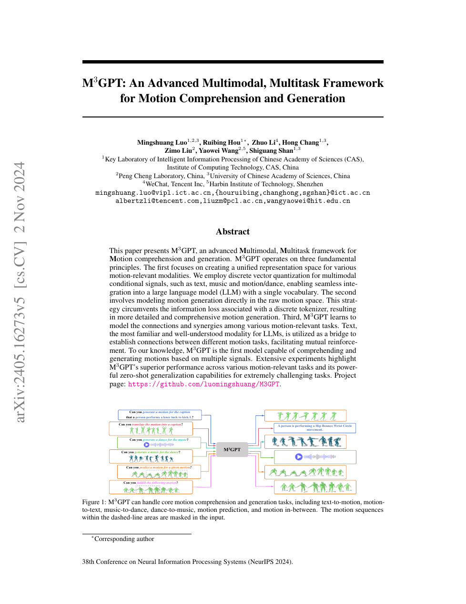

<!--
---
id: P0030
title_en: "M3GPT: An Advanced Multimodal, Multitask Framework for Motion Comprehension and Generation"
title_zh: "M³GPT：用于动作理解与生成的高级多模态多任务框架"
year: 2024
date: 2024-05-25
venue: "NeurIPS 2024"
primary_category: motion-generation
tags: [motion-generation, multimodal, autoregressive, transformer, text, music, human-motion]
authors: [Mingshuang Luo, Ruibing Hou, Zhuo Li, Hong Chang, Zimo Liu, Yaowei Wang, Shiguang Shan]
institutions: [Institute of Computing Technology CAS, Peng Cheng Laboratory, University of Chinese Academy of Sciences, WeChat Tencent, Harbin Institute of Technology Shenzhen]
paper_url: "https://arxiv.org/abs/2405.16273"
project_url: "https://luomingshuang.github.io/M3GPT/"
github_url: "https://github.com/luomingshuang/M3GPT"
video_url: null
open_source: {code: full, training_code: full, inference_code: full, model_weights: partial, dataset: "no", robot_deployment: "no"}
open_source_checked: 2026-09-03
robots: []
inputs: [text, music, motion]
outputs: [text, music, motion]
read_status: read
reproduce_status: not-started
local_materials: []
created: 2026-09-03
updated: 2026-09-03
---
-->

# P0030｜M³GPT：用于动作理解与生成的高级多模态多任务框架

*M³GPT: An Advanced Multimodal, Multitask Framework for Motion Comprehension and Generation*

[论文](https://arxiv.org/abs/2405.16273) · [项目页](https://luomingshuang.github.io/M3GPT/) · [官方代码](https://github.com/luomingshuang/M3GPT)

## 基本信息

<!-- AUTO-BASIC-INFO:START -->
> **作者**：Mingshuang Luo、Ruibing Hou、Zhuo Li、Hong Chang、Zimo Liu、Yaowei Wang、Shiguang Shan
>
> **机构**：Institute of Computing Technology CAS、Peng Cheng Laboratory、University of Chinese Academy of Sciences、WeChat Tencent、Harbin Institute of Technology Shenzhen
>
> **论文时间**：2024-05-25
>
> **期刊 / 会议**：NeurIPS 2024
>
> **主分类**：动作生成
>
> **重点标签**：**动作生成** · **多模态** · **自回归** · **Transformer** · **文本** · **音乐** · **人体动作**
>
> **阅读状态**：已阅读　·　**复现状态**：未开始
<!-- AUTO-BASIC-INFO:END -->

## 本文贡献

- 将文本、音乐和动作分别离散化并纳入统一词表，用同一自回归模型完成跨模态理解与生成。
- 除离散 token 交叉熵外，联合训练动作 detokenizer，让连续动作重建误差反向传播到 LLM，缓解离散量化丢失细节。
- 以文本作为音乐和舞蹈之间的语义桥，增加 music-to-text、text-to-dance 等辅助任务，促进难学的 music-to-dance 对齐。

## 研究问题

LLM 对文本熟悉，却不了解音乐/动作 token 的结构；直接把三者串联容易只学表层共现。M³GPT 用共享词表建立形式统一，再用连续动作损失和文本桥接任务建立内容层对齐。

## 原论文重点图

**图 1：M³GPT 三层框架（原论文 Figure 1 所在页）。** 多模态 tokenizer 产生离散序列，核心 LLM 做 next-token 预测，动作 detokenizer 同时返回连续空间误差；任务包括文本↔动作、音乐↔舞蹈、描述、预测和插值。

## 研究方法详细解读

### 总体流程：三套 token、一个 T5、三个训练阶段

M³GPT 先把人体动作/舞蹈与音乐离散化，再扩展 T5 词表以同时容纳文字、动作码和音乐码。Stage 1 训练共享动作 tokenizer，音乐直接采用预训练 Jukebox tokenizer；Stage 2 以多种模态翻译任务做对齐预训练，并继续调整动作 decoder；Stage 3 用自然语言指令微调任务选择。推理时 instruction 决定输入/输出模态，T5 自回归生成目标 token；动作 token 由动作 decoder 还原姿态，音乐 token 由 Jukebox decoder 还原音频。

### 动作与音乐 tokenizer

动作 VQ-VAE 用 1D convolution encoder 将 `Tm×dm` 压成 latent，最近邻码本量化，deconvolution decoder 重建；重建 L1、embedding 和 commitment 共同训练。普通动作与舞蹈共享码本，使 text-to-motion 学到的姿态语义能迁移到 music-to-dance。音乐 tokenizer 采用在约 120 万首歌曲上训练的 Jukebox VQ-VAE，将音频切成 5 秒片段编码；数据有限时不重新学习声学码本，避免音乐重建成为瓶颈。

### 统一词表与自回归主干

T5 原文本词表与动作码本、音乐码本拼成统一词表，新 embedding 与 prediction rows 随机初始化；模态起止符告诉模型当前 token 的解释域。encoder 读取 instruction 和条件，decoder 依据前缀预测文字/动作/音乐的下一 token。统一词表让 motion-to-text、dance-to-music、text-to-motion、music-to-dance、预测和插值共享参数，但目标 head 中不同 token 原本同为分类项，不会天然知道两个动作码在连续姿态上是否相近。

### 动作 decoder 的动态联合优化

为补足纯交叉熵“不区分相近错码和相远错码”的问题，Stage 2/3 不再完全冻结 motion de-tokenizer。系统以解码后的连续动作 L1 寻找更合适的目标码序列，并随着 decoder 更新动态调整监督 token；LLM 的离散预测损失与 decoder 的连续重建目标共同迭代，使码语义朝可重建细节的方向适配。这是动态目标/联合优化，不应简写为梯度直接穿过不可导 argmin；复现需保持目标码更新、decoder 参数和 teacher forcing 的时序一致。

### 文本桥接的多任务对齐

直接混合 music-to-dance 与 text-to-motion 容易因模态差异产生梯度冲突。论文从音乐风格元数据合成诸如“一个人在跳 Jazz”的文字，增加 music-to-text 和 text-to-dance 辅助任务：音乐先对齐 LLM 熟悉的语言语义，语言再连接共享动作/舞蹈码本。对齐预训练混合 motion-to-text、dance-to-music、四类动作生成及上述辅助任务，以文本作为公共中介建立协同，而不是要求音乐码和动作码逐 token 相同。

### 指令微调与推理

最后把每类任务写成不同 instruction–condition–response 模板，只对 response 做 token 预测，学习用户措辞与目标模态选择。推理可执行文字生动作、音乐生舞蹈、动作补全、动作描述或舞蹈到音乐等，生成 token 送入相应 de-tokenizer。所谓 zero-shot 组合依赖 Stage 2 的共享词表和辅助任务，不保证任意未见模态组合都稳定；长自回归序列还受错误累积和结束符预测影响。

### 使用边界

M³GPT 输出人体动作/音频，没有机器人骨架和物理控制。联合 decoder 优化提高连续重建，并不添加接触动力学约束；用于机器人仍需重定向、可执行性筛选和闭环跟踪。复现应分别报告音乐重建、动作 tokenizer、token 任务和最终连续动作，避免只看 LLM loss。

## 实验结果与结论

论文在 Motion-X、AIST++、FineDance 等数据上评估文本/音乐/动作双向任务，并报告零样本组合能力。结论是连续动作反馈与文本桥接可改善统一建模，但仍受 tokenizer 与数据对齐质量限制。

## 局限与复现提醒

- 动作、音乐、文本 tokenizer 的时间倍率和特殊 token 必须严格一致。
- 多任务采样比例会显著影响稀有任务；zero-shot 需区别于模板近似训练分布。
- 不含机器人物理执行。

## 阅读与复现状态

- 阅读：已阅读论文、NeurIPS 页面和飞书整理。
- 资源：官方训练仓库已核验，未运行。
- 机器人：未适配。

## 参考资料

- [NeurIPS 论文页](https://proceedings.neurips.cc/paper_files/paper/2024/hash/316648eb8b4ffb6010f531b07848c300-Abstract-Conference.html)
- [arXiv](https://arxiv.org/abs/2405.16273)
- [官方代码](https://github.com/luomingshuang/M3GPT)

## 更新记录

- 2026-09-03：依据原论文方法与训练章节，扩展总体流程、数据表征、模块信息流、训练目标、推理/部署及实现边界。
- 2026-09-03：补充正文基本信息卡，展示完整作者、机构、论文时间、期刊/会议、分类、标签与状态。
- 2026-09-03：新建条目，解析三模态词表、连续动作反馈与文本桥接任务。
