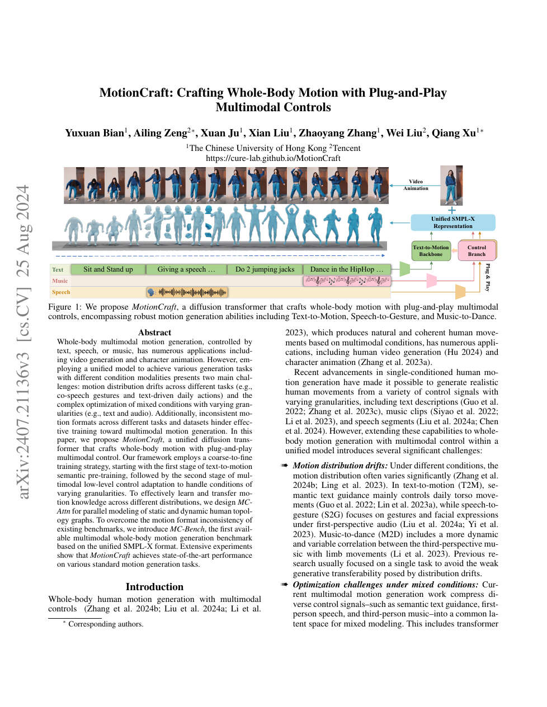

<!--
---
id: P0031
title_en: "MotionCraft: Crafting Whole-Body Motion with Plug-and-Play Multimodal Controls"
title_zh: "MotionCraft：使用即插即用多模态控制生成全身动作"
year: 2024
date: 2024-07-30
venue: "AAAI 2025"
primary_category: motion-generation
tags: [motion-generation, multimodal, diffusion, transformer, smplx, text, audio]
authors: [Yuxuan Bian, Ailing Zeng, Xuan Ju, Xian Liu, Zhaoyang Zhang, Wei Liu, Qiang Xu]
institutions: [The Chinese University of Hong Kong, Tencent]
paper_url: "https://arxiv.org/abs/2407.21136"
project_url: "https://cure-lab.github.io/MotionCraft"
github_url: null
video_url: null
open_source: {code: unknown, training_code: unknown, inference_code: unknown, model_weights: unknown, dataset: partial, robot_deployment: "no"}
open_source_checked: 2026-09-03
robots: []
inputs: [text, music, speech, motion controls]
outputs: [SMPL-X whole-body motion]
read_status: read
reproduce_status: not-started
local_materials: []
created: 2026-09-03
updated: 2026-09-04
---
-->

# P0031｜MotionCraft：使用即插即用多模态控制生成全身动作

*MotionCraft: Crafting Whole-Body Motion with Plug-and-Play Multimodal Controls*

[论文](https://arxiv.org/abs/2407.21136) · [项目页](https://cure-lab.github.io/MotionCraft)

## 基本信息

<!-- AUTO-BASIC-INFO:START -->
> **作者**：Yuxuan Bian、Ailing Zeng、Xuan Ju、Xian Liu、Zhaoyang Zhang、Wei Liu、Qiang Xu
>
> **机构**：The Chinese University of Hong Kong、Tencent
>
> **论文时间**：2024-07-30
>
> **期刊 / 会议**：AAAI 2025
>
> **主分类**：动作生成
>
> **重点标签**：**动作生成** · **多模态** · **扩散模型** · **Transformer** · **SMPL-X** · **文本** · **音频**
>
> **阅读状态**：已阅读　·　**复现状态**：未开始
<!-- AUTO-BASIC-INFO:END -->

## 本文贡献

- 建立统一 SMPL-X 的 MC-Bench，解决文本动作、音乐舞蹈和语音手势数据骨架/部位不一致的问题。
- 提出由文本语义预训练到多模态低层控制适配的 coarse-to-fine 两阶段训练，降低不同任务分布直接混合的冲突。
- 在 Diffusion Transformer 中加入 MC-Attn，同时建模静态人体拓扑与动态运动关系，并以即插即用控制分支接入音频等条件。

## 研究问题

文本提供全局语义，音乐/语音提供高频时间条件；各数据集又覆盖不同身体部位。若直接联合训练，模型会在动作分布和条件粒度上相互干扰。MotionCraft 先统一格式，再让文本主干提供动作先验，最后适配细粒度条件。

## 原论文重点图

**图 1：统一 SMPL-X 与即插即用多模态控制（原论文 Figure 1 所在页）。** 文本主干学习通用动作语义，控制分支读取音乐/语音等逐帧条件；MC-Attn 在身体拓扑与时间动态两条关系上交换信息。

## 研究方法详细解读

MotionCraft 的核心不是把文本、音乐、语音、轨迹全部平铺成一组条件，而是明确“文本决定动作大意，低层模态决定什么时候、哪个身体部位怎样动”。Stage 1 先训练跨场景文本动作 DiT，Stage 2 冻结主干，用可插拔 control branch 和身体位置 mask 注入帧级信号，从而让新增控制不重写整个动作先验。

### 1. 总体定位：粗语义和细粒度控制为什么要分层

文本能说“跳舞”或“挥手”，却很难描述每一帧节拍；音乐和语音有精确时间结构，但不一定决定完整动作语义。直接联合训练需要所有模态成对且容易互相干扰。MotionCraft 通过 MC-Bench 统一数据与 12 身体部位表示，让文本主干学习通用拓扑，再让控制分支按时间和部位只修改相关特征。

### 2. 整体训练流程：文本主干加可插拔控制

1. 将 HumanML3D、FineDance、BEAT2 等统一到 SMPL-X 和 12 个身体部位，记录各模态及其有效位置。
2. Stage 1 用文本—动作数据训练主 DiT，在动作空间做扩散去噪，建立粗粒度语义与全身协调先验。
3. Stage 2 冻结主干并复制部分 block 为 control branch，输入语音、音乐、轨迹等帧级条件。
4. MC-Attn 分别处理身体部位、时间和条件关系；位置 mask 决定控制应作用于哪些帧和部位。
5. 控制特征通过零初始化桥逐层加回主干，只训练新增分支，保持无控制时的原模型能力。
6. 推理可组合不同插件与 mask，从噪声生成全身动作；冲突条件仍需用户或权重策略解决。

### 3. 总体信息流：文本先验打底，低层模态作为残差控制

MotionCraft 先将 HumanML3D、FineDance 和 BEAT2 统一到 SMPL-X 的 12 个身体部位。Stage 1 用跨场景文本—动作对训练主 DiT，让模型掌握粗粒度语义和通用全身拓扑；Stage 2 冻结主干，复制部分 DiT block 为 control branch，输入语音或音乐等帧级条件，通过零初始化线性桥逐层修正主干。两个分支都使用 MC-Attn，将静态骨架、当前动作依赖和各部位时间关系分开建模。

### MC-Bench 与 12 部位表示

HumanML3D 的 SMPL、FineDance 的 SMPL-H 6D 旋转和 BEAT2 的 SMPL-X 被转换到统一 SMPL-X；Root、Trans、Head、躯干、双臂、双手、双腿等拆成 12 个 body tokens。HumanML3D/FineDance 缺失面部时填平均 expression，FineDance 旋转转为 axis-angle 以减少官方重定向误差。统一格式允许共享主干，但人工填充的脸和拟合部位不是原始高质量捕捉，相关指标需单独解释。

### MC-Attn 的三条并行关系

静态 skeleton learner 从只含自连接的单位邻接矩阵开始，训练出输入无关的 12 部位关系 `Âs`，快速吸收稳定解剖结构；动态 topology learner 以每帧部位 attention score 作为边权，按动作/条件改变手脚协同；temporal attention 则把每个部位视作独立序列，并与文本 token 联合计算时间关系。三路输出 `Es+Ed+Et` 后再经 MoE/FFN，使结构先验、场景适配和跨帧动态都保留。

### Stage 1 的文本动作扩散训练

主分支接收带噪 SMPL-X、扩散时间和冻结 CLIP ViT-B/32 加两层 Transformer 的文本特征，做直接 `x0` 预测。文本作为三个数据域都能获得的粗条件，让 4 层 motion DiT 先学自然动作与语义，而不是一开始被高频音频信号牵引。主干 latent 为 `12×64`，前馈维度 256，训练时按数据域混合任务并使用相同身体表示。

### Stage 2 的控制分支与位置 mask

冻结 Stage 1 全部参数，复制其中两层 block 初始化控制分支；语音/音乐 encoder 产生长度 `Tc` 的帧级条件，以位置 mask 对齐到动作长度 `Fm`，缺失帧置零。每个控制层输出通过初始为零的 `Wp` 加到主干对应层输入，所以训练初期保持原生成分布，随后只学习低层时序残差。不同低层模态可各自训练 plug-and-play 分支，而不反复重训文本主干。

### 优化与推理信息流

扩散过程在统一全身动作上加噪，网络以文本/音频条件回归干净动作；Stage 1 更新主干，Stage 2 只更新 control encoder、复制 block、body-wise decoder 和 zero bridges。推理从噪声开始，主干始终提供文本与通用动作先验，选定的语音或音乐控制分支逐层注入帧级修正；无低层条件时关闭分支即可回到 text-to-motion。零桥只保证初始化稳定，不保证微调后完全无遗忘，需回测原任务。

### 边界与复现重点

填充/转换后的 SMPL-X 数据存在域差，强音频信号与文本冲突时仍是软融合。论文生成的是人体全身动作，没有机器人接触与力矩；机器人应用还需重定向和低层控制。复现应锁定 12 部位切片、旋转格式、condition mask、冻结参数清单和控制 branch 层数，否则“同一架构”也会出现不同结果。

## 实验结果与结论

论文在多个标准生成任务上报告强结果，并通过统一 benchmark 展示一个模型处理文本、音乐和语音。结论是格式统一和分阶段适配同样重要；结果仍属于人体动作生成。

## 局限与复现提醒

- SMPL-X 转换误差、缺失部位填充和 FPS 统一会影响跨数据集比较。
- 插件式控制增加参数和训练阶段，不代表任意新模态零成本接入。
- 机器人应用仍需重定向与动力学验证。

## 阅读与复现状态

- 阅读：已阅读论文与飞书方法整理。
- 资源：项目页已核验，完整代码/权重边界待核验。
- 运行：未复现。

## 参考资料

- [arXiv](https://arxiv.org/abs/2407.21136)
- [项目页](https://cure-lab.github.io/MotionCraft)

## 更新记录

- 2026-09-04：按 ADAPT 式方法结构补充粗语义与帧级控制的分工，并用六步流程讲清 MC-Bench、文本 DiT、冻结主干、控制分支、MC-Attn 和位置 mask。
- 2026-09-03：依据原论文方法与训练章节，扩展总体流程、数据表征、模块信息流、训练目标、推理/部署及实现边界。
- 2026-09-03：补充正文基本信息卡，展示完整作者、机构、论文时间、期刊/会议、分类、标签与状态。
- 2026-09-03：新建条目，整理 MC-Bench、两阶段训练与 MC-Attn。
