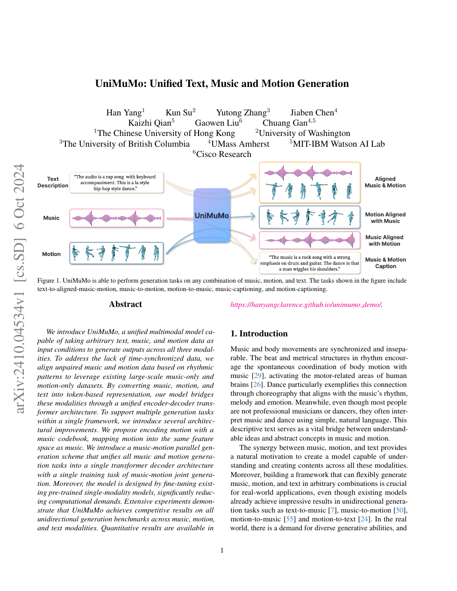

<!--
---
id: P0032
title_en: "UniMuMo: Unified Text, Music and Motion Generation"
title_zh: "UniMuMo：统一文本、音乐与动作生成"
year: 2024
date: 2024-10-06
venue: "AAAI 2025"
primary_category: motion-generation
tags: [motion-generation, multimodal, autoregressive, transformer, text, music, dance-generation]
authors: [Han Yang, Kun Su, Yutong Zhang, Jiaben Chen, Kaizhi Qian, Gaowen Liu, Chuang Gan]
institutions: [The Chinese University of Hong Kong, University of Washington, University of British Columbia, UMass Amherst, MIT-IBM Watson AI Lab, Cisco Research]
paper_url: "https://arxiv.org/abs/2410.04534"
project_url: "https://hanyangclarence.github.io/unimumo_demo/"
github_url: null
video_url: null
open_source: {code: unknown, training_code: unknown, inference_code: unknown, model_weights: unknown, dataset: "no", robot_deployment: "no"}
open_source_checked: 2026-09-03
robots: []
inputs: [text, music, motion]
outputs: [text, music, motion]
read_status: read
reproduce_status: not-started
local_materials: []
created: 2026-09-03
updated: 2026-09-04
---
-->

# P0032｜UniMuMo：统一文本、音乐与动作生成

*UniMuMo: Unified Text, Music and Motion Generation*

[论文](https://arxiv.org/abs/2410.04534) · [项目页](https://hanyangclarence.github.io/unimumo_demo/)

## 基本信息

<!-- AUTO-BASIC-INFO:START -->
> **作者**：Han Yang、Kun Su、Yutong Zhang、Jiaben Chen、Kaizhi Qian、Gaowen Liu、Chuang Gan
>
> **机构**：The Chinese University of Hong Kong、University of Washington、University of British Columbia、UMass Amherst、MIT-IBM Watson AI Lab、Cisco Research
>
> **论文时间**：2024-10-06
>
> **期刊 / 会议**：AAAI 2025
>
> **主分类**：动作生成
>
> **重点标签**：**动作生成** · **多模态** · **自回归** · **Transformer** · **文本** · **音乐** · **舞蹈生成**
>
> **阅读状态**：已阅读　·　**复现状态**：未开始
<!-- AUTO-BASIC-INFO:END -->

## 本文贡献

- 在缺少大规模配对数据时，通过节拍检测与动态时间规整将独立音乐、舞蹈对齐，利用音乐-only 与动作-only 数据。
- 将动作映射到音乐模型的残差码本空间，并行自回归生成音乐与动作，使任意一方可作为另一方条件。
- 以跨模态因果注意力和混合专家组合预训练单模态模型，在一个 encoder–decoder Transformer 中支持文本、音乐、动作多向生成。

## 研究问题

音乐和动作虽共享节奏结构，却缺少成对数据；分别量化后 token 时间率也不同。UniMuMo 通过节拍对齐构造弱配对，再在共享声学/动作 token 时间轴上联合生成，降低从头训练多模态模型的成本。

## 原论文重点图

**图 1：文本、音乐和动作的统一输入输出（原论文 Figure 1 所在页）。** 音乐与动作先在节拍层对齐并 token 化，模型沿共同时间步并行预测两条序列；文本可描述或控制任一/两者。

## 研究方法详细解读

UniMuMo 的核心不是先生成音乐再让另一个模型生成动作，而是在同一个自回归 Transformer 中并行预测音乐与动作两条 token stream。为解决真实音乐—动作配对不足，它先按节拍把未配对样本弱对齐；为让两条流容易交互，又冻结 Encodec 音乐码本并训练动作编码器使用同一套残差量化空间。

### 1. 总体定位：联合生成为什么先要解决配对和码本

音乐数据和动作数据都很多，但严格同步配对很少；独立 tokenizer 的码率、层数和语义完全不同，直接跨注意力难以学习拍点对应。UniMuMo 用节拍检测与 DTW 构造弱配对，再让动作适配既有音乐 RVQ，统一时间和层级。共享码本不表示音乐 token 与动作 token 含义相同，而是提供可并行建模的结构。

### 2. 整体训练流程：弱配对、共享量化、双流生成

1. 分别从音乐和动作检测节拍，用 DTW 拉伸/对齐动作，构造同步但非人工精标的弱配对。
2. Stage 1 冻结 Encodec 的 Residual VQ，只训练动作 encoder/decoder，使动作也能用同一层级码本重建。
3. Stage 2 从 MusicGen 初始化 Transformer，文本作为条件，并行预测音乐流和动作流；模态专用参数保留各自容量。
4. 两条流在相同时间网格上交换上下文，可做文本生音乐+动作、给音乐生动作或给动作生音乐。
5. Stage 3 冻结大部分生成器并增加 caption encoder/相关适配，使模型还能从音乐动作对生成文字描述。
6. 推理按任务固定一条已知流或同时从头采样，再分别用音乐与动作 decoder 还原连续信号。

### 3. 总体信息流：对齐弱配对，再共享音乐码本联合生成

UniMuMo 先从未配对音乐和动作中检测节拍，用 DTW 拉伸动作形成同步对；Stage 1 冻结 Encodec 音乐 RVQ，只训练动作 encoder/decoder，让动作也使用同一残差码本；Stage 2 从 MusicGen 初始化 Transformer，以文本为条件并行预测音乐和动作两条 token stream；Stage 3 冻结大部分生成主干，将其改作全注意力特征 extractor，训练 T5 decoder 输出音乐或动作 caption。三阶段分别解决表示对齐、双向生成和理解。

### 节拍弱配对与文本合成

音乐从声谱 onset 得到二值 beat；动作由 directogram 的负一阶差分得到 motion flux，筛峰并用动态规划选择强且近似等间隔的视觉 beat。DTW 在两条 beat 序列间求匹配路径，只插值/拉伸动作去适配稳定音乐，避免扭曲音频听感。缺少 caption 时，一路用音乐理解模型从音频描述，另一路让 LLM 依据 genre/tempo metadata 合成，兼顾准确度与措辞多样性；这仍是带噪弱监督。

### Stage 1：共用冻结的 Residual VQ

Encodec 把波形编码为 `d×Tfr` 特征，并经 `K` 层 RVQ 得到同形状音乐 token。动作 encoder 将 `dm×Tfm` 映射到完全相同的 `d×Tfr`，直接使用冻结音乐 RVQ 量化，动作 decoder 再恢复姿态；只以动作 L2 重建与系数 0.02 的 commitment 更新动作两端。共享的不是音乐/动作整数序列本身，而是码本 embedding 和时间栅格，使预训练 MusicGen 权重可以合理初始化下一阶段。

### Stage 2：双流并行自回归

音乐、动作的 `K×S` RVQ token 分别应用 MusicGen delay pattern，再沿时间维拼成两半。cross-modal causal mask 的四个象限均为下三角，使时刻 `t` 的两模态只能读取双方过去；一次 forward 同时计算音乐与动作下一 token 交叉熵，权重 `μ=0.85` 偏向保护音乐。推理可在同一时间步并行采样两条流，也可钳制整条音乐只生成动作，或反向由动作生成音乐。

### 模态专用容量与文本条件

为避免音乐预训练能力被动作污染，动作使用独立 embedding、独立分类 head，并在每层增加 motion FFN；音乐和动作位置编码各自从 1 开始，保持同步而非把动作当音乐后半段。新增动作模块从对应 MusicGen 部件初始化。音乐描述和动作描述分别经 T5 encoder，classifier-free dropout 独立进行，cross-attention mask 只让各 stream读取自己的文字条件，由共享 self-attention交换跨模态时序。

### Stage 3：从生成器变为 caption encoder

生成主干原本使用 causal attention，不适合完整理解输入。论文添加由 causal 权重初始化的 trainable full-self-attention，只更新这些层和新 T5 decoder，其余 music-motion decoder 冻结；同时去掉两模态交叉区域，并随机将整条音乐或动作置空，使单模态也能 caption。这样 Stage 2 的时序特征被复用，但理解任务不会反向破坏联合生成器。

### 推理能力与边界

同一模型可执行 text→music+motion、music→motion、motion→music 及文字描述，条件缺失通过固定一条 stream 或 mask 实现。共享码本和 beat 对齐不保证语义/舞种真实匹配，DTW 还可能改变动作动力学。输出是人体动作与音频，机器人使用需重新采样、重定向、物理筛选和低层控制；应分别评价音频质量、动作质量与跨模态同步。

## 实验结果与结论

论文在各单向生成 benchmark 上达到有竞争力结果，并展示音乐—舞蹈双向生成和文本控制。贡献在数据利用和统一结构；弱配对噪声仍限制精确编舞对应。

## 局限与复现提醒

- DTW 需记录 beat detector、允许拉伸范围和重采样策略，否则音频/动作时长会漂移。
- 用音乐码本承载动作需单独验证重建，不应只看最终 FID。
- 人体动作输出不含机器人接触或力矩约束。

## 阅读与复现状态

- 阅读：已阅读论文与飞书整理。
- 资源：项目页已核验，代码/模型状态待核验。
- 运行：未复现。

## 参考资料

- [arXiv](https://arxiv.org/abs/2410.04534)
- [项目页](https://hanyangclarence.github.io/unimumo_demo/)

## 更新记录

- 2026-09-04：按 ADAPT 式讲解补充配对稀缺和双码本不兼容问题，并用六步流程明确节拍弱配对、共享 RVQ、双流生成和 caption 阶段。
- 2026-09-03：依据原论文方法与训练章节，扩展总体流程、数据表征、模块信息流、训练目标、推理/部署及实现边界。
- 2026-09-03：补充正文基本信息卡，展示完整作者、机构、论文时间、期刊/会议、分类、标签与状态。
- 2026-09-03：新建条目，解析节拍弱配对、共享残差码本和并行生成。
