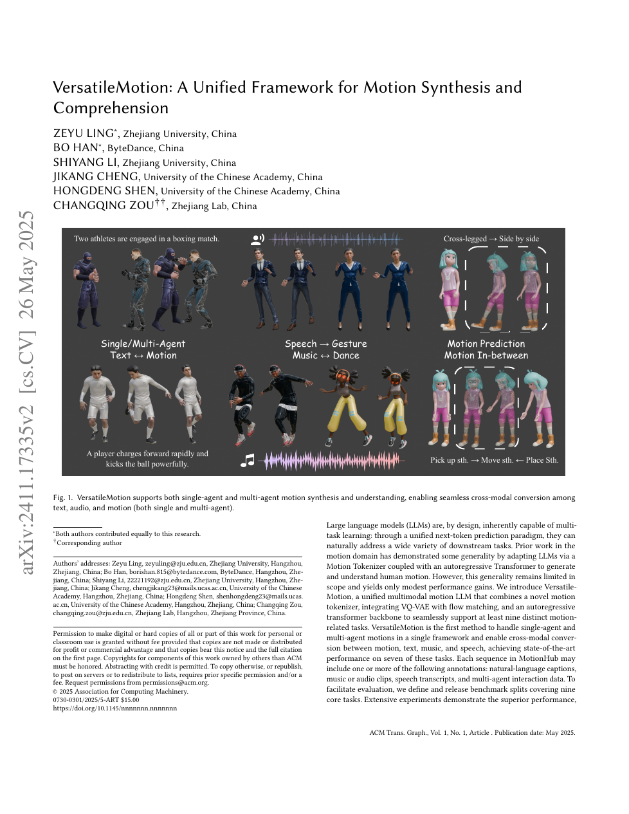

<!--
---
id: P0033
title_en: "VersatileMotion: A Unified Framework for Motion Synthesis and Comprehension"
title_zh: "VersatileMotion（原 MotionLLaMA）：动作合成与理解统一框架"
year: 2024
date: 2024-11-26
venue: "ACM Transactions on Graphics, 2026"
primary_category: motion-generation
tags: [motion-generation, multimodal, transformer, flow-matching, autoregressive, smplx, large-scale-data]
authors: [Zeyu Ling, Bo Han, Shiyang Li, Jikang Cheng, Hongdeng Shen, Changqing Zou]
institutions: [Zhejiang University, ByteDance, University of Chinese Academy of Sciences, Zhejiang Lab]
paper_url: "https://arxiv.org/abs/2411.17335"
project_url: null
github_url: "https://github.com/ZeyuLing/MotionLLaMA"
video_url: null
open_source: {code: full, training_code: full, inference_code: full, model_weights: partial, dataset: full, robot_deployment: "no"}
open_source_checked: 2026-09-03
robots: []
inputs: [text, music, speech, motion, interaction motion]
outputs: [motion, captions, multimodal comprehension]
read_status: read
reproduce_status: not-started
local_materials: []
created: 2026-09-03
updated: 2026-09-03
---
-->

# P0033｜VersatileMotion（原 MotionLLaMA）：动作合成与理解统一框架

*VersatileMotion: A Unified Framework for Motion Synthesis and Comprehension*

[论文](https://arxiv.org/abs/2411.17335) · [官方代码（原 MotionLLaMA 名称）](https://github.com/ZeyuLing/MotionLLaMA)

## 基本信息

<!-- AUTO-BASIC-INFO:START -->
> **作者**：Zeyu Ling、Bo Han、Shiyang Li、Jikang Cheng、Hongdeng Shen、Changqing Zou
>
> **机构**：Zhejiang University、ByteDance、University of Chinese Academy of Sciences、Zhejiang Lab
>
> **论文时间**：2024-11-26
>
> **期刊 / 会议**：ACM Transactions on Graphics, 2026
>
> **主分类**：动作生成
>
> **重点标签**：**动作生成** · **多模态** · **Transformer** · **流匹配** · **自回归** · **SMPL-X** · **大规模数据**
>
> **阅读状态**：已阅读　·　**复现状态**：未开始
<!-- AUTO-BASIC-INFO:END -->

## 本文贡献

- 提出 HoMi Tokenizer，以单码本同时编码身体和手部，在重建精度上接近多层 RVQ，建立全身统一动作 token。
- 基于 LLaMA-3.2/LoRA 统一文本、音乐、语音、单人/双人动作的生成与理解任务，并在后续版本将 VQ-VAE 与 flow matching 结合提升连续细节。
- 构建 MotionHub：约 13.15 万动作、26.99 万文本和 3659 条音频，覆盖多任务微调，并公开代码与数据。

## 研究问题

动作 LLM 的瓶颈一端是手部/身体码本不统一，另一端是离散 token 丢失连续细节。VersatileMotion 先用 HoMi 建共享表示，再通过 LLM 建模任务关系，并以 flow matching 补偿离散解码上限。

## 原论文重点图

**图 1：统一动作 tokenizer、LLM 与生成/理解任务（原论文 Figure 1 所在页）。** 动作、音频和文本转为对应 token，LLM 通过指令选择任务；HoMi 负责全身离散表示，连续生成/重建模块恢复动作细节。

## 研究方法详细解读

### HoMi Tokenizer

身体与手部共享单一码本，但编码器以层级/部位结构避免大关节主导量化。相对多码本 RVQ，单码本缩短序列和输出空间；必须同时检查手部误差、码本利用率与身体重建。

### LLM 与 LoRA 任务统一

预训练 LLM 接收动作特殊 token 和任务指令，LoRA 降低多任务微调成本。任务包括补全、预测、文本动作、音乐舞蹈、语音手势、双人交互和反向描述；数据采样比例决定哪些能力保留。

### Flow matching 连续细化

后续 VersatileMotion 版本将离散语义与连续 flow 结合：LLM 决定高层动作内容，flow 模块在条件轨迹上恢复细粒度连续姿态。复现必须区分旧 MotionLLaMA 与新版 VersatileMotion 配置/checkpoint。

## 实验结果与结论

论文在补全、双人文本动作和理解任务上报告领先或有竞争力结果，MotionHub 扩展任务范围。结果支持统一 tokenizer + LLM 路线，但并未验证人体动作的机器人可执行性。

## 局限与复现提醒

- 仓库/论文存在 MotionLLaMA→VersatileMotion 更名与版本演进，需锁定 commit、配置和 checkpoint。
- 单码本平均重建好不代表手指等小部位无损，需分部位指标。
- 机器人链路还需重定向、接触修正和 GMT。

## 阅读与复现状态

- 阅读：已阅读论文、版本说明与飞书整理。
- 资源：代码和 MotionHub 入口已核验，未运行。
- 机器人：未适配。

## 参考资料

- [arXiv](https://arxiv.org/abs/2411.17335)
- [官方代码](https://github.com/ZeyuLing/MotionLLaMA)

## 更新记录

- 2026-09-03：补充正文基本信息卡，展示完整作者、机构、论文时间、期刊/会议、分类、标签与状态。
- 2026-09-03：新建条目，明确 MotionLLaMA/VersatileMotion 名称演进，解析 HoMi、LLM 和 flow matching。
