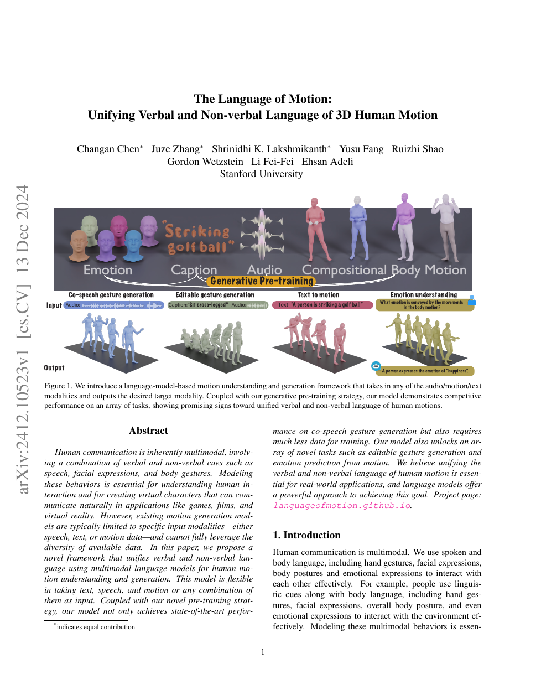

<!--
---
id: P0034
title_en: "The Language of Motion: Unifying Verbal and Non-verbal Language of 3D Human Motion"
title_zh: "动作的语言：统一三维人体动作的言语与非言语表达"
year: 2024
date: 2024-12-13
venue: "CVPR 2025"
primary_category: motion-generation
tags: [motion-generation, multimodal, transformer, text, speech, human-motion, motion-editing]
authors: [Changan Chen, Juze Zhang, Shrinidhi K. Lakshmikanth, Yusu Fang, Ruizhi Shao, Gordon Wetzstein, Li Fei-Fei, Ehsan Adeli]
institutions: [Stanford University]
paper_url: "https://arxiv.org/abs/2412.10523"
project_url: "https://languageofmotion.github.io/"
github_url: null
video_url: null
open_source: {code: unknown, training_code: unknown, inference_code: unknown, model_weights: unknown, dataset: partial, robot_deployment: "no"}
open_source_checked: 2026-09-03
robots: []
inputs: [text, speech, motion, modality combinations]
outputs: [motion, text, emotion labels]
read_status: read
reproduce_status: not-started
local_materials: []
created: 2026-09-03
updated: 2026-09-03
---
-->

# P0034｜动作的语言：统一三维人体动作的言语与非言语表达

*The Language of Motion: Unifying Verbal and Non-verbal Language of 3D Human Motion*

[论文](https://arxiv.org/abs/2412.10523) · [项目页](https://languageofmotion.github.io/)

## 基本信息

<!-- AUTO-BASIC-INFO:START -->
> **作者**：Changan Chen、Juze Zhang、Shrinidhi K. Lakshmikanth、Yusu Fang、Ruizhi Shao、Gordon Wetzstein、Li Fei-Fei、Ehsan Adeli
>
> **机构**：Stanford University
>
> **论文时间**：2024-12-13
>
> **期刊 / 会议**：CVPR 2025
>
> **主分类**：动作生成
>
> **重点标签**：**动作生成** · **多模态** · **Transformer** · **文本** · **语音** · **人体动作** · **动作编辑**
>
> **阅读状态**：已阅读　·　**复现状态**：未开始
<!-- AUTO-BASIC-INFO:END -->

## 本文贡献

- 用多模态语言模型统一文本、语音和动作的任意输入组合，既生成动作，也执行描述、情绪理解和可编辑手势等任务。
- 为身体、手、脸或上下身设计组合式动作 VQ 表示，避免整个人体由单一码本粗粒度压缩。
- 提出生成式预训练，利用无需严格三元配对的单模态/双模态数据，并在较少监督下提高 co-speech gesture 质量。

## 研究问题

现实交流同时包含说话内容、声学韵律、手势、脸部和身体姿态。专用模型只处理一种输入/输出，不能利用不完整多模态数据。本文将言语和非言语信号都视作可生成语言，并通过组合 tokenizer 保留身体层级。

## 原论文重点图

**图 1：从语音/文本/动作到手势生成、编辑、文本动作和情绪理解（原论文 Figure 1 所在页）。** 各任务共用多模态序列模型；差别由输入可见模态和目标模态定义。

## 研究方法详细解读

### 组合式动作 token

身体不同部位分别或分层量化，再按照时间同步关系组合，使手脸细节不会完全被躯干能量淹没。代价是多码流长度更长，训练需显式维护部位同步与缺失部位掩码。

### 统一 T5 式建模

文本、语音和动作编码器把输入映射到共享 encoder，decoder 按任务生成文本或动作 token。任务提示声明目标模态，任意组合通过 modality dropout/不同训练样本覆盖。

### 生成式预训练

预训练对已有模态做重建、预测与跨模态生成，使模型能利用只有语音或只有动作的数据；再在 co-speech 等配对任务上微调。该策略提高数据效率，但预训练伪配对质量仍决定语义一致性。

## 实验结果与结论

论文在 co-speech gesture 上取得强结果，并展示可编辑手势、动作情绪理解和文本动作。核心价值是统一人类交流模态；机器人控制仍缺动力学与实时闭环。

## 局限与复现提醒

- 需核对部位 tokenizer 的 FPS、同步策略和面手缺失处理。
- 情绪等标签具有主观性，自动指标不等同于人类交流效果。
- 机器人应用需压缩延迟并增加重定向/跟踪。

## 阅读与复现状态

- 阅读：已阅读论文与飞书方法整理。
- 资源：项目页已核验，完整代码/权重状态待核验。
- 运行：未复现。

## 参考资料

- [arXiv](https://arxiv.org/abs/2412.10523)
- [项目页](https://languageofmotion.github.io/)

## 更新记录

- 2026-09-03：补充正文基本信息卡，展示完整作者、机构、论文时间、期刊/会议、分类、标签与状态。
- 2026-09-03：新建条目，整理组合式动作 token、统一多模态任务与生成式预训练。
