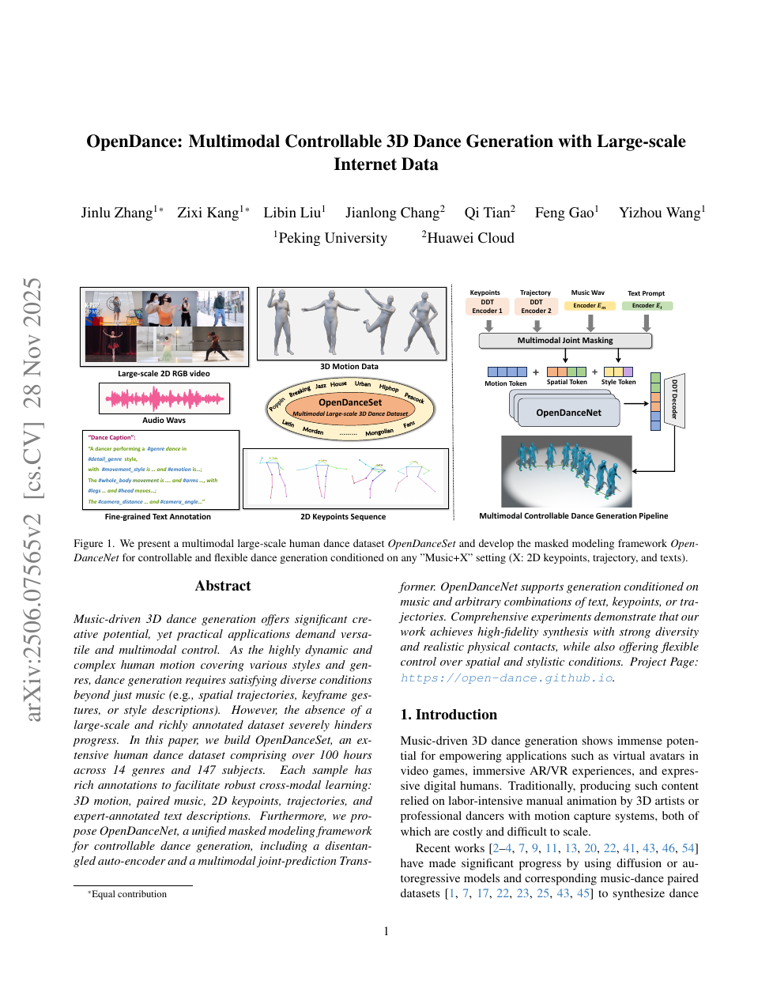

<!--
---
id: P0035
title_en: "OpenDance: Multimodal Controllable 3D Dance Generation with Large-scale Internet Data"
title_zh: "OpenDance：基于大规模互联网数据的多模态可控三维舞蹈生成"
year: 2025
date: 2025-06-09
venue: "CVPR 2026"
primary_category: motion-generation
tags: [dance-generation, multimodal, masked-modeling, transformer, large-scale-data, music, text]
authors: [Jinlu Zhang, Zixi Kang, Libin Liu, Jianlong Chang, Qi Tian, Feng Gao, Yizhou Wang]
institutions: [Peking University, Huawei Cloud]
paper_url: "https://arxiv.org/abs/2506.07565"
project_url: "https://open-dance.github.io/"
github_url: null
video_url: null
open_source: {code: unknown, training_code: unknown, inference_code: unknown, model_weights: unknown, dataset: partial, robot_deployment: "no"}
open_source_checked: 2026-09-03
robots: []
inputs: [music, text, keypoints, trajectory]
outputs: [3D dance motion]
read_status: read
reproduce_status: not-started
local_materials: []
created: 2026-09-03
updated: 2026-09-03
---
-->

# P0035｜OpenDance：基于大规模互联网数据的多模态可控三维舞蹈生成

*OpenDance: Multimodal Controllable 3D Dance Generation with Large-scale Internet Data*

[论文](https://arxiv.org/abs/2506.07565) · [项目页](https://open-dance.github.io/)

## 基本信息

<!-- AUTO-BASIC-INFO:START -->
> **作者**：Jinlu Zhang、Zixi Kang、Libin Liu、Jianlong Chang、Qi Tian、Feng Gao、Yizhou Wang
>
> **机构**：Peking University、Huawei Cloud
>
> **论文时间**：2025-06-09
>
> **期刊 / 会议**：CVPR 2026
>
> **主分类**：动作生成
>
> **重点标签**：**舞蹈生成** · **多模态** · **掩码建模** · **Transformer** · **大规模数据** · **音乐** · **文本**
>
> **阅读状态**：已阅读　·　**复现状态**：未开始
<!-- AUTO-BASIC-INFO:END -->

## 本文贡献

- 从互联网构建超过 100 小时、14 种风格、147 位舞者的 OpenDanceSet，每条样本对齐 RGB、音频、2D 关键点、3D 动作和细粒度文本。
- 提出解耦舞蹈自动编码器，将空间/运动内容与风格因素分开，减少多舞者、多视角数据对动作 token 的污染。
- 以 OpenDanceNet 的多模态联合掩码训练统一音乐、文本、关键点和轨迹控制，使单模态/混合条件都成为 token 补全。

## 研究问题

小型棚拍数据限制舞种和身份覆盖，互联网数据又有相机运动、遮挡、身份与服装偏差。OpenDance 同时处理数据恢复质量、内容—风格解耦和条件组合，目标是让规模化不以失去精确控制为代价。

## 原论文重点图

**图 1：OpenDanceSet 与 OpenDanceNet（原论文 Figure 1 所在页）。** 左侧从大规模 RGB 视频建立五模态对齐数据，中间显示风格覆盖，右侧将关键点、轨迹、音乐和文本编码为条件 token，通过联合掩码 Transformer 恢复舞蹈动作。

## 研究方法详细解读

### 总体流程：建库、三路量化、联合掩码、逐步修正

OpenDance 先从 600 小时网络视频构建 100.26 小时 OpenDanceSet；再以 OpenDanceSet、AIST++ 和 AMASS 训练 Disentangled Dance Tokenizer，将关节旋转、二维关键点和全局轨迹分别量化；Multimodal-Condition Transformer 同时恢复被 mask 的三路 token，并读取音乐与文本；推理时 MS-LRM 反复重遮蔽低置信 token，每一步还在 logits/embedding 上沿足滑损失梯度修正，最后做轻量后处理。图 4 的三块正好对应 tokenizer、生成训练和可控推理。

### OpenDanceSet 的采集与标注链

艺术家给出 14 个细舞种/3 个主类别与音乐风格，GPT 扩展搜索词，人工检查视频—查询匹配；YOLOX 删除非单人或身体不完整片段，2D pose estimator 提 COCO keypoints 并按帧剔除抖动。GVHMR 类世界坐标估计器恢复 SMPL 局部旋转、根平移与 shape；Jukebox 提 4,800 维音乐特征，Librosa 提 35 维节拍特征。专业舞者标 genre，普通标注员给起止/性别/风格，LLM 根据关键点可视化补全四肢和全身描述，最终覆盖 147 位舞者及 41k 条长片段。

### 后优化与训练样本筛选

三维运动先经 Kalman filter 平滑，再以 Physical Foot Contact 为优化惩罚减少脚滑。按人工起止裁掉入场/退场秒数，使用 jitter、stillness、PFC 和 human-alignment 分数筛除低质样本；MotionCritic 原本来自 text-to-motion，论文以 AIST++ 分数分布作参考阈值，减轻域差。训练切片不少于 5 秒，并对大类用更稀 stride、稀有舞种更密采样，平衡 genre；数据总时长与实际切片数/重复采样不能混为一项。

### DDT 的三路离散表示

DDT 为关节旋转 `J`、2D keypoints `K` 和全局 trajectory `X` 分别设置 encoder、codebook 与 decoder，得到 `3×T'×d` token；不在 encoder 早期融合，使稀疏轨迹或局部关键点可以补零后直接落入自己的 token stream。训练对三路连续量分别做旋转/关键点/根轨迹重建，并以多数据集动作先验提高覆盖。动作最终采用 24 关节 SMPL 6D 旋转、3D root translation 和 heel/toe 接触，30 FPS。

### MCT 的联合掩码训练

音乐经 Jukebox、文本经 CLIP，轨迹/关键点经冻结 DDT；各 stream 拼接后，音乐和文本按模态概率整体丢弃，三路空间 token 再随机逐 token mask。Transformer 不只预测 motion token，还同时分类恢复关键点和轨迹的所有 mask 位置，以交叉熵迫使网络真正学习严格空间约束，而非只依赖容易的音乐/文本。用 Gumbel-Softmax 可微采样预测 token，经 DDT 和 FK 后再计算轨迹 L1、2D keypoint L1、3D FK 一致性与接触脚损失。

### MS-LRM 与足滑梯度修正

推理把用户给定的音乐、文字、稀疏关键点/轨迹固定，未知位置全设 mask。每轮 MCT 给所有未知码分布和置信度，MS-LRM 根据跨历轮累计的 logit 排序重新 mask 低置信项，而非只看当前一轮；随后 Gumbel/soft token 经 DDT、FK 计算足滑损失，沿该损失梯度直接调整 logits 再采样。最后一轮还在 motion embedding 上修正并做后处理，因此“物理优化”位于推理 token 分布，不是动力学仿真或力矩约束。

### 推理能力与边界

任意条件子集可通过训练时的模态 mask 进入同一推理，包括末帧关键点、自定义直线/圆轨迹、文本与音乐。约束冲突时联合概率和足滑项做软折中，没有硬可满足性保证。论文单张 RTX 4090 训练，输出人体舞蹈；用于机器人需另做骨架重定向、动力学筛选和闭环跟踪，PFC/足滑改善不等于机器人接触稳定。

## 实验结果与结论

论文在音乐舞蹈、多模态控制和跨风格生成上报告强结果，并展示大数据与解耦/掩码设计的消融。其贡献主要是互联网舞蹈数据与人体生成，不证明动作可直接由机器人跟踪。

## 局限与复现提醒

- 需记录数据许可、视频去重、姿态估计器和人工筛选标准。
- 3D 恢复误差可能被模型学习为风格；应检查足接触、根漂移和骨长稳定性。
- 接机器人前需重定向、FPS 对齐、接触重算和物理筛选。

## 阅读与复现状态

- 阅读：已阅读论文与飞书数据/方法整理。
- 资源：项目页已核验，完整数据和代码发布边界待核验。
- 运行：未复现。

## 参考资料

- [arXiv](https://arxiv.org/abs/2506.07565)
- [项目页](https://open-dance.github.io/)

## 更新记录

- 2026-09-03：依据原论文方法与训练章节，扩展总体流程、数据表征、模块信息流、训练目标、推理/部署及实现边界。
- 2026-09-03：补充正文基本信息卡，展示完整作者、机构、论文时间、期刊/会议、分类、标签与状态。
- 2026-09-03：新建条目，整理五模态数据、解耦 tokenizer 和联合掩码生成。
