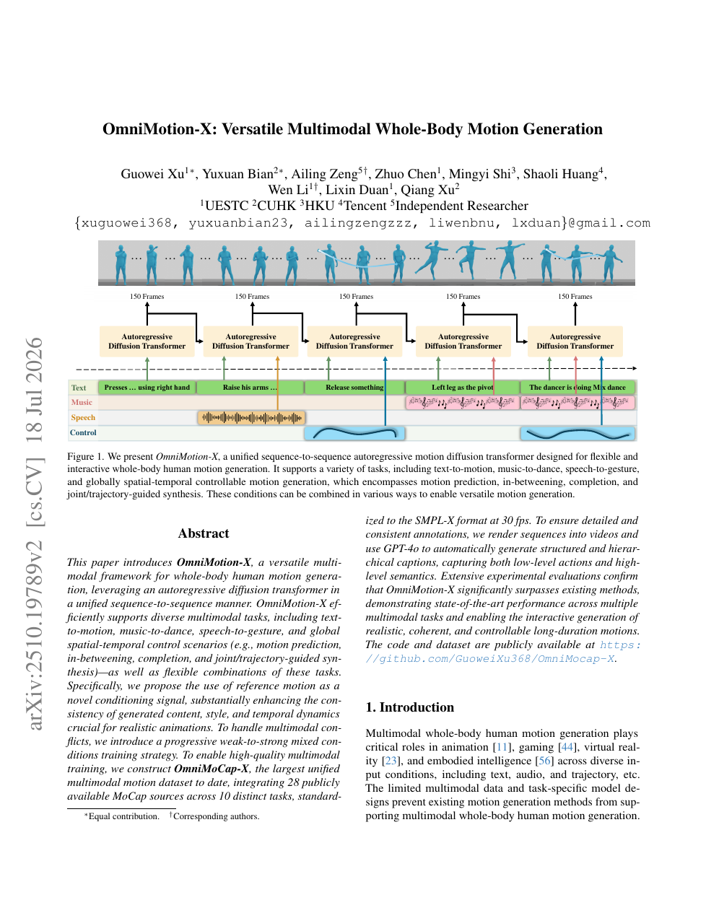

<!--
---
id: P0036
title_en: "OmniMotion-X: Versatile Multimodal Whole-Body Motion Generation"
title_zh: "OmniMotion-X：多用途多模态全身动作生成"
year: 2025
date: 2025-10-22
venue: "CVPR 2026 Findings"
primary_category: motion-generation
tags: [motion-generation, multimodal, diffusion, autoregressive, smplx, large-scale-data, motion-editing]
authors: [Guowei Xu, Yuxuan Bian, Ailing Zeng, Zhuo Chen, Mingyi Shi, Shaoli Huang, Wen Li, Lixin Duan, Qiang Xu]
institutions: [University of Electronic Science and Technology of China, The Chinese University of Hong Kong, The University of Hong Kong, Tencent]
paper_url: "https://arxiv.org/abs/2510.19789"
project_url: null
github_url: null
video_url: null
open_source: {code: unknown, training_code: unknown, inference_code: unknown, model_weights: unknown, dataset: partial, robot_deployment: "no"}
open_source_checked: 2026-09-03
robots: []
inputs: [text, music, speech, reference motion, keypoints, trajectory]
outputs: [SMPL-X whole-body motion]
read_status: read
reproduce_status: not-started
local_materials: []
created: 2026-09-03
updated: 2026-09-04
---
-->

# P0036｜OmniMotion-X：多用途多模态全身动作生成

*OmniMotion-X: Versatile Multimodal Whole-Body Motion Generation*

[论文](https://arxiv.org/abs/2510.19789)

## 基本信息

<!-- AUTO-BASIC-INFO:START -->
> **作者**：Guowei Xu、Yuxuan Bian、Ailing Zeng、Zhuo Chen、Mingyi Shi、Shaoli Huang、Wen Li、Lixin Duan、Qiang Xu
>
> **机构**：University of Electronic Science and Technology of China、The Chinese University of Hong Kong、The University of Hong Kong、Tencent
>
> **论文时间**：2025-10-22
>
> **期刊 / 会议**：CVPR 2026 Findings
>
> **主分类**：动作生成
>
> **重点标签**：**动作生成** · **多模态** · **扩散模型** · **自回归** · **SMPL-X** · **大规模数据** · **动作编辑**
>
> **阅读状态**：已阅读　·　**复现状态**：未开始
<!-- AUTO-BASIC-INFO:END -->

## 本文贡献

- 以统一 sequence-to-sequence 自回归 Diffusion Transformer 支持文本动作、音乐舞蹈、语音手势、预测、插值、补全和关节/轨迹控制及其组合。
- 将参考动作作为显式条件，增强内容、风格和时间动态一致性；提出从弱条件到强条件的渐进混合训练缓解模态冲突。
- 构建 OmniMoCap-X：统一 28 个 MoCap 来源、10 类任务为 30 FPS SMPL-X，并以渲染视频 + GPT-4o 生成层级描述。

## 研究问题

多任务模型既要处理全局文本，又要处理逐帧音频和稀疏几何约束；强条件过早加入会让模型忽略弱语义。OmniMotion-X 通过自回归块生成和 weak-to-strong 课程，先学通用动作，再逐步增加精确约束。

## 原论文重点图

**图 1：OmniMotion-X 分块自回归 DiT（原论文 Figure 1 所在页）。** 动作以约 150 帧块连续生成，每块可接收文本、音乐、语音和控制条件；先前块成为下一块上下文，从而支持交互式长动作和条件切换。

## 研究方法详细解读

OmniMotion-X 的核心不是一次性把文本、参考动作、轨迹、语音和音乐全部混合训练，而是先让一个 12 身体部位 DiT 学会通用全身动作，再按“文本→参考动作→全局控制→完整音频”的顺序逐步加入更强条件。每阶段继承上一阶段能力，避免强帧级信号过早压制动作先验。

### 1. 总体定位：多用途全身生成的难点在哪里

28 个动作来源的骨架、手脸完整度、文本层级和音频标注不一致；不同条件的控制强度也不同：文本只给大意，轨迹和参考动作几乎逐帧规定结果。若一开始联合训练，模型容易依赖最强条件，弱文本能力和无条件先验学不稳。论文因此先统一 OmniMoCap-X，再用 weak-to-strong 课程安排条件进入顺序。

### 2. 整体训练流程：数据统一与四阶段条件课程

1. 把 28 个来源转换为统一 SMPL-X 全身动作，补齐/标注手、脸、分层文字、语音和音乐条件。
2. 将全身拆成 12 个部位 token，带噪动作进入 DiT；各模态 encoder 输出统一的 prefix 条件。
3. Stage 1 训练文本条件，先建立动作语义和无/弱条件生成先验。
4. Stage 2 加入参考动作，学习动作风格和内容迁移；Stage 3 再加入全局时空控制，学习路径与关键点约束。
5. Stage 4 加入完整语音/音乐帧级信号，使口型、手势和节拍建立细时间对齐。
6. 推理可选择或组合 prefix 条件，并通过滚动窗口生成长动作；输出仍需针对机器人另做重定向和跟踪。

### 3. 总体信息流：统一全身数据，逐步加入从弱到强的条件

OmniMotion-X 将 28 个来源转为统一 SMPL-X 全身动作与分层文字，随后用一个 12 部位 DiT 直接在动作空间做 `x0` 去噪。条件编码器分别处理文本、全局时空控制、语音、音乐和参考动作，投影后全部作为 prefix token 与带噪动作联合注意。训练不是一次混入全部条件，而是按“文本 → 参考动作 → 全局控制 → 完整音频”四阶段逐步解锁；推理可把已生成上一段作为 reference，滚动产生长序列或响应用户指定动作。

### OmniMoCap-X 的统一与标注

28 个动作源先校正骨架、坐标和帧率，统一为 SMPL-X、30 FPS，共约 6,430 万帧/286.2 小时；缺失手脸的来源需拟合或填充，不能视为同质量原生捕捉。系统将动作渲染为视频，结合原始 description、action label 和 task category 交给 GPT-4o 等 VLM，生成低层身体细节与高层任务语义的层级 caption。自动文字丰富条件覆盖，也会把渲染、拟合和 VLM 误差带进监督。

### 12 部位 DiT 与条件前缀

动作拆成 12 个 body part，每部位 128 维，主干 hidden `1536=12×128`，8 层、8 头、FFN 3072。文本由 T5-XXL，语音由 wav encoder，音乐由 Librosa，全局/参考动作由 body-wise encoder 提取；各自线性投到动作宽度并按顺序拼成 prefix context。full attention 允许条件间与动作 token 互相对齐，网络从随机扩散时刻的带噪姿态直接回归干净 `x0`，基础目标为 L2。

### 参考动作与全局控制的不同作用

全局控制给定稀疏/连续的空间—时间关节轨迹，要求输出命中特定位置；reference motion 则是一段与目标时长相近的完整动作，可来自上一生成块或用户模板，提供风格、节奏和细粒度运动先验。首段没有参考时使用 null token，后续把前段或用户动作编码为 `cr`。reference 提升连贯和质量，但若训练/测试总用真值上一段，会与部署时模型自产历史形成分布差，需单独验证滚动误差。

### 四阶段 weak-to-strong 训练

Stage 1 文本-only 460k 步，先建立动作—语义和自然动作先验；Stage 2 加 reference motion 再 460k；Stage 3 加 global spatiotemporal control 230k；Stage 4 加 speech/music 等完整音频 920k。batch 依次为 48/48/48/16，单张 H800，AdamW 初始 `1e-4`，新增条件时重置并按 cosine 衰减到 `1e-5`。强条件后加入，避免模型一开始只复制参考/轨迹而忽略弱文本语义；混合条件样本让已学条件继续出现，减少遗忘。

### 推理任务与滚动生成

text-to-motion 只给文本，speech/music 分别提供帧级音频；trajectory synthesis 把可见全局 token 作为 prefix/约束，prediction 和 in-between 用已知动作形成 reference。默认参考和目标各 150 帧，长序列把上一段编码为下一段参考，新指令/用户动作可在下一块加入。多条件在 attention 中软融合，课程顺序只建立优化偏好，不提供条件冲突的硬优先级。

### 边界与复现重点

论文统一的是人体 SMPL-X 生成任务，不含机器人控制。参考动作实验中训练/测试的真值上下文口径与真实滚动生成要分开；手部、面部填充质量也会影响跨数据集指标。用于机器人需在输出后做关节映射、FPS 重采样、接触/限位筛选和低层跟踪，不能把几何控制成功率等同于动力学可执行。

## 实验结果与结论

论文在多个文本、音乐、语音和空间控制基准上取得领先或有竞争力结果，并展示长时组合控制。统一能力来自数据和训练协议共同作用，不应只归因于 DiT 结构。

## 局限与复现提醒

- 30 FPS、SMPL-X 参数、150 帧块和历史长度是关键接口。
- VLM 自动描述需抽样审计；28 数据集许可与可下载性不等同。
- 机器人部署仍需重定向与低层控制。

## 阅读与复现状态

- 阅读：已阅读论文与飞书详细整理。
- 资源：论文入口已核验，代码/完整数据状态待核验。
- 运行：未复现。

## 参考资料

- [arXiv](https://arxiv.org/abs/2510.19789)

## 更新记录

- 2026-09-04：按 ADAPT 式讲解补充条件强弱不一致和数据统一问题，并用六步流程明确 OmniMoCap-X、12 部位 DiT 与四阶段 weak-to-strong 训练。
- 2026-09-03：依据原论文方法与训练章节，扩展总体流程、数据表征、模块信息流、训练目标、推理/部署及实现边界。
- 2026-09-03：补充正文基本信息卡，展示完整作者、机构、论文时间、期刊/会议、分类、标签与状态。
- 2026-09-03：新建条目，整理 OmniMoCap-X、分块自回归扩散和渐进混合条件。
