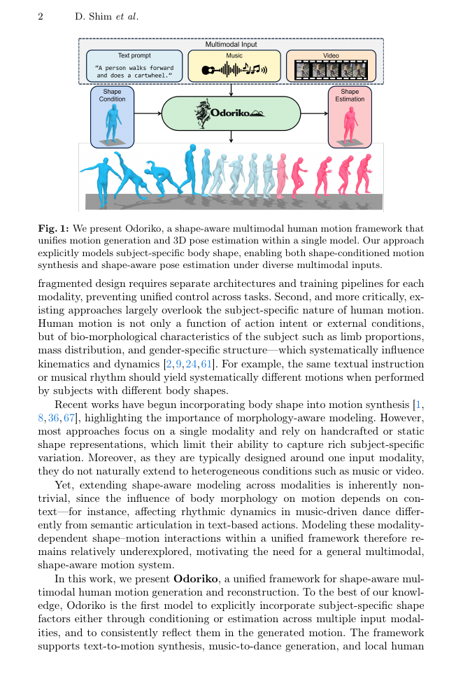

<!--
---
id: P0037
title_en: "Odoriko: A Shape-Aware Multimodal Diffusion Framework for Human Motion"
title_zh: "Odoriko：形状感知的多模态人体动作扩散框架"
year: 2026
date: 2026-06-19
venue: "ECCV 2026"
primary_category: motion-generation
tags: [motion-generation, multimodal, diffusion, smpl, pose-estimation, text, music, video]
authors: [Dongseok Shim, Julian Tanke, Kengo Uchida, Christian Simon, Koichi Saito, Takashi Shibuya, Shusuke Takahashi, Yuki Mitsufuji]
institutions: [Sony Group Corporation, Sony AI]
paper_url: "https://arxiv.org/abs/2606.21135"
project_url: "https://dsshim0125.github.io/odoriko.github.io/"
github_url: "https://github.com/sony/creativeai"
video_url: null
open_source: {code: partial, training_code: unknown, inference_code: unknown, model_weights: unknown, dataset: "no", robot_deployment: "no"}
open_source_checked: 2026-09-03
robots: []
inputs: [text, music, video, 2D pose, body shape]
outputs: [shape-aware SMPL motion]
read_status: read
reproduce_status: not-started
local_materials: []
created: 2026-09-03
updated: 2026-09-03
---
-->

# P0037｜Odoriko：形状感知的多模态人体动作扩散框架

*Odoriko: A Shape-Aware Multimodal Diffusion Framework for Human Motion*

[论文](https://arxiv.org/abs/2606.21135) · [项目页](https://dsshim0125.github.io/odoriko.github.io/) · [Sony 研究入口](https://github.com/sony/creativeai)

## 基本信息

<!-- AUTO-BASIC-INFO:START -->
> **作者**：Dongseok Shim、Julian Tanke、Kengo Uchida、Christian Simon、Koichi Saito、Takashi Shibuya、Shusuke Takahashi、Yuki Mitsufuji
>
> **机构**：Sony Group Corporation、Sony AI
>
> **论文时间**：2026-06-19
>
> **期刊 / 会议**：ECCV 2026
>
> **主分类**：动作生成
>
> **重点标签**：**动作生成** · **多模态** · **扩散模型** · **SMPL** · **姿态估计** · **文本** · **音乐** · **视频**
>
> **阅读状态**：已阅读　·　**复现状态**：未开始
<!-- AUTO-BASIC-INFO:END -->

## 本文贡献

- 在统一文本、音乐、视频、2D 姿态动作模型中显式加入性别与 SMPL 形状参数，使运动学输出与“谁在运动”一致。
- 当视频条件没有形状标签时，同时恢复人体形状与动作，将估计和生成放入同一扩散框架。
- 采用类似 GENMO 的 estimation/generation 双模式：强观测条件下直接估计，弱条件下多样生成，并以分层方式注入模态与形态条件。

## 研究问题

既有统一模型通常把不同体形的运动平均到同一分布，忽略腿长、体重分布和性别对步态/舞姿的系统影响。Odoriko 把 body shape 作为条件变量，避免模型仅根据动作语义生成“平均身体”的运动。

## 原论文重点图

**图 1：Odoriko 多模态与形状条件框架（原论文 Figure 1 所在页）。** 文本/音乐驱动生成，视频/2D 姿态驱动估计；SMPL 形状和性别在网络不同层级调制动作。视频无显式形状时，网络还预测形状分支。

## 研究方法详细解读

### 总体流程：多模态去噪与人体形状在同一主干中耦合

Odoriko 把带噪动作、逐帧条件、文本 token、全局条件和 subject shape token 送入 Shape-Aware Motion Transformer。前半段 MM blocks 联合对齐动作、文字和性别模板；后半段移除文字，只用动作、全局条件和连续 `β` 细化运动学。生成任务由用户给出 gender/shape，网络按文本或音乐反向扩散；视频估计任务用 learnable estimation token，同时恢复动作并预测 gender/`β`，对整个去噪轨迹的 shape 输出取平均。

### 规范化动作表示

每帧由根离地高度 `rz`、地面平面根速度 `ṙx/ṙy`、竖直轴角速度 `α̇` 和 SMPL 局部关节 6D 旋转组成，去除绝对世界平移/朝向以稳定跨数据集训练。相机任务额外预测 camera-aligned 根 6D 朝向 `θr^l`，纯文本/音乐生成不需要该字段。网络直接在这一数据域做 `x0` 预测，没有 VAE/tokenizer，所有旋转和根运动误差直接进入扩散 L2。

### 多模态条件的局部与全局两条通路

T5-Base 提文本 token，CLIP 提整句全局语义；Jukebox+EDGE 提音乐，TRAM 提视频，DWPose 的 18 关节 2D keypoints 经 MLP。除文字外的帧级条件都重采样/插值到动作长度，再加到对应 motion token；T5 token 沿时间维拼接后参加 full attention。每种条件还池化出全局向量（文本直接用 CLIP），与 diffusion timestep 相加并 prepend 为 global token，分别负责局部同步和长程语义。

### 两段式混合 Transformer

前半 Multimodal Motion blocks 让 motion、T5 text、global 和 shape token 共同 self-attention，先确定语义与大体动作；后半 Motion-Centric Refinement blocks 删除 text token，降低计算并集中精修动作，只保留已汇总的 global/shape。变长序列用 zero padding 和 masked attention，视频无文本时直接 mask 文本。该结构不是“视频回归/文本生成两个网络”，模式差异主要来自条件和 shape token。

### 分层形状注入与两种工作模式

SMPL shape 写成性别 `g` 和 10 维 `β`：性别决定模板/shape basis，故在前半段用可学习 gender token 注入；`β` 表示模板内连续比例，在后半段经 MLP token 注入精细运动学。shape conditioning 模式直接使用真值/用户形状，不计算 shape 预测损失；shape estimation 模式换成估计 token，并以 classifier/regressor 输出 `ĝ/β̂`。FineDance 等无 shape 数据使用可学习 placeholder，而不是伪造零形状监督。

### 训练损失与数据配置

随机扩散时刻加噪后，主损失是干净动作 L2；估计模式再加 `β` MSE 与 gender cross-entropy，二者权重均 0.1，生成模式权重置零。text-to-motion 使用保留真实 shape 的 AMASS 子集，music-to-dance 用 FineDance 并以 AIST++ 提供性别监督，video-to-motion 用 EMDB、3DPW、Human3.6M；预训练特征 encoder 冻结，主要更新 adapters 和 SAMT。不同数据缺失 shape 的 mask/placeholder 是联合训练契约。

### UniPC 推理与边界

反向过程使用 UniPC predictor–corrector；给定 shape 时每步受 `g/β` 引导，估计时每步产生 shape 预测，最终跨全部 `T` 步平均以降低单步噪声。身体形状影响落地和肢体范围，但损失仍是运动学/扩散监督，不是可微物理或机器人动力学。衣服、遮挡和相机会造成 shape—pose 不可辨识；机器人应用需另做目标骨架映射、物理筛选与跟踪。

## 实验结果与结论

论文在文本动作、音乐舞蹈、视频动作估计上达到或超过多种专用模型，并新增形态一致性评价。结果说明 shape conditioning 有价值，但 FID 等指标仍受表示转换与评估器影响。

## 局限与复现提醒

- SMPL shape 不等于真实质量/惯量，不能直接作为机器人物理参数。
- 视频形状估计受服装和视角偏差；多任务权重会造成生成/估计折中。
- Sony 汇总仓库存在项目入口，但完整训练代码与权重需进一步核验。

## 阅读与复现状态

- 阅读：已阅读论文与飞书方法整理。
- 资源：项目页与 Sony 汇总入口已核验，完整开源边界待核验。
- 运行：未复现。

## 参考资料

- [arXiv](https://arxiv.org/abs/2606.21135)
- [项目页](https://dsshim0125.github.io/odoriko.github.io/)
- [Sony Creative AI](https://github.com/sony/creativeai)

## 更新记录

- 2026-09-03：依据原论文方法与训练章节，扩展总体流程、数据表征、模块信息流、训练目标、推理/部署及实现边界。
- 2026-09-03：补充正文基本信息卡，展示完整作者、机构、论文时间、期刊/会议、分类、标签与状态。
- 2026-09-03：新建条目，整理形状条件、估计/生成双模式与形状恢复边界。
