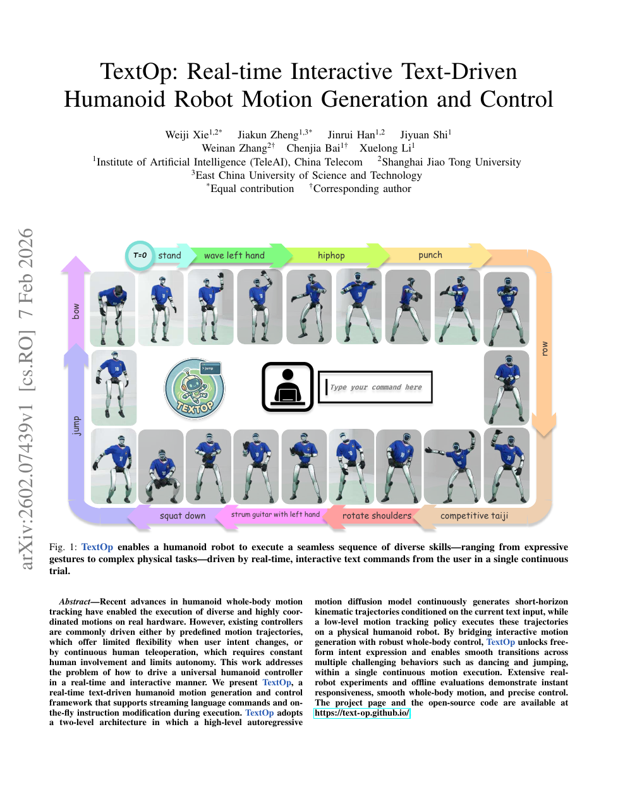

<!--
---
id: P0038
title_en: "TextOp: Real-time Interactive Text-Driven Humanoid Robot Motion Generation and Control"
title_zh: "TextOp：实时交互式文本驱动人形机器人动作生成与控制"
year: 2026
date: 2026-02-07
venue: "arXiv preprint arXiv:2602.07439"
primary_category: motion-generation
tags: [motion-generation, motion-tracking, diffusion, autoregressive, text, real-time, humanoid, sim2real]
authors: [Weiji Xie, Jiakun Zheng, Jinrui Han, Jiyuan Shi, Weinan Zhang, Chenjia Bai, Xuelong Li]
institutions: [Institute of Artificial Intelligence TeleAI China Telecom, Shanghai Jiao Tong University, East China University of Science and Technology]
paper_url: "https://arxiv.org/abs/2602.07439"
project_url: "https://text-op.github.io/"
github_url: null
video_url: null
open_source: {code: partial, training_code: unknown, inference_code: full, model_weights: unknown, dataset: unknown, robot_deployment: partial}
open_source_checked: 2026-09-03
robots: [humanoid]
inputs: [streaming text, motion history, proprioception]
outputs: [short-horizon motion, joint control]
read_status: read
reproduce_status: not-started
local_materials: []
created: 2026-09-03
updated: 2026-09-03
---
-->

# P0038｜TextOp：实时交互式文本驱动人形机器人动作生成与控制

*TextOp: Real-time Interactive Text-Driven Humanoid Robot Motion Generation and Control*

[论文](https://arxiv.org/abs/2602.07439) · [项目页与开源入口](https://text-op.github.io/)

## 基本信息

<!-- AUTO-BASIC-INFO:START -->
> **作者**：Weiji Xie、Jiakun Zheng、Jinrui Han、Jiyuan Shi、Weinan Zhang、Chenjia Bai、Xuelong Li
>
> **机构**：Institute of Artificial Intelligence TeleAI China Telecom、Shanghai Jiao Tong University、East China University of Science and Technology
>
> **论文时间**：2026-02-07
>
> **期刊 / 会议**：arXiv preprint arXiv:2602.07439
>
> **主分类**：动作生成
>
> **重点标签**：**动作生成** · **动作跟踪** · **扩散模型** · **自回归** · **文本** · **实时** · **人形机器人** · **Sim2Real**
>
> **阅读状态**：已阅读　·　**复现状态**：未开始
<!-- AUTO-BASIC-INFO:END -->

## 本文贡献

- 提出两层实时系统：高层自回归动作扩散不断生成短时运动学参考，低层通用跟踪策略在真实人形机器人上闭环执行。
- 支持执行过程中流式输入和即时修改文本，使站立、挥手、舞蹈、跳跃、太极等技能在一次连续试验中平滑切换。
- 通过动作历史条件和短窗滚动生成解决传统离线 text-to-motion 必须先生成完整序列、难以响应用户意图变化的问题。

## 研究问题

预定义轨迹灵活性低，持续遥操作又要求人全程参与。文本能表达自由意图，但离线生成延迟和动作段拼接不适合闭环。TextOp 选择“短时生成 + 稳健跟踪”，在语义响应速度与低层稳定性之间分层。

## 原论文重点图

**图 1：单次连续试验中的在线提示切换（原论文 Figure 1 所在页）。** 时间轴上用户依次发送 bow、stand、wave、hiphop、punch 等命令；高层生成器滚动续写，低层 tracker 不重启，从而避免技能切换时回到默认站姿。

## 研究方法详细解读

### 总体流程：文本滚动生成机器人动作，跟踪器闭环执行

TextOp 先把人体 MoCap 重定向和筛选成 50 Hz G1 动作，并与 BABEL 分段文字配对；VAE 读取历史+未来动作学习条件 latent，冻结后由文本条件 LDM 从噪声生成下一短段 latent，decoder 接历史恢复机器人未来动作；连续短段进入 motion buffer，IsaacLab 训练的通用 tracker 读取未来 5 帧参考和本体状态输出关节目标。实机上生成器在外部 RTX 4090 以 6.25 Hz 更新，tracker 在 G1 板载计算机以 50 Hz 运行，用户新文本在后续生成块生效。

### 数据预处理与两类训练集

所有动作先由 GMR 从 SMPL 映射到 29 自由度 G1，30 Hz 插值到 50 Hz；以踝速度小于 0.002、踝高小于 0.2 的阈值提左右足接触。先训练一个放宽终止、无域随机化的特权 tracker 40k 步估计每条失败率，删除失败概率大于 0.05 的动作，再按标准终止复检。生成数据将 AMASS 与 BABEL 按文件/时间对齐并镜像增强为 83,478 段—文字对；tracker 数据切为 100–2,000 帧、相邻重叠 50–200 帧，AMASS 12,296 段/40.67 小时，私有数据 403 段/3.12 小时。

### 机器人局部增量表示

每帧 `f_t` 包含根 roll/pitch 的 `[sinθ, cosθ-1]`、yaw 增量、足接触、yaw 对齐坐标中的根平移增量、绝对根高度、关节角 `q` 与关节增量 `Δq`。给定初始根位姿，可按 yaw/平移积分精确逆变换回原 G1 轨迹；表示对全局平移和偏航不变，同时天然遵守单自由度机器人关节结构。接触阈值、Euler 顺序、局部旋转方向和 `q` 顺序必须与 inverse algorithm 一致。

### VAE：历史条件下的未来动作潜空间

一个 primitive 由 `T_history` 历史和 `T_future` 待预测帧组成，相邻 primitive 共享边界历史。Transformer encoder 将历史+未来和 learnable distribution tokens 编码为高斯 latent，decoder 用 latent+历史重建未来；训练目标为 Huber feature reconstruction、轻量 KL，以及 FK 后身体平移/旋转、关节角/速度和接触脚位置等 geometric losses。VAE 先训练并冻结，确保 LDM 只需建模紧凑未来分布而不是全维动作。

### LDM 与 self-rollout 训练

CLIP 编码当前文字，Transformer LDM 读取噪声 latent、扩散时刻、最近历史和文本，直接回归干净 `z0`；文本以 0.1 概率清空以支持 CFG。训练样本含 `N` 个连续重叠 primitive，随着训练推进，以线性增加、最高 0.8 的概率把下一段真值历史替换为上一段模型预测，模拟部署误差累积。LDM loss 由 latent Huber、解码 feature reconstruction 和与 VAE 相同 geometric terms 组成，因此文字语义、片段衔接和机器人几何共同监督。

### 自回归扩散推理与提示切换

每块从高斯 latent 开始做 5 个 DDPM 风格去噪步，classifier-free guidance scale 为 5；clean latent 与最近历史经 VAE decoder 得到未来 `T_future` 帧，尾部写回下一块历史并进入 buffer。新文字经 CLIP 后从下一次 6.25 Hz 生成周期参与，历史保证姿态/速度连续。窗口短可快速响应但上下文少，窗口长更稳定却增加延迟；self-rollout 只缩小训练/推理差，不消除无限滚动漂移。

### 通用 tracker 的 PPO 训练与生成数据增强

低层采用简单 MLP，一阶段 goal-conditioned PPO；actor 读取本体状态和未来 5 帧参考，episode 从动作首帧初始化，超时或跟踪偏差过大终止，奖励组合根/身体/关节跟踪与动作正则。为覆盖生成器特有的噪声，论文从 BABEL 文字构造 20 秒指令流，用高层生成 5,368 段、31.48 小时动作并加入 tracker 训练。8,192 环境、200 Hz 仿真、50 Hz policy，actor/critic `[2048,1024,512]`，并做摩擦、质心、关节零位和外推随机化。

### 实机部署与证据边界

tracker 用 ONNX Runtime 在 G1 板载机 50 Hz 运行，高层用 TensorRT 在外部 4090 以 6.25 Hz 生成，经有线/无线网络和 motion buffer 同步；电机指令、通信和用户感知延迟都应计入端到端响应。生成数据先经过特定 G1/跟踪器筛选，但文本生成的运动学流畅不等于任意硬件安全。复现必须绑定重定向配置、50 Hz 表示、接触阈值、tracker 资产、PD/限位和两端时间戳。

## 实验结果与结论

论文用离线指标与真实机器人连续试验展示即时响应、平滑切换和多种高动态技能。结果证明文本可作为实时上层接口，但具体成功率、安全和跨平台泛化仍受 tracker 与硬件限制。

## 局限与复现提醒

- 长时自回归会累积漂移；突变提示可能在动力学上不可直接衔接。
- 复现必须锁定生成窗/历史窗、文本更新时间、动作表示、tracker checkpoint 与控制频率。
- 官方页面提供开源入口，但训练、权重和完整部署项应逐项核验；本知识库未运行。

## 阅读与复现状态

- 阅读：已阅读原文与飞书方法整理。
- 资源：项目页已核验，开源分项保守记录。
- 运行：未进行仿真或实机验证。

## 参考资料

- [arXiv](https://arxiv.org/abs/2602.07439)
- [项目页](https://text-op.github.io/)

## 更新记录

- 2026-09-03：依据原论文方法与训练章节，扩展总体流程、数据表征、模块信息流、训练目标、推理/部署及实现边界。
- 2026-09-03：补充正文基本信息卡，展示完整作者、机构、论文时间、期刊/会议、分类、标签与状态。
- 2026-09-03：新建条目，整理短窗自回归生成、历史衔接和低层跟踪接口。
