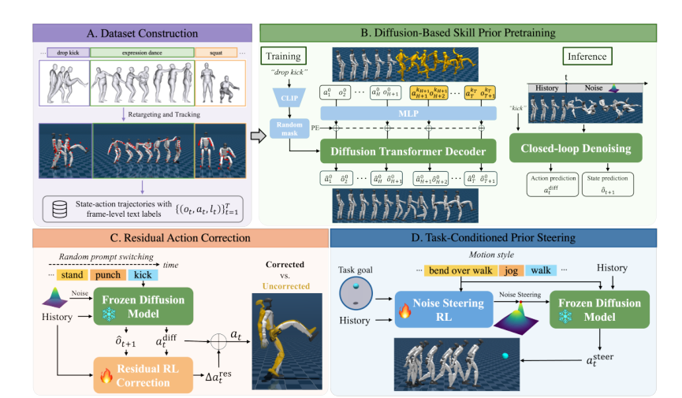
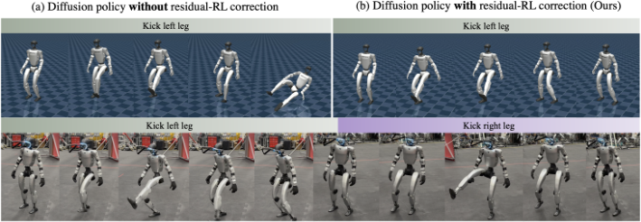
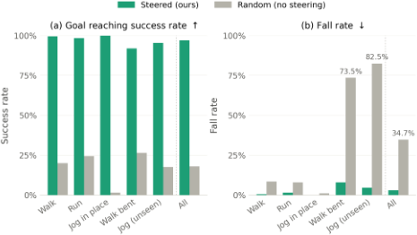

<!--
---
id: P0039
title_en: "ADAPT: Agile Diffusion Action Priors for Robust and Steerable Online Text-Driven Humanoid Control"
title_zh: "ADAPT：面向鲁棒、可操控在线文本驱动人形机器人控制的敏捷扩散动作先验"
year: 2026
date: 2026-09-01
venue: "arXiv preprint arXiv:2609.00677"
primary_category: tracking-wbc
tags:
  - whole-body-control
  - diffusion
  - motion-prior
  - reinforcement-learning
  - transformer
  - text
  - robot-state
  - g1
  - isaac-lab
  - sim2sim
  - sim2real
  - real-time
  - onnx
  - tensorrt
  - generalization
authors:
  - Yan Wu
  - Chenhao Li
  - Kaifeng Zhao
  - Gen Li
  - Marco Hutter
  - Siyu Tang
institutions:
  - ETH Zurich
paper_url: "https://arxiv.org/abs/2609.00677"
project_url: "https://wuyan01.github.io/ADAPT-project/"
github_url: null
video_url: "https://www.youtube.com/watch?v=e1dgFzgg5_M"
open_source:
  code: "no"
  training_code: "no"
  inference_code: "no"
  model_weights: "no"
  dataset: "no"
  robot_deployment: "no"
open_source_checked: 2026-09-04
robots:
  - Unitree G1
inputs:
  - text command
  - proprioceptive state-action history
  - planar task goal for downstream adaptation
outputs:
  - 29-dimensional normalized joint targets
  - predicted future proprioceptive states
read_status: deep-read
reproduce_status: not-started
local_materials:
  - "local_archive/P0039/adapt-paper.pdf"
  - "local_archive/P0039/ADAPT_方法框架详解与全文中文翻译.docx"
created: 2026-09-04
updated: 2026-09-04
---
-->

# P0039｜ADAPT：面向鲁棒、可操控在线文本驱动人形机器人控制的敏捷扩散动作先验

*ADAPT: Agile Diffusion Action Priors for Robust and Steerable Online Text-Driven Humanoid Control*

[论文](https://arxiv.org/abs/2609.00677) · [项目页](https://wuyan01.github.io/ADAPT-project/) · [演示视频](https://www.youtube.com/watch?v=e1dgFzgg5_M) · [方法框架详解与全文中文翻译](attachments/方法框架详解与全文中文翻译.docx)

## 基本信息

<!-- AUTO-BASIC-INFO:START -->
> **作者**：Yan Wu、Chenhao Li、Kaifeng Zhao、Gen Li、Marco Hutter、Siyu Tang
>
> **机构**：ETH Zurich
>
> **论文时间**：2026-09-01
>
> **期刊 / 会议**：arXiv preprint arXiv:2609.00677
>
> **主分类**：动作跟踪与全身控制
>
> **重点标签**：**全身控制** · **扩散模型** · **运动先验** · **强化学习** · **Transformer** · **文本** · **机器人状态** · **Unitree G1** · **Isaac Lab** · **Sim2Sim** · **Sim2Real** · **实时** · **ONNX** · **TensorRT** · **泛化**
>
> **阅读状态**：已精读　·　**复现状态**：未开始
<!-- AUTO-BASIC-INFO:END -->

### 资料与开源说明

- 论文于 2026-09-01 首次公开；当前可核验出版信息为 arXiv 预印本。PDF 元数据中的 CoRL 2026 模板信息不能单独证明正式接收，因此未登记为会议论文。
- 截至 2026-09-04，官方项目页将代码标为“Coming Soon”，尚未提供可访问的代码仓库、模型权重、整理后的状态—动作数据集或 G1 部署代码；各分项按“当前未公开”记录，后续应重新核验。
- 本页附件已实际收录方法框架详解与全文中文翻译；以下方法解读同时依据原论文正文、公式、附录和该文档复核。

## 本文贡献

- 把交互式文本控制定义为闭环动力学控制问题，训练文本条件扩散策略直接从机器人历史状态—动作和当前命令生成 29 维关节目标及未来本体状态，省去部署时独立的“文本生成人体动作—重定向—低层跟踪”三段链路。
- 利用 BABEL 帧级动作标签和经物理跟踪验证的 G1 状态—动作轨迹，使预训练既学习单项技能，也接触技能边界；再在冻结扩散先验之上训练受空间约束的 Residual RL，提高长时执行与任意时刻提示切换的稳定性。
- 提出 Noise Steering RL：不改动扩散先验参数，而由轻量策略根据目标、历史和文本选择扩散初始噪声，将同一技能先验适配到风格保持的目标到达任务。
- 在 IsaacLab、MuJoCo 和真实 Unitree G1 上评估在线文本切换、动态技能、采样延迟和风格化目标到达，展示约 2 ms 推理和 50 Hz 闭环控制，并量化稳定性与文本语义之间的折中。

## 研究问题

主流文本驱动人形系统通常先生成运动学参考，再让独立控制器跟踪。高层生成器不了解机器人当下的接触、动量和支撑状态，提示在奔跑、跳跃或单腿支撑中突然改变时，新参考可能瞬间不可执行。已有端到端方法又多用“一段动作对应一句描述”的序列级监督，缺少技能转换边界。ADAPT 研究的是：能否用细粒度语言监督训练一个直接输出低层动作的多模态扩散控制器，再用小规模 RL 模块分别解决闭环稳定性和任务引导，同时不重训或覆盖原有动作语义。

## 原论文重点图

**图 1：ADAPT 方法总览（原论文 Figure 2）。** A 区先把 AMASS 人体动作重定向到 G1，并用预训练 TextOp tracker 在物理仿真中执行，只保存成功状态—动作轨迹，再对齐 BABEL 帧级标签。B 区以干净历史、加噪未来和 CLIP 文本条件训练 Diffusion Transformer Decoder；闭环推理每次同时预测动作和下一状态，但只执行第一步。C 区冻结扩散模型，Residual RL 读取扩散动作与预测下一状态，只对下肢和腰部施加小残差，以承接随机提示切换。D 区同样冻结先验，由 Noise Steering RL 根据目标和运动风格选择扩散初始噪声，使采样结果朝任务目标偏移。

**图 2：Residual RL 的鲁棒性修正与真机结果（原论文 Figure 4）。** 上排仿真对比中，纯扩散策略在踢腿期间失衡倒地，加入受约束残差后完成动作并恢复；下排展示真实 G1 的左右踢腿。该图说明 residual 的角色是小范围救场，而不是另一个完整动作生成器；是否保留文本语义还必须结合空间 mask、自跟踪奖励和消融结果判断。

**图 3：Noise Steering 的目标到达结果（原论文 Figure 5）。** 绿色为学得的 steering noise，灰色为随机噪声。前者在 walk、run、原地慢跑、弯腰行走和训练未见的 jog 上均显著提高到达率，并将总体跌倒率从 34.7% 降至 2.9%。它证明“选择先验中的哪一种合理动作”可以承载下游目标，但不代表冻结先验能处理任意任务或任意未见文本。

## 研究方法详细解读

### 总体流程：一个冻结扩散先验，两种互补 RL 适配

ADAPT 分四步建立。第一步是离线数据构建：人体动作经 GMR 重定向为 Unitree G1 参考，再由 TextOp 跟踪器在 IsaacLab 内实际执行，只保留成功 rollout，并把每帧状态、控制动作与 BABEL 技能标签配对。第二步用这些物理可执行示范做行为克隆，训练文本条件 Diffusion Transformer 联合生成未来本体状态和关节动作。第三步冻结扩散网络及 CLIP 编码器，用 PPO 训练 Residual RL；它不重新定义技能，只在扩散动作上叠加受限的平衡修正。第四步仍冻结同一先验，另训 Noise Steering RL，让任务目标通过初始噪声影响扩散采样。交互式文本部署保留 CLIP、扩散控制器和 residual actor；目标到达部署改用 noise-steering actor。GMR、TextOp tracker 和两个 PPO critic 都只服务于数据或训练，不进入对应在线控制链路。

### 数据构建：从人体运动学参考到可执行状态—动作监督

原始运动来自 AMASS，语言使用 BABEL 的帧级标注。GMR 先把人体动作映射到 29 自由度 G1，但这些重定向结果仍只是运动学参考；作者继续调用预训练 TextOp tracker 在 IsaacLab 中闭环跟踪，以实际访问到的 `D={(o_t,a_t,l_t)}` 作为训练样本，并删除跟踪失败序列。因而 diffusion 学到的 action label 来自物理控制 rollout，而不是人体姿态或逆运动学结果。采集时随机化静摩擦 `[0.3,1.6]`、动摩擦 `[0.3,1.2]`、恢复系数 `[0,0.5]`、关节零位 `±0.01 rad`、刚度/阻尼比例 `[0.75,1.25]` 及躯干质心偏移，以拓宽可执行状态覆盖。论文没有公布最终保留的序列数、总小时数或训练切片数，复现时不能从 AMASS/BABEL 原始规模反推。

### 状态—动作表示：96 维帧、5 帧历史和 15 帧未来

每帧输入 `x_t=[v_t,0.2ω_t,g_t,q_t,0.05q̇_t,a_{t-1}]` 共 96 维：前 67 维是根线速度、缩放根角速度、投影重力、29 维关节位置和缩放关节速度，后 29 维是上一时刻归一化关节目标。训练 clip 长 `T=20`，前 `H=5` 帧为干净历史，后 15 帧为待预测未来。由于真机根线速度难以稳定估计，历史中的该字段在训练和推理时都置零；模型仍在未来支路预测物理一致的状态演化。这个处理减少对特权估计器的依赖，却也意味着复现不能把 critic 使用的特权根线速度误接到 actor，或仅在部署端临时置零而造成训练—推理分布不一致。

### 扩散技能先验：联合去噪未来状态与动作

主干是 8 层 causal Transformer decoder，hidden size 512、FFN 1024、8 个注意力头；冻结 CLIP 把文本编码为 512 维条件。训练只向未来 15 帧加入高斯噪声，历史保持可观测上下文；不同未来帧采用独立噪声等级，以更接近滚动执行中各时间位置误差不同的情形。网络使用 v-prediction，最小化预测速度场与由干净未来、噪声及累计噪声系数构成目标之间的均方误差。训练扩散链为 20 步、cosine noise schedule，文本以 0.1 概率替换为空条件以学习 classifier-free guidance；优化器为 AdamW，学习率 `1e-5`，10k warmup 后使用循环余弦计划，并以 0.9995 EMA 保存平滑权重。这里的“state prediction”既扩充联合分布，也给 residual 提供下一状态参照，不是独立世界模型训练目标。

### 闭环推理：预测一段、只执行一步、重新观测

每个 50 Hz 控制周期读取最近 5 帧状态—动作历史和当前文本，把未来区间初始化为高斯噪声，再用 CFG scale 2.5 做 2 步 DDIM 去噪。模型得到 15 帧未来状态—动作，只发送第一帧 29 维关节目标；机器人进入新状态后，历史窗口滑动并重新采样。因而 ADAPT 虽一次生成短时域，实际控制仍是 receding-horizon feedback，而不是开环播放整段预测。论文消融显示 1 步采样约 1.5 ms、BC-only 成功率 0.706；2 步约 2 ms、成功率 0.804；5 步约 4 ms、成功率 0.792。更多去噪步没有单调改善闭环表现，2 步是延迟、语义和稳定性共同约束下的选择。

### Residual RL：冻结语义先验，只修正稳定性相关自由度

行为克隆在长 rollout 和任意切换时刻会离开离线数据支持。Residual actor 因此读取 5 帧本体历史、扩散动作 `a_t^diff` 和扩散预测的下一本体状态 `ô_{t+1}`，输出 `Δa_t^res`，最终动作是 `a_t=a_t^diff+α_t(m⊙Δa_t^res)`。二值 mask `m` 只开放髋、膝、踝和腰部，保留上肢语义；`α_t` 在前 100k environment steps 从 0 线性增至 0.05，避免训练初期残差直接接管控制。Residual actor 本身不接收文本，命令语义始终由冻结扩散先验承载。扩散输出给 residual 额外贡献 96 个条件维度，既告诉它当前计划动作，也给出“如果遵循先验，下一状态应是什么”的内在参照。

### Residual RL 训练：自跟踪奖励、困难提示采样与扰动课程

Residual actor/critic 是 `[2048,1024,512]` MLP，在 2048 个 IsaacLab 环境中用 PPO 训练；仿真步长 0.005 s、decimation 4、控制 50 Hz、episode 20 s，`γ=0.985`、GAE `λ=0.92`、学习率 `1.5e-4`。训练每 5–10 秒随机换一次原子技能文本，并依据跌倒率提高困难命令采样概率。奖励用扩散预测下一状态做 self-tracking：下肢关节项权重 1.0、上肢 0.1，另有线/角速度 0.05、投影重力 0.1；负项包括 residual magnitude `-1.0`、action rate `-0.05`、非法接触 `-0.1`、脚滑 `-0.05` 和非超时终止 `-20`。地形难度在 400k 步内退火，并把外推从初期每 2.5–4 s、较小速度逐步加到 600k 步后每 1–3 s、最大 `±0.5 m/s` 和 `0.78 rad/s`，使 residual 学会恢复而非只拟合平地名义状态。

### Noise Steering RL：把任务目标写进扩散初始噪声

下游 goal-reaching 不直接微调去噪器，也不在最终关节动作上再叠加导航残差。Steering actor 输入 5 帧本体历史、骨盆坐标系中的二维目标和 512 维文本 embedding，输出与扩散未来输入同形的初始噪声 `z_t`；冻结扩散策略从该噪声去噪，得到仍处于文本技能分布内的关节目标。PPO 训练采用循环 `REACH→HOLD→RESAMPLE`：目标半径 0.5–3 m；进入 0.3 m 并持续 0.3 s 后文本切为 stand，保持 0.5–1.5 s 再采新目标。到达脉冲权重 500、距离项 2.0、朝目标速度 1.0；保持阶段约束近目标、低平移速度和低偏航，同时惩罚脚滑、坏接触、过速和终止。此阶段 `γ=0.99`、GAE `λ=0.95`、学习率 `1e-3`，只随机化刚度/阻尼并加入状态噪声，明确关闭 action delay。

### 真机部署与复现契约

论文将策略导出为 ONNX，并在配备 RTX 5080 与 Intel Core Ultra 9 275HX 的外接笔记本上用 TensorRT 推理，Unitree G1 控制频率 50 Hz、策略延迟约 2 ms；文本通过 ROS topic 异步更新，目标到达使用机载 LiDAR—惯性里程计提供 odometry-frame 目标。复现必须同时固定 29 关节顺序、归一化 joint target 与 PD 接口、96 维观测排列和缩放、历史根线速度置零、20/5 窗口、2 步 DDIM 与 CFG 2.5、TextOp 数据采集 tracker、G1 资产及域随机化范围。论文没有公开控制增益、完整数据、checkpoint 和硬件安全状态机，本页也未运行其代码；论文的 sim2sim/实机次数不能外推为其他 G1 配置的安全保证。

## 实验结果与结论

### 交互式文本控制协议

作者在同一 130 条命令池上运行 2048 个、每个 20 秒的 rollout，每 5–10 秒切换提示。成功率定义为不跌倒；平滑度分别统计完整 rollout 和切换后 1 秒窗口，脚滑统计接触时踝部水平速度；TMR R@K 与三人用户研究用于文本—动作对齐。语义和动作质量只在未跌倒序列上计算，因此高成功率与高语义分数是两个独立目标，不能只看其中一个。

### 主要定量结果

- 完整 ADAPT 成功率 0.984，高于 BC-only 扩散的 0.804、DART 两阶段链路的 0.764、Offline TextOp 的 0.522 和 LangWBC 的 0.923；动作平滑度 0.0086、转换平滑度 0.0107、脚滑 0.055 也为表中最佳。
- Residual RL 带来稳定性—语义折中：BC-only 的 R@1 为 59.50%，完整模型为 44.60%。去掉 residual 空间约束时成功率升至 0.997，但 R@1 降到 26.19%，表明 residual 通过覆盖命令动作产生语义坍塌；这也是下肢 mask 不能随意删除的直接证据。
- MuJoCo 中 walk、jog、jump、kick 分别成功 10/10、9/10、10/10、10/10；真实 G1 各测 5 次，分别成功 5/5、5/5、3/5、4/5。实机失败主要仍在重复高动态跳跃和较长单腿支撑，样本量也不足以证明长期安全率。
- Noise Steering 在全部风格上的目标到达成功率从随机噪声的 18.0% 提升到 97.1%，跌倒率从 34.7% 降至 2.9%；训练未见的 jog 提示达到 95.5% 成功率、4.5% 跌倒率，说明该任务协议下存在文本泛化，但不等于开放词汇或开放环境泛化。

## 局限与复现提醒

- **论文明确的局限：** Residual correction 有时会把高跳、激烈出拳等高动态动作拉回更安全的站立式行为；紧凑模型与两步去噪服务于实时性，更大模型的表达能力和延迟仍有冲突。
- **数据边界：** 训练依赖 AMASS、BABEL、GMR 和特定 TextOp tracker，但论文未报告最终数据量；跟踪成功筛选也会过滤 tracker 难以执行的动作，先验覆盖不等于原始人体动作覆盖。
- **开源边界：** 官方代码仍为 Coming Soon，当前无法核验配置、关节顺序、PD 参数、checkpoint、ROS 接口和 TensorRT 构建是否与论文叙述完全一致。
- **证据边界：** 本页只完成论文与本地材料精读、元数据核验和原图提取，没有运行 Demo、训练、IsaacLab、MuJoCo、Sim2Real 或真机安全测试。

## 阅读与复现状态

- 阅读：已精读原论文、附录、方法框架详解和全文中文翻译。
- 资源：已核验 arXiv、官方项目页和视频；代码、权重、整理数据及部署资源尚未公开。
- 运行：未运行代码或模型，复现状态保持“未开始”。
- 部署：论文报告 Unitree G1 实机结果，本知识库未做独立 sim2sim 或硬件验证。

## 参考资料

- [arXiv 论文页](https://arxiv.org/abs/2609.00677)
- [官方项目页](https://wuyan01.github.io/ADAPT-project/)
- [官方演示视频](https://www.youtube.com/watch?v=e1dgFzgg5_M)
- [作者 Kaifeng Zhao 的论文列表](https://zkf1997.github.io/)

## 更新记录

- 2026-09-04：新建 P0039 精读档案；核验作者、机构、首次公开日期与当前开源状态；收录方法详解及全文翻译、原论文 Figure 2/4/5，并完成数据、扩散预训练、两类 RL 后训练、实验与部署边界的详细解读。
