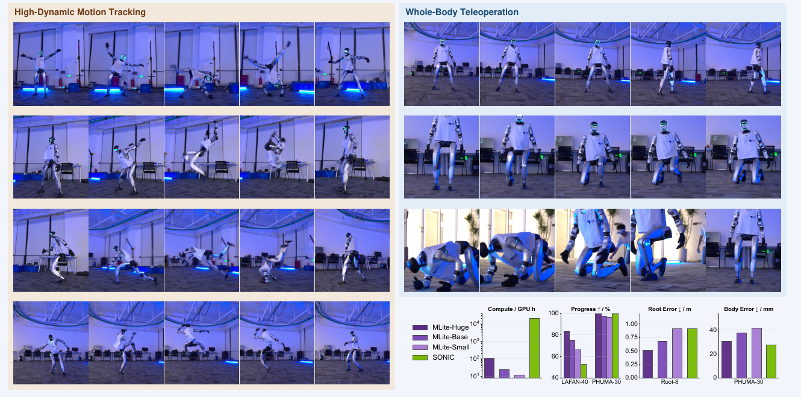

<!--
---
id: P0040
title_en: "MimicLite: Efficient and Effective General Humanoid Motion Tracking"
title_zh: "MimicLite：高效且有效的通用人形机器人动作跟踪"
year: 2026
date: 2026-07-16
venue: "Technical report"
primary_category: tracking-wbc
tags:
  - motion-tracking
  - whole-body-control
  - reinforcement-learning
  - teleoperation
  - motion-capture
  - g1
  - mujoco
  - sim2sim
  - sim2real
  - real-time
authors:
  - Robotparty Lab
institutions:
  - Robotparty Lab
paper_url: "https://github.com/Roboparty/MimicLite/blob/main/mimic-lite.pdf"
project_url: "https://github.com/Roboparty/MimicLite"
github_url: "https://github.com/EGalahad/mimic-lite"
video_url: null
open_source:
  code: full
  training_code: full
  inference_code: full
  model_weights: full
  dataset: partial
  robot_deployment: full
open_source_checked: 2026-09-04
robots:
  - Unitree G1
inputs:
  - robot proprioception
  - four-frame future joint reference
  - Pico teleoperation reference
outputs:
  - normalized joint targets for PD control
read_status: deep-read
reproduce_status: not-started
local_materials:
  - "local_archive/P0040/mimiclite-technical-report.pdf"
created: 2026-09-04
updated: 2026-09-04
---
-->

# P0040｜MimicLite：高效且有效的通用人形机器人动作跟踪

*MimicLite: Efficient and Effective General Humanoid Motion Tracking*

[技术报告](https://github.com/Roboparty/MimicLite/blob/main/mimic-lite.pdf) · [项目总入口](https://github.com/Roboparty/MimicLite) · [训练代码](https://github.com/EGalahad/mimic-lite) · [统一部署运行时](https://github.com/EGalahad/sim2real)

## 基本信息

<!-- AUTO-BASIC-INFO:START -->
> **作者**：Robotparty Lab
>
> **机构**：Robotparty Lab
>
> **论文时间**：2026-07-16
>
> **期刊 / 会议**：Technical report
>
> **主分类**：动作跟踪与全身控制
>
> **重点标签**：**动作跟踪** · **全身控制** · **强化学习** · **遥操作** · **动作捕捉** · **Unitree G1** · **MuJoCo** · **Sim2Sim** · **Sim2Real** · **实时**
>
> **阅读状态**：已精读　·　**复现状态**：未开始
<!-- AUTO-BASIC-INFO:END -->

### 资料与开源说明

- 技术报告以 Robotparty Lab 为集体作者，未列出个人作者；本页据报告首页登记，不自行从仓库提交记录推断署名。
- 项目把训练、数据转换和部署拆为多个仓库。当前总入口已发布 PPO/PPO-ROA 权重、训练与评估代码、数据转换工具和 G1 部署运行时；训练数据部分受原数据集许可约束，因此登记为“部分公开”。
- 报告中的 Small/Base/Huge 对比是论文快照；截至 2026-09-04，总入口公开的主版本已经更新为更大并行规模的 MimicLite-PPO 与 MimicLite-ROA，二者不能混作同一实验配置。

## 本文贡献

- 把通用动作跟踪从“需要大规模控制网络和长时间训练”重新压缩为系统工程问题：通过规范数据缓存、并行环境和简洁 MLP，在 8 张 RTX 4090 上约 3 小时得到可部署策略。
- 用同一套实现训练 Small、Base、Huge 三种容量，并在统一 MuJoCo 协议下与 SONIC 比较局部身体误差和全局根漂移，强调计算预算与评测口径必须同时对齐。
- 给出从动作库、PPO 训练、ONNX 导出到 Pico 实时遥操作和真实 Unitree G1 的完整链路，并公开可扩展的观测类与 YAML 接口。

## 研究问题

通用人形动作跟踪常被认为必须依赖数百小时数据、超大网络和昂贵分布式训练。MimicLite 研究的是：如果把机器人状态表示、前视命令、缓存、采样和评测协议设计好，小型 MLP 是否仍能覆盖高动态动作与实时遥操作；以及在局部关节跟踪接近时，如何用根部漂移暴露长时闭环差异。

## 原论文重点图

**图 1：实机技能、遥操作与计算量对比（原论文 Figure 1）。** 左侧展示侧手翻、后空翻、虎跳接肩滚和旋踢等高动态动作；右侧展示 Pico 驱动的步行、深蹲、单/双膝跪地及倒地起身。右下将三种 MimicLite 规模与 SONIC 的 GPU 小时、完成率、根误差和身体误差并列。报告没有单独的模块框架图，因此本页收录其原论文总览图，并在下文依据方法、算法和实现章节重建文字信息流，不以自绘图替代。

## 研究方法详细解读

### 总体流程：把动作跟踪拆成可核对的数据、策略与运行时契约

MimicLite 的核心不是提出一个复杂的新网络，而是证明通用 tracker 的成本很大程度取决于训练系统是否干净。完整链路是：先把不同来源动作统一成机器人原生关节轨迹并预计算前向运动学；再让 actor 读取可部署本体状态和四帧未来命令、critic 额外读取特权状态；PPO 在大量并行环境中学习关节目标；之后导出策略，由相同观测定义接入 MuJoCo、Pico 或真实 G1。训练期的 critic、域随机化和失败终止不会部署，真正上机的只有 actor、观测缓冲、命令缓冲和低层 PD 接口。

### 整体训练主线：从原始动作到三种策略规模

1. 将 LAFAN1、100STYLE、SONIC 动作以及 Pico 录制数据转成目标机器人 `qpos`，保存机器人模型、关节顺序和采样率，并预计算 link 位姿/速度缓存。
2. 按时间片抽取当前本体状态与四帧未来参考，构造 actor 观测；训练环境同时保留根状态、接触和完整参考作为 critic 特权输入。
3. actor 输出逐关节归一化残差，经关节尺度映射为 PD 目标；仿真器执行后计算全身跟踪奖励、控制正则和失败条件。
4. 在 8 张 GPU 上分别训练宽度约 128、256、1024 的 Small/Base/Huge MLP，保持数据、控制与评测协议一致，只比较容量和并行规模。
5. 导出 actor 与观测 YAML，先走共享 MuJoCo 评测，再通过同一运行时切换 Pico 输入或物理 G1 后端。

### 数据与机器人表示：先存机器人轨迹，再谈策略学习

报告使用 LAFAN1 约 2.45 小时、100STYLE 约 18.6 小时、SONIC 约 288.3 小时，以及 946 秒真实 Pico 参考。所有来源都先进入机器人坐标与关节空间，运行时不再重复做人体骨架求解。轨迹缓存包含根位姿、关节角、关节速度和由机器人模型计算的 link 运动学；这让奖励计算避免每步重复解析文件或做昂贵变换。关键复现点不是“有一个 NPZ”即可，而是文件中的关节名称、顺序、根四元数约定、50 Hz 时间轴和训练使用的 MJCF 必须一致。

### Actor、critic 与四帧命令窗口

actor 只接收真机可获得的关节位置/速度、根角速度、投影重力、上一动作，以及未来四帧关节参考；短前视既给出动作趋势，又把端到端延迟限制在约 0.08 秒。critic 额外读取训练环境的完整状态和参考误差，改善值函数估计但不污染部署观测。网络保持普通 MLP，研究重点是比较宽度带来的收益，而非通过隐藏的状态估计器增强 actor。当前公开 ROA 版本增加在线适应分支，但那是报告后续发布配置，不能回填为原始 PPO 实验的方法组成。

### 动作解码、延迟建模与 PD 闭环

策略输出按关节缩放的目标偏移，再与默认姿态或参考关节角组合成目标位置；低层 PD 在更高频率上产生力矩。训练会随机化控制延迟，并在参考时间戳之间插值，避免 actor 只适应理想整帧命令。部署缓冲区处理时间戳抖动：正常输入按真实时间取参考，流暂停时保持最新姿态并把速度目标归零，平面位移与偏航保持连续。这样，tracker 学的是闭环纠错，而不是把训练 clip 逐帧开环播放。

### 奖励、失败判定与根漂移设计

奖励同时约束关节角、身体局部位置/姿态、根姿态与速度，并惩罚动作变化、能量、关节限位和不期望接触。局部身体误差衡量动作形状是否相似，却可能掩盖全局根逐渐漂走；MimicLite 因而把“根平面偏离参考超过阈值”设为截断，而不是给 actor 一个部署不可观测的全局根位置奖励。躯干朝向或局部 body 跟踪失效直接终止，根平移漂移则用于评测和截断。这一选择解释了为什么策略可不依赖全局定位，同时仍要在长时协议中报告 Root-8 指标。

### PPO 并行训练与计算量口径

报告主方法使用 PPO，另以 SAC 作对照。三种 MLP 在相同约 4000 次更新下训练，环境并行度随模型规模配置为多 GPU 的大批量 rollout；Huge 版本在 8×8192 环境上约三小时完成，作者折算为约百 GPU 小时量级，显著低于 SONIC 的报告预算。这个比较只在给定硬件、帧数、评测动作和实现吞吐下成立。总入口后续 16×16384 的 PPO/ROA 训练分别报告 92.3 与 173.2 GPU 小时，属于更新后的发布配置，应在复现记录中单独命名 checkpoint。

### 推理、遥操作与统一运行时

部署时 actor 以 50 Hz 读取观测和四帧参考，输出关节目标；推理与机器人 I/O 解耦，MuJoCo 和真实 Unitree G1 只是可替换后端。Pico 输入先转换为连续全身参考，再写入带时间戳的命令缓冲，策略本身不直接处理 VR 原始传感器。统一运行时通过“观测类 + YAML”描述每个 checkpoint 需要的历史、前视、归一化和字段顺序，因此替换策略时不能只换 ONNX，还必须同时替换配套 YAML、机器人模型和关节映射。

### 评测协议与部署复现边界

跨方法比较在 MuJoCo 中使用 LAFAN-40、PHUMA-30 与 Root-8：完成率说明是否走完整段，Body Error 衡量局部跟踪，Root Error 专门检查全局漂移。实机视频证明了报告所列动作能够在作者 G1 上完成，但没有给出长期重复次数、热约束或跌倒安全统计。本页没有运行任何 checkpoint。复现必须锁定论文快照还是当前 PPO/ROA 发布、参考前视长度、观测 YAML、ONNX 输入维度、PD 增益、MJCF、关节顺序、命令时间戳和急停机制；格式校验或离线视频都不能替代 sim2sim 与硬件安全验证。

## 实验结果与结论

### 实验设置

- 数据与基线：LAFAN-40、PHUMA-30 和 Root-8，共用 MuJoCo 评测；对比三种 MimicLite 规模、SONIC，并给出 PPO/SAC 与系统消融。
- 指标：动作完成率、局部身体位置误差、全局根误差、训练 GPU 小时和策略延迟。
- 平台：Unitree G1；训练使用大规模并行仿真，部署经统一运行时连接 MuJoCo、Pico 与实机。

### 主要结果

- 报告中的 Huge/Base/Small 在极低于 SONIC 的训练预算下取得相近局部身体误差；Huge 在 Root-8 上的全局根跟踪优于报告对照的 SONIC，说明短前视 MLP 并非只能做局部姿态模仿。
- 规模变小会降低高难动作完成率，但收益不是只由参数量决定；缓存、并行度、终止与根漂移处理共同决定训练效率。
- 真实 G1 展示高动态动作与 Pico 遥操作，是部署可行性证据；报告没有给出足以估计安全失效率的重复试验，因此不能把演示视频等同于通用实机安全证明。

## 局限与复现提醒

- **论文明确的边界：** 研究聚焦 MLP 跟踪器和系统吞吐，不证明小模型在任意机器人、任意动作库或长时复杂环境都优于大模型。
- **版本边界：** 技术报告 Small/Base/Huge 与当前 PPO/PPO-ROA 发布的并行度、训练阶段和权重不同，必须以精确 checkpoint 与 YAML 命名实验。
- **数据边界：** 部分训练数据受原许可限制；公开转换脚本不等于所有原始数据均可再分发。
- **验证边界：** 本知识库只完成原文精读、公开状态核验和原图提取，未运行训练、Demo、sim2sim 或实机。

## 阅读与复现状态

- 阅读：已精读技术报告及当前项目说明。
- 资源：已核验训练、模型、数据工具和统一部署仓库的公开边界。
- 运行：未运行公开策略，复现状态保持“未开始”。
- 实机：论文报告 G1 结果，本知识库没有独立硬件验证。

## 参考资料

- [MimicLite 技术报告](https://github.com/Roboparty/MimicLite/blob/main/mimic-lite.pdf)
- [MimicLite 项目总入口](https://github.com/Roboparty/MimicLite)
- [训练与评估代码](https://github.com/EGalahad/mimic-lite)
- [统一部署运行时](https://github.com/EGalahad/sim2real)

## 更新记录

- 2026-09-04：创建 P0040 精读档案；核验技术报告、分仓库开源边界和当前发布版本；收录原论文 Figure 1，并完整解读数据缓存、观测、PPO、根漂移评测及部署契约。
