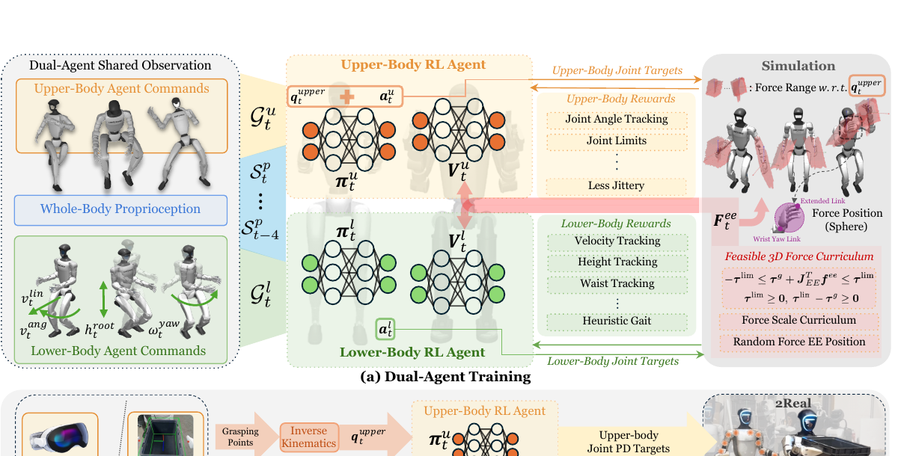

<!--
---
id: P0041
title_en: "FALCON: Learning Force-Adaptive Humanoid Loco-Manipulation"
title_zh: "FALCON：学习力自适应的人形机器人移动操作"
year: 2026
date: 2025-05-10
venue: "Learning for Dynamics and Control Conference (L4DC) 2026, Oral"
primary_category: locomanip
tags:
  - loco-manipulation
  - whole-body-control
  - reinforcement-learning
  - force-control
  - inverse-kinematics
  - teleoperation
  - robot-state
  - g1
  - isaac-gym
  - sim2real
  - real-time
authors:
  - Yuanhang Zhang
  - Yifu Yuan
  - Prajwal Gurunath
  - Ishita Gupta
  - Shayegan Omidshafiei
  - Ali-akbar Agha-mohammadi
  - Marcell Vazquez-Chanlatte
  - Liam Pedersen
  - Tairan He
  - Guanya Shi
institutions:
  - Carnegie Mellon University
  - Field AI
  - Nissan USA
paper_url: "https://arxiv.org/abs/2505.06776"
project_url: "https://lecar-lab.github.io/falcon-humanoid/"
github_url: "https://github.com/LeCAR-Lab/FALCON"
video_url: null
open_source:
  code: full
  training_code: full
  inference_code: full
  model_weights: "no"
  dataset: "no"
  robot_deployment: full
open_source_checked: 2026-09-04
robots:
  - Unitree G1
  - Booster T1
inputs:
  - lower-body velocity and stance commands
  - upper-body joint targets
  - whole-body proprioception
outputs:
  - lower-body and upper-body joint targets
read_status: deep-read
reproduce_status: not-started
local_materials:
  - "local_archive/P0041/falcon.pdf"
created: 2026-09-04
updated: 2026-09-04
---
-->

# P0041｜FALCON：学习力自适应的人形机器人移动操作

*FALCON: Learning Force-Adaptive Humanoid Loco-Manipulation*

[论文](https://arxiv.org/abs/2505.06776) · [项目页](https://lecar-lab.github.io/falcon-humanoid/) · [官方代码](https://github.com/LeCAR-Lab/FALCON)

## 基本信息

<!-- AUTO-BASIC-INFO:START -->
> **作者**：Yuanhang Zhang、Yifu Yuan、Prajwal Gurunath、Ishita Gupta、Shayegan Omidshafiei、Ali-akbar Agha-mohammadi、Marcell Vazquez-Chanlatte、Liam Pedersen、Tairan He、Guanya Shi
>
> **机构**：Carnegie Mellon University、Field AI、Nissan USA
>
> **论文时间**：2025-05-10
>
> **期刊 / 会议**：Learning for Dynamics and Control Conference (L4DC) 2026, Oral
>
> **主分类**：LocoManip
>
> **重点标签**：**移动操作** · **全身控制** · **强化学习** · **力控制** · **逆运动学** · **遥操作** · **机器人状态** · **Unitree G1** · **Isaac Gym** · **Sim2Real** · **实时**
>
> **阅读状态**：已精读　·　**复现状态**：未开始
<!-- AUTO-BASIC-INFO:END -->

### 资料与开源说明

- 论文 2025-05-10 首次公开，官方项目页标注为 L4DC 2026 Oral；日期字段按首次公开日期登记，出版信息按当前官方接收状态登记。
- 截至 2026-09-04，官方仓库已勾选训练、sim2sim 与 sim2real 代码，并提供 Unitree 与 Booster SDK 部署入口；README 未提供可直接核验的官方预训练权重或论文训练数据，相关分项分别登记为“未公开”。

## 本文贡献

- 用两个任务专门化 RL agent 分别负责下肢运动与上肢操作，却共享全身本体观测并联合训练，从结构上缓解单一全身策略的巨大动作空间与目标冲突。
- 提出受关节力矩极限约束的三维末端外力课程，根据手臂雅可比、重力补偿和当前姿态估算各方向可承受力，再逐步扩大负载扰动。
- 在 Unitree G1 与 Booster T1 上把遥操作、FoundationPose 物体位姿、逆运动学和动作规划接入同一控制器，验证搬运、推拉、拉门等受力移动操作。

## 研究问题

人形移动操作既要下肢维持速度、步态和根高度，又要上肢跟踪抓取姿态并承受末端负载。下肢 RL 加上肢 IK 的经典拆分忽视外力对全身的耦合，单一全身 RL 又面临高维探索和多目标互相干扰。FALCON 研究如何保留分工的训练效率，同时让两个策略通过共享状态和动力学在同一身体上协同，并让训练负载始终位于真实关节力矩可承受范围。

## 原论文重点图

**图 1：FALCON 双智能体训练与部署总览（原论文 Figure 2）。** 上半部橙色上肢 agent 接收上肢目标与全身本体状态，绿色下肢 agent 接收速度、根高、腰偏航等命令和同一状态；两者分别有奖励和值函数，但动作在同一仿真身体上共同执行。右侧红色支路依据关节力矩极限构造可行三维末端力课程。下半部部署把 VR、手柄或自主规划转为命令，上肢目标可由 IK 生成，两个 actor 合并关节目标驱动物理机器人。

## 研究方法详细解读

### 总体流程：两个策略、一个身体、同一动力学后果

FALCON 的核心不是简单把上肢 IK 替换为 RL，而是让上、下肢各有独立优化目标，同时都看到全身状态并共同改变同一机器人。完整训练先从人体动作构造上肢关节目标、从速度与姿态采样构造下肢命令；随后两个 actor 同步输出互不重叠的关节动作，仿真一次执行；两个 critic 分别按各自任务奖励评估同一转移；外力课程在手腕附近施加姿态相关且力矩可行的三维扰动。部署仅保留两个 actor，训练期 critic、力课程与特权状态全部移除。

### 整体训练主线：命令生成到联合 PPO

1. 从 AMASS 动作提取并重定向上肢参考，下肢命令则采样根线/角速度、站姿、根高度和腰部偏航。
2. 构造五步本体历史，包括关节角/速度、根角速度、投影重力和上一动作，让两个 agent 共享同一身体上下文。
3. 上肢 actor 与下肢 actor 各自输出关节子集目标，拼成完整动作后由 PD 控制器执行。
4. 依据当前手臂姿态、雅可比和力矩裕量求可行末端力边界，采样方向、作用点与幅值，并随课程进度增大。
5. 两个 PPO 分别用上肢跟踪/限位奖励和下肢速度/高度/步态奖励更新，但 rollout 与物理转移完全共享。
6. 部署时把 VR 或自主抓取管线产生的目标映射为同样命令接口，直接运行两个 actor。

### 双智能体观测与动作分工

共享本体观测包含最近五帧关节状态、根角速度、投影重力和动作历史，使上肢策略能感知下肢加速、身体倾斜与负载造成的整体变化，下肢策略也能感知手臂动作和外力后的姿态。下肢目标包括平面线速度、偏航角速度、站立标志、根高度与腰偏航；上肢目标是关节角。两者输出各自关节的 PD 位置目标，动作空间不重叠，却通过躯干动力学、接触和共享状态形成耦合。这个分解避免单一 actor 同时探索两类命令组合，但不把身体切成两个独立仿真系统。

### 非对称 critic 与独立奖励

actor 仅用部署可得观测，critic 额外读取根线速度和末端受力等仿真特权信息。上肢奖励强调目标关节角、关节限位与动作平滑；下肢奖励强调速度、根高度、腰姿态、步态和启发式足接触。各自的值函数只估计本任务回报，减少奖励尺度冲突；更新时仍以同一批联合动作产生的转移训练。因此某一 agent 不能假设另一个固定不动，它必须在对方不断学习的分布中形成协调。

### 力矩约束的三维末端力边界

随机外力若超过电机能力，会让训练长期处于必败状态；过小又学不到负载适应。FALCON 用末端雅可比把笛卡尔力映射为关节力矩，并扣除重力补偿与已有动作所占裕量，得到每个手臂姿态下正、负方向可承受的力范围。作者先用 Dirichlet 分布采样三个坐标轴的相对比例，再在满足各关节力矩上下限的可行区间内确定整体尺度。这样 3D 方向随机，但不会系统性要求超出关节额定能力。

### 课程学习：幅值、方向与接触点同时变化

全局课程系数从小到大放宽可行力比例，使策略先学基本协调，再面对更重负载。水平力会优先取与末端速度相反的方向，模拟搬运物体的阻力；力经过低通滤波，避免每步跳变成不现实冲击。作用点在腕部扩展 link 的球面附近随机，迫使策略处理不同力矩臂，而非只记住手腕中心的单一载荷。课程依赖当前关节姿态实时重算，因而复制时不能把论文中的最大牛顿数当作所有姿态都安全的恒定扰动。

### 上肢参考、IK 与训练—部署差异

训练时上肢关节目标来自 AMASS 重定向，直接为策略提供大量自然姿态；部署时 VR 手部点、FoundationPose 估计的物体位姿或规划器抓取点先进入逆运动学，转换成与训练一致的上肢关节目标。IK 只负责把任务空间意图变成命令，不直接驱动电机；上肢 RL 仍会依据负载和全身状态对目标做动力学可行的闭环响应。训练数据分布、IK 解域和真实手臂关节限位若不一致，双 agent 也无法自动修复无解目标。

### PPO 联合更新与稳定性来源

两个策略在同一时间步采样并执行，分别用 PPO clipped objective 更新；共享的不是参数，而是观测和物理结果。分开的 actor/critic缩小每个动作与奖励空间，力课程又避免过早进入不可恢复状态。下肢可以用腰与步态吸收上肢负载，上肢则学习在根运动和外力下继续跟踪。与固定 PID 或上肢 IK 相比，这种协调来源于 joint rollout；与 monolithic 全身 RL 相比，它避免所有目标在一个回报中争夺同一表示容量。

### 推理与自主移动操作链路

遥操作链路把 VR 上肢动作经 IK 转为关节目标，下肢命令来自操作者或摇杆。自主链路用 FoundationPose 估计物体六自由度位姿，运动规划器生成抓取和搬运阶段，再通过四状态机组织接近、抓取、搬运与放置。每个周期两个 actor 同时读本体状态并输出关节子目标，合并后进入 PD。感知、规划和 IK 在策略外部，FALCON 没有端到端学习视觉；因此论文中的自主操作成功也依赖这些上游模块的精度和状态机条件。

### 部署边界与复现契约

论文报告 Unitree G1 和 Booster T1，官方仓库提供两个 SDK 的 sim2real 脚本。复现需要锁定机器人关节划分、五帧历史顺序、上下肢命令定义、PD 增益、力矩上限、腕部 link/雅可比、外力滤波、课程进度和 AMASS→机器人重定向。作者指出持续每臂超过约 2 kg 会受腕部热约束，而训练模型没有显式热动力学；仿真成功不代表电机长期温升安全。本页未运行代码、仿真或实机，官方结果只作为论文证据。

## 实验结果与结论

### 实验设置

- 对比：上肢 PID/IK、单体全身 RL 与 FALCON 双 agent；在不同外力和负载下比较上肢关节误差、根状态与任务完成。
- 训练：多方向末端力、姿态相关可行边界和递增课程；仿真中覆盖推、拉与搬运扰动。
- 部署：Unitree G1、Booster T1，遥操作和 FoundationPose/规划器自主链路。

### 主要结果

- 大外力条件下，FALCON 的上肢关节误差约 0.37，优于 PID 的 0.60 与单体 RL 的 0.73；根部相关误差约 0.45，说明分解没有牺牲下肢稳定来换上肢跟踪。
- 真实 G1 每手负载约 1.2 kg 时，上肢误差约 0.39，并完成作者展示的搬运、推拉和拉门任务。
- 结果支持“共享全身观测 + 独立目标 + 可行力课程”在论文任务上的有效性；未覆盖长期热稳定、未知工具接触模型或任意双手大负载。

## 局限与复现提醒

- **热与硬件边界：** 仿真力矩边界没有建模持续负载导致的腕部温升，短时可承受不等于长期安全。
- **上游依赖：** 自主链路仍依赖 FoundationPose、规划器和 IK，感知失败不在策略训练目标内。
- **权重边界：** 代码已公开，但官方 README 未提供可直接复核的论文预训练权重；从头训练需自行核对配置和机器人资产。
- **验证边界：** 本页完成论文精读和公开状态核验，未运行训练、sim2sim、SDK 部署或真机。

## 阅读与复现状态

- 阅读：已精读论文方法、外力课程、实验和部署章节。
- 代码：已核验训练、sim2sim 与 sim2real 公开范围，未执行。
- 仿真与实机：未验证，复现状态保持“未开始”。

## 参考资料

- [arXiv 论文页](https://arxiv.org/abs/2505.06776)
- [官方项目页](https://lecar-lab.github.io/falcon-humanoid/)
- [官方代码](https://github.com/LeCAR-Lab/FALCON)

## 更新记录

- 2026-09-04：创建 P0041 精读档案；核验 L4DC 2026 Oral、作者机构和代码边界；收录原论文 Figure 2，详细解读双智能体 PPO、力矩可行三维外力课程、IK 上游与双平台部署。
